# API Call 模块设计文档

## 模块概述

API Call 模块是 Scheduler 框架中的核心调用工具，用于向外部 API 接口发送 HTTP 请求并获取数据。该模块支持多种 HTTP 方法、认证方式和内容类型，提供了完整的 API 调用能力。

## 核心组件

### 1. API 类 (api.py)

主要的 API 调用工具类，继承自 `CoreCall`，实现了完整的 API 调用流程。

### 2. Schema 类 (schema.py)

定义了 API 调用的输入输出数据结构：

- `APIInput`: API 调用的输入参数
- `APIOutput`: API 调用的输出结果

## 类结构图

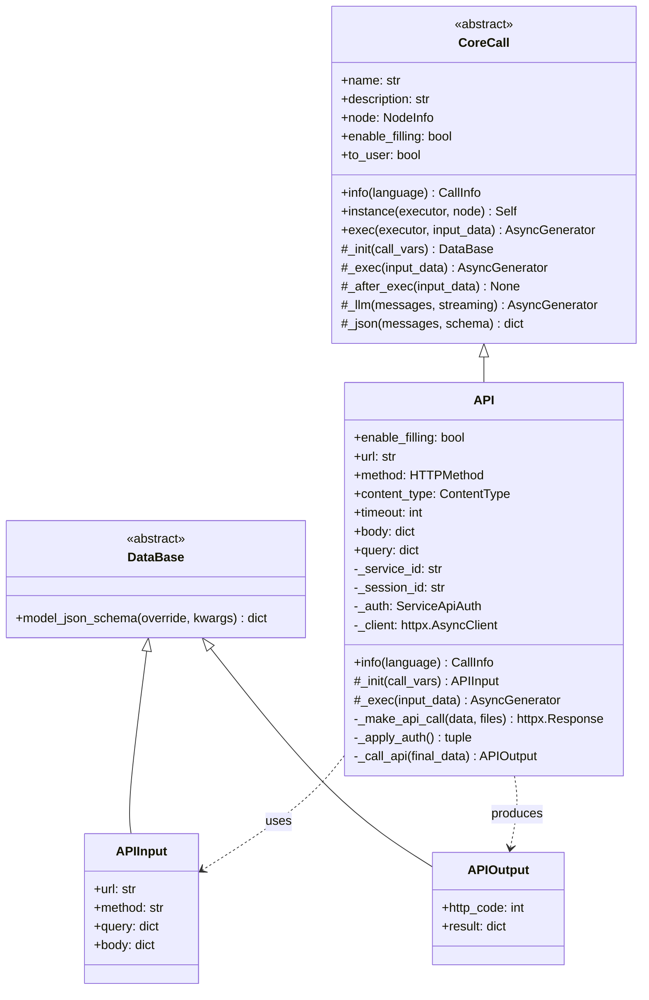

## 执行流程图

### 主流程

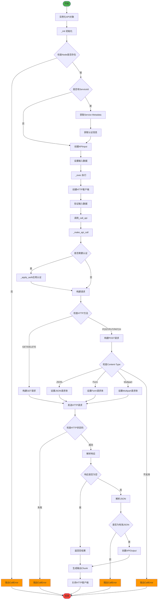

### 认证流程

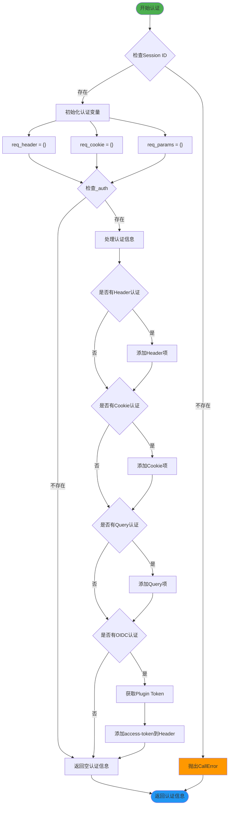

## 时序图

### 完整调用时序

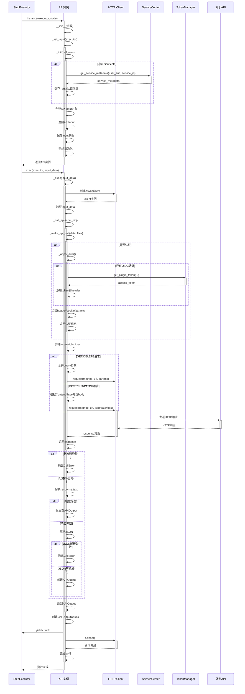

### 认证处理时序

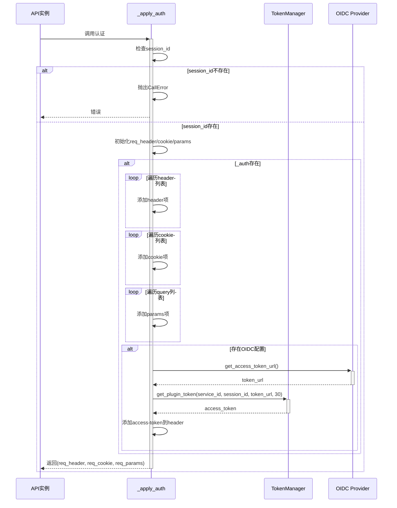

## 状态图

### API调用状态流转

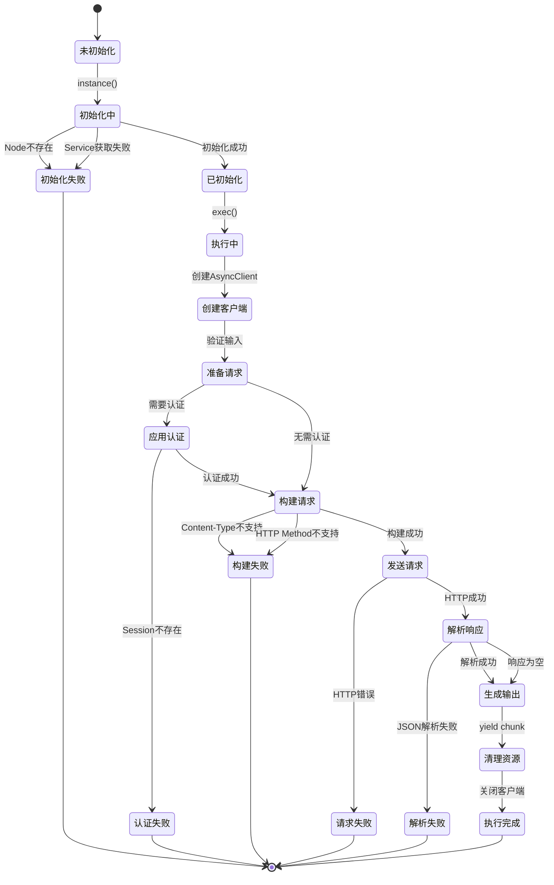

## 关键特性

### 1. HTTP 方法支持

支持的 HTTP 方法：

- GET
- POST
- PUT
- PATCH
- DELETE

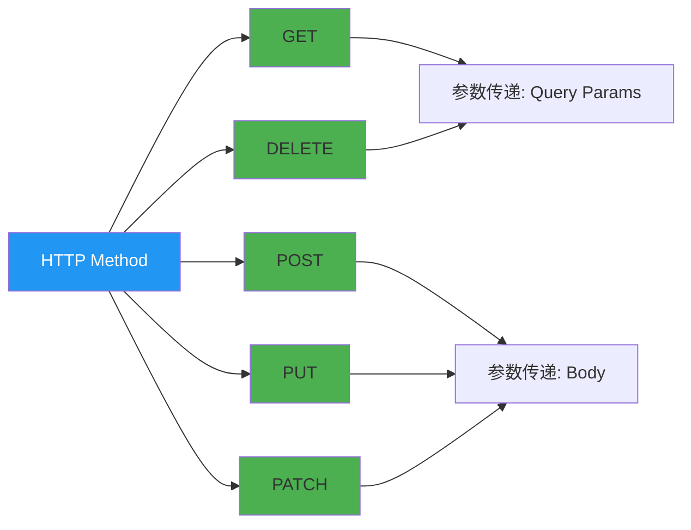

### 2. Content-Type 支持

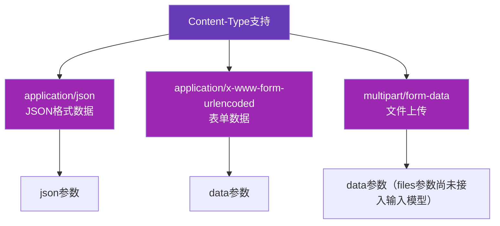

### 3. 认证方式

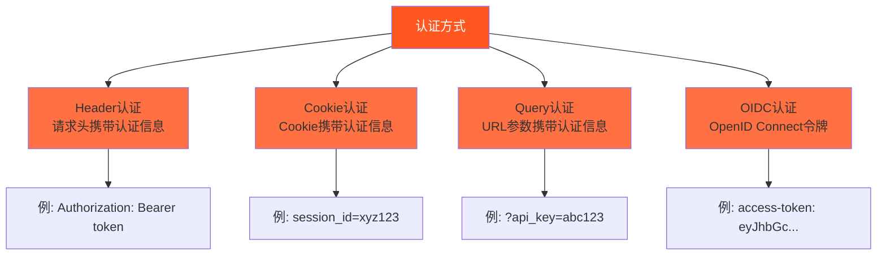

### 4. 成功状态码

模块识别的成功 HTTP 状态码范围：

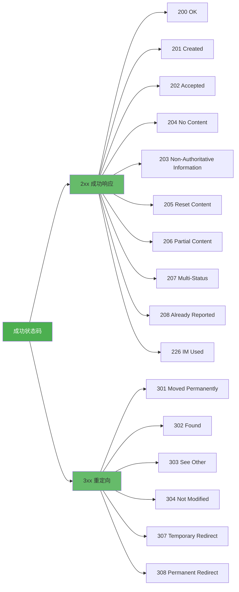

## 错误处理

### 错误场景

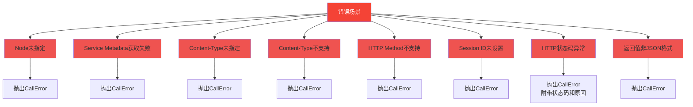

## 配置参数

### API 类配置参数

| 参数 | 类型 | 默认值 | 说明 |
|------|------|--------|------|
| `url` | str | 必填 | API接口的完整URL |
| `method` | HTTPMethod | 必填 | HTTP方法 |
| `content_type` | ContentType | None | Content-Type |
| `timeout` | int | 300 | 超时时间（秒），必须大于30 |
| `body` | dict | {} | 已知的部分请求体 |
| `query` | dict | {} | 已知的部分请求参数 |
| `enable_filling` | bool | True | 是否需要自动参数填充 |
| `to_user` | bool | False | 是否将输出返回给用户 |

## 实现注意事项

- 认证信息虽然会在 `_apply_auth` 中生成 Header/Cookie/Query 三类数据，但当前实现仅将 Cookie 和 Query 透传至 `httpx` 请求，Header 信息尚未写入请求参数，依赖 Header 的认证策略暂时无效。
- `files` 参数作为占位符传入 `_make_api_call`，但 `APIInput` 尚未提供文件字段，Multipart 上传只能提交表单字段，文件内容暂未接入。
- 当外部返回的响应体不是合法 JSON 时会抛出 `CallError`，不会返回原始字符串结果。

### 配置关系图

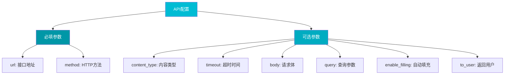

## 使用示例

### 基本 GET 请求

```python
api = await API.instance(
    executor=executor,
    node=node,
    url="https://api.example.com/users",
    method=HTTPMethod.GET,
    query={"page": 1, "limit": 10}
)

async for chunk in api.exec(executor, input_data):
    print(chunk)
```

### POST 请求（JSON）

```python
api = await API.instance(
    executor=executor,
    node=node,
    url="https://api.example.com/users",
    method=HTTPMethod.POST,
    content_type=ContentType.JSON,
    body={"name": "John", "email": "john@example.com"}
)

async for chunk in api.exec(executor, input_data):
    print(chunk)
```

### 带认证的请求

```python
# Service Metadata中配置了认证信息
api = await API.instance(
    executor=executor,
    node=node_with_service_id,  # node中包含serviceId
    url="https://api.example.com/protected",
    method=HTTPMethod.GET
)

async for chunk in api.exec(executor, input_data):
    print(chunk)
```

## 依赖关系

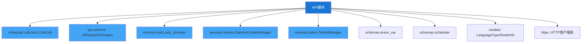

## 生命周期

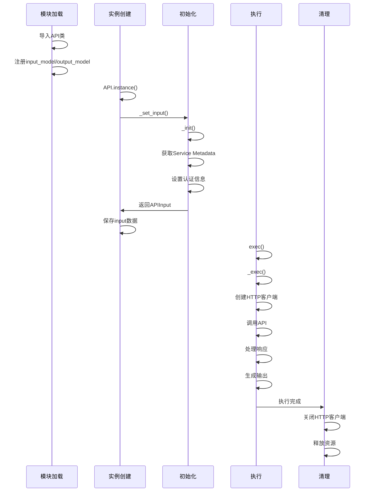

## 最佳实践

### 1. 超时设置

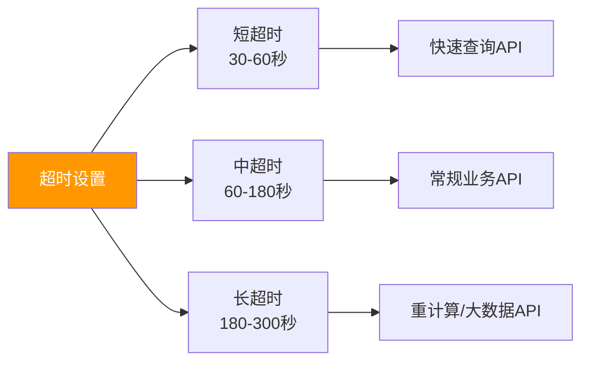

### 2. 错误处理策略

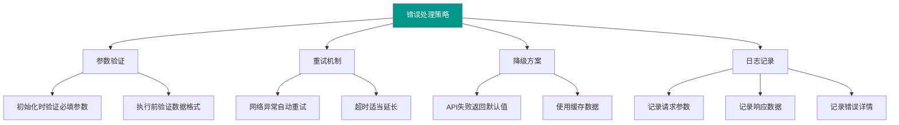

### 3. 安全考虑

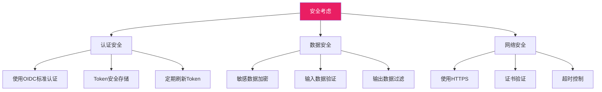
