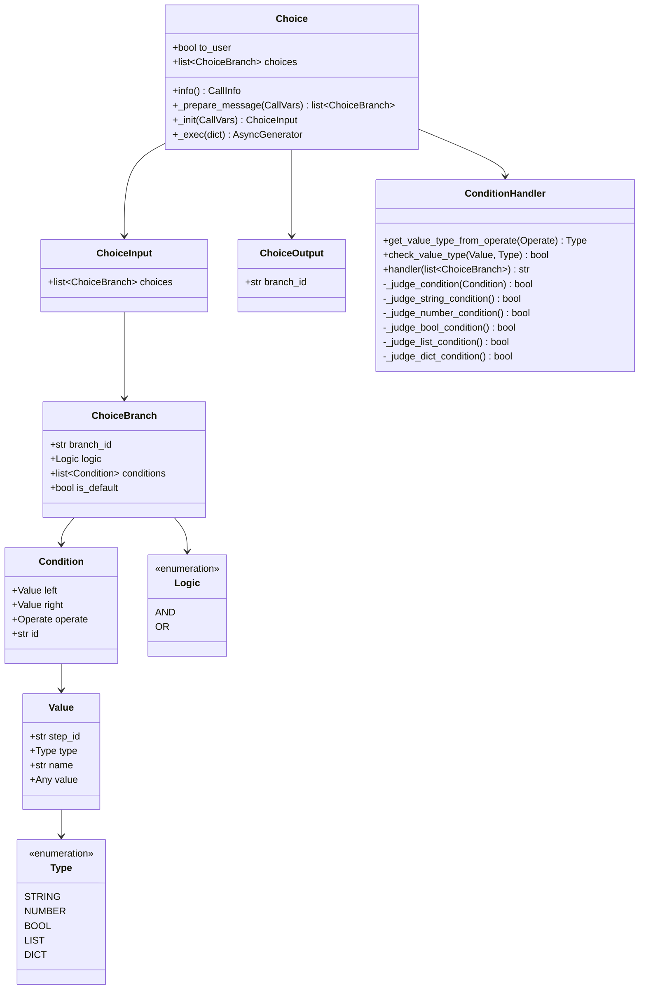
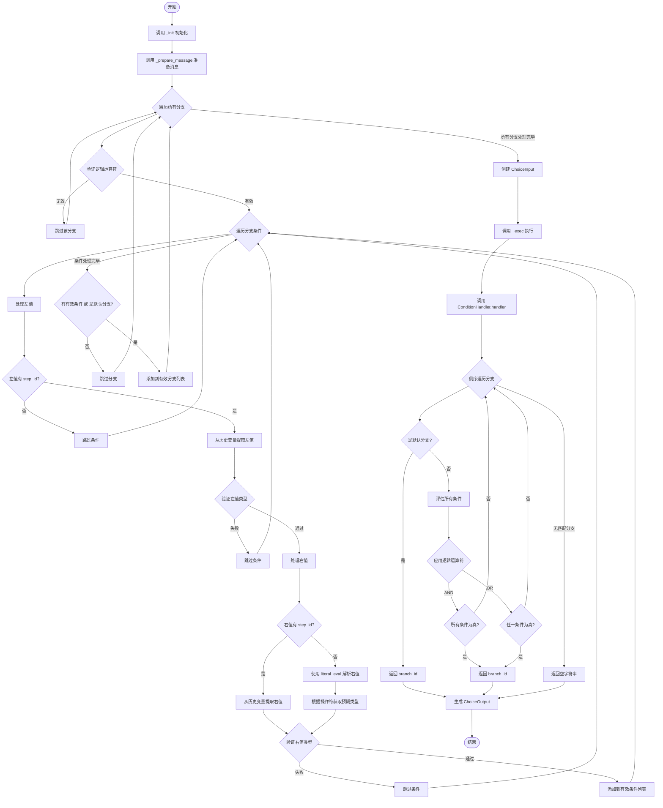
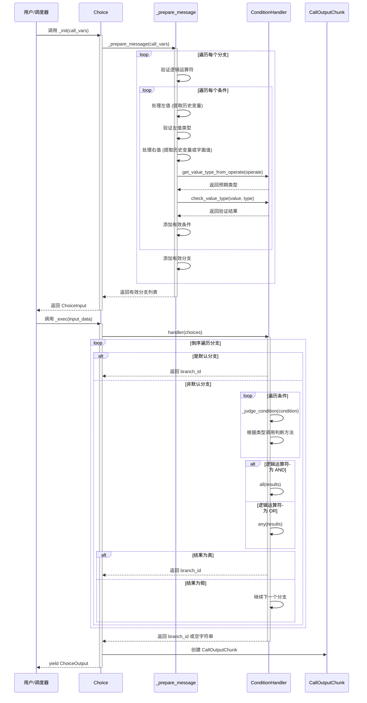
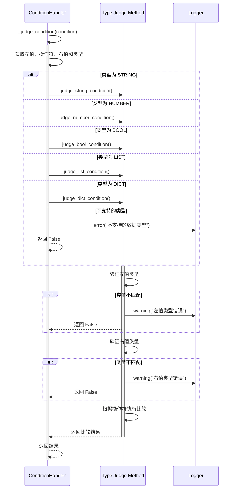
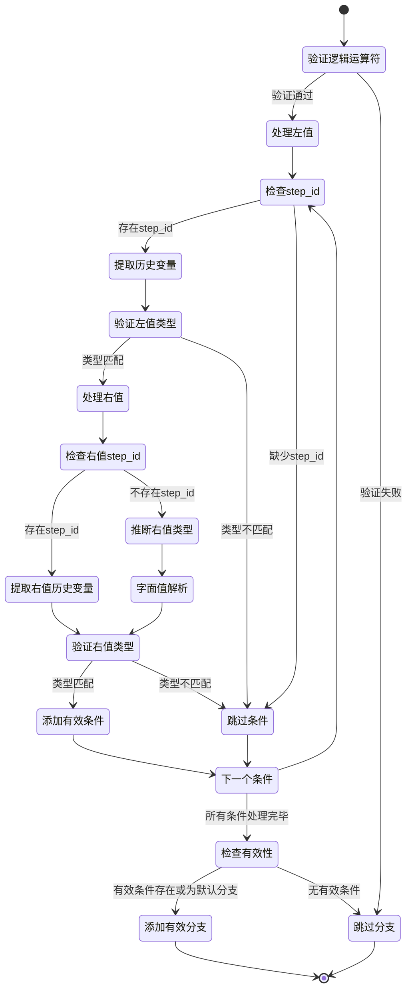

# Choice 模块设计文档

## 1. 模块概述

Choice 模块是一个条件分支选择器,用于根据程序化条件判断或大模型决策来选择执行路径。该模块支持多种数据类型的条件判断,包括字符串、数字、布尔值、列表和字典类型。

### 1.1 核心功能

- 支持多分支条件判断
- 支持 AND/OR 逻辑运算符组合多个条件
- 支持从历史步骤中提取变量进行条件判断
- 支持多种数据类型的比较操作
- 提供默认分支机制

### 1.2 模块组成

模块位于 `apps/scheduler/call/choice/` 目录下,主要包含以下文件:

- [choice.py](../../apps/scheduler/call/choice/choice.py) - Choice 工具核心实现
- [schema.py](../../apps/scheduler/call/choice/schema.py) - 数据结构定义
- [condition_handler.py](../../apps/scheduler/call/choice/condition_handler.py) - 条件处理器

## 2. 数据结构设计

### 2.1 核心数据模型

### 2.2 数据类型与操作符对应关系

```mermaid
graph TD
    A[数据类型] --> B[STRING 字符串]
    A --> C[NUMBER 数字]
    A --> D[BOOL 布尔]
    A --> E[LIST 列表]
    A --> F[DICT 字典]

    B --> B1[EQUAL 等于]
    B --> B2[NOT_EQUAL 不等于]
    B --> B3[CONTAINS 包含]
    B --> B4[NOT_CONTAINS 不包含]
    B --> B5[STARTS_WITH 开头匹配]
    B --> B6[ENDS_WITH 结尾匹配]
    B --> B7[REGEX_MATCH 正则匹配]
    B --> B8[LENGTH_* 长度比较]

    C --> C1[EQUAL 等于]
    C --> C2[NOT_EQUAL 不等于]
    C --> C3[GREATER_THAN 大于]
    C --> C4[LESS_THAN 小于]
    C --> C5[GREATER_THAN_OR_EQUAL 大于等于]
    C --> C6[LESS_THAN_OR_EQUAL 小于等于]

    D --> D1[EQUAL 等于]
    D --> D2[NOT_EQUAL 不等于]

    E --> E1[EQUAL 等于]
    E --> E2[NOT_EQUAL 不等于]
    E --> E3[CONTAINS 包含]
    E --> E4[NOT_CONTAINS 不包含]
    E --> E5[LENGTH_* 长度比较]

    F --> F1[EQUAL 等于]
    F --> F2[NOT_EQUAL 不等于]
    F --> F3[CONTAINS_KEY 包含键]
    F --> F4[NOT_CONTAINS_KEY 不包含键]
```

## 3. 执行流程设计

### 3.1 主流程图

### 3.2 条件判断流程

```mermaid
flowchart TD
    Start([开始条件判断]) --> GetType[获取左值类型]
    GetType --> TypeSwitch{数据类型判断}

    TypeSwitch -->|STRING| StringJudge[字符串条件判断]
    TypeSwitch -->|NUMBER| NumberJudge[数字条件判断]
    TypeSwitch -->|BOOL| BoolJudge[布尔条件判断]
    TypeSwitch -->|LIST| ListJudge[列表条件判断]
    TypeSwitch -->|DICT| DictJudge[字典条件判断]
    TypeSwitch -->|其他| Error[返回 False]

    StringJudge --> S1{操作符类型}
    S1 -->|EQUAL| S_Equal[left == right]
    S1 -->|NOT_EQUAL| S_NotEqual[left != right]
    S1 -->|CONTAINS| S_Contains[right in left]
    S1 -->|NOT_CONTAINS| S_NotContains[right not in left]
    S1 -->|STARTS_WITH| S_StartsWith[left.startswith]
    S1 -->|ENDS_WITH| S_EndsWith[left.endswith]
    S1 -->|REGEX_MATCH| S_Regex[re.match]
    S1 -->|LENGTH_*| S_Length[比较长度]

    NumberJudge --> N1{操作符类型}
    N1 -->|EQUAL| N_Equal[left == right]
    N1 -->|NOT_EQUAL| N_NotEqual[left != right]
    N1 -->|GREATER_THAN| N_GT[left > right]
    N1 -->|LESS_THAN| N_LT[left < right]
    N1 -->|GTE| N_GTE[left >= right]
    N1 -->|LTE| N_LTE[left <= right]

    BoolJudge --> B1{操作符类型}
    B1 -->|EQUAL| B_Equal[left == right]
    B1 -->|NOT_EQUAL| B_NotEqual[left != right]

    ListJudge --> L1{操作符类型}
    L1 -->|EQUAL| L_Equal[left == right]
    L1 -->|NOT_EQUAL| L_NotEqual[left != right]
    L1 -->|CONTAINS| L_Contains[right in left]
    L1 -->|NOT_CONTAINS| L_NotContains[right not in left]
    L1 -->|LENGTH_*| L_Length[比较长度]

    DictJudge --> D1{操作符类型}
    D1 -->|EQUAL| D_Equal[left == right]
    D1 -->|NOT_EQUAL| D_NotEqual[left != right]
    D1 -->|CONTAINS_KEY| D_ContainsKey[right in left]
    D1 -->|NOT_CONTAINS_KEY| D_NotContainsKey[right not in left]

    S_Equal --> Return[返回结果]
    S_NotEqual --> Return
    S_Contains --> Return
    S_NotContains --> Return
    S_StartsWith --> Return
    S_EndsWith --> Return
    S_Regex --> Return
    S_Length --> Return

    N_Equal --> Return
    N_NotEqual --> Return
    N_GT --> Return
    N_LT --> Return
    N_GTE --> Return
    N_LTE --> Return

    B_Equal --> Return
    B_NotEqual --> Return

    L_Equal --> Return
    L_NotEqual --> Return
    L_Contains --> Return
    L_NotContains --> Return
    L_Length --> Return

    D_Equal --> Return
    D_NotEqual --> Return
    D_ContainsKey --> Return
    D_NotContainsKey --> Return

    Error --> Return
    Return --> End([结束])
```

## 4. 时序图

### 4.1 完整执行时序

### 4.2 条件类型判断时序

## 5. 核心算法

### 5.1 分支选择算法

Choice 模块采用**倒序遍历**策略来选择分支:

1. 从分支列表的**末尾开始**向前遍历 (choices[::-1])
2. 遇到默认分支 (is_default=True) 直接返回
3. 对于非默认分支,评估所有条件
4. 根据逻辑运算符 (AND/OR) 组合条件结果
5. 返回第一个匹配的分支 ID
6. 如果没有任何分支匹配,返回空字符串

**倒序遍历的原因**:

- 优先级设计:后定义的分支优先级更高
- 默认分支通常放在第一个,倒序遍历时最后检查

### 5.2 条件验证流程

## 6. 注意事项

### 6.1 类型安全

- 左值必须有 step_id,从历史步骤中提取
- 右值可以是字面值或历史变量
- 类型验证贯穿整个流程,确保运行时安全

### 6.2 错误处理

- 验证失败的条件会被跳过并记录警告日志
- 所有条件都无效的分支会被跳过
- 提供默认分支机制保证至少有一个返回结果

### 6.3 性能考虑

- 倒序遍历在找到匹配分支后立即返回
- 条件验证采用短路逻辑 (AND/OR)
- 历史变量提取使用缓存机制 (在 CoreCall 中实现)
