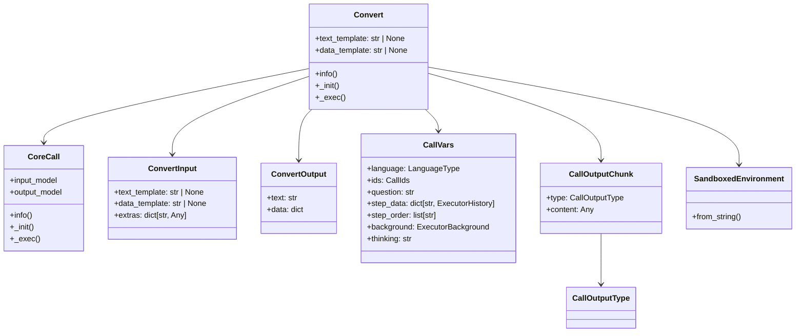
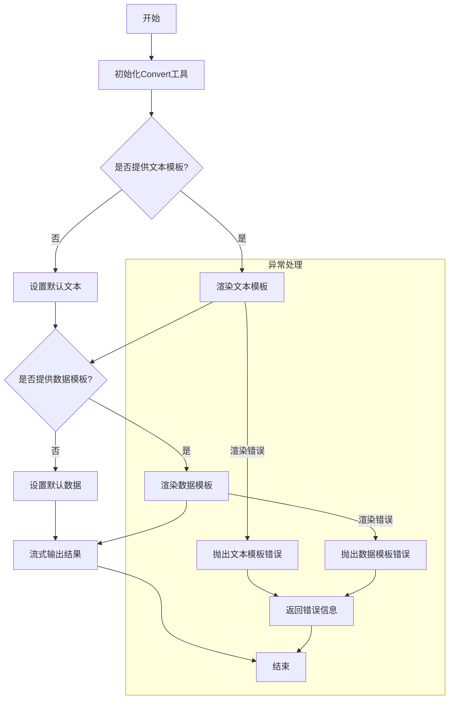
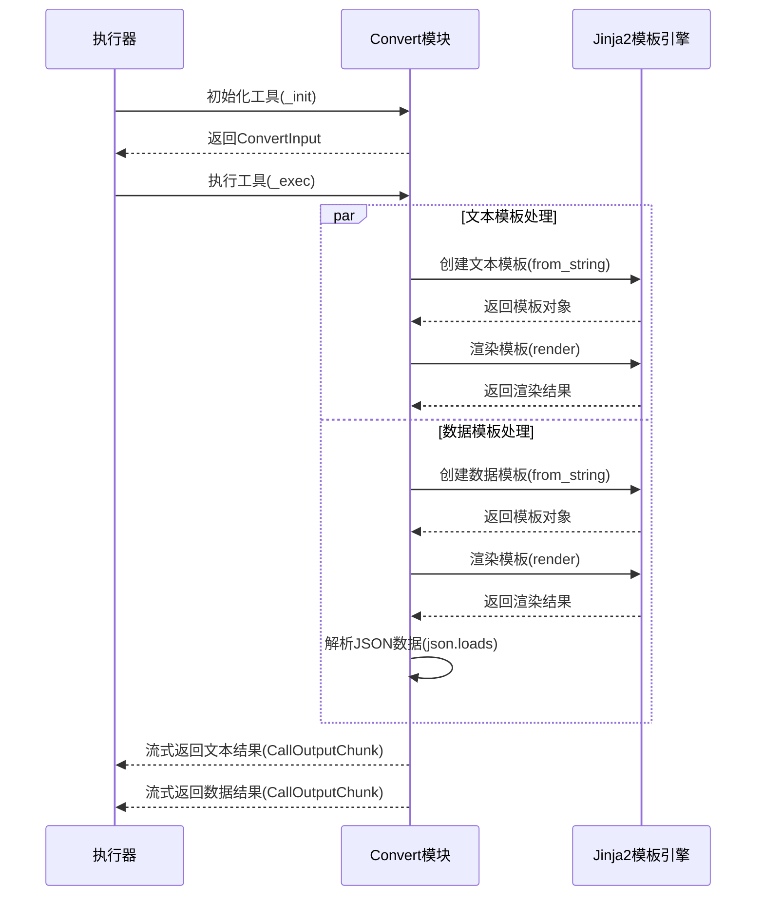

# Convert模块文档

## 1. 模块概述

Convert模块是欧拉助手框架中的一个核心工具，主要用于对生成的文字信息和原始数据进行格式化处理。该模块基于Jinja2模板引擎，支持灵活的模板语法，可以将各种数据转换为特定格式的文本或结构化数据，为系统中的数据展示和传递提供了强大的支持。

**主要功能特性：**
- 支持Jinja2模板语法的文本格式化
- 支持JSON数据的模板渲染和解析
- 提供多语言的工具名称和描述信息
- 采用异步编程模式，支持流式输出
- 集成了丰富的上下文变量，如时间、历史记录、问题等

## 2. 代码结构

Convert模块位于 `apps/scheduler/call/convert/` 目录下，包含以下三个主要文件：

```text
apps/scheduler/call/convert/
├── __init__.py    # 模块初始化文件
├── convert.py     # 核心实现代码
└── schema.py      # 输入输出数据结构定义
```

## 3. 核心类与方法

### 3.1 Convert类

`Convert` 类是模块的核心，继承自 `CoreCall` 基类，实现了模板转换的核心逻辑。

```python
class Convert(CoreCall, input_model=ConvertInput, output_model=ConvertOutput):
    """Convert 工具，用于对生成的文字信息和原始数据进行格式化"""
    text_template: str | None = Field(description="自然语言信息的格式化模板，jinja2语法", default=None)
    data_template: str | None = Field(description="原始数据的格式化模板，jinja2语法", default=None)
```

### 3.2 主要属性

| 属性名 | 类型 | 默认值 | 描述 |
|--------|------|--------|------|
| `text_template` | str \| None | None | 自然语言信息的格式化模板，使用Jinja2语法 |
| `data_template` | str \| None | None | 原始数据的格式化模板，使用Jinja2语法 |

### 3.3 主要方法

#### 3.3.1 info方法

**功能描述**：提供Convert工具的名称和描述信息，支持多语言国际化。

**主要特点**：
- 支持中英文两种语言切换
- 返回标准的CallInfo对象，包含工具名称和功能描述
- 中文版本名称为"模板转换"，英文版本名称为"Convert"
- 描述信息说明了工具的核心功能：使用Jinja2语法格式化自然语言信息和原始数据

```python
@classmethod
def info(cls, language: LanguageType = LanguageType.CHINESE) -> CallInfo:
    """返回Call的名称和描述"""
    i18n_info = {
        LanguageType.CHINESE: CallInfo(
            name="模板转换",
            description="使用jinja2语法将自然语言信息和原始数据进行格式化。",
        ),
        LanguageType.ENGLISH: CallInfo(
            name="Convert",
            description="Use jinja2 syntax to format natural language information and original data.",
        ),
    }
    return i18n_info[language]
```

#### 3.3.2 _init方法

**功能描述**：初始化Convert工具，准备模板渲染所需的环境和变量。

**主要特点**：
- 继承自CoreCall基类并进行扩展
- 创建SandboxedEnvironment环境以安全地执行模板
- 收集和准备模板渲染所需的额外变量（如时间、历史记录、问题等）

```python
async def _init(self, call_vars: CallVars) -> ConvertInput:
    """初始化工具"""
    await super()._init(call_vars)

    self._history = call_vars.step_data
    self._question = call_vars.question
    self._env = SandboxedEnvironment(
        loader=BaseLoader(),
        autoescape=False,
        trim_blocks=True,
        lstrip_blocks=True,
    )

    # 获取当前时间
    time = datetime.now(tz=pytz.timezone("Asia/Shanghai")).strftime("%Y-%m-%d %H:%M:%S")
    # 返回空的ConvertInput，因为输入数据来自上一步的输出
    self._extras = {
        "time": time,
        "history": self._history,
        "question": self._question,
        "background": self._sys_vars.background,
        "ids": self._sys_vars.ids,
    }
    return ConvertInput(
        text_template=self.text_template,
        data_template=self.data_template,
        extras=self._extras,
    )
```

#### 3.3.3 _exec方法

**功能描述**：执行模板转换操作，处理文本模板和数据模板，并流式返回结果。

**主要特点**：
- 分别处理文本模板和数据模板
- 对模板渲染过程中的异常进行捕获和处理
- 支持流式输出，分别返回文本和数据两种类型的结果

```python
async def _exec(self) -> AsyncGenerator[CallOutputChunk, None]:
    """调用Convert工具"""
    # 处理文本模板
    result_message = ""
    if self.text_template is not None:
        try:
            text_template = self._env.from_string(self.text_template)
            result_message = text_template.render(**self._extras)
        except Exception as e:
            raise CallError(
                message=f"文本模板渲染错误: {e!s}",
                data={
                    "template": self.text_template,
                    "error": str(e),
                },
            ) from e
    else:
        result_message = "未提供文本模板"

    # 处理数据模板
    result_data = {}
    if self.data_template is not None:
        try:
            data_template = self._env.from_string(self.data_template)
            rendered_data_str = data_template.render(**self._extras)
            # 尝试解析为JSON对象
            result_data = json.loads(rendered_data_str)
        except Exception as e:
            raise CallError(
                message=f"数据模板渲染错误: {e!s}",
                data={
                    "template": self.data_template,
                    "error": str(e),
                },
            ) from e
    else:
        result_data = {"message": "未提供数据模板"}

    # 返回文本和数据两个部分
    yield CallOutputChunk(
        type=CallOutputType.TEXT,
        content=result_message,
    )
    yield CallOutputChunk(
        type=CallOutputType.DATA,
        content=result_data,
    )
```

## 4. 数据结构

### 4.1 核心数据结构关系



### 4.2 详细字段说明

#### 4.2.1 ConvertInput 输入数据结构

| 字段名 | 类型 | 必需 | 说明 | 示例值 |
|--------|------|------|------|--------|
| `text_template` | `str \| None` | 否 | 自然语言信息的格式化模板，Jinja2语法 | `"当前时间：{{ time }}"` |
| `data_template` | `str \| None` | 否 | 原始数据的格式化模板，Jinja2语法 | `"{\"question\": \"{{ question }}\", \"time\": \"{{ time }}\"}"` |
| `extras` | `dict[str, Any]` | 是 | 模板渲染的额外变量 | `{"time": "2023-01-01 12:00:00", "question": "你好"}` |

#### 4.2.2 ConvertOutput 输出数据结构

| 字段名 | 类型 | 必需 | 说明 | 示例值 |
|--------|------|------|------|--------|
| `text` | `str` | 是 | 格式化后的文字信息 | `"当前时间：2023-01-01 12:00:00"` |
| `data` | `dict` | 是 | 格式化后的结果数据 | `{"question": "你好", "time": "2023-01-01 12:00:00"}` |

#### 4.2.3 CallVars 系统变量结构

| 字段名 | 类型 | 必需 | 说明 | 示例值 |
|--------|------|------|------|--------|
| `thinking` | `str` | 是 | 上下文思考信息 | `"用户想了解当前时间，我需要调用时间工具获取信息。"` |
| `question` | `str` | 是 | 改写后的用户输入问题 | `"现在几点了？"` |
| `step_data` | `dict[str, ExecutorHistory]` | 是 | 历史工具的结构化数据 | `{"time_tool": ExecutorHistory(...)` |
| `step_order` | `list[str]` | 是 | 历史工具的执行顺序 | `["time_tool", "llm"]` |
| `background` | `ExecutorBackground` | 是 | 执行器的背景信息 | `ExecutorBackground(...)` |
| `ids` | `CallIds` | 是 | 调用相关的ID信息 | `CallIds(...)` |
| `language` | `LanguageType` | 是 | 当前使用的语言类型 | `LanguageType.CHINESE` |

## 5. 流程图与时序图

### 5.1 模块工作流程图



### 5.2 模块调用时序图



## 6. 输入输出示例

### 6.1 文本模板示例

**配置参数：**
```json
{
  "text_template": "用户的问题是：{{ question }}\n当前时间：{{ time }}\n历史步骤数：{{ history | length }}"
}
```

**输入数据(CallVars)：**
```json
{
  "question": "什么是欧拉助手?",
  "time": "2023-01-01 12:00:00",
  "history": {"step1": {"result": "数据1"}, "step2": {"result": "数据2"}}
}
```

**输出结果(文本部分)：**
```
用户的问题是：什么是欧拉助手?
当前时间：2023-01-01 12:00:00
历史步骤数：2
```

### 6.2 数据模板示例

**配置参数：**
```json
{
  "data_template": "{\"question\": \"{{ question }}\", \"timestamp\": \"{{ time }}\", \"history_count\": {{ history | length }} }"
}
```

**输入数据(CallVars)：**
```json
{
  "question": "什么是欧拉助手?",
  "time": "2023-01-01 12:00:00",
  "history": {"step1": {"result": "数据1"}, "step2": {"result": "数据2"}}
}
```

**输出结果(数据部分)：**
```json
{
  "question": "什么是欧拉助手?",
  "timestamp": "2023-01-01 12:00:00",
  "history_count": 2
}
```

## 7. 错误处理

Convert模块包含完善的错误处理机制，主要针对以下两种错误情况：

1. **文本模板渲染错误**：当文本模板语法错误或渲染过程中出现异常时，会抛出包含详细错误信息的CallError异常。
2. **数据模板渲染错误**：当数据模板语法错误、渲染过程中出现异常或渲染结果无法解析为JSON时，会抛出包含详细错误信息的CallError异常。

错误信息包含错误描述和相关上下文数据，有助于快速定位和解决问题。

## 8. 代码优化建议

1. **模板缓存机制**：对于频繁使用的模板，可以考虑添加缓存机制，避免重复解析模板字符串，提高性能。

2. **模板语法检查**：在初始化阶段，可以先对模板语法进行预检查，提前发现并报告语法错误，提高用户体验。

3. **数据类型安全**：在解析JSON数据时，可以添加更严格的数据类型验证，确保输出数据符合预期的格式和类型。

4. **自定义过滤器扩展**：可以考虑扩展Jinja2环境，添加自定义过滤器，提供更多数据处理和格式化能力。

5. **国际化支持增强**：当前的默认提示信息仅支持中文，可以考虑将其纳入多语言支持体系，根据系统语言自动切换。