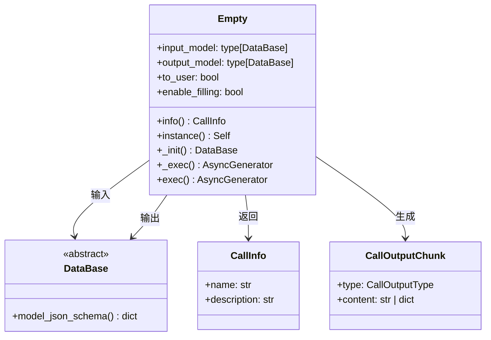
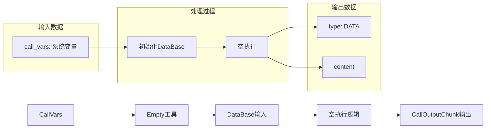
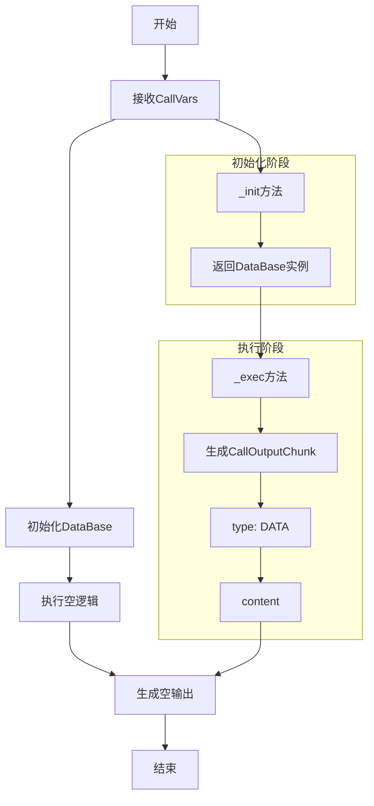
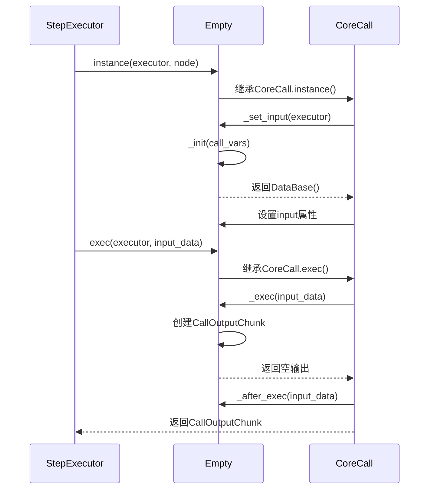

# Empty工具模块文档

## 概述

Empty工具是一个占位符工具，用于在工作流中提供空白节点功能。它不执行任何实际的操作，主要用于工作流设计中的占位、测试或作为流程控制节点。Empty工具是最简单的Call实现，展示了CoreCall框架的基本结构和生命周期。

## 功能特性

- **占位符功能**：提供空白节点，用于工作流占位
- **多语言支持**：支持中文和英文两种语言
- **最小化实现**：展示CoreCall框架的基本结构
- **零副作用**：不执行任何实际操作，确保系统稳定性
- **结构化数据**：基于Pydantic模型进行数据验证和序列化

## 核心组件

### 1. Empty类

Empty工具的核心实现类，继承自`CoreCall`基类，是所有Call实现中最简单的示例。

### 2. 主要属性

| 属性名 | 类型 | 默认值 | 描述 |
|--------|------|--------|------|
| `input_model` | type[DataBase] | DataBase | 输入模型类型 |
| `output_model` | type[DataBase] | DataBase | 输出模型类型 |
| `to_user` | bool | False | 是否将输出返回给用户 |
| `enable_filling` | bool | False | 是否需要进行自动参数填充 |

### 3. 核心方法

- `info()`: 返回工具的多语言名称和描述
- `instance()`: 创建工具实例（继承自CoreCall）
- `_init()`: 初始化工具输入
- `_exec()`: 执行工具逻辑（空实现）
- `exec()`: 公共执行接口（继承自CoreCall）

## 数据结构

Empty工具的数据结构非常简单，它使用DataBase作为输入和输出模型：



### 数据模型说明

- **DataBase**: 所有Call的输入基类，提供通用的数据验证和序列化功能
- **CallInfo**: 包含工具名称和描述的信息类
- **CallOutputChunk**: Call的输出块，包含类型和内容
- **Empty**: 主要的工具类，使用DataBase作为输入和输出模型

### 数据流转关系



## 工作流程

Empty工具的工作流程非常简单，主要展示Call的基本生命周期：



## 执行时序图



## 核心实现

### 1. 类定义

```python
class Empty(CoreCall, input_model=DataBase, output_model=DataBase):
    """空Call"""
```

Empty类继承自CoreCall，并指定输入和输出模型都为DataBase，这是最简单的配置。

### 2. 多语言信息

```python
@classmethod
def info(cls, language: LanguageType = LanguageType.CHINESE) -> CallInfo:
    i18n_info = {
        LanguageType.CHINESE: CallInfo(name="空白", description="空白节点，用于占位"),
        LanguageType.ENGLISH: CallInfo(name="Empty", description="Empty node, used for placeholder"),
    }
    return i18n_info[language]
```

提供中英文两种语言的名称和描述信息。

### 3. 初始化方法

```python
async def _init(self, call_vars: CallVars) -> DataBase:
    return DataBase()
```

返回一个空的DataBase实例，不进行任何处理。

### 4. 执行方法

```python
async def _exec(self, input_data: dict[str, Any]) -> AsyncGenerator[CallOutputChunk, None]:
    output = CallOutputChunk(type=CallOutputType.DATA, content={})
    yield output
```

生成一个空的DATA类型输出块，内容为空字典。

## 使用示例

### 基本使用

```python
# 创建Empty工具实例
empty_tool = await Empty.instance(executor, node)

# 执行空操作
async for chunk in empty_tool.exec(executor, input_data):
    if chunk.type == CallOutputType.DATA:
        print(f"输出内容: {chunk.content}")  # 输出: {}
```

### 在工作流中使用

```python
# 工作流配置示例
workflow_config = {
    "nodes": [
        {
            "id": "start",
            "type": "start",
            "name": "开始"
        },
        {
            "id": "placeholder",
            "type": "Empty",
            "name": "占位节点",
            "description": "用于占位的空白节点"
        },
        {
            "id": "end",
            "type": "end", 
            "name": "结束"
        }
    ],
    "edges": [
        {"from": "start", "to": "placeholder"},
        {"from": "placeholder", "to": "end"}
    ]
}
```

## 配置参数

| 参数 | 类型 | 默认值 | 描述 |
|------|------|--------|------|
| `input_model` | type[DataBase] | DataBase | 输入模型类型 |
| `output_model` | type[DataBase] | DataBase | 输出模型类型 |
| `to_user` | bool | False | 是否将输出返回给用户 |
| `enable_filling` | bool | False | 是否需要进行自动参数填充 |

## 应用场景

### 1. 工作流占位


在工作流设计中使用Empty节点作为占位符，为未来的功能扩展预留位置。

### 2. 流程测试

在开发阶段使用Empty节点测试工作流的连接性和流程逻辑，而不执行实际的功能。

## 依赖关系

- `CoreCall`: 基础调用框架，提供通用的Call生命周期管理
- `DataBase`: 基础数据模型，提供通用的数据验证和序列化功能
- `CallInfo`: 工具信息模型，包含名称和描述
- `CallOutputChunk`: 输出块模型，定义输出格式
- `CallVars`: 系统变量模型，包含执行上下文信息

## 相关模块

- `apps/scheduler/call/core.py`: CoreCall基类实现
- `apps/scheduler/call/empty.py`: Empty工具实现
- `apps/schemas/scheduler.py`: 调度器相关Schema定义
- `apps/schemas/enum_var.py`: 枚举类型定义
