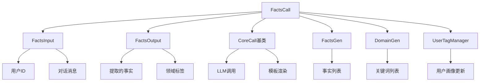
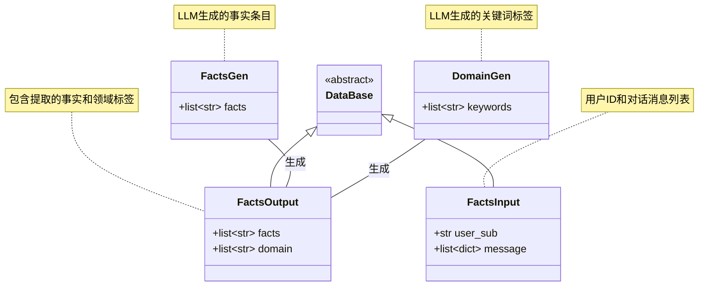
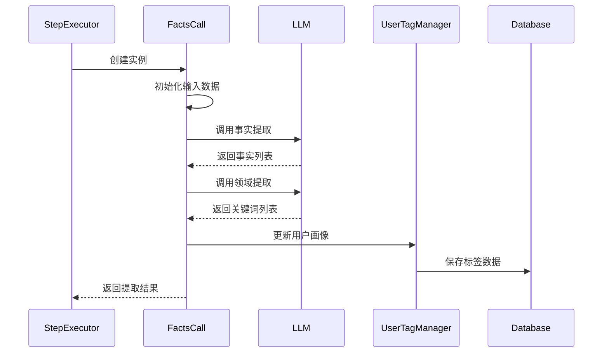
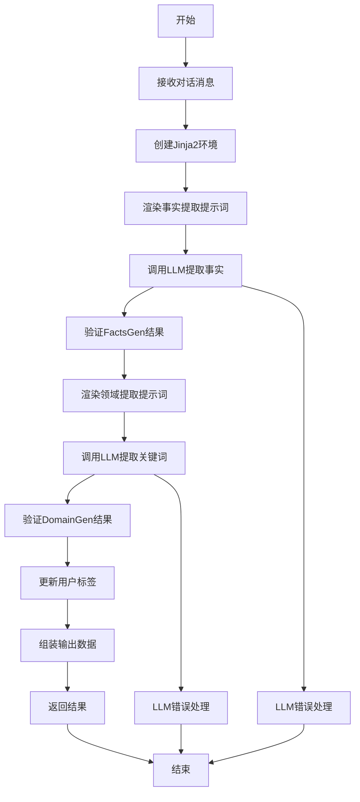
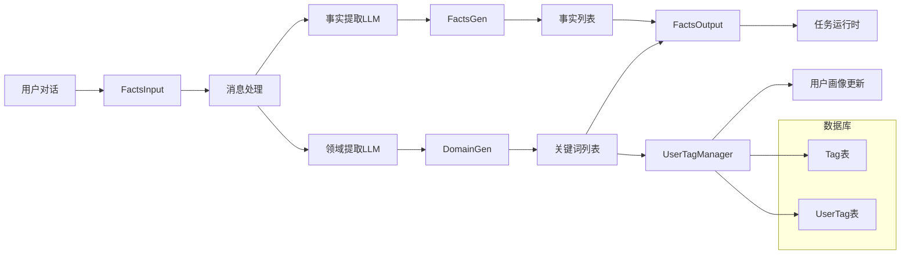
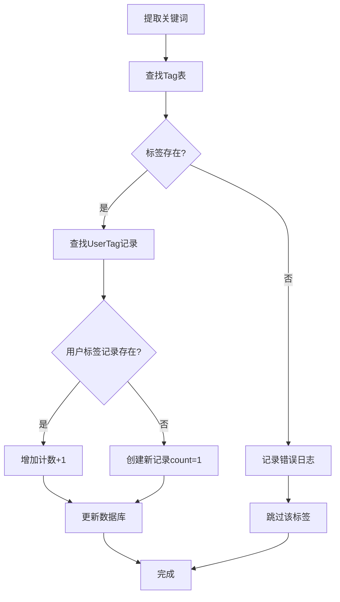

# Facts模块文档

## 概述

Facts模块是一个用于从对话上下文和文档片段中提取事实信息的工具。该模块通过分析用户与助手的对话内容，提取关键事实信息并生成用户画像标签，为推荐系统提供数据支持。

## 模块架构



## 核心组件

### 1. FactsCall类

继承自`CoreCall`基类，是facts模块的核心实现类。

**主要属性：**

- `answer: str` - 用户输入的回答内容
- `input_model: FactsInput` - 输入数据模型
- `output_model: FactsOutput` - 输出数据模型

**核心方法：**

- `info()` - 返回模块的名称和描述（支持中英文）
- `instance()` - 创建模块实例
- `_init()` - 初始化模块，组装输入数据
- `_exec()` - 执行事实提取逻辑
- `exec()` - 公共执行接口，处理输出格式

### 2. 数据结构



### 3. 提示词模板

#### 事实提取提示词 (FACTS_PROMPT)

从对话中提取关键信息并组织成独特的事实条目：

- **关注信息类型**：实体、偏好、关系、动作
- **提取要求**：准确、清晰、简洁（少于30字）
- **输出格式**：JSON格式的事实列表
- **语言支持**：中文/英文双语模板

#### 领域提取提示词 (DOMAIN_PROMPT)

提取推荐系统所需的关键词标签：

- **包含内容**：实体名词、技术术语、时间范围、地点、产品等
- **标签要求**：精简、不重复、不超过10字
- **输出格式**：JSON格式的关键词列表
- **语言支持**：中文/英文双语模板

## 执行流程



## 处理逻辑



## 数据流图



## 用户画像更新机制



## 配置和依赖

### 依赖组件

- `CoreCall` - 基础调用框架
- `UserTagManager` - 用户标签管理服务
- `LLM` - 大语言模型服务
- `Jinja2` - 模板渲染引擎

### 配置参数

- `language` - 语言类型（中文/英文）
- `autoescape` - 模板自动转义（false）
- `trim_blocks` - 去除块空白（true）
- `lstrip_blocks` - 去除行空白（true）

## 使用示例

### 输入示例

```python
input_data = {
    "user_sub": "user123",
    "message": [
        {"role": "user", "content": "北京天气如何？"},
        {"role": "assistant", "content": "北京今天晴天，温度25度。"}
    ]
}
```

### 输出示例

```python
output = {
    "facts": ["北京今天天气晴朗", "北京今日温度25度"],
    "domain": ["北京", "天气"]
}
```

## 错误处理

1. **LLM调用失败** - 记录错误日志，返回空结果
2. **数据验证失败** - 抛出类型错误异常
3. **标签不存在** - 记录错误日志，跳过该标签
4. **数据库操作失败** - 抛出相应异常

## 性能考虑

- 使用异步生成器模式，支持流式输出
- 模板渲染缓存，提高重复调用效率
- 批量数据库操作，减少I/O开销
- 错误恢复机制，保证系统稳定性

## 扩展性

- 支持多语言提示词模板
- 可配置的事实提取规则
- 可扩展的用户画像维度
- 支持自定义输出格式
