# Graph Call 模块设计文档

## 模块概述

Graph Call 模块是 Scheduler 框架中的图表渲染工具,用于将 SQL 查询得到的结构化数据转换为可视化图表。该模块基于 ECharts 图表库,通过大语言模型智能选择图表类型和样式,自动生成符合用户需求的图表配置。

## 核心组件

### 1. Graph 类 (graph.py)

主要的图表生成工具类,继承自 `CoreCall`,实现了完整的图表渲染流程。

### 2. Schema 类 (schema.py)

定义了图表工具的输入输出数据结构:

- `RenderInput`: 图表渲染的输入参数
- `RenderOutput`: 图表渲染的输出结果
- `RenderFormat`: ECharts 图表的完整配置格式
- `RenderStyleResult`: 大语言模型选择的图表样式结果
- `RenderAxis`: ECharts 图表的轴配置

### 3. 提示词模板 (prompt.py)

包含中英文双语提示词模板 `GENERATE_STYLE_PROMPT`,用于引导大语言模型根据用户问题选择合适的图表类型和样式。

### 4. 图表配置模板 (option.json)

预定义的 ECharts 基础配置模板,包含 tooltip、legend、dataset、xAxis、yAxis 和 series 等核心配置项。

## 类结构图

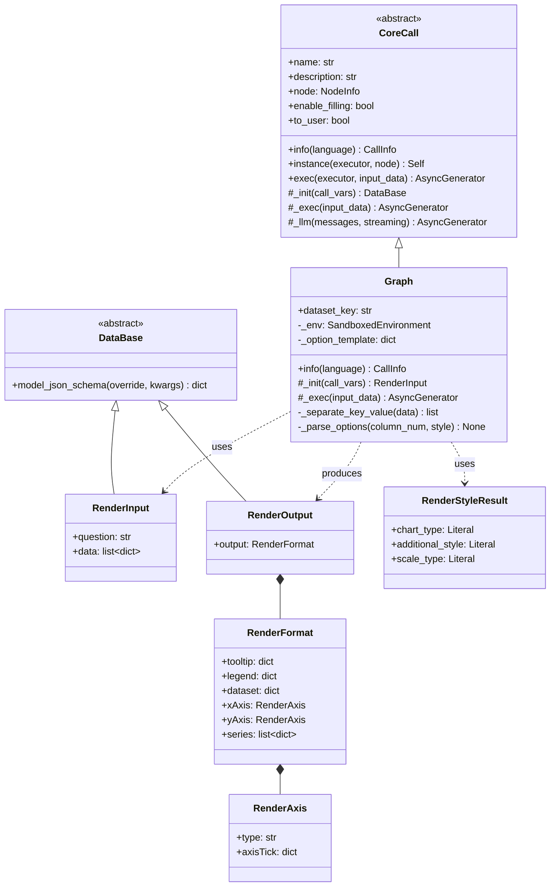

## 执行流程图

### 主流程

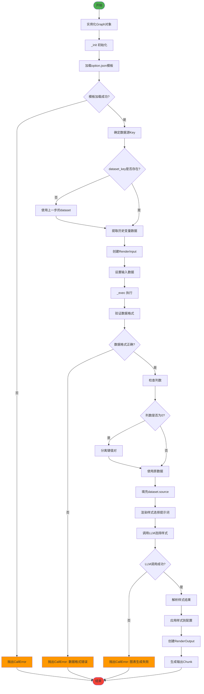

### 样式解析流程

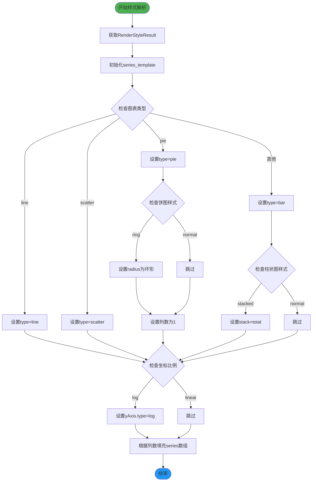

## 时序图

### 完整调用时序

```mermaid
sequenceDiagram
    participant Executor as StepExecutor
    participant Graph as Graph实例
    participant Template as Jinja2Template
    participant LLM as 大语言模型
    participant File as option.json

    Executor->>+Graph: instance(executor, node)
    Graph->>Graph: __init__(参数)
    Graph->>+Graph: _set_input(executor)
    Graph->>+Graph: _init(call_vars)

    Graph->>Graph: 创建SandboxedEnvironment
    Graph->>+File: 读取option.json
    File-->>-Graph: 返回模板内容

    alt 模板加载失败
        Graph->>Graph: 抛出CallError
    end

    Graph->>Graph: 解析JSON模板
    Graph->>Graph: 保存到_option_template

    alt dataset_key为空
        Graph->>Graph: 使用上一步ID
        Graph->>Graph: 拼接路径: step_id/dataset
    end

    Graph->>Graph: _extract_history_variables(key, history)
    Graph->>Graph: 创建RenderInput对象
    Graph-->>-Graph: 返回RenderInput
    Graph->>Graph: 保存input数据
    Graph-->>-Graph: 完成初始化
    Graph-->>-Executor: 返回Graph实例

    Executor->>+Graph: exec(executor, input_data)
    Graph->>+Graph: _exec(input_data)
    Graph->>Graph: 验证RenderInput

    alt 数据格式错误
        Graph->>Graph: 抛出CallError
    end

    Graph->>Graph: 计算列数

    alt 列数为0
        Graph->>+Graph: _separate_key_value(data)
        Graph-->>-Graph: 返回分离后数据
        Graph->>Graph: 设置列数为1
    end

    Graph->>Graph: 填充_option_template["dataset"]["source"]

    Graph->>+Template: 选择语言模板
    Graph->>Template: render(question)
    Template-->>-Graph: 返回提示词

    Graph->>+LLM: 调用LLM流式生成
    loop 流式接收
        LLM-->>Graph: 返回chunk
        Graph->>Graph: 拼接结果
    end
    LLM-->>-Graph: 完成生成

    Graph->>Graph: model_validate_json(result)
    Graph->>Graph: 解析为RenderStyleResult

    Graph->>+Graph: _parse_options(column_num, style)

    alt chart_type为line
        Graph->>Graph: 设置series_template.type=line
    else chart_type为scatter
        Graph->>Graph: 设置series_template.type=scatter
    else chart_type为pie
        Graph->>Graph: 设置series_template.type=pie
        Graph->>Graph: 设置column_num=1
        alt additional_style为ring
            Graph->>Graph: 设置radius=[40%, 70%]
        end
    else 其他
        Graph->>Graph: 设置series_template.type=bar
        alt additional_style为stacked
            Graph->>Graph: 设置stack=total
        end
    end

    alt scale_type为log
        Graph->>Graph: 设置yAxis.type=log
    end

    loop 遍历列数
        Graph->>Graph: 添加series_template到series数组
    end

    Graph-->>-Graph: 完成样式配置

    Graph->>Graph: 创建RenderFormat对象
    Graph->>Graph: 创建RenderOutput对象
    Graph->>Graph: 创建CallOutputChunk
    Graph->>Executor: yield chunk

    Graph-->>-Graph: 完成执行
    Graph-->>-Executor: 执行完成
```

## 数据结构

### 输入数据结构

#### RenderInput

```json
{
  "question": "查询openEuler各版本的软件数量并绘制柱状图",
  "data": [
    {
      "openeuler_version": "openEuler-22.03-LTS-SP2",
      "软件数量": 5847
    },
    {
      "openeuler_version": "openEuler-22.03-LTS-SP3",
      "软件数量": 6012
    },
    {
      "openeuler_version": "openEuler-22.03-LTS-SP4",
      "软件数量": 6123
    }
  ]
}
```

**字段说明:**

| 字段 | 类型 | 必填 | 说明 |
|------|------|------|------|
| question | string | 是 | 用户原始问题 |
| data | array | 是 | SQL查询结果数据,必须是字典列表格式 |

### 输出数据结构

#### RenderOutput

```json
{
  "output": {
    "tooltip": {},
    "legend": {},
    "dataset": {
      "source": [
        {
          "openeuler_version": "openEuler-22.03-LTS-SP2",
          "软件数量": 5847
        },
        {
          "openeuler_version": "openEuler-22.03-LTS-SP3",
          "软件数量": 6012
        },
        {
          "openeuler_version": "openEuler-22.03-LTS-SP4",
          "软件数量": 6123
        }
      ]
    },
    "xAxis": {
      "type": "category",
      "axisTick": {
        "alignWithLabel": false
      }
    },
    "yAxis": {
      "type": "value",
      "axisTick": {
        "alignWithLabel": false
      }
    },
    "series": [
      {
        "type": "bar"
      }
    ]
  }
}
```

**字段说明:**

| 字段 | 类型 | 说明 |
|------|------|------|
| output | object | ECharts完整配置对象 |
| output.tooltip | object | 提示框配置 |
| output.legend | object | 图例配置 |
| output.dataset | object | 数据集配置 |
| output.dataset.source | array | 数据源数组 |
| output.xAxis | object | X轴配置 |
| output.yAxis | object | Y轴配置 |
| output.series | array | 系列配置数组 |

### 中间数据结构

#### RenderStyleResult

LLM选择的图表样式结果:

```json
{
  "chart_type": "bar",
  "additional_style": "stacked",
  "scale_type": "linear"
}
```

**字段说明:**

| 字段 | 类型 | 可选值 | 说明 |
|------|------|--------|------|
| chart_type | string | bar, pie, line, scatter | 图表类型 |
| additional_style | string | normal, stacked, ring | 附加样式 |
| scale_type | string | linear, log | 坐标轴比例类型 |

**样式组合规则:**

- **柱状图 (bar)**:
  - `normal`: 普通柱状图
  - `stacked`: 堆叠柱状图
- **饼图 (pie)**:
  - `normal`: 普通饼图
  - `ring`: 环形饼图
- **折线图 (line)**: 无附加样式
- **散点图 (scatter)**: 无附加样式

## 配置模板

### option.json 模板结构

```json
{
  "tooltip": {},
  "legend": {},
  "dataset": {
    "source": []
  },
  "xAxis": {
    "type": "category",
    "axisTick": {
      "alignWithLabel": false
    }
  },
  "yAxis": {
    "type": "value",
    "axisTick": {
      "alignWithLabel": false
    }
  },
  "series": []
}
```

**配置项说明:**

| 配置项 | 类型 | 初始值 | 说明 |
|--------|------|--------|------|
| tooltip | object | {} | 提示框组件,空对象表示使用默认配置 |
| legend | object | {} | 图例组件,空对象表示使用默认配置 |
| dataset.source | array | [] | 数据源,运行时填充SQL查询结果 |
| xAxis.type | string | category | X轴类型,类目轴 |
| yAxis.type | string | value | Y轴类型,数值轴,可能被修改为log |
| series | array | [] | 系列列表,运行时根据列数和样式填充 |

## 提示词模板

- **结构化指令**: 使用 XML 标签清晰分隔不同部分
- **枚举类型说明**: 明确列出所有可用的图表类型和样式选项
- **示例驱动**: 提供完整的问题-思考-答案示例
- **思维链引导**: 使用"让我们一步步思考"引导模型推理
- **格式约束**: 明确要求输出 JSON 格式
- **多语言支持**: 提供中英文两种语言的独立模板

## 核心算法

### 1. 数据格式验证

系统对输入数据进行严格的格式验证:

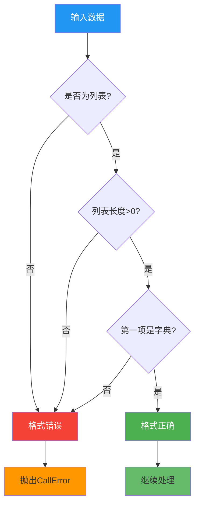

**验证规则:**

- 数据必须是列表类型
- 列表长度必须大于0
- 列表的第一个元素必须是字典类型

**示例:**

```python
# 正确格式
[
    {"version": "22.03-LTS-SP2", "count": 100},
    {"version": "22.03-LTS-SP3", "count": 120}
]

# 错误格式
"some string"  # 不是列表
[]  # 空列表
[1, 2, 3]  # 不是字典列表
```

### 2. 键值对分离算法

当数据只有单列(列数为0)时,执行键值对分离:


**转换示例:**

输入:

```json
[
  {"total_packages": 5847}
]
```

输出:

```json
[
  {
    "type": "total_packages",
    "value": 5847
  }
]
```

**算法逻辑:**

1. 遍历数据列表中的每个字典
2. 对于每个字典,遍历其键值对
3. 将每个键值对转换为 `{"type": key, "value": val}` 格式
4. 将转换后的字典添加到结果列表
5. 返回新的数据列表

### 3. 列数计算

列数决定了需要生成多少个 series 配置:

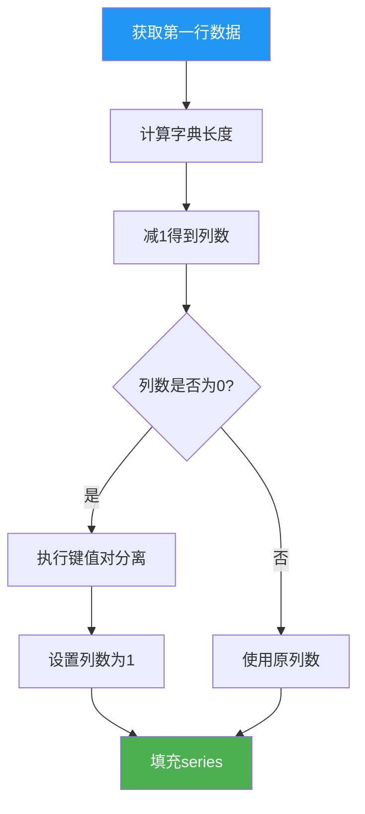

**计算规则:**

- 列数 = 数据第一行字典的键数量 - 1
- 减1是因为通常第一列是类目/标签,不计入数据系列
- 如果列数为0,表示数据只有一个键值对,需要分离后列数变为1

**示例:**

数据:

```json
[
  {"version": "v1", "pkg_count": 100, "issue_count": 50}
]
```

- 字典长度: 3
- 列数: 3 - 1 = 2
- 需要生成2个 series 配置

### 4. 样式应用算法

根据 LLM 返回的样式结果配置图表:

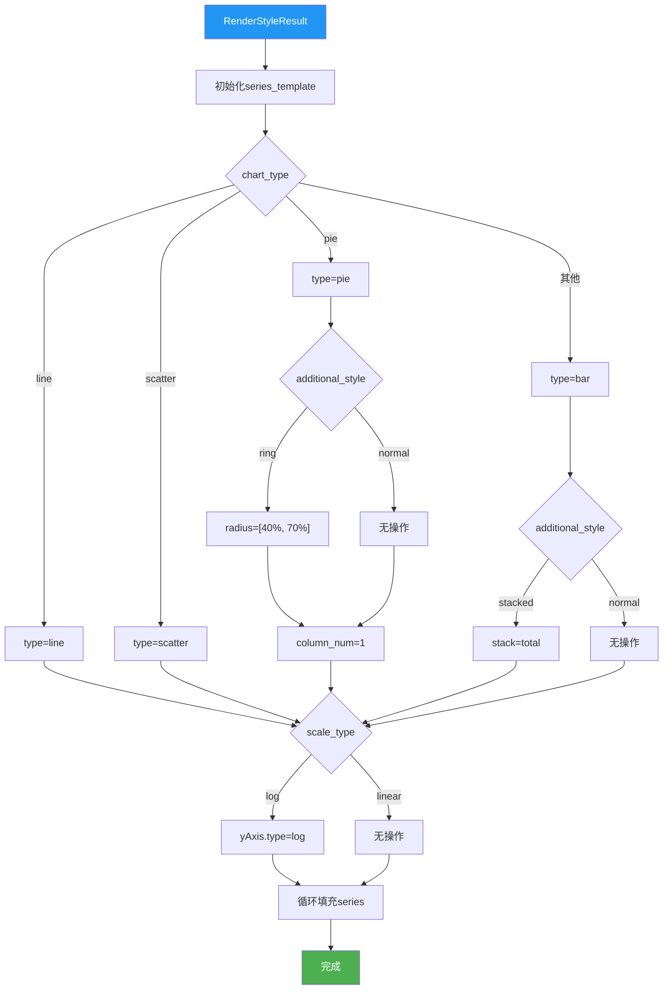

## 工作流程

### 初始化流程

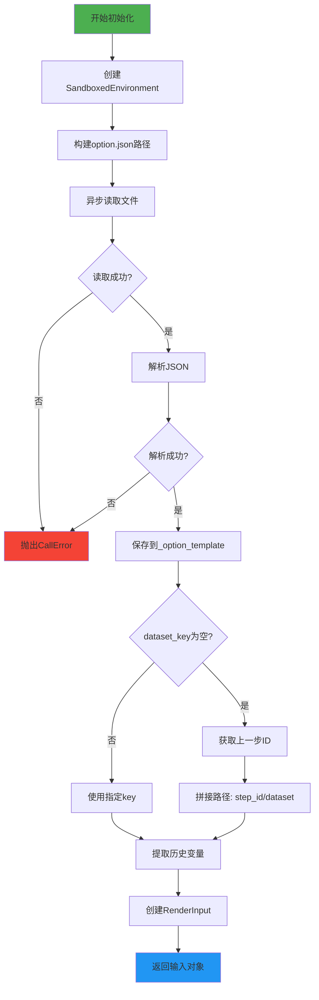

### 执行流程

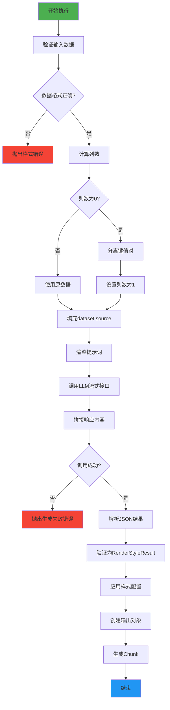

## 关键特性

### 1. 图表类型支持

支持的图表类型如下：

- 柱状图（bar）  
  - 普通柱状图（normal）
  - 堆叠柱状图（stacked）
- 饼图（pie）
  - 普通饼图（normal）
  - 环形饼图（ring）
- 折线图（line）
  - 折线图
- 散点图（scatter）
  - 散点图

### 2. 坐标轴比例支持

支持的坐标轴比例包括：

- 线性比例（linear）：适用于数据分布较为均匀的情况，配置项无需特殊指定。
- 对数比例（log）：适用于跨度较大、变化量级明显的数据类型，配置项需设置 `yAxis.type=log`。

### 3. 数据源自动识别

自动识别和选择数据源的方式如下：

- 如果未指定 `dataset_key`，系统会自动使用上一步输出的 `dataset`。
- 支持显式指定数据源路径，例如通过"step_id/key"格式指向历史某一步的数据。
- 默认流程为：  
  1. 检查 `dataset_key` 是否存在。
  2. 存在时使用指定 key 的历史数据。
  3. 不存在时，获取上一步的 step_id，并拼接出 `step_id/dataset`。
  4. 从对应位置提取数据传递给图表。

### 4. 智能样式选择

图表样式的智能选择流程如下：

1. 用户提出可视化需求（如类型、样式）。
2. 系统通过 Jinja2 模板渲染用户需求与数据结构，生成提示词。
3. 大语言模型根据提示词进行推理，返回结构化的样式选择结果（如图表类型、样式、坐标比例）。
4. 系统根据返回的结果自动生成相应的 ECharts 图表配置。

样式选择主要包括：

- 分析用户问题意图
- 匹配合适的图表类型
- 选择可能的附加样式（如 stacked、ring 等）
- 判断使用线性或对数比例

## 错误处理

### 错误场景

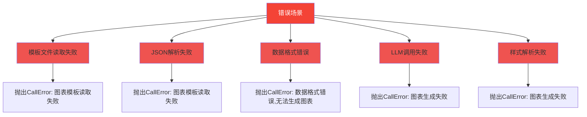

**错误信息示例:**

```json
{
  "message": "数据格式错误,无法生成图表!",
  "data": {
    "data": "invalid data format"
  }
}
```

## 配置参数

### Graph 类配置参数

| 参数 | 类型 | 默认值 | 说明 |
|------|------|--------|------|
| `dataset_key` | str | "" | 数据源路径,格式为"step_id/key",为空则使用上一步的dataset |
| `name` | str | 必填 | 工具名称 |
| `description` | str | 必填 | 工具描述 |
| `node` | NodeInfo | None | 节点信息 |
| `enable_filling` | bool | False | 是否需要自动参数填充 |
| `to_user` | bool | False | 是否将输出返回给用户 |

### 多语言支持

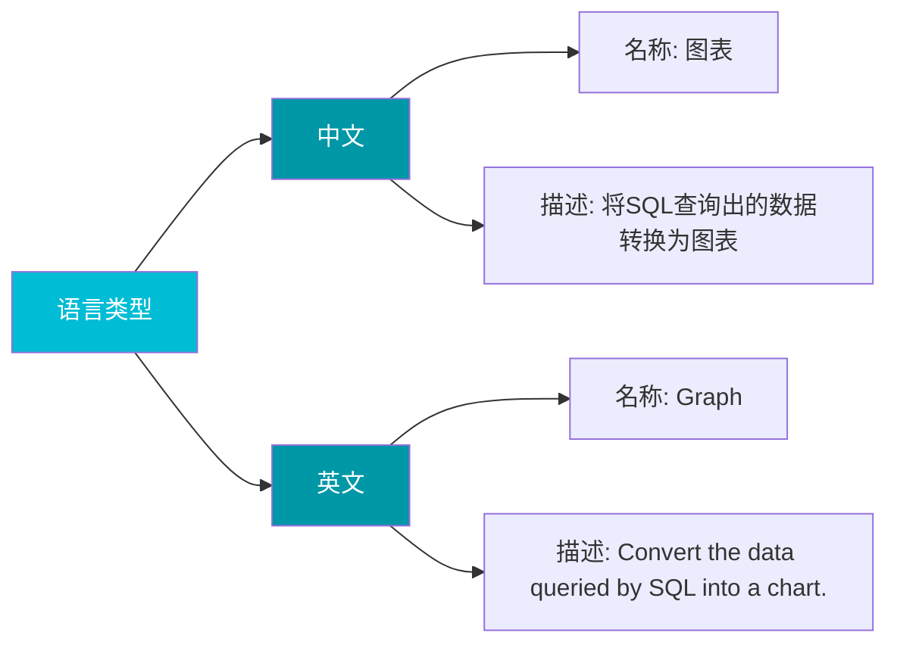

## 状态图

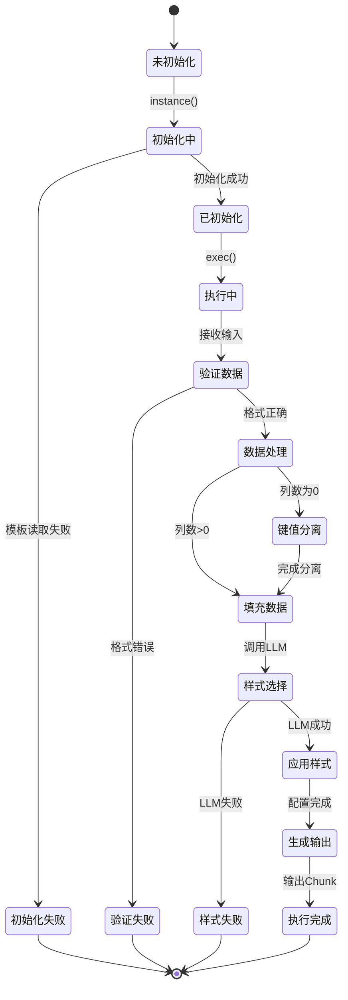
