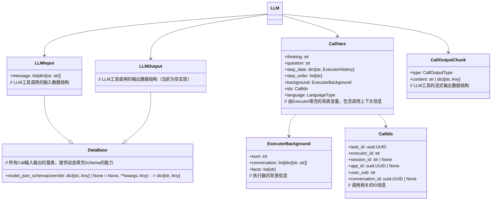
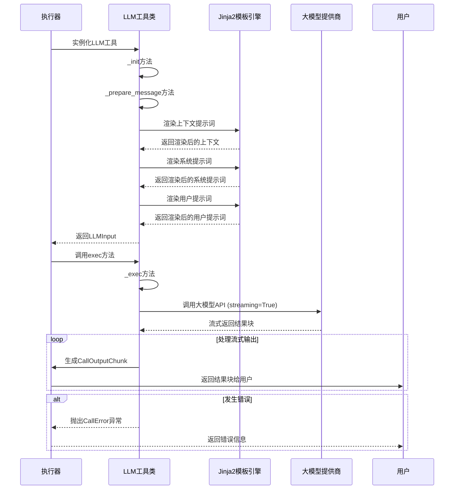

# LLM调用模块文档

## 1. 模块概述

LLM（Large Language Model）调用模块是欧拉助手框架中负责与大语言模型交互的核心组件。该模块提供了灵活的大模型调用能力，支持自定义系统提示词、用户提示词、历史对话记录等多种参数配置，可根据上下文信息和用户输入生成适当的大模型调用请求，并流式返回大模型的响应结果。

## 2. 代码结构

LLM调用模块位于 `apps/scheduler/call/llm/` 目录下，包含以下三个主要文件：

```text
apps/scheduler/call/llm/
├── __init__.py    # 模块初始化文件
├── llm.py         # 核心实现代码
├── prompt.py      # 提示词模板定义
└── schema.py      # 输入输出数据结构定义
```

## 3. 核心类与方法

### 3.1 LLM类

`LLM` 类是模块的核心，继承自 `CoreCall` 基类，实现了与大模型的交互逻辑。

### 3.2 主要属性

| 属性名 | 类型 | 默认值 | 描述 |
|--------|------|--------|------|
| `to_user` | bool | True | 是否需要将输出返回给用户 |
| `temperature` | float | 0.7 | 大模型温度（随机化程度），控制输出的随机性 |
| `step_history_size` | int | 3 | 上下文信息中包含的步骤历史数量，范围0-10 |
| `history_length` | int | 0 | 历史对话记录数量，用于提供上下文信息 |
| `system_prompt` | str | "You are a helpful assistant." | 大模型系统提示词，定义AI的角色和行为 |
| `user_prompt` | str | LLM_DEFAULT_PROMPT | 大模型用户提示词模板，使用Jinja2语法 |

### 3.3 主要方法

#### 3.3.1 info方法

**功能描述**：提供LLM工具的名称和描述信息，支持多语言国际化。

**主要特点**：

- 支持中英文两种语言切换
- 返回标准的CallInfo对象，包含工具名称和功能描述
- 中文版本名称为"大模型"，英文版本名称为"LLM"
- 描述信息说明了工具的核心功能：使用指定提示词和上下文信息调用大模型

#### 3.3.2 _prepare_message方法

**功能描述**：准备输入给大模型的消息列表，是整个LLM调用流程的核心预处理方法。

**处理步骤**：

1. **创建Jinja2模板环境**：用于后续的模板渲染
2. **提取上下文信息**：从call_vars中获取最近几个步骤的历史数据
3. **渲染上下文提示词**：使用LLM_CONTEXT_PROMPT模板，将AI思考过程和工具输出信息格式化
4. **处理历史对话记录**：根据配置的history_length参数提取相关对话历史
5. **渲染系统提示词**：使用Jinja2模板引擎处理系统提示词
6. **渲染用户提示词**：将用户问题、上下文信息等参数注入用户提示词模板
7. **构建消息列表**：按照标准格式组装完整的消息序列

**输出格式**：返回包含role和content字段的消息字典列表

#### 3.3.3 _init方法

**功能描述**：初始化LLM工具，准备调用所需的输入数据。

**执行流程**：

- 接收CallVars参数，包含执行上下文信息
- 调用_prepare_message方法生成消息列表
- 将消息列表封装为LLMInput对象
- 返回准备好的输入数据供后续执行使用

#### 3.3.4 _exec方法

**功能描述**：执行实际的大模型调用，并以流式方式返回处理结果。

**执行过程**：

1. **数据验证**：将输入数据转换为LLMInput对象
2. **大模型调用**：通过self._llm方法调用大模型API，启用流式模式
3. **流式处理**：使用异步生成器逐块接收大模型返回的结果
4. **结果转换**：将每个结果块封装为CallOutputChunk对象
5. **异常处理**：捕获调用过程中的异常，并转换为标准的CallError异常

**输出特性**：

- 采用流式输出，提高响应速度和用户体验
- 每个输出块包含类型标识（TEXT）和内容
- 自动过滤空结果块，确保输出质量

## 4. 提示词模板

LLM调用模块使用了两种主要的提示词模板，定义在`prompt.py`文件中：

### 4.1 LLM_CONTEXT_PROMPT 上下文提示词模板

**功能说明**：用于提供AI思考过程和工具调用信息，帮助大模型理解上下文背景。

**主要特点**：

- **多语言支持**：提供中英文两种语言版本
- **结构化输出**：使用XML标签格式组织信息
- **动态变量**：通过Jinja2模板引擎注入动态内容
- **循环渲染**：支持多个工具输出的动态生成

**模板结构**：

1. **思考过程部分**：
   - 中文版：`以下是AI处理用户指令时所做的思考，在<reasoning>中给出：`
   - 英文版：`The following is the thinking of the AI when processing the user's instruction, given in <reasoning>:`
   - 使用 `{{ reasoning }}` 变量插入AI的思考内容

2. **工具调用说明部分**：
   - 中文版：`你作为AI，在完成用户指令前，需要获取必要的信息。为此，你调用了一些工具，并获得了它们的输出：`
   - 英文版：`As an AI, before completing the user's instruction, you need to obtain necessary information. For this purpose, you have called some tools and obtained their outputs:`

3. **工具数据部分** (`<tool_data>`)：
   - 使用 `` 循环渲染多个工具的输出
   - 每个工具包含三个子元素：
     - `<name>{{ tool.step_name }}</name>`：工具名称
     - `<description>{{ tool.step_description }}</description>`：工具描述
     - `<output>{{ tool.output_data }}</output>`：工具输出数据

### 4.2 LLM_DEFAULT_PROMPT 默认用户提示词模板

**功能说明**：默认的用户提示词模板，包含系统指令、用户问题和上下文信息的完整结构。

**主要特点**：

- **角色定义**：明确定义AI助手的角色和行为准则
- **时间感知**：提供当前时间信息作为时间参照
- **上下文整合**：将用户问题和背景信息有机结合
- **输出规范**：明确要求不包含XML标签，不编造信息

**模板结构**：

1. **系统指令部分** (`<instructions>`)：
   - 定义AI助手的基本角色和职责
   - 提供当前时间信息（通过 `{{ time }}` 变量）
   - 说明用户问题和背景信息的来源
   - 明确输出要求和注意事项

2. **用户问题部分** (`<user_question>`)：
   - 使用 `{{ question }}` 变量插入用户的具体问题
   - 提供清晰的问题展示格式

3. **上下文背景部分** (`<context>`)：
   - 使用 `{{ context }}` 变量插入相关的背景信息
   - 包含AI思考过程和工具调用结果

4. **输出引导**：
   - 简洁地引导AI开始输出回答

## 5. 数据结构

### 5.1 类关系图

以下是LLM调用模块中使用的主要数据结构及其关系：



### 5.2 详细字段说明

#### 5.2.1 LLMInput 输入数据结构

| 字段名 | 类型 | 必需 | 说明 | 示例值 |
|--------|------|------|------|--------|
| `message` | `list[dict[str, str]]` | ✅ | 输入给大模型的消息列表，每条消息包含role和content字段 | `[{"role": "user", "content": "你好"}]` |

**消息格式说明**：

- `role`: 消息角色，通常为 `"system"`、`"user"` 或 `"assistant"`
- `content`: 消息内容，包含具体的文本信息

#### 5.2.2 CallVars 系统变量结构

| 字段名 | 类型 | 必需 | 说明 | 示例值 |
|--------|------|------|------|--------|
| `thinking` | `str` | ✅ | 上下文思考信息，包含AI的推理过程 | `"用户想了解天气情况，我需要调用天气工具获取信息。"` |
| `question` | `str` | ✅ | 改写后的用户输入问题 | `"今天北京的天气怎么样？"` |
| `step_data` | `dict[str, ExecutorHistory]` | ✅ | 历史工具的结构化数据字典，key为工具名称 | `{"weather": ExecutorHistory(...)}` |
| `step_order` | `list[str]` | ✅ | 历史工具的执行顺序列表 | `["weather", "llm"]` |
| `background` | `ExecutorBackground` | ✅ | 执行器的背景信息对象 | `ExecutorBackground(...)` |
| `ids` | `CallIds` | ✅ | 调用相关的ID信息对象 | `CallIds(...)` |
| `language` | `LanguageType` | ✅ | 当前使用的语言类型 | `LanguageType.CHINESE` |

#### 5.2.3 ExecutorBackground 背景信息结构

| 字段名 | 类型 | 必需 | 说明 | 示例值 |
|--------|------|------|------|--------|
| `num` | `int` | ✅ | 对话记录最大数量限制 | `10` |
| `conversation` | `list[dict[str, str]]` | ✅ | 历史对话记录列表，每个元素包含role和content | `[{"role": "user", "content": "你好"}, {"role": "assistant", "content": "你好！有什么可以帮助您的吗？"}]` |
| `facts` | `list[str]` | ✅ | 当前执行器的背景事实信息列表 | `["用户位于北京", "当前时间是2024年"]` |

#### 5.2.4 CallIds ID信息结构

| 字段名 | 类型 | 必需 | 说明 | 示例值 |
|--------|------|------|------|--------|
| `task_id` | `uuid.UUID` | ✅ | 当前任务的唯一标识符 | `123e4567-e89b-12d3-a456-426614174000` |
| `executor_id` | `str` | ✅ | Flow执行器的ID，对应Flow ID | `"flow_001"` |
| `session_id` | `str \| None` | ❌ | 用户会话ID，可能为空 | `"session_123"` 或 `None` |
| `app_id` | `uuid.UUID \| None` | ❌ | 应用ID，可能为空 | `123e4567-e89b-12d3-a456-426614174001` 或 `None` |
| `user_sub` | `str` | ✅ | 用户唯一标识符 | `"user_12345"` |
| `conversation_id` | `uuid.UUID \| None` | ❌ | 对话ID，可能为空 | `123e4567-e89b-12d3-a456-426614174002` 或 `None` |

#### 5.2.5 CallOutputChunk 输出块结构

| 字段名 | 类型 | 必需 | 说明 | 示例值 |
|--------|------|------|------|--------|
| `type` | `CallOutputType` | ✅ | 输出类型枚举，标识输出内容类型 | `CallOutputType.TEXT` |
| `content` | `str \| dict[str, Any]` | ✅ | 输出内容，可以是文本字符串或结构化数据 | `"今天北京天气晴朗"` 或 `{"temperature": 25}` |

**输出类型说明**：

- `TEXT`: 文本类型输出
- `DATA`: 结构化数据输出
- `ERROR`: 错误信息输出

### 5.3 数据类型枚举

#### LanguageType 语言类型

- `CHINESE`: 中文
- `ENGLISH`: 英文

#### CallOutputType 输出类型

- `TEXT`: 文本输出
- `DATA`: 数据输出
- `ERROR`: 错误输出

## 6. 调用流程图

以下是LLM调用模块的核心调用流程图，展示了从初始化到执行再到输出结果的完整过程：



## 7. 工作原理详解

### 7.1 消息准备流程

1. **获取上下文信息**：从`call_vars`中提取最近`step_history_size`个步骤的历史数据
2. **渲染上下文提示词**：使用`LLM_CONTEXT_PROMPT`模板，插入AI思考过程和工具输出信息
3. **处理历史对话**：从`background.conversation`中提取最近`history_length`条对话记录
4. **准备格式化参数**：包括当前时间、上下文信息、用户问题等
5. **渲染系统提示词和用户提示词**：使用Jinja2模板引擎将格式化参数应用到提示词中
6. **构建消息列表**：按照历史消息、系统消息、用户消息的顺序构建完整的消息列表

### 7.2 大模型调用过程

1. **调用初始化**：`_init`方法被调用，准备LLMInput对象
2. **执行调用**：`_exec`方法被调用，将消息列表发送给大模型
3. **流式处理结果**：通过异步生成器流式接收大模型返回的结果块
4. **转换输出格式**：将结果块转换为`CallOutputChunk`格式并输出
5. **错误处理**：捕获并处理调用过程中可能出现的异常

## 8. 配置参数说明

| 参数名 | 类型 | 默认值 | 说明 |
|--------|------|--------|------|
| to_user | bool | True | 是否需要将输出返回给用户 |
| temperature | float | 0.7 | 大模型温度（随机化程度） |
| step_history_size | int | 3 | 上下文信息中包含的步骤历史数量（0-10） |
| history_length | int | 0 | 历史对话记录数量 |
| system_prompt | str | "You are a helpful assistant." | 大模型系统提示词 |
| user_prompt | str | LLM_DEFAULT_PROMPT | 大模型用户提示词 |

## 9. 输入输出示例

### 9.1 输入示例

```json
{
  "temperature": 0.7,
  "step_history_size": 3,
  "history_length": 0,
  "system_prompt": "You are a helpful assistant.",
  "user_prompt": "<instructions>\n    你是一个乐于助人的智能助手。请结合给出的背景信息, 回答用户的提问。\n    当前时间：{{ time }}，可以作为时间参照。\n    用户的问题将在<user_question>中给出，上下文背景信息将在<context>中给出。\n    注意：输出不要包含任何XML标签，不要编造任何信息。若你认为用户提问与背景信息无关，请忽略背景信息直接作答。\n</instructions>\n\n<user_question>\n    今天北京的天气怎么样？\n</user_question>\n\n<context>\n    用户想了解天气情况，我需要调用天气工具获取信息。\n</context>\n\n现在，输出你的回答："
}
```

### 9.2 输出示例

```python
# 初始化后的LLMInput对象（简化表示）
LLMInput(
    message=[
        {
            "role": "system",
            "content": "You are a helpful assistant."
        },
        {
            "role": "user",
            "content": "<instructions>\n            你是一个乐于助人的智能助手...\n        </instructions>\n        <user_question>\n            今天北京的天气怎么样？\n        </user_question>\n        <context>\n            无背景信息。\n        </context>\n        现在，输出你的回答："
        }
    ]
)

# 执行调用后，会流式返回类似以下内容
"今天北京天气晴朗，气温25-32摄氏度，微风..."
```

## 10. 总结

LLM调用模块是欧拉助手框架中连接应用与大语言模型的关键桥梁。它通过灵活的配置参数和模板系统，支持根据不同场景构建合适的提示词，并以流式方式高效处理大模型的响应结果。该模块的设计使得开发者可以轻松集成各种大语言模型能力，并通过简单的配置定制化调用行为。
