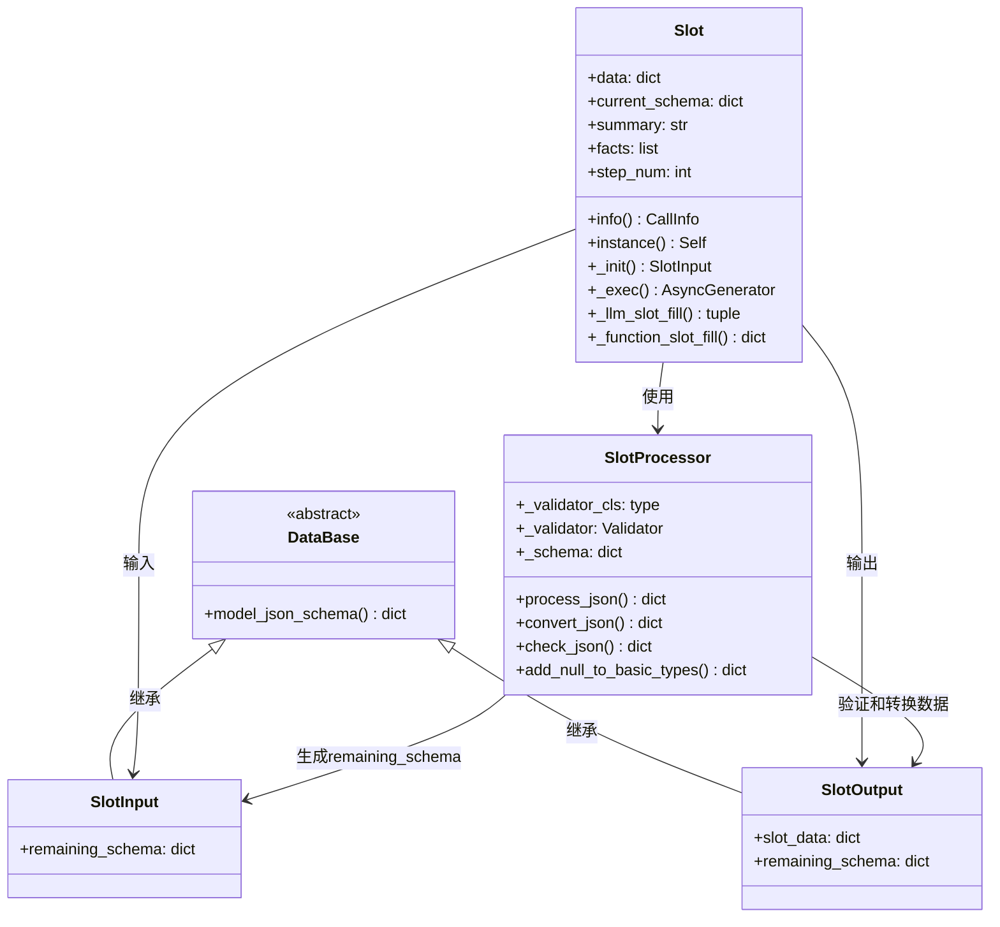
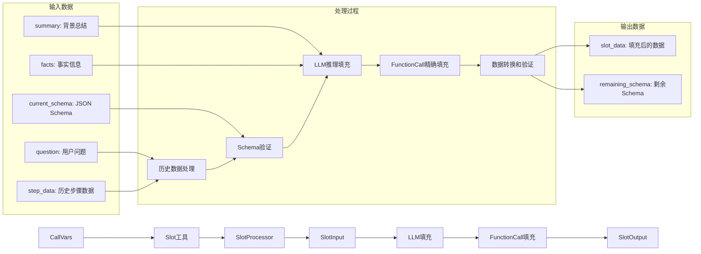
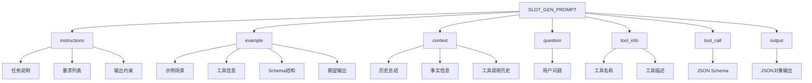
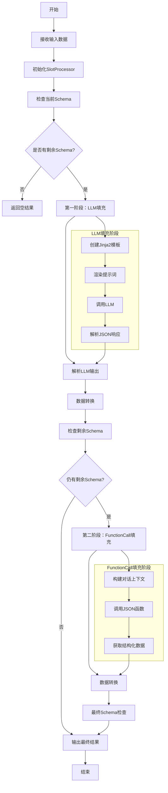
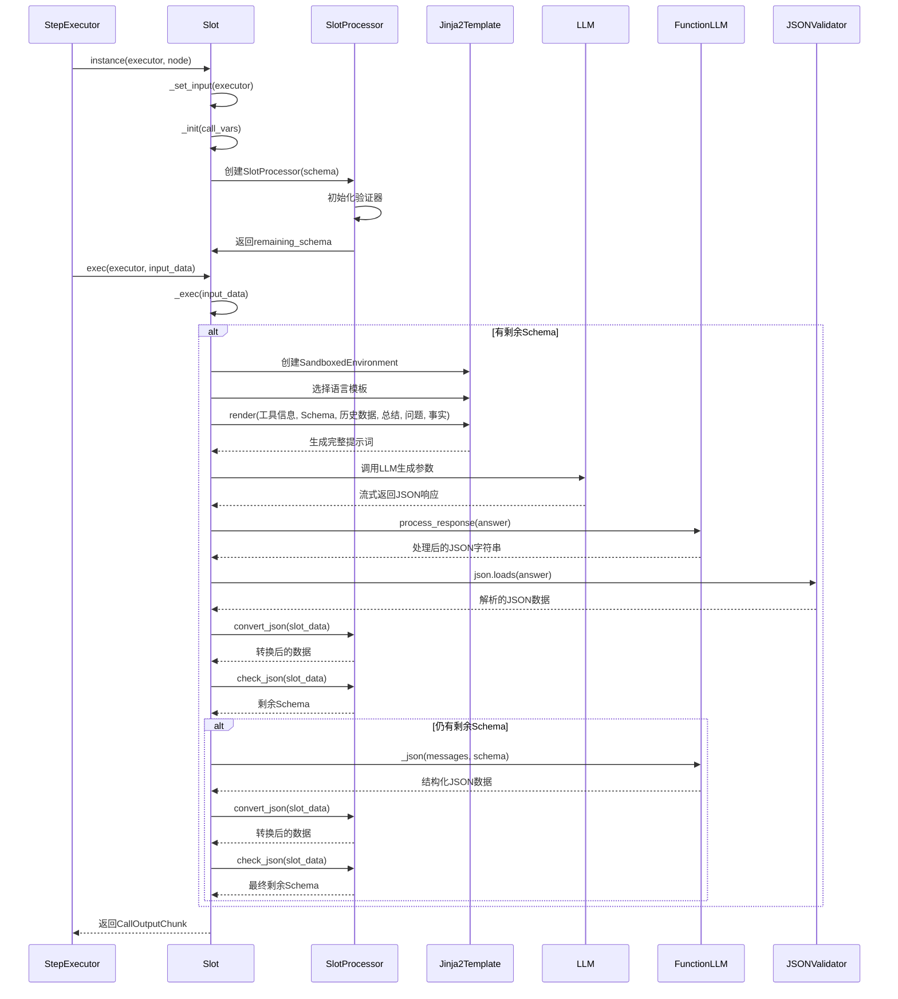
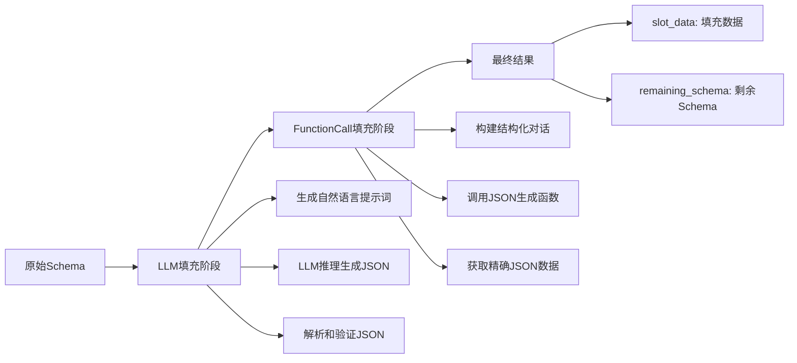
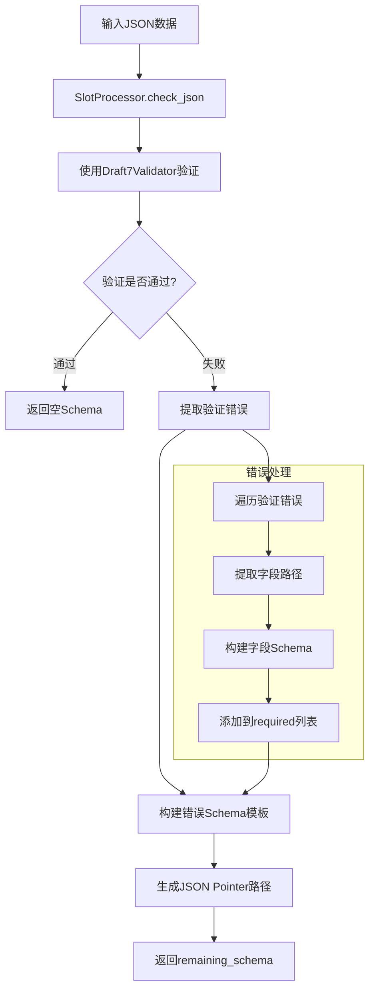

# Slot工具模块文档

## 概述

Slot工具是一个智能参数自动填充工具，它通过分析历史步骤数据、背景信息和用户问题，自动生成符合JSON Schema要求的参数对象。该工具支持两阶段填充策略：首先使用大语言模型进行初步填充，如果存在剩余参数则使用FunctionCall进行精确填充。

## 功能特性

- **智能参数填充**：基于历史步骤和背景信息自动填充工具参数
- **两阶段填充策略**：LLM初步填充 + FunctionCall精确填充
- **Schema验证**：支持JSON Schema验证和错误检测
- **多语言支持**：支持中文和英文两种语言
- **模板化提示词**：使用Jinja2模板引擎动态生成提示词
- **流式输出**：支持实时流式输出填充结果
- **结构化数据**：基于Pydantic模型进行数据验证和序列化

## 核心组件

### 1. Slot类

Slot工具的核心实现类，继承自`CoreCall`基类，负责参数自动填充的整个流程。

### 2. 主要属性

| 属性名 | 类型 | 默认值 | 描述 |
|--------|------|--------|------|
| `data` | dict[str, Any] | {} | 当前输入数据 |
| `current_schema` | dict[str, Any] | {} | 当前JSON Schema |
| `summary` | str | "" | 背景信息总结 |
| `facts` | list[str] | [] | 事实信息列表 |
| `step_num` | int | 1 | 历史步骤数 |

### 3. 核心方法

- `info()`: 返回工具的多语言名称和描述
- `instance()`: 创建工具实例
- `_init()`: 初始化工具输入，处理历史数据和Schema
- `_exec()`: 执行参数填充逻辑
- `_llm_slot_fill()`: 使用大语言模型填充参数
- `_function_slot_fill()`: 使用FunctionCall填充剩余参数

## 数据结构

Slot工具涉及多个数据模型，它们之间的关系如下：



### 数据模型说明

- **DataBase**: 所有Call的输入基类，提供通用的数据验证和序列化功能
- **SlotInput**: 继承自DataBase，包含剩余需要填充的Schema信息
- **SlotOutput**: 继承自DataBase，包含填充后的数据和剩余Schema
- **Slot**: 主要的工具类，负责参数填充的整个流程
- **SlotProcessor**: 参数槽处理器，负责JSON Schema验证和数据转换

### 数据流转关系



## 提示词模板

Slot工具使用Jinja2模板引擎生成提示词，支持中英文两种语言。模板设计遵循以下原则：

### 模板设计特点

- **结构化指令**：使用XML标签清晰分隔不同部分
- **动态内容渲染**：通过Jinja2循环语法动态生成历史工具数据
- **多语言适配**：根据系统语言自动选择合适的模板
- **输出格式控制**：明确指定JSON输出要求和限制

### 提示词模板结构



### 模板核心要素

1. **任务说明**：明确要求生成符合JSON Schema的参数对象
2. **数据优先级**：用户输入 > 背景信息 > 历史数据
3. **格式约束**：严格按照JSON Schema输出，不编造字段
4. **可选字段处理**：可省略可选字段
5. **示例说明**：提供具体的使用示例

## 工作流程

Slot工具采用两阶段填充策略，确保参数填充的准确性和完整性：



## 执行时序图



## 核心算法

### 1. 两阶段填充策略



### 2. Schema验证流程



## 使用示例

### 基本使用

```python
# 创建Slot工具实例
slot_tool = await Slot.instance(executor, node)

# 执行参数填充
async for chunk in slot_tool.exec(executor, input_data):
    if chunk.type == CallOutputType.DATA:
        slot_output = chunk.content
        print(f"填充数据: {slot_output['slot_data']}")
        print(f"剩余Schema: {slot_output['remaining_schema']}")
```

### 输入数据示例

```python
# Slot工具输入数据结构示例
slot_input = SlotInput(
    remaining_schema={
        "type": "object",
        "properties": {
            "city": {
                "type": "string",
                "description": "城市名称"
            },
            "date": {
                "type": "string", 
                "description": "查询日期"
            }
        },
        "required": ["city", "date"]
    }
)

# 上下文数据
context_data = {
    "data": {},
    "current_schema": {...},
    "summary": "用户询问天气信息",
    "facts": ["用户对杭州天气感兴趣"],
    "step_num": 1
}
```

### 输出数据示例

```python
# Slot工具输出数据结构示例
slot_output = SlotOutput(
    slot_data={
        "city": "杭州",
        "date": "明天"
    },
    remaining_schema={}  # 空表示所有参数已填充完成
)
```

## 配置参数

| 参数 | 类型 | 默认值 | 描述 |
|------|------|--------|------|
| `data` | dict[str, Any] | {} | 当前输入数据 |
| `current_schema` | dict[str, Any] | {} | 当前JSON Schema |
| `summary` | str | "" | 背景信息总结 |
| `facts` | list[str] | [] | 事实信息列表 |
| `step_num` | int | 1 | 历史步骤数 |
| `to_user` | bool | False | 是否将输出返回给用户 |
| `enable_filling` | bool | False | 是否需要进行自动参数填充 |

## 错误处理

Slot工具包含以下错误处理机制：

### 1. JSON解析错误

- LLM输出格式不正确时的异常处理
- 使用try-catch捕获JSON解析异常
- 解析失败时返回空字典

### 2. Schema验证错误

- JSON Schema格式错误检测
- 验证器初始化失败处理
- 字段验证失败时的错误提取

### 3. 模板渲染错误

- Jinja2模板渲染异常处理
- 变量未定义时的默认值处理
- 模板语法错误检测

### 4. LLM调用异常

- 大模型调用失败处理
- 网络超时和重试机制
- 响应格式验证

## 性能与扩展性

### 性能考虑

Slot工具在性能方面进行了以下优化：

- **两阶段填充策略**：优先使用LLM快速填充，必要时使用FunctionCall精确填充
- **流式输出**：支持实时流式输出，提升用户体验
- **模板缓存**：Jinja2模板环境复用，减少重复创建开销
- **Schema验证优化**：使用高效的JSON Schema验证器

### 扩展性设计

Slot工具设计具有良好的扩展性：

1. **多语言支持**：可轻松添加新的语言模板
2. **Schema扩展**：支持自定义JSON Schema验证规则
3. **填充策略**：可扩展更多填充策略和算法
4. **数据转换**：支持自定义数据转换器
5. **集成接口**：基于CoreCall基类，易于集成到调度系统

## 依赖关系

- `CoreCall`: 基础调用框架
- `SlotProcessor`: 参数槽处理器，负责Schema验证和数据转换
- `Jinja2`: 模板引擎，用于动态生成提示词
- `Pydantic`: 数据验证和序列化
- `FunctionLLM`: 大语言模型接口和JSON处理
- `jsonschema`: JSON Schema验证库
- `CallVars`: 调用变量和上下文信息

## 相关模块

- `apps/scheduler/slot/slot.py`: 核心SlotProcessor实现
- `apps/scheduler/call/core.py`: CoreCall基类
- `apps/llm/function.py`: FunctionLLM接口
- `apps/schemas/scheduler.py`: 调度器相关Schema定义
