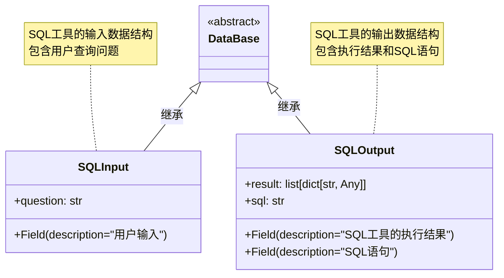
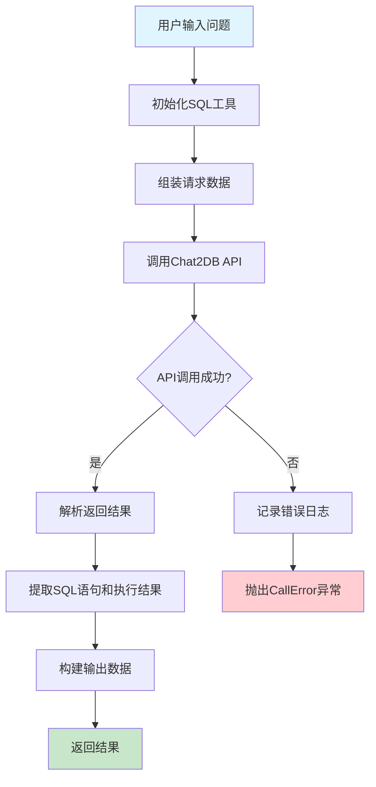
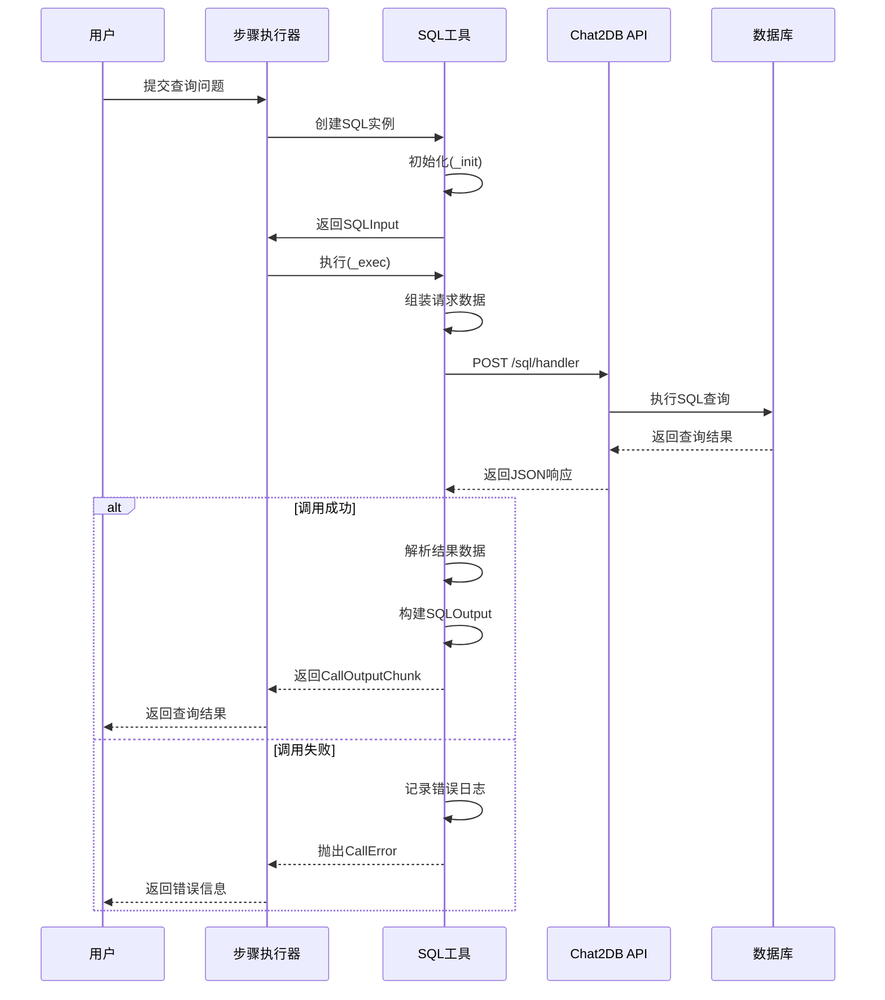

# SQL模块文档

## 概述

SQL模块是Euler Copilot框架中的一个核心调用工具，用于通过自然语言查询生成SQL语句并执行数据库操作。该模块支持多种数据库类型，包括MySQL、MongoDB、PostgreSQL和OpenGauss。

## 功能特性

- **多数据库支持**: 支持MySQL、MongoDB、PostgreSQL、OpenGauss等多种数据库
- **自然语言转SQL**: 通过外置的Chat2DB工具API，将用户问题转换为SQL语句
- **异步执行**: 采用异步编程模式，支持流式输出
- **错误处理**: 完善的异常处理和错误信息国际化
- **配置灵活**: 支持动态配置数据库连接参数

## 类结构

### SQL类

继承自`CoreCall`基类，实现了SQL查询的核心功能。

#### 主要属性

| 属性名 | 类型 | 默认值 | 描述 |
|--------|------|--------|------|
| `database_type` | str | "postgres" | 数据库类型 |
| `host` | str | "localhost" | 数据库地址 |
| `port` | int | 5432 | 数据库端口 |
| `username` | str | "root" | 数据库用户名 |
| `password` | str | "root" | 数据库密码 |
| `database` | str | "postgres" | 数据库名称 |
| `table_name_list` | list[str] | [] | 表名列表 |

### 数据结构



## 执行流程



## 时序图



## 核心方法

### info() 类方法

返回Call的名称和描述信息，支持中英文国际化。

```python
@classmethod
def info(cls, language: LanguageType = LanguageType.CHINESE) -> CallInfo:
    """返回Call的名称和描述"""
```

### _init() 方法

初始化SQL工具，从CallVars中提取用户问题。

```python
async def _init(self, call_vars: CallVars) -> SQLInput:
    """初始化SQL工具"""
    return SQLInput(question=call_vars.question)
```

### _exec() 方法

执行SQL查询的核心方法，包含以下步骤：

1. **数据验证**: 将输入数据转换为SQLInput对象
2. **请求组装**: 构建发送给Chat2DB API的请求数据
3. **API调用**: 异步调用Chat2DB的/sql/handler端点
4. **结果处理**: 解析API返回的JSON数据
5. **输出构建**: 创建SQLOutput对象并返回

```python
async def _exec(self, input_data: dict[str, Any]) -> AsyncGenerator[CallOutputChunk, None]:
    """运行SQL工具, 支持MySQL, MongoDB, PostgreSQL, OpenGauss"""
```

## API接口规范

### 请求格式

发送给Chat2DB API的请求数据结构：

```json
{
    "type": "postgres",
    "host": "localhost",
    "port": 5432,
    "username": "root",
    "password": "root",
    "database": "postgres",
    "goal": "用户问题",
    "table_list": ["表名1", "表名2"]
}
```

### 响应格式

Chat2DB API的响应数据结构：

```json
{
    "code": 200,
    "result": {
        "sql": "SELECT * FROM users WHERE id = 1",
        "execute_result": [
            {"id": 1, "name": "张三", "email": "zhangsan@example.com"}
        ],
        "risk": "低风险"
    }
}
```

## 错误处理

### 异常类型

- **CallError**: 自定义异常类，用于处理SQL查询失败的情况
- **httpx异常**: HTTP请求相关的异常
- **JSON解析异常**: API响应解析失败

### 错误消息

支持中英文错误消息：

```python
MESSAGE = {
    "fail": {
        LanguageType.CHINESE: "SQL查询错误：SQL语句执行失败！",
        LanguageType.ENGLISH: "SQL query error: SQL statement execution failed!",
    },
}
```

## 配置要求

### 环境配置

需要在配置文件中设置Chat2DB API的URL：

```toml
[extra]
sql_url = "http://chat2db-api:8080"
```

### 数据库配置

SQL工具支持以下数据库配置参数：

- **数据库类型**: postgres, mysql, mongodb, opengauss
- **连接参数**: host, port, username, password, database
- **表名列表**: 可选的表名列表，用于限制查询范围

## 使用示例

### 基本用法

```python
# 创建SQL工具实例
sql_tool = SQL(
    database_type="postgres",
    host="localhost",
    port=5432,
    username="postgres",
    password="password",
    database="mydb",
    table_name_list=["users", "orders"]
)

# 执行查询
input_data = {"question": "查询所有用户信息"}
async for chunk in sql_tool._exec(input_data):
    if chunk.type == CallOutputType.DATA:
        result = chunk.content
        print(f"SQL语句: {result['sql']}")
        print(f"查询结果: {result['result']}")
```

### 在流程中使用

```yaml
steps:
  - name: "sql_query"
    type: "sql"
    description: "查询用户数据"
    config:
      database_type: "postgres"
      host: "db.example.com"
      port: 5432
      username: "readonly_user"
      password: "secure_password"
      database: "analytics"
      table_name_list: ["users", "user_profiles"]
```

## 性能、扩展性与安全考虑

### 性能考虑

- **超时设置**: HTTP请求超时时间设置为60秒，适用于大多数SQL查询场景
- **异步处理**: 采用异步HTTP客户端(httpx.AsyncClient)，支持流式输出，提高用户体验
- **日志记录**: 详细记录SQL语句、执行结果和风险等级，便于问题排查和性能监控

### 扩展性

- **支持新的数据库类型**: 可以通过修改`database_type`字段支持新的数据库类型，前提是Chat2DB API支持该数据库
- **自定义输出格式**: 可以通过继承`SQLOutput`类来扩展输出数据结构，添加更多元数据信息
- **错误处理增强**: 可以在`_exec`方法中添加更细粒度的错误处理逻辑，针对不同类型的错误提供更具体的错误信息

### 安全考虑

- **SQL注入防护**: 依赖Chat2DB工具进行SQL注入防护，该工具会验证SQL语句的安全性、评估SQL执行的风险等级、提供风险提示信息
- **数据库权限**: 建议使用具有最小权限的数据库用户，只授予必要的查询权限
- **密码管理**: 数据库密码应通过安全的方式存储和传递，避免在日志中泄露敏感信息
