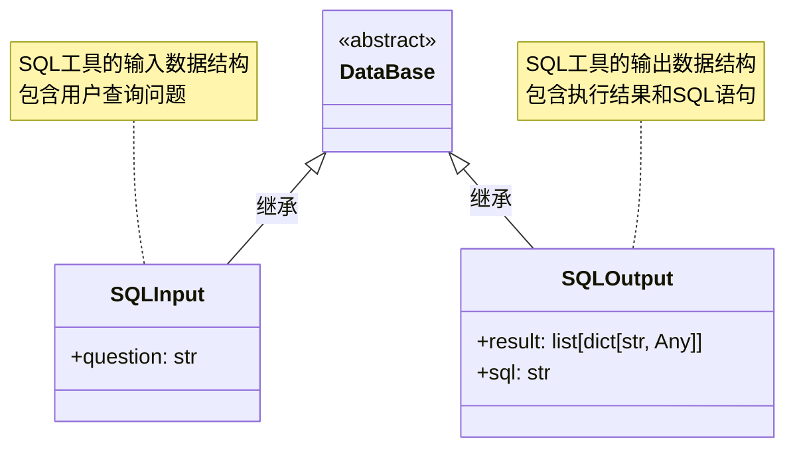

# SQL模块文档

## 概述

SQL模块是openEuler Intelligence框架中的一个工具，用于通过将自然语言转换为SQL语句并执行数据库操作。该模块支持多种数据库类型，包括MySQL、MongoDB、PostgreSQL和openGauss。

## 功能特性

- **多数据库支持**: 支持MySQL、MongoDB、PostgreSQL、openGauss等多种数据库
- **自然语言转SQL**: 通过外置的Chat2DB工具API，将用户问题转换为SQL语句
- **异步执行**: 采用异步编程模式，支持流式输出
- **配置灵活**: 支持动态配置数据库连接参数

## 类结构

### SQL类

继承自`CoreCall`基类，实现了SQL查询的核心功能。

#### 主要属性

| 属性名 | 类型 | 默认值 | 描述 |
|--------|------|--------|------|
| `database_type` | str | "postgres" | 数据库类型 |
| `host` | str | "localhost" | 数据库地址 |
| `port` | int | 5432 | 数据库端口 |
| `username` | str | "root" | 数据库用户名 |
| `password` | str | "root" | 数据库密码 |
| `database` | str | "postgres" | 数据库名称 |
| `table_name_list` | list[str] | [] | 表名列表 |

### 数据结构



## 执行流程


## 时序图


## 核心方法

- `info()`：返回Call的名称和描述信息，支持中英文国际化。
- `_init()`：初始化SQL工具，从CallVars中提取用户问题。
- `_exec()`：执行SQL查询的核心方法，包含以下步骤：
    1. **数据验证**: 将输入数据转换为SQLInput对象
    2. **请求组装**: 构建发送给Chat2DB API的请求数据
    3. **API调用**: 异步调用Chat2DB的/sql/handler端点
    4. **结果处理**: 解析API返回的JSON数据
    5. **输出构建**: 创建SQLOutput对象并返回

## API接口规范

### 请求格式

发送给Chat2DB API的请求数据结构：

```json
{
    "type": "postgres",
    "host": "localhost",
    "port": 5432,
    "username": "root",
    "password": "root",
    "database": "postgres",
    "goal": "用户问题",
    "table_list": ["表名1", "表名2"]
}
```

### 响应格式

Chat2DB API的响应数据结构：

```json
{
    "code": 200,
    "result": {
        "sql": "SELECT * FROM users WHERE id = 1",
        "execute_result": [
            {"id": 1, "name": "张三", "email": "zhangsan@example.com"}
        ],
        "risk": "低风险"
    }
}
```

## 异常

- **CallError**: 自定义异常类，用于处理SQL查询失败的情况
- **httpx异常**: HTTP请求相关的异常
- **JSON解析异常**: API响应解析失败

## 配置

需要在配置文件中设置Chat2DB API的URL：

```toml
[extra]
sql_url = "http://chat2db-api:8080"
```

## 使用示例

### 在Flow中使用

```yaml
steps:
  - name: "sql_query"
    type: "sql"
    description: "查询用户数据"
    config:
      database_type: "postgres"
      host: "db.example.com"
      port: 5432
      username: "readonly_user"
      password: "secure_password"
      database: "analytics"
      table_name_list: ["users", "user_profiles"]
```

## 性能、扩展性与安全考虑

### 性能考虑

- **超时设置**: HTTP请求超时时间设置为60秒，适用于大多数SQL查询场景
- **异步处理**: 采用异步HTTP客户端(httpx.AsyncClient)，支持流式输出，提高用户体验
- **日志记录**: 详细记录SQL语句、执行结果和风险等级，便于问题排查和性能监控

### 安全考虑

- **SQL注入防护**: 依赖Chat2DB工具进行SQL注入防护，该工具会验证SQL语句的安全性、评估SQL执行的风险等级、提供风险提示信息
- **数据库权限**: 建议使用具有最小权限的数据库用户，只授予必要的查询权限
- **密码管理**: 数据库密码应通过安全的方式存储和传递，避免在日志中泄露敏感信息
