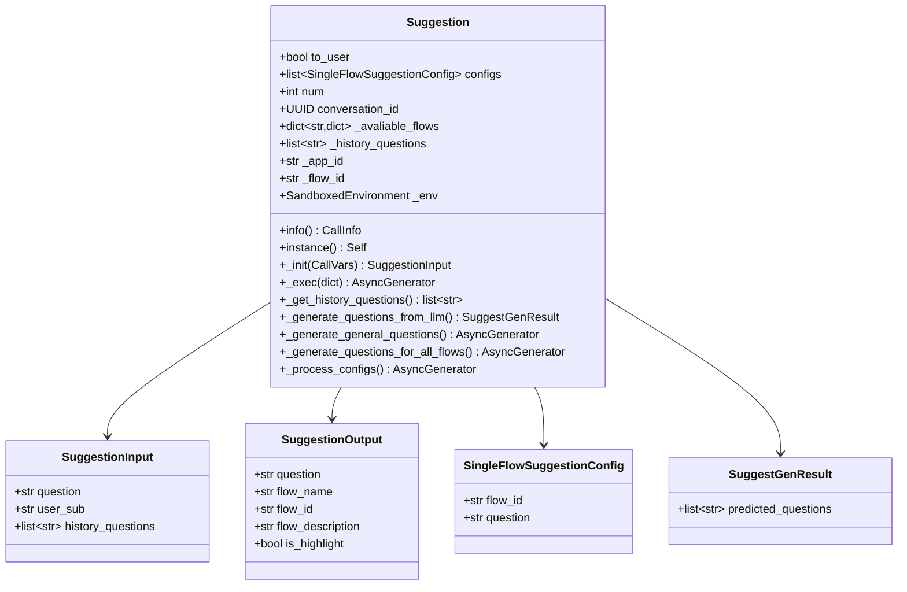
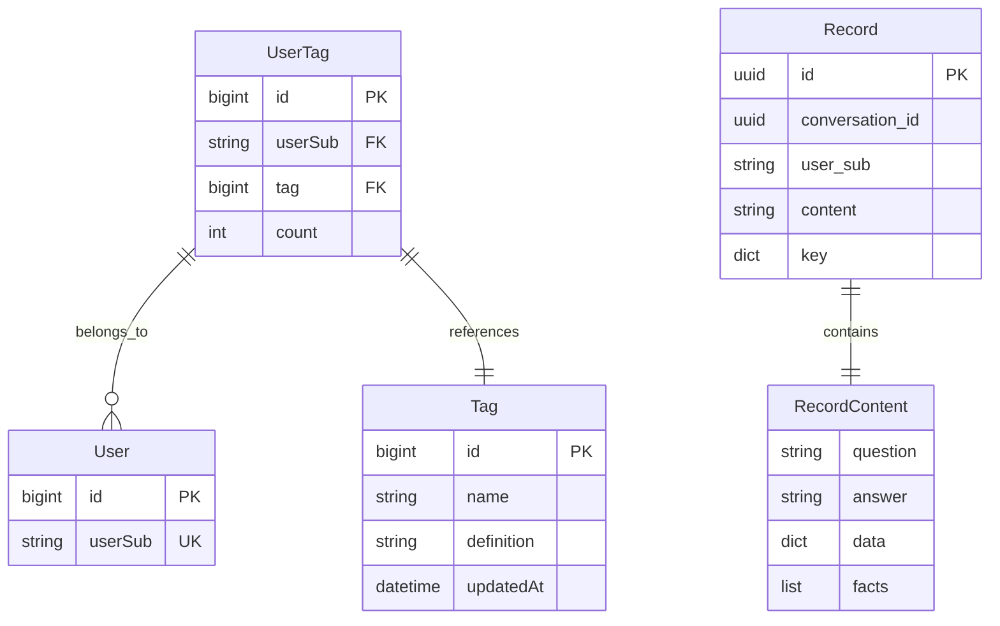
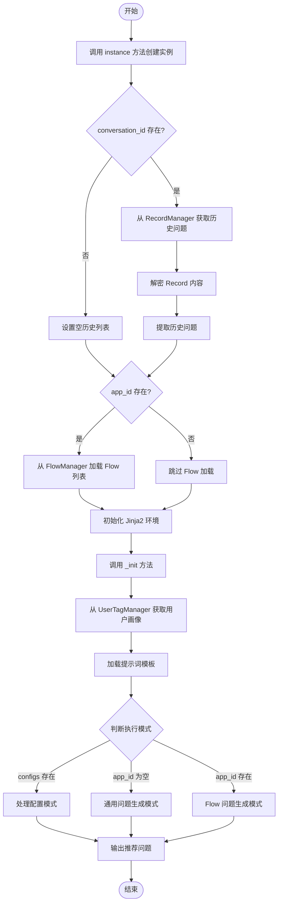
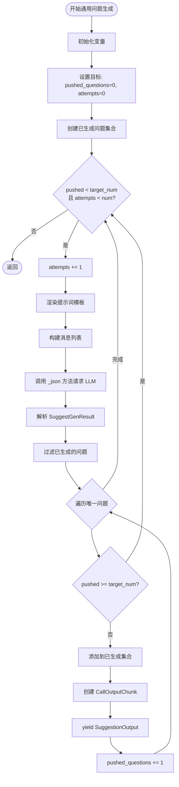
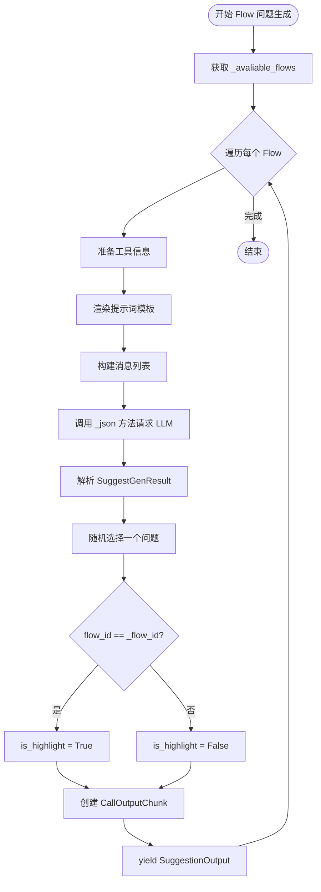
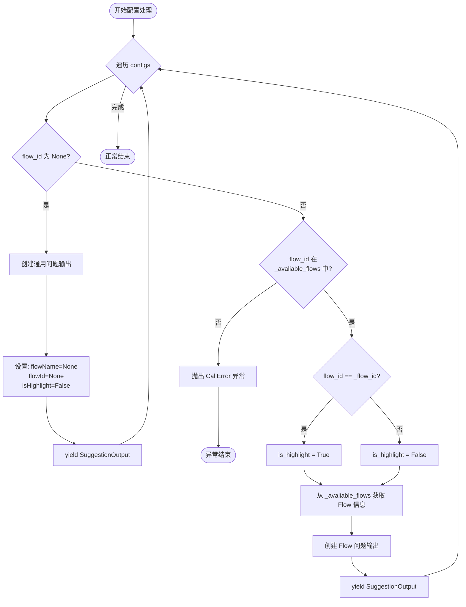
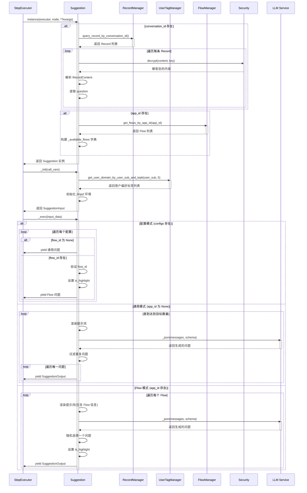
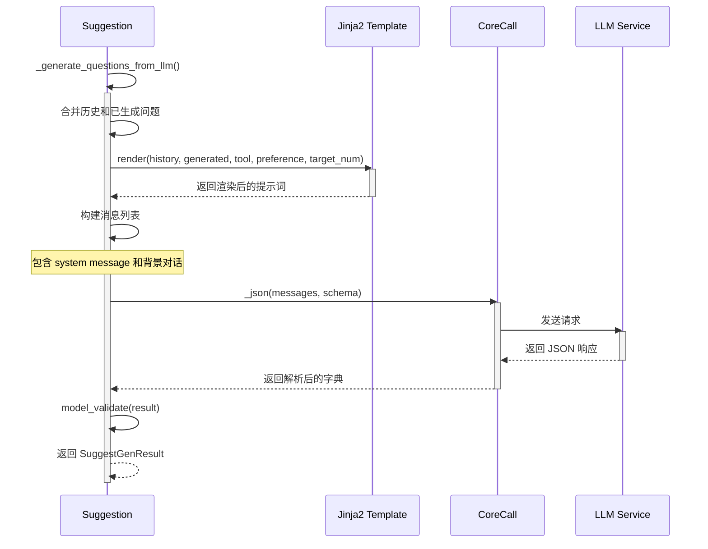

# Suggest 模块设计文档

## 1. 模块概述

Suggest 模块是一个智能问题推荐系统,用于在对话场景中为用户推荐相关的后续问题。该模块基于用户的历史对话、用户画像和应用流程信息,通过大语言模型生成个性化的问题推荐。

### 1.1 核心功能

- 基于用户历史对话和用户画像生成个性化问题推荐
- 支持为应用中的多个 Flow 分别生成推荐问题
- 支持通过配置指定固定的推荐问题
- 支持为特定 Flow 生成高亮标识
- 智能去重避免重复推荐历史问题

### 1.2 模块组成

模块位于 `apps/scheduler/call/suggest/` 目录下,主要包含以下文件:

- [suggest.py](../../apps/scheduler/call/suggest/suggest.py) - 问题推荐核心实现
- [schema.py](../../apps/scheduler/call/suggest/schema.py) - 数据结构定义
- [prompt.py](../../apps/scheduler/call/suggest/prompt.py) - 提示词模板定义

## 2. 数据结构设计

### 2.1 核心数据模型



### 2.2 数据库相关模型



## 3. 接口设计

### 3.1 输入数据结构

#### SuggestionInput

```json
{
  "question": "杭州有哪些著名景点?",
  "user_sub": "user_12345",
  "history_questions": [
    "简单介绍一下杭州",
    "杭州有哪些著名景点?"
  ]
}
```

**字段说明:**

- `question` (string): 当前用户提出的问题
- `user_sub` (string): 用户唯一标识
- `history_questions` (list[string]): 该对话中的历史问题列表

#### SingleFlowSuggestionConfig

```json
{
  "flow_id": "550e8400-e29b-41d4-a716-446655440000",
  "question": "查询杭州的天气情况"
}
```

**字段说明:**

- `flow_id` (string | null): Flow 的唯一标识,为 null 时表示通用问题
- `question` (string): 固定的推荐问题文本

### 3.2 输出数据结构

#### SuggestionOutput

```json
{
  "question": "杭州的天气怎么样?",
  "flowName": "景点查询",
  "flowId": "550e8400-e29b-41d4-a716-446655440000",
  "flowDescription": "查询景点信息和相关内容",
  "isHighlight": true
}
```

**字段说明:**

- `question` (string): 推荐的问题文本
- `flowName` (string | null): 关联的 Flow 名称
- `flowId` (string | null): 关联的 Flow ID
- `flowDescription` (string | null): Flow 的描述信息
- `isHighlight` (boolean): 是否为当前 Flow 的推荐,用于前端高亮显示

### 3.3 LLM 生成结果结构

#### SuggestGenResult

```json
{
  "predicted_questions": [
    "杭州的天气怎么样?",
    "杭州有什么特色美食?",
    "西湖周边有哪些酒店推荐?"
  ]
}
```

**字段说明:**

- `predicted_questions` (list[string]): LLM 生成的推荐问题列表

## 4. 提示词模板设计

### 4.1 模板结构

- 提示词模板采用 Jinja2 语法编写，支持中文和英文两种语言版本，以适应不同用户需求。
- 模板整体分为指令区和示例区，引导模型明确生成目标和要求。

### 4.2 模板变量

- 在模板中，预留了以下变量用于动态渲染：
  - `history`：用户过往提出的问题列表，用于帮助模型避免重复推荐。
  - `generated`：已经生成的推荐问题集合，实现进一步去重。
  - `tool`：当前可用工具的信息，包括名称与功能描述，有助于模型理解可用操作范围。
  - `preference`：用户偏好或兴趣领域标签，引导模型生成更贴合用户需求的问题。
  - `target_num`：本次需要推荐的问题数量，指示模型严格生成指定条数的推荐内容。

### 4.3 提示词核心设计要点

- 明确指示模型：需要基于历史对话、工具信息和用户兴趣生成推荐问题，并且数量、格式等都有明确定义。
- 重点强调去重：将所有历史问题和已生成问题通过 question_list 逐一罗列，要求模型不得重复推荐这些问题。
- 问题风格与格式：
  1. 以用户口吻提出，且必须为疑问句或祈使句。
  2. 内容精炼，每个问题不超过30字（或相应英文长度）。
  3. 不允许在问题中夹杂与问题内容无关的扩展信息。
- 通过示例块讲解模板填充方式，包括历史问题、工具信息、目标数量和用户偏好，帮助模型更好理解上下文格式。
- 模板整体结构规范、要素完整，便于灵活扩展多语言版本和其他业务场景。

## 5. 执行流程设计

### 5.1 主执行流程



### 5.2 通用问题生成流程



### 5.3 Flow 问题生成流程



### 5.4 配置处理流程



## 6. 时序图

### 6.1 完整执行时序



### 6.2 LLM 调用时序



## 7. 核心逻辑

### 7.1 去重逻辑

在通用问题生成模式中，模块通过集合数据结构来实现问题去重。具体做法如下：

1. 首先初始化一个空的 `generated_questions` 集合，用于存放已经生成过的推荐问题。
2. 每次调用大模型（LLM）时，会将历史提问和已生成问题一并传入提示词，确保推荐问题不与这些重复。
3. 大模型返回结果后，需要过滤掉集合中已出现过的问题，只保留新的、未推荐过的问题。
4. 新产生的问题再加入集合中，持续扩充去重列表。
5. 以上步骤循环进行，直到达到预定数量或达到最大尝试次数为止。

**此逻辑的优势：**

- 利用集合查找效率高，去重操作快速。
- 支持多次调用 LLM 的跨批次去重。
- 将所有历史问题都提供给 LLM，有助于生成更相关、更具有多样性的问题。

### 7.2 Flow 匹配与高亮逻辑

在流程（Flow）相关的推荐场景，逻辑为：

- 遍历应用中的所有流程（Flow），为每个 Flow 分别生成专属的推荐问题。
- 通过对比每个 Flow 的唯一标识（flow_id）与当前实际执行的流程标识（_flow_id），判断该 Flow 是否为当前高亮流程。
- 若相符，则为该 Flow 生成的推荐问题设置高亮标识，该标识会在前端界面进行突出显示，以便用户快速识别当前重点推荐内容。

### 7.3 随机选择逻辑

在 Flow 模式下，大模型通常会返回多个可用推荐问题。为提升推荐结果的多样性和用户体验，每次仅随机挑选其中一个问题进行推荐。具体流程为：

- 从 LLM 返回的问题列表中，采用随机方式选取一个问题推送给用户。
- 这样可以避免每次都重复展示某一个问题，增强推荐内容的新鲜感和个性化体验。

## 8. 配置说明

### 8.1 模块配置参数

| 参数名 | 类型 | 默认值 | 说明 |
|--------|------|--------|------|
| to_user | bool | true | 是否将推荐问题推送给用户 |
| configs | list[SingleFlowSuggestionConfig] | [] | 固定的问题推荐配置列表 |
| num | int | 3 | 通用模式下推荐问题的总数量 (范围: 1-6) |
| conversation_id | UUID | None | 对话 ID,用于获取历史问题 |

### 8.2 配置模式示例

#### 固定问题配置

```json
{
  "configs": [
    {
      "flow_id": null,
      "question": "这是一个通用推荐问题"
    },
    {
      "flow_id": "550e8400-e29b-41d4-a716-446655440000",
      "question": "查询特定信息"
    }
  ]
}
```

#### 通用生成模式配置

```json
{
  "num": 5,
  "configs": []
}
```

#### Flow 生成模式配置

```json
{
  "app_id": "660e8400-e29b-41d4-a716-446655440000",
  "configs": []
}
```

## 9. 数据库查询

### 9.1 历史问题查询

**查询方法:** `RecordManager.query_record_by_conversation_id()`

**查询逻辑:**

1. 根据 user_sub 和 conversation_id 查询 MongoDB
2. 限制返回最近 15 条记录
3. 解密每条记录的 content 字段
4. 从 RecordContent 中提取 question 字段

**数据流:**

```text
MongoDB Record → 解密 → RecordContent → question
```

### 9.2 用户画像查询

**查询方法:** `UserTagManager.get_user_domain_by_user_sub_and_topk()`

**SQL 查询逻辑:**

```sql
SELECT ut.*, t.name, t.definition
FROM framework_user_tag ut
JOIN framework_tag t ON ut.tag = t.id
WHERE ut.userSub = ?
ORDER BY ut.count DESC
LIMIT 5
```

**返回数据:**

- 用户最常涉及的前 5 个领域标签
- 包含标签名称和访问次数

### 9.3 Flow 信息查询

**查询方法:** `FlowManager.get_flows_by_app_id()`

**查询逻辑:**

1. 根据 app_id 查询该应用下的所有 Flow
2. 提取每个 Flow 的 id、name 和 description
3. 构建字典映射: flow_id → {name, description}
