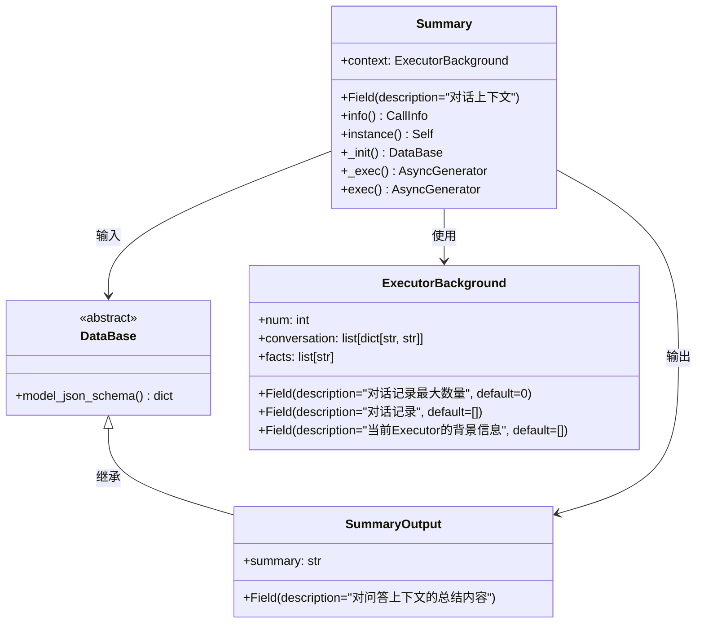

# Summary工具模块文档

## 概述

Summary工具是一个用于理解对话上下文的智能工具，它通过分析对话记录和关键事实，生成简洁的背景总结，为后续对话提供上下文理解支持。

## 功能特性

- **上下文理解**：分析对话记录和关键事实，生成三句话以内的背景总结
- **多语言支持**：支持中文和英文两种语言
- **模板化提示词**：使用Jinja2模板引擎动态生成提示词
- **流式输出**：支持实时流式输出总结内容
- **结构化数据**：基于Pydantic模型进行数据验证和序列化

## 核心组件

### 1. Summary类

Summary工具的核心实现类，继承自`CoreCall`基类。

```python
class Summary(CoreCall, input_model=DataBase, output_model=SummaryOutput):
    """总结工具"""
    
    context: ExecutorBackground = Field(description="对话上下文")
```

**主要方法：**

- `info()`: 返回工具的多语言名称和描述
- `instance()`: 创建工具实例
- `_init()`: 初始化工具输入
- `_exec()`: 执行总结生成逻辑
- `exec()`: 公共执行接口

### 2. 数据结构

Summary工具涉及多个数据模型，它们之间的关系如下：



#### 数据模型说明

- **DataBase**: 所有Call的输入基类，提供通用的数据验证和序列化功能
- **SummaryOutput**: 继承自DataBase，包含总结内容的输出模型
- **ExecutorBackground**: 执行器背景信息，包含对话记录和关键事实
- **Summary**: 主要的工具类，使用ExecutorBackground作为上下文，输出SummaryOutput

#### 数据流转关系


### 3. 提示词模板

Summary工具使用Jinja2模板引擎生成提示词，支持中英文两种语言。模板设计遵循以下原则：

- **结构化指令**：使用XML标签清晰分隔不同部分
- **动态内容渲染**：通过Jinja2循环语法动态生成对话记录
- **多语言适配**：根据系统语言自动选择合适的模板
- **输出格式控制**：明确指定输出要求和限制

#### 提示词模板设计

Summary工具提供中英文两种语言的提示词模板，两种模板在结构和功能上保持一致，仅在语言表述上有所差异。模板设计包含以下核心要素：

1. **任务说明**：明确要求生成三句话背景总结，用于后续对话的上下文理解
2. **质量要求**：强调突出重要信息点（时间、地点、人物、事件等），确保信息准确性，不得编造信息
3. **格式约束**：限制输出长度（少于3句话，少于300个字），不包含XML标签
4. **数据源标识**：清晰标记对话记录和关键事实的来源，使用XML标签进行结构化组织

模板使用Jinja2语法进行动态渲染：

- 通过循环语法动态生成对话记录，每个对话项包含角色和内容信息
- 关键事实以列表形式呈现，支持多行显示
- 根据系统语言自动选择合适的模板版本

这种设计确保了多语言环境下的正确显示和一致的用户体验。

## 工作流程


## 执行时序图


## 数据流图


## 使用示例

### 基本使用

```python
# 创建Summary工具实例
summary_tool = await Summary.instance(executor, node)

# 执行总结生成
async for chunk in summary_tool.exec(executor, input_data):
    print(chunk.content)  # 输出总结内容
```

### 上下文数据示例

```python
# ExecutorBackground数据结构示例
context = ExecutorBackground(
    num=10,
    conversation=[
        {"role": "user", "content": "你好，我想了解Python编程"},
        {"role": "assistant", "content": "当然可以！Python是一门很受欢迎的编程语言..."},
        {"role": "user", "content": "能给我一些学习建议吗？"}
    ],
    facts=[
        "用户对Python编程感兴趣",
        "用户希望获得学习建议",
        "对话发生在2024年"
    ]
)
```

## 配置参数

| 参数 | 类型 | 默认值 | 描述 |
|------|------|--------|------|
| `context` | ExecutorBackground | - | 对话上下文信息 |
| `to_user` | bool | False | 是否将输出返回给用户 |
| `enable_filling` | bool | False | 是否需要进行自动参数填充 |

## 错误处理

Summary工具包含以下错误处理机制：

1. **输出格式验证**：检查LLM输出是否为字符串格式
2. **模板渲染错误**：Jinja2模板渲染异常处理
3. **LLM调用异常**：大模型调用失败处理

## 性能与扩展性

### 性能考虑

Summary工具在性能方面进行了以下优化：

- **流式输出**：支持实时流式输出，提升用户体验
- **模板缓存**：Jinja2模板环境复用，减少重复创建开销
- **内存优化**：及时释放不需要的中间数据

### 扩展性设计

Summary工具设计具有良好的扩展性：

1. **多语言支持**：可轻松添加新的语言模板
2. **模板定制**：支持自定义提示词模板
3. **输出格式**：可扩展输出数据结构
4. **集成接口**：基于CoreCall基类，易于集成到调度系统

## 依赖关系

- `CoreCall`: 基础调用框架
- `Jinja2`: 模板引擎
- `Pydantic`: 数据验证和序列化
- `LLM`: 大语言模型接口
- `ExecutorBackground`: 执行器背景信息
