# MCP Agent Executor 模块设计文档

## 1. 概述

MCP Agent Executor 是基于 Model Context Protocol (MCP) 的智能代理执行器，负责将用户的自然语言目标转化为可执行的工具调用序列，并自动完成多步骤任务流程。

### 1.1 核心特性

- **自动规划**：基于用户目标自动生成执行计划
- **动态工具调用**：支持多个 MCP 服务器的工具调用
- **智能错误处理**：自动识别参数错误并请求用户补充
- **风险评估**：对流程和步骤进行风险评估
- **断点续传**：支持任务暂停和恢复
- **用户交互**：支持手动确认和参数补充

### 1.2 技术栈

- **语言**: Python 3.x
- **异步框架**: anyio
- **MCP 客户端**: mcp (Anthropic)
- **LLM 集成**: 支持多种大模型
- **数据验证**: Pydantic

## 2. 架构设计

### 2.1 类结构

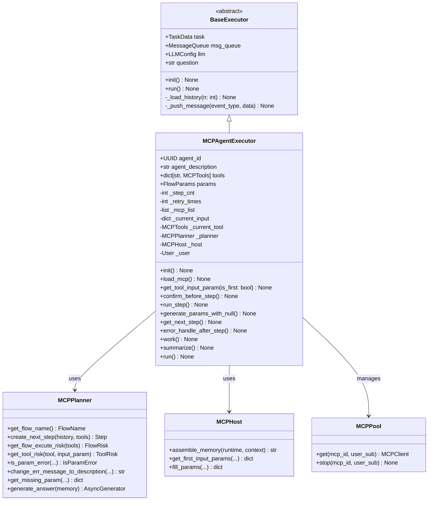

### 2.2 核心组件关系

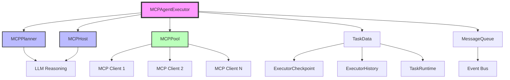

## 3. 执行流程

### 3.1 主流程图

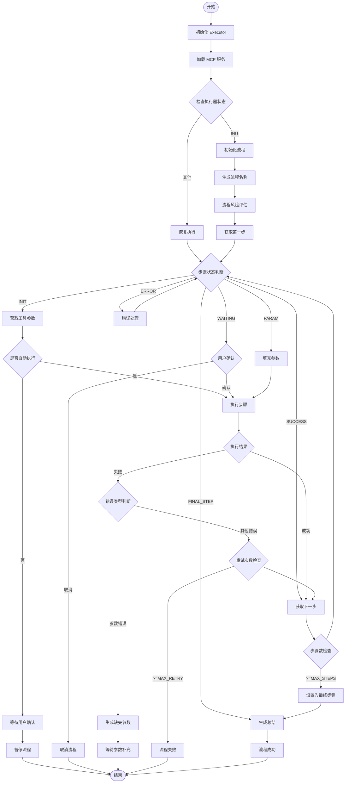

### 3.2 步骤执行状态机

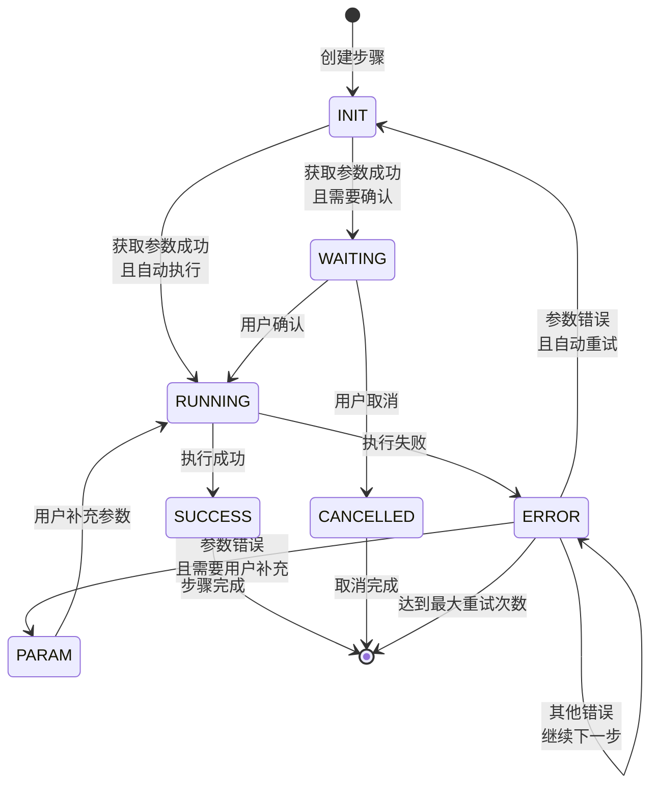

### 3.3 执行器状态机

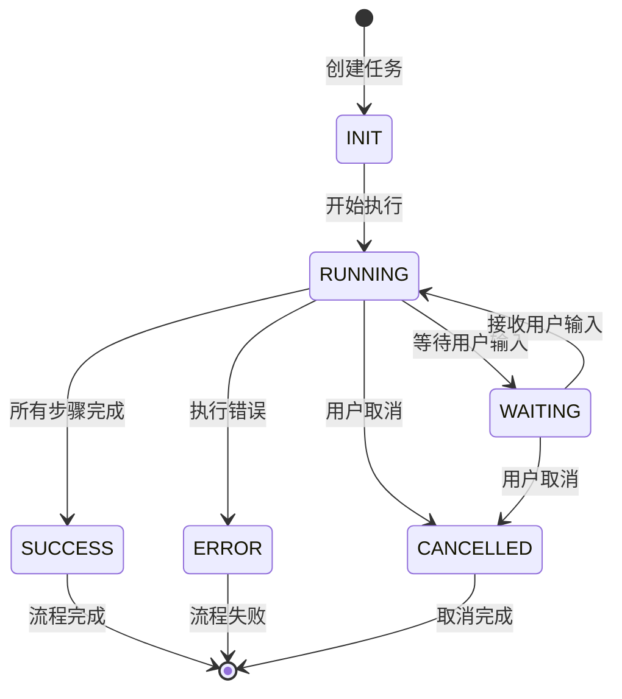

## 4. 时序图

### 4.1 正常执行流程

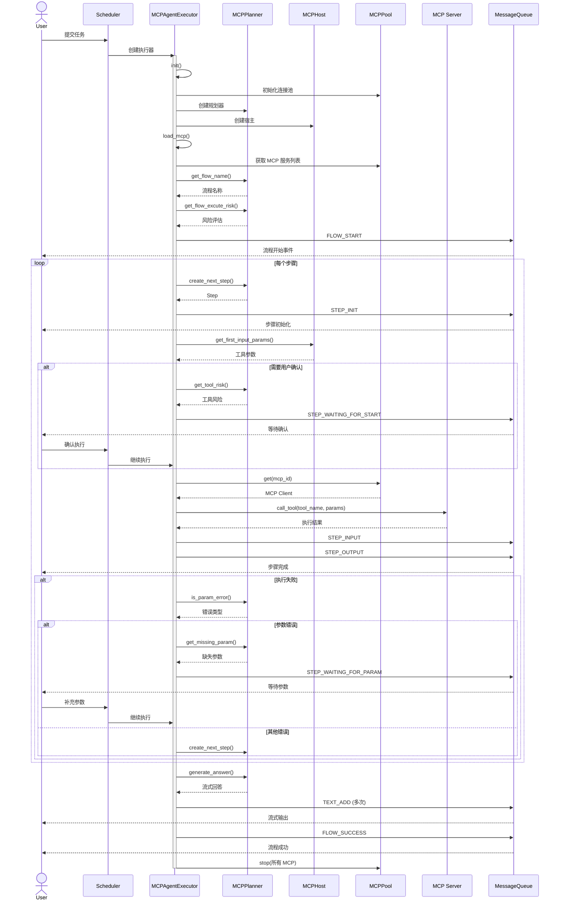

### 4.2 错误处理流程

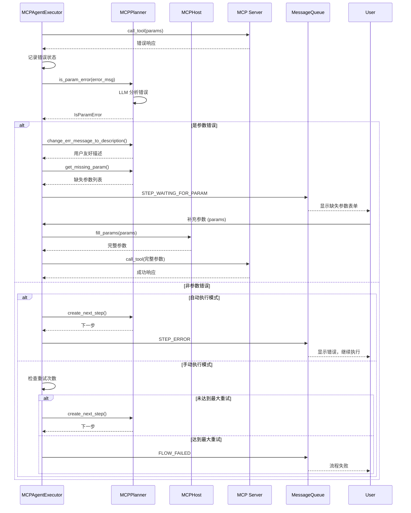

## 5. 核心方法详解

### 5.1 初始化方法

#### init() - 初始化执行器

**功能说明：** 在执行器创建后首次被调用，负责初始化所有必要的组件和状态。

**执行步骤：**

1. 初始化步骤计数器（_step_cnt）和重试计数器（_retry_times）为0
2. 创建 MCP 连接池实例（MCPPool）用于管理多个 MCP 客户端
3. 初始化空的 MCP 服务列表和当前输入参数字典
4. 创建规划器（MCPPlanner）实例，传入任务和 LLM 配置
5. 创建宿主（MCPHost）实例，传入任务和 LLM 配置
6. 从用户管理器中获取并验证用户信息
7. 加载历史会话记录

**使用场景：** 在调度器创建执行器实例后自动调用

---

#### load_mcp() - 加载 MCP 服务

**功能说明：** 根据 Agent 配置加载所需的 MCP 服务器和工具列表。

**执行步骤：**

1. 通过应用中心管理器获取 Agent 的元数据配置
2. 验证应用类型是否为 Agent 类型
3. 遍历元数据中配置的 MCP 服务 ID 列表
4. 对每个 MCP 服务检查用户是否已激活
5. 获取已激活的 MCP 服务详情并添加到服务列表
6. 加载每个 MCP 服务提供的工具到工具字典
7. 添加特殊的 FINAL 工具用于标记流程结束

**使用场景：** 在 run() 方法开始执行前调用

---

### 5.2 步骤执行方法

#### work() - 执行当前步骤的主逻辑

**功能说明：** 根据当前步骤状态执行相应的处理逻辑，是步骤执行的核心调度方法。

**状态处理逻辑：**

| 步骤状态 | 处理逻辑 | 后续动作 |
|---------|---------|---------|
| INIT | 获取工具参数，判断用户是否开启自动执行 | 自动执行则直接运行；否则等待确认 |
| WAITING | 检查是否有用户确认参数 | 有参数则继续；无参数则取消流程 |
| PARAM | 填充用户补充的参数 | 使用新参数重新执行 |
| RUNNING | 执行工具调用，最多重试5次 | 成功则继续；失败则记录错误 |
| ERROR | 判断重试次数和错误类型 | 参数错误请求补充；其他错误继续或失败 |
| SUCCESS | 获取下一步骤 | 继续执行或结束流程 |

**特殊处理：**

- 用户取消时发送 STEP_CANCEL 和 FLOW_CANCEL 事件
- 参数状态时会删除上一次的重复上下文记录
- 运行状态时会尝试最多5次重新获取参数并执行

---

#### run_step() - 执行单个工具调用

**功能说明：** 执行当前步骤对应的 MCP 工具调用，处理执行结果和异常。

**执行流程：**

1. 设置执行器和步骤状态为 RUNNING
2. 验证当前工具对象存在性
3. 从 MCP 连接池获取对应的客户端
4. 调用 MCP 工具并传入当前输入参数
5. 解析工具返回结果，提取文本内容
6. 推送 STEP_INPUT 和 STEP_OUTPUT 事件
7. 将执行历史记录添加到任务上下文
8. 更新步骤状态为 SUCCESS

**异常处理：**

- **ClosedResourceError（连接关闭）**: 停止当前用户的 MCP 进程，设置错误状态
- **通用异常**: 记录异常堆栈，将错误信息和输入数据保存到状态中
- **工具返回错误**: 提取错误文本内容，设置步骤状态为 ERROR

**输出格式：** 工具输出封装为包含 message 字段的字典

---

#### get_next_step() - 规划下一步骤

**功能说明：** 基于当前执行历史和可用工具，使用 LLM 规划下一步要执行的步骤。

**执行逻辑：**

1. 检查步骤计数器是否小于最大步骤数限制（25步）
2. 递增步骤计数器
3. 组装历史记忆（包含所有已执行步骤的输入输出）
4. 调用规划器的 create_next_step 方法，最多重试3次
5. 验证规划返回的工具 ID 是否在可用工具列表中
6. 如果规划失败或工具不存在，设置为 FINAL 步骤
7. 生成新的步骤 ID 和步骤名称
8. 更新任务状态

**容错机制：**

- 规划失败时自动重试最多3次
- 所有重试都失败或步骤数超限时自动设置为结束步骤

---

### 5.3 参数处理方法

#### get_tool_input_param() - 获取工具输入参数

**功能说明：** 根据当前工具的输入模式（首次或补充）生成或填充工具参数。

**参数说明：**

- **is_first**: 布尔值，标识是否为首次获取参数

**执行逻辑：**

**首次获取（is_first=True）：**

1. 从当前状态获取工具对象
2. 调用宿主的 get_first_input_params 方法
3. 基于用户输入、工具定义和任务上下文生成参数
4. 将生成的参数保存到当前输入变量

**参数补充（is_first=False）：**

1. 从 params 字段提取用户补充的内容和描述
2. 调用宿主的 fill_params 方法
3. 使用用户输入、当前参数、错误信息和补充内容修复参数
4. 更新状态中的当前输入参数

**应用场景：**

- 步骤初始化时首次生成参数
- 参数错误后用户补充时填充参数
- 步骤重试时重新生成参数

---

#### generate_params_with_null() - 生成参数补充请求

**功能说明：** 当检测到参数错误时，生成需要用户补充的参数列表并暂停执行。

**执行流程：**

1. 调用规划器获取缺失参数列表（使用 get_missing_param）
2. 提取错误信息中的错误消息文本
3. 调用规划器将技术错误消息转换为用户友好描述
4. 推送 STEP_WAITING_FOR_PARAM 事件，包含描述和参数列表
5. 推送 FLOW_STOP 事件暂停流程
6. 设置执行器状态为 WAITING，步骤状态为 PARAM
7. 添加包含参数请求信息的历史记录

**输出内容：**

- **message**: 用户友好的错误描述和参数说明
- **params**: 缺失参数的结构化定义（支持 null 值）

---

### 5.4 错误处理方法

#### error_handle_after_step() - 处理不可恢复的步骤错误

**功能说明：** 当步骤错误无法通过重试或参数补充解决时，终止整个流程。

**执行步骤：**

1. 设置步骤状态为 ERROR
2. 设置执行器状态为 ERROR
3. 推送 FLOW_FAILED 事件通知流程失败
4. 删除可能重复的最后一条上下文记录
5. 创建并添加错误状态的历史记录
6. 更新任务状态到检查点

**触发条件：**

- 错误重试次数达到最大限制（3次）
- 无法继续执行的致命错误

---

#### _handle_step_error_and_continue() - 处理错误并继续执行

**功能说明：** 记录当前步骤的错误信息，并尝试规划下一步继续执行。

**执行流程：**

1. 推送 STEP_ERROR 事件，包含错误消息
2. 检查上下文最后一条记录是否为当前步骤
3. 如果是则更新状态为 ERROR 和输出数据
4. 如果不是则创建新的错误历史记录
5. 调用 get_next_step 规划下一步骤

**适用场景：**

- 自动执行模式下的非致命错误
- 用户选择继续执行的错误

---

### 5.5 用户交互方法

#### confirm_before_step() - 等待用户确认执行

**功能说明：** 在执行高风险或需要确认的步骤前，暂停流程等待用户确认。

**执行流程：**

1. 验证当前任务状态和工具对象存在
2. 调用规划器评估当前工具的执行风险
3. 生成包含风险等级和原因的确认消息
4. 推送 STEP_WAITING_FOR_START 事件，附带风险信息
5. 推送 FLOW_STOP 事件暂停流程
6. 设置执行器状态为 WAITING，步骤状态为 WAITING
7. 添加包含风险评估的历史记录

**风险评估内容：**

- **risk**: 风险等级（LOW/MEDIUM/HIGH）
- **reason**: 风险原因的自然语言描述

---

### 5.6 总结与输出方法

#### summarize() - 生成最终回答

**功能说明：** 在所有步骤执行完成后，基于执行历史生成自然语言总结。

**执行流程：**

1. 组装完整的执行记忆（包含所有步骤的输入输出）
2. 调用规划器的 generate_answer 方法
3. 以异步流式方式接收 LLM 生成的回答片段
4. 对每个片段推送 TEXT_ADD 事件
5. 将片段追加到任务运行时的完整回答字段
6. 循环直到所有内容生成完毕

**输出特点：**

- 流式输出，用户可实时看到生成进度
- 基于完整执行历史生成，包含上下文信息
- 自然语言格式，易于理解

---

### 5.7 辅助验证方法

#### _validate_task_state() - 验证任务状态

**功能说明：** 检查任务的状态对象是否存在，不存在则抛出异常。

**使用场景：** 在所有需要访问任务状态的方法开始时调用

---

#### _validate_current_tool() - 验证当前工具

**功能说明：** 检查当前工具对象是否已设置，未设置则抛出异常。

**使用场景：** 在所有需要使用当前工具的方法中调用

---

#### _remove_last_context_if_same_step() - 清理重复上下文

**功能说明：** 如果任务上下文的最后一条记录与当前步骤 ID 相同，则删除该记录。

**使用场景：**

- 参数补充前清理等待记录
- 错误处理前清理失败记录
- 避免重复记录导致历史混乱

---

#### _create_executor_history() - 创建历史记录

**功能说明：** 根据当前状态创建一条标准化的执行历史记录对象。

**输入参数：**

- **step_status**: 步骤状态枚举值
- **input_data**: 步骤输入数据字典（可选）
- **output_data**: 步骤输出数据字典（可选）
- **extra_data**: 额外数据字典（可选，如风险评估）

**返回对象包含：**

- 任务标识信息（taskId、stepId、executorId等）
- 步骤详细信息（名称、类型、状态）
- 数据内容（输入、输出、额外数据）

**使用场景：** 所有需要记录步骤执行历史的场景

## 6. 数据模型

### 6.1 核心数据模型关系图

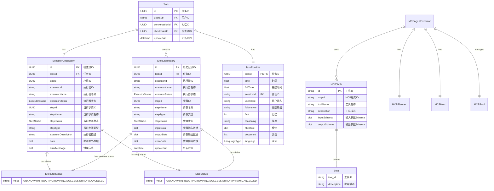

### 6.2 执行器状态枚举

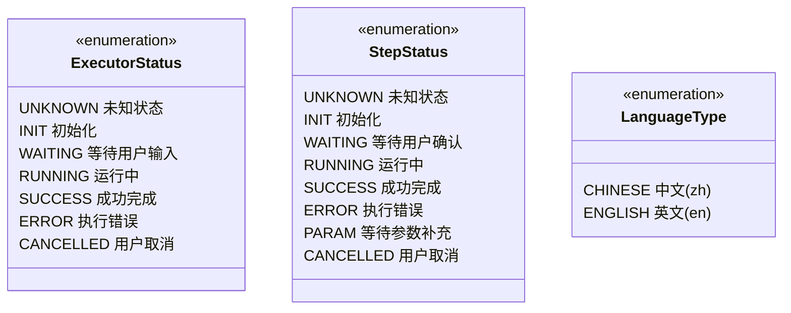

### 6.3 数据模型详细说明

#### ExecutorCheckpoint - 执行器检查点

**用途**: 保存任务执行的当前状态，支持断点续传和状态恢复。

**关键字段**:

- **执行器级别**:
  - `executorId`: 唯一标识一个执行流程（如工作流ID）
  - `executorName`: 流程的可读名称
  - `executorStatus`: 整个执行器的当前状态
  - `executorDescription`: 流程的详细描述

- **步骤级别**:
  - `stepId`: 当前正在执行步骤的唯一标识
  - `stepName`: 步骤名称（通常是工具ID）
  - `stepStatus`: 当前步骤的状态
  - `stepType`: 步骤类型标识

- **辅助数据**:
  - `data`: 步骤相关的额外数据
  - `errorMessage`: 错误信息（包含 err_msg 和 data）

#### ExecutorHistory - 执行器历史

**用途**: 记录每个步骤的完整执行历史，用于上下文记忆和回溯。

**关键字段**:

- **输入输出**:
  - `inputData`: 步骤执行时的输入参数
  - `outputData`: 步骤执行后的输出结果
  - `extraData`: 额外信息（如风险评估、参数请求等）

- **状态追踪**:
  - `stepStatus`: 该历史记录对应的步骤状态
  - `executorStatus`: 记录时的执行器状态
  - `updatedAt`: 记录更新时间

**用途场景**:

- LLM 上下文组装
- 用户查看执行历史
- 错误诊断和重试

#### MCPTools - MCP 工具定义

**用途**: 描述 MCP 服务提供的工具及其参数规范。

**关键字段**:

- `id`: 工具的唯一标识符
- `mcpId`: 所属 MCP 服务的 ID
- `toolName`: 工具在 MCP 服务中的名称
- `description`: 工具功能的自然语言描述
- `inputSchema`: JSON Schema 格式的输入参数定义
- `outputSchema`: JSON Schema 格式的输出结果定义

**特殊工具**:

- `FINAL`: 虚拟工具，用于标记流程结束

#### Step - 步骤定义

**用途**: LLM 规划生成的单个执行步骤。

**关键字段**:

- `tool_id`: 要执行的工具 ID（对应 MCPTools.id）
- `description`: 该步骤的自然语言描述（说明为什么执行这个工具）

### 6.4 数据流转示意图

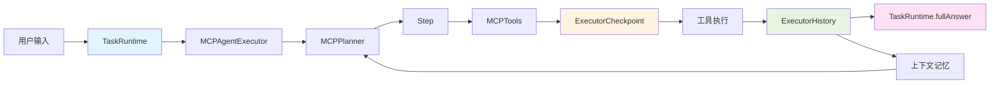

**说明**:

1. **用户输入** → **TaskRuntime**: 保存用户的原始问题
2. **TaskRuntime** → **MCPAgentExecutor**: 启动执行器
3. **MCPAgentExecutor** → **MCPPlanner**: 请求规划下一步
4. **MCPPlanner** → **Step**: 生成步骤定义
5. **Step** → **MCPTools**: 查找对应工具
6. **MCPTools** → **ExecutorCheckpoint**: 保存当前状态
7. **ExecutorCheckpoint** → **工具执行**: 执行 MCP 工具
8. **工具执行** → **ExecutorHistory**: 记录执行历史
9. **ExecutorHistory** → **TaskRuntime**: 更新完整回答
10. **ExecutorHistory** → **上下文记忆**: 提供历史上下文
11. **上下文记忆** → **MCPPlanner**: 用于下一步规划（循环）

## 7. 事件系统

### 7.1 事件类型

| 事件类型 | 触发时机 | 数据结构 |
|---------|---------|---------|
| FLOW_START | 流程开始 | FlowRisk (可选) |
| FLOW_STOP | 流程暂停 | {} |
| FLOW_SUCCESS | 流程成功 | {} |
| FLOW_FAILED | 流程失败 | {} |
| FLOW_CANCEL | 流程取消 | {} |
| STEP_INIT | 步骤初始化 | {} |
| STEP_INPUT | 步骤输入 | 工具参数 |
| STEP_OUTPUT | 步骤输出 | 工具结果 |
| STEP_ERROR | 步骤错误 | 错误信息 |
| STEP_CANCEL | 步骤取消 | {} |
| STEP_WAITING_FOR_START | 等待用户确认 | ToolRisk |
| STEP_WAITING_FOR_PARAM | 等待参数补充 | 缺失参数列表 |
| TEXT_ADD | 流式文本输出 | TextAddContent |

### 7.2 事件流转图

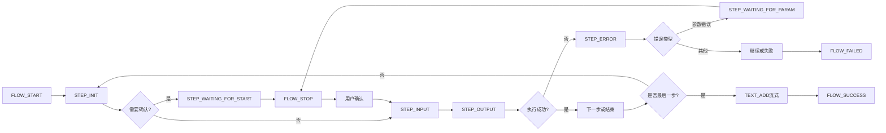

## 8. 配置参数

### 8.1 常量配置

| 常量 | 值 | 说明 |
|-----|-----|-----|
| AGENT_MAX_STEPS | 25 | 最大执行步骤数 |
| AGENT_MAX_RETRY_TIMES | 3 | 最大重试次数 |
| AGENT_FINAL_STEP_NAME | "FIANL" | 最终步骤名称 |
| JSON_GEN_MAX_TRIAL | 3 | JSON生成最大尝试次数 |

### 8.2 用户配置

| 配置项 | 类型 | 说明 |
|-------|------|-----|
| autoExecute | bool | 是否自动执行（不等待确认） |

## 9. 错误处理策略

### 9.1 错误分类

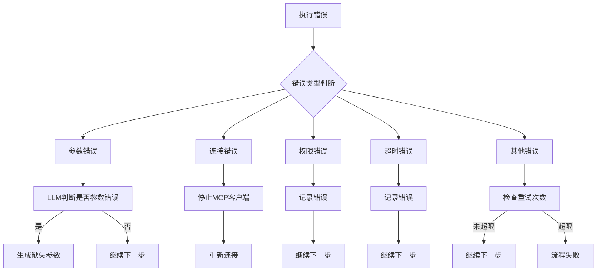

### 9.2 错误处理流程

1. **参数错误**
   - 使用 LLM 判断是否为参数错误
   - 生成缺失参数列表
   - 等待用户补充

2. **连接错误**
   - 捕获 `ClosedResourceError`
   - 停止当前 MCP 客户端
   - 记录错误并继续下一步

3. **重试机制**
   - 单步骤内重试：最多5次
   - 全局重试：最多3次
   - 超过限制后流程失败

## 10. 性能优化

### 10.1 MCP 连接池

- 使用 `MCPPool` 管理 MCP 客户端
- 按 `(mcp_id, user_sub)` 复用连接
- 任务结束后统一关闭连接

### 10.2 上下文管理

- 历史记录限制（默认3轮）
- 步骤上下文去重（避免重复记录）
- 流式输出（减少内存占用）

### 10.3 并发控制

- 全局并发任务上限：30
- 单用户滑动窗口限流：15秒5次请求

## 11. 安全考虑

### 11.1 风险评估

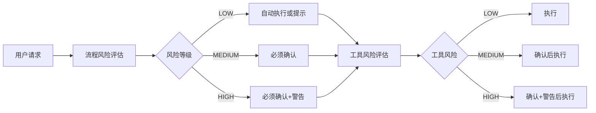

## 12. 参考资料

- [Model Context Protocol](https://modelcontextprotocol.io/)
- [Anthropic MCP SDK](https://github.com/anthropics/mcp)
