# Step Executor 模块设计文档

## 1. 概述

Step Executor 是工作流执行器中负责单个步骤执行的核心模块，它将工作流中定义的每个步骤转换为实际的 Call 调用，并管理步骤的完整生命周期。

核心特性：

- **Call 实例化**：动态加载和实例化各种 Call 类
- **参数管理**：支持参数覆盖和动态参数填充
- **自动填参**：集成 Slot 填充机制，自动补充缺失参数
- **流式输出**：支持流式处理 Call 的输出内容
- **错误处理**：完善的异常捕获和错误状态管理
- **上下文管理**：维护步骤执行历史用于后续步骤

## 2. 架构设计

### 2.1 类结构

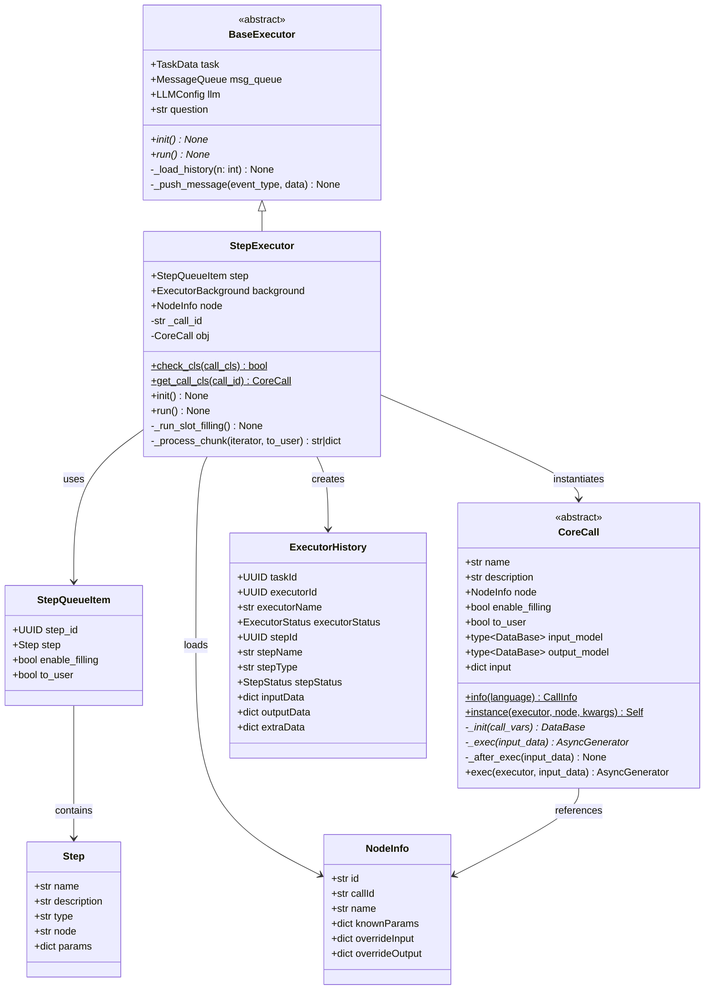

### 2.2 核心组件关系

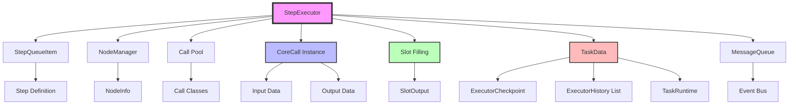

### 2.3 Call 类型系统

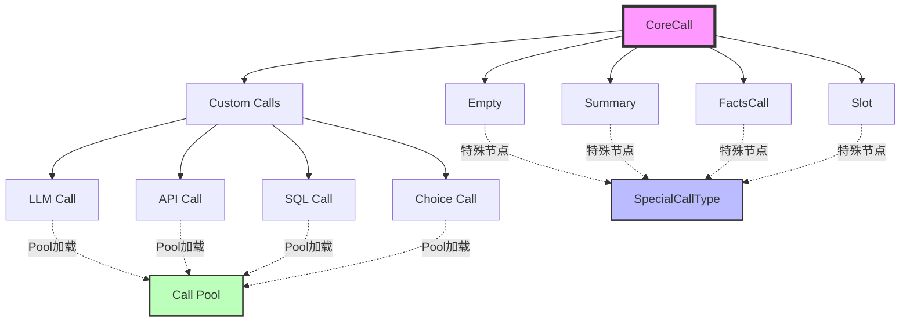

## 3. 执行流程

### 3.1 主流程图

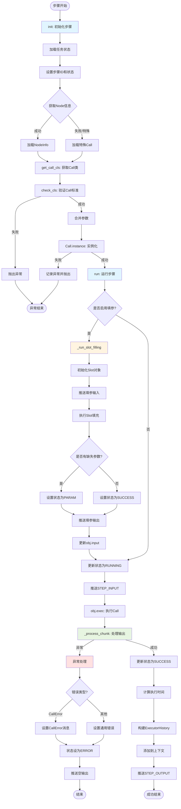

### 3.2 Call 实例化流程

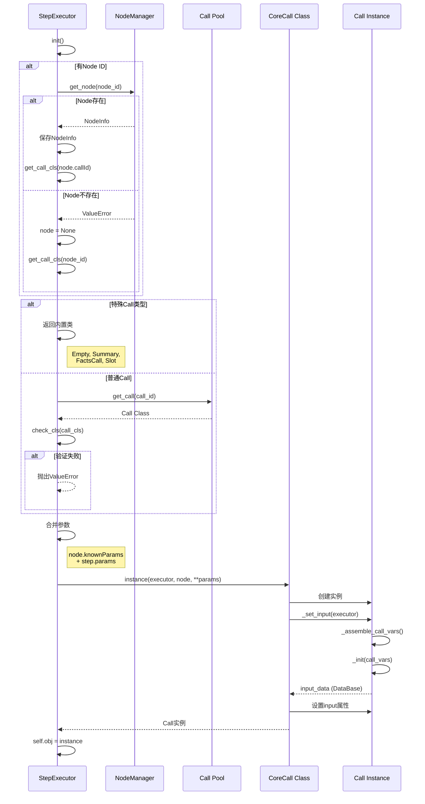

### 3.3 自动填参流程

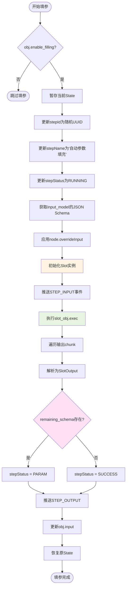

### 3.4 Chunk 处理流程

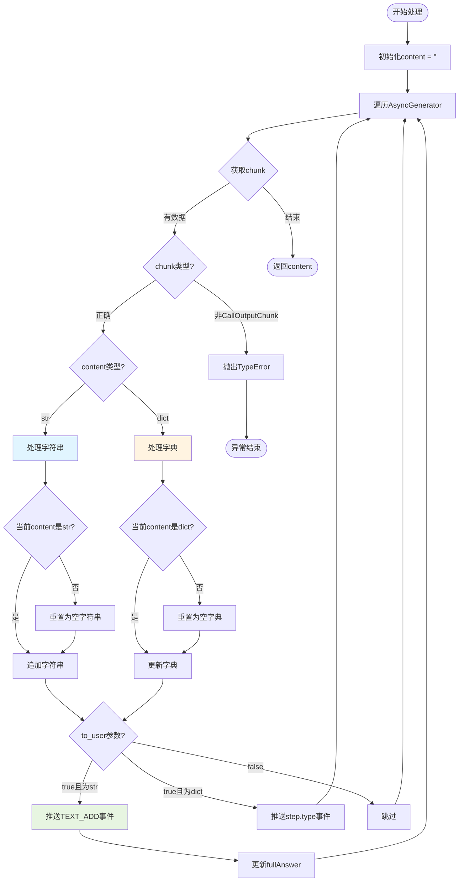

## 4. 时序图

### 4.1 完整步骤执行时序

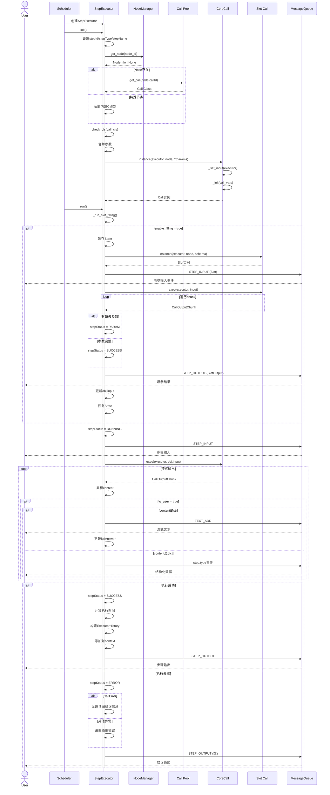

### 4.2 Call 验证时序

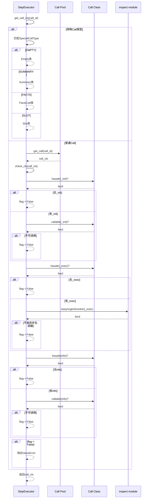

### 4.3 错误处理时序

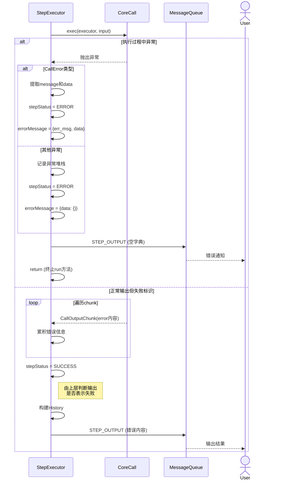

## 5. 核心方法详解

### 5.1 初始化方法

#### init() - 初始化步骤执行器

**功能说明**：在步骤执行前初始化所有必要的组件，包括加载 Node、获取 Call 类、实例化 Call 对象。

**执行步骤**：

1. 检查任务状态（task.state）是否存在，不存在则抛出异常
2. 将步骤信息写入任务状态：
   - `stepId`: 当前步骤的唯一标识
   - `stepType`: 步骤类型（转换为字符串）
   - `stepName`: 步骤名称
3. 尝试从 NodeManager 获取 Node 详情：
   - 成功则保存到 `self.node`
   - 失败则设置为 `None`（可能是内置特殊节点）
4. 根据 Node 信息获取 Call 类：
   - 有 Node：使用 `node.callId` 获取
   - 无 Node：直接使用 `node_id`（特殊节点）
5. 合并参数：
   - 基础参数：`node.knownParams`（如果存在）
   - 覆盖参数：`step.params`（用户指定参数优先）
6. 实例化 Call 类并保存到 `self.obj`

**异常处理**：

- **RuntimeError**: 任务状态不存在
- **ValueError**: Node ID 不存在或 Call 类验证失败
- **其他异常**: 记录日志并重新抛出

**使用示例**：

```python
step_executor = StepExecutor(
    task=task_data,
    msg_queue=message_queue,
    llm=llm_config,
    question=user_question,
    step=step_queue_item,
    background=executor_background
)
await step_executor.init()
# 此时 step_executor.obj 已经是实例化的 Call 对象
```

---

#### check_cls(call_cls) - 检查 Call 类是否符合标准

**功能说明**：静态方法，验证 Call 类是否实现了必需的方法和接口。

**验证项**：

| 属性/方法 | 类型要求 | 说明 |
|----------|---------|------|
| `_init` | 可调用 | 初始化方法，返回输入数据 |
| `_exec` | 异步生成器函数 | 执行方法，流式输出结果 |
| `info` | 可调用 | 返回 Call 的元信息 |

**返回值**：

- `True`: 所有验证通过
- `False`: 至少有一项验证失败

**使用场景**：在从 Pool 加载 Call 类后，实例化前进行验证。

---

#### get_call_cls(call_id) - 获取并验证 Call 类

**功能说明**：静态方法，根据 Call ID 获取对应的 Call 类，支持特殊节点和池加载。

**特殊节点映射**：

```python
EMPTY -> Empty          # 空节点
SUMMARY -> Summary      # 总结节点
FACTS -> FactsCall      # 事实提取节点
SLOT -> Slot           # 参数填充节点
```

**执行逻辑**：

1. 检查 `call_id` 是否为特殊类型，如果是则直接返回内置类
2. 否则从 Call Pool 获取对应的 Call 类
3. 调用 `check_cls` 验证 Call 类的合法性
4. 验证失败则抛出 `ValueError`

**异常**：

- **ValueError**: Call 不符合标准要求

---

### 5.2 步骤执行方法

#### run() - 运行单个步骤

**功能说明**：步骤执行的主入口方法，协调填参、执行、输出处理和历史记录。

**执行流程**：

```text
检查状态 → 自动填参 → 更新为RUNNING → 推送输入
→ 执行Call → 处理输出 → 更新为SUCCESS → 构建历史 → 推送输出
```

**关键时间节点**：

- `task.runtime.time`: 步骤开始时间（UTC时间戳）
- `task.runtime.fullTime`: 步骤执行总时长（秒）

**输出处理**：

- **字符串输出**: 封装为 `TextAddContent`
- **字典输出**: 直接使用

**历史记录字段**：

```python
ExecutorHistory(
    taskId=任务ID,
    executorId=执行器ID,
    executorName=执行器名称,
    executorStatus=执行器状态,
    stepId=步骤ID,
    stepName=步骤名称,
    stepType=步骤类型,
    stepStatus=步骤状态,
    inputData=输入数据,
    outputData=输出数据
)
```

**异常处理**：

执行失败时：

1. 设置步骤状态为 `ERROR`
2. 推送空的 `STEP_OUTPUT` 事件
3. 设置错误消息到 `task.state.errorMessage`
4. 直接返回（不抛出异常）

---

#### _run_slot_filling() - 运行自动参数填充

**功能说明**：在步骤执行前，如果启用了自动填参，使用 Slot 机制补充缺失的参数。

**前置条件**：

- `self.obj.enable_filling = True`
- 任务状态存在

**执行步骤**：

1. **状态保护**：
   - 暂存当前的 `stepId` 和 `stepName`
   - 生成新的临时步骤ID
   - 设置步骤名称为 "自动参数填充"

2. **初始化 Slot**：

   ```python
   slot_obj = await Slot.instance(
       executor=self,
       node=self.node,
       data=self.obj.input,
       current_schema=self.obj.input_model.model_json_schema(
           override=self.node.overrideInput
       )
   )
   ```

3. **执行填参**：
   - 推送 `STEP_INPUT` 事件
   - 调用 `slot_obj.exec()` 执行填充
   - 解析为 `SlotOutput`

4. **状态判断**：
   - 有 `remaining_schema`: 设置为 `PARAM`（需要用户补充）
   - 无 `remaining_schema`: 设置为 `SUCCESS`（已完全填充）

5. **更新输入**：

   ```python
   self.obj.input.update(result.slot_data)
   ```

6. **恢复状态**：
   - 恢复原 `stepId` 和 `stepName`

**特点**：

- 不存入数据库（相当于虚拟步骤）
- 状态临时变更，不影响主步骤
- 填参结果直接更新到 Call 对象的输入

---

#### _process_chunk(iterator, to_user) - 处理 Chunk 流

**功能说明**：处理 Call 执行过程中的流式输出，支持字符串和字典两种格式。

**参数说明**：

- `iterator`: `AsyncGenerator[CallOutputChunk, None]` - 异步生成器
- `to_user`: `bool` - 是否推送到用户（默认 `False`）

**处理逻辑**：

```python
content: str | dict[str, Any] = ""

async for chunk in iterator:
    # 类型检查
    if not isinstance(chunk, CallOutputChunk):
        raise TypeError("返回结果类型错误")

    # 字符串累积
    if isinstance(chunk.content, str):
        if not isinstance(content, str):
            content = ""  # 类型切换，重置
        content += chunk.content

        if to_user:
            await self._push_message(EventType.TEXT_ADD.value, chunk.content)
            self.task.runtime.fullAnswer += chunk.content

    # 字典更新
    else:
        if not isinstance(content, dict):
            content = {}  # 类型切换，重置
        content = chunk.content

        if to_user:
            await self._push_message(self.step.step.type, chunk.content)

return content
```

**类型切换策略**：

- 当 `content` 类型与 `chunk.content` 类型不匹配时，重置 `content`
- 字符串模式：累加追加
- 字典模式：完全替换

**事件推送**：

- **字符串**: 推送 `TEXT_ADD` 事件，累积到 `fullAnswer`
- **字典**: 推送步骤类型事件（如 `STEP_RUNNING`）

**返回值**：

- 累积的字符串或最终的字典

---

### 5.3 辅助方法

#### _push_message(event_type, data) - 推送消息

继承自 `BaseExecutor`，统一的消息推送接口。

**常用事件类型**：

| 事件类型 | 触发时机 | 数据格式 |
|---------|---------|---------|
| `STEP_INPUT` | 步骤开始执行前 | `obj.input` (dict) |
| `STEP_OUTPUT` | 步骤执行完成后 | 输出数据 (dict) |
| `TEXT_ADD` | 流式文本输出 | `TextAddContent` |
| `EventType(step.type)` | 结构化数据输出 | 自定义格式 |

---

## 6. 数据模型

### 6.1 核心数据结构

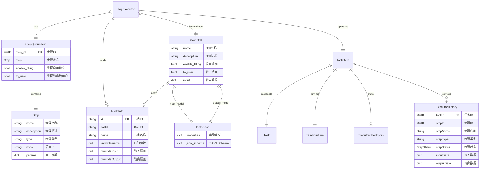

### 6.2 步骤状态枚举

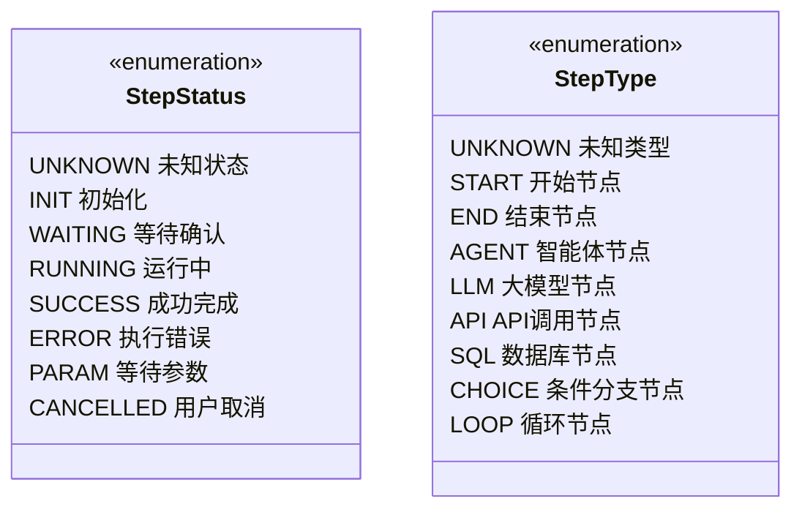

### 6.3 参数合并策略

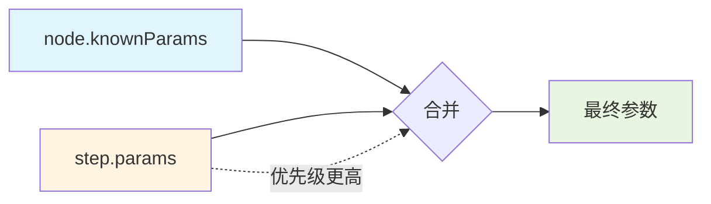

**合并规则**：

```python
params = {}

# 1. 加载节点已知参数
if node and node.knownParams:
    params = node.knownParams.copy()

# 2. 用户参数覆盖
if step.params:
    params.update(step.params)

# 结果：用户参数 > 节点参数
```

### 6.4 输入输出流转

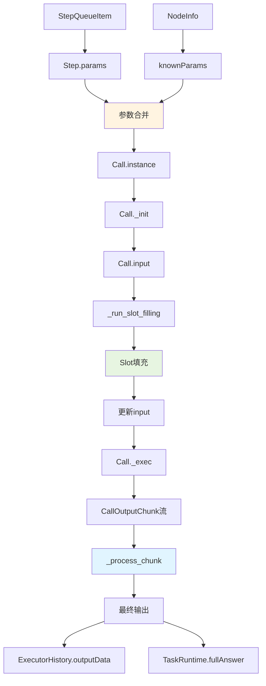

## 7. Call 标准规范

### 7.1 Call 类必须实现的接口

```python
from typing import AsyncGenerator, Any
from pydantic import BaseModel

class CustomCallInput(DataBase):
    """自定义输入模型"""
    param1: str
    param2: int | None = None

class CustomCallOutput(DataBase):
    """自定义输出模型"""
    result: str
    status: str

class CustomCall(
    CoreCall,
    input_model=CustomCallInput,
    output_model=CustomCallOutput
):
    """自定义Call类"""

    @classmethod
    def info(cls, language: LanguageType = LanguageType.CHINESE) -> CallInfo:
        """返回Call的元信息"""
        return CallInfo(
            name="自定义Call",
            description="这是一个自定义的Call示例",
            input_schema=cls.input_model.model_json_schema(),
            output_schema=cls.output_model.model_json_schema()
        )

    async def _init(self, call_vars: CallVars) -> DataBase:
        """初始化，组装输入数据"""
        return CustomCallInput(
            param1=call_vars.question,
            param2=42
        )

    async def _exec(self, input_data: dict[str, Any]) -> AsyncGenerator[CallOutputChunk, None]:
        """执行，流式输出结果"""
        # 处理逻辑
        result = process_data(input_data)

        # 流式输出
        for chunk in result:
            yield CallOutputChunk(
                type=CallOutputType.TEXT,
                content=chunk
            )
```

### 7.2 Call 验证清单

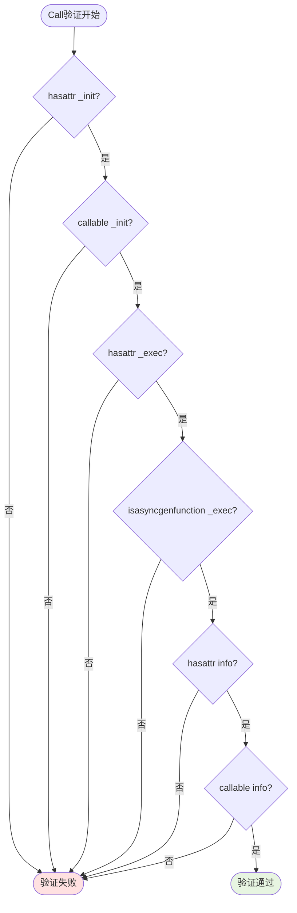

## 8. 特殊节点

### 8.1 特殊节点类型

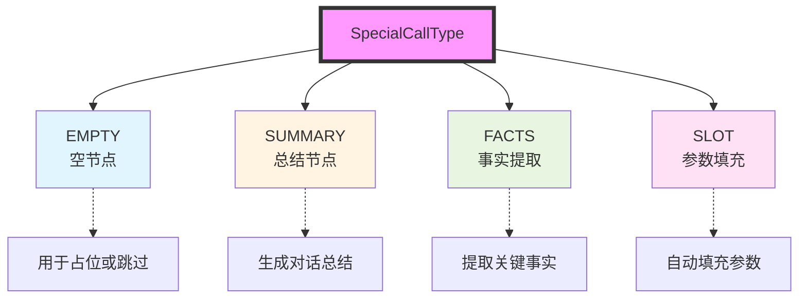

### 8.2 特殊节点特性

| 节点类型 | Call ID | 用途 | 输入 | 输出 |
|---------|---------|------|------|------|
| Empty | `EMPTY` | 占位节点 | 任意 | 空 |
| Summary | `SUMMARY` | 总结生成 | 对话历史 | 总结文本 |
| FactsCall | `FACTS` | 事实提取 | 对话内容 | 事实列表 |
| Slot | `SLOT` | 参数填充 | Schema + 数据 | SlotOutput |

### 8.3 Slot 填充详解

**SlotOutput 结构**：

```python
class SlotOutput(BaseModel):
    slot_data: dict[str, Any]           # 已填充的参数数据
    remaining_schema: dict | None       # 仍然缺失的参数Schema
    filled_fields: list[str]            # 本次填充的字段
```

**使用场景**：

1. **自动填参** (`_run_slot_filling`)：
   - 在步骤执行前自动补充参数
   - 不存入历史记录
   - 填充结果更新到 `obj.input`

2. **手动填参** (用户补充)：
   - 步骤状态为 `PARAM` 时
   - 用户通过表单补充参数
   - 重新执行步骤

**填充策略**：

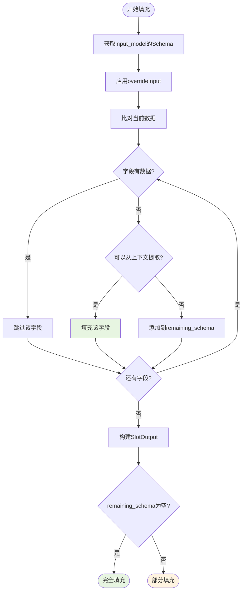

## 9. 错误处理

### 9.1 错误分类

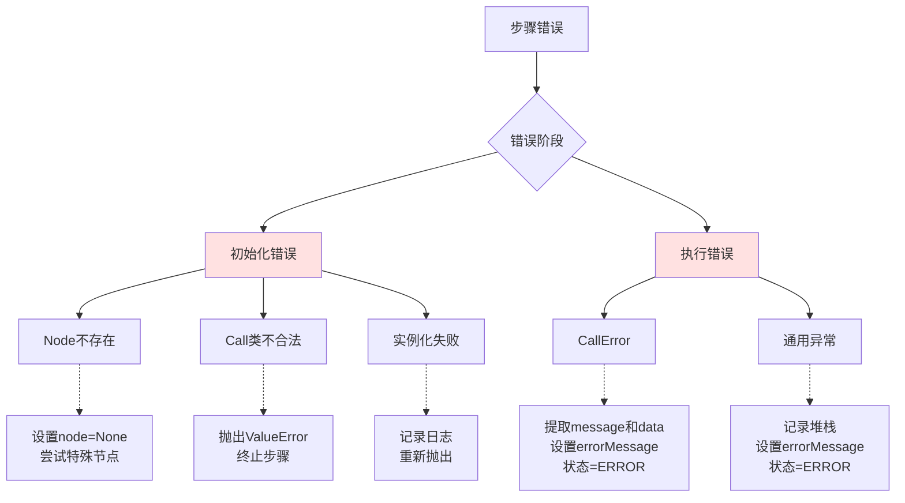

### 9.2 错误处理策略

```python
# 初始化错误
try:
    self.obj = await call_cls.instance(self, self.node, **params)
except Exception:
    logger.exception("[StepExecutor] 初始化Call失败")
    raise  # 重新抛出，由上层处理

# 执行错误
try:
    content = await self._process_chunk(iterator, to_user=self.obj.to_user)
except Exception as e:
    logger.exception("[StepExecutor] 运行步骤失败，进行异常处理步骤")
    self.task.state.stepStatus = StepStatus.ERROR
    await self._push_message(EventType.STEP_OUTPUT.value, {})

    if isinstance(e, CallError):
        self.task.state.errorMessage = {
            "err_msg": e.message,
            "data": e.data,
        }
    else:
        self.task.state.errorMessage = {
            "data": {},
        }
    return  # 不抛出异常，步骤结束
```

### 9.3 错误信息结构

```python
# CallError
{
    "err_msg": "具体的错误描述",
    "data": {
        "error_type": "parameter_missing",
        "missing_fields": ["field1", "field2"],
        "details": "..."
    }
}

# 通用错误
{
    "data": {}  # 空字典
}
```

## 10. 性能优化

### 10.1 流式处理

**优势**：

- 减少内存占用
- 提升用户体验（实时反馈）
- 支持超长输出

**实现**：

```python
async def _process_chunk(
    self,
    iterator: AsyncGenerator[CallOutputChunk, None],
    *,
    to_user: bool = False,
) -> str | dict[str, Any]:
    content: str | dict[str, Any] = ""

    async for chunk in iterator:
        # 边接收边处理
        if isinstance(chunk.content, str):
            content += chunk.content
            if to_user:
                # 立即推送，不等待完整输出
                await self._push_message(EventType.TEXT_ADD.value, chunk.content)

    return content
```

### 10.2 参数合并优化

**策略**：

- 延迟合并：在实例化时才合并
- 浅拷贝：避免深拷贝带来的性能损耗
- 增量更新：Slot 填充时使用 `update` 而非重建

```python
# 高效合并
params = node.knownParams if node and node.knownParams else {}
if step.params:
    params.update(step.params)  # 原地更新

# Slot更新
self.obj.input.update(result.slot_data)  # 增量更新
```

### 10.3 状态缓存

**避免重复查询**：

```python
# 缓存Node信息
self.node = await NodeManager.get_node(node_id)

# 缓存Call类
self.obj = await call_cls.instance(...)

# 避免在循环中重复获取状态
state = self.task.state  # 缓存引用
if not state:
    raise RuntimeError(...)
state.stepStatus = StepStatus.RUNNING
```

## 11. 参考资料

### 11.1 相关模块

- [BaseExecutor](base.py) - 执行器基类
- [CoreCall](../call/core.py) - Call 基类
- [Slot](../call/slot/slot.py) - 参数填充
- [NodeManager](../../services/node.py) - 节点管理
- [Call Pool](../pool/pool.py) - Call 池

### 11.2 数据模型

- [ExecutorHistory](../../models/task.py) - 执行历史
- [ExecutorCheckpoint](../../models/task.py) - 执行检查点
- [StepStatus](../../models/task.py) - 步骤状态枚举
- [StepType](../../models/task.py) - 步骤类型枚举

### 11.3 消息队列

- [MessageQueue](../../common/queue.py) - 消息队列
- [EventType](../../schemas/enum_var.py) - 事件类型枚举
