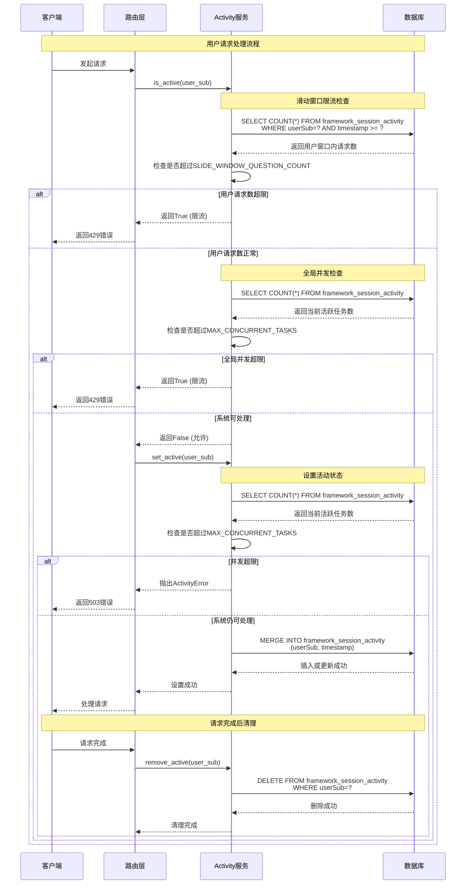
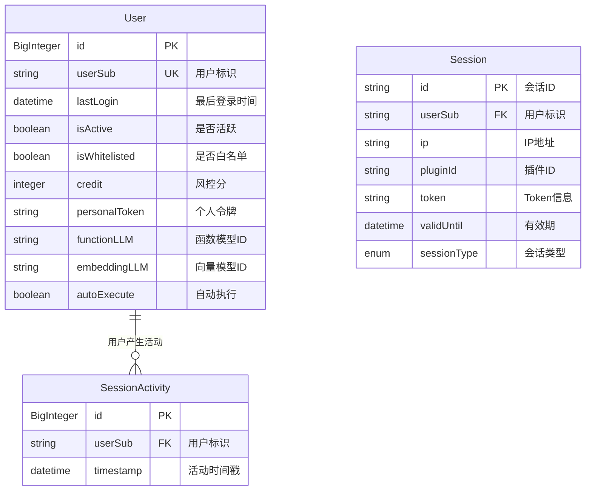
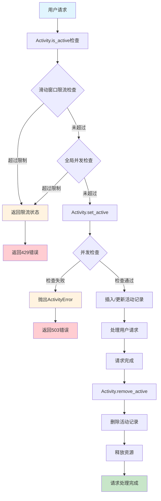
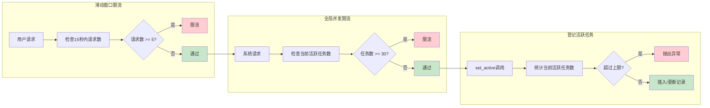
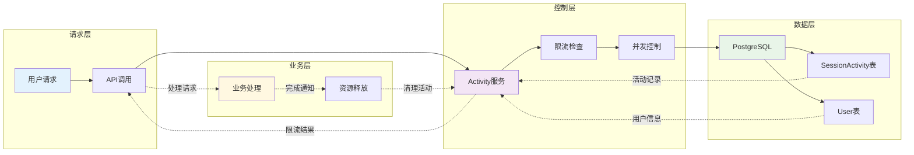

# Activity模块设计文档

## 概述

Activity 模块是 openEuler Intelligence 框架中的用户活动控制系统，负责管理系统的并发限制和用户限流。该模块实现了单用户滑动窗口限流和全局并发任务限制，确保系统在高负载情况下的稳定性和公平性。

## 核心功能

- **全局并发控制**: 限制系统同时执行的任务数量，防止系统过载
- **单用户限流**: 基于滑动窗口的用户请求频率限制（当前仅在活动检测阶段执行）
- **活动状态管理**: 跟踪和管理用户活动状态
- **资源保护**: 通过限流机制保护系统资源

## 数据模型

### SessionActivity实体

- **表名**: `framework_session_activity`
- **主键**: `id` (BigInteger, 自增)
- **字段**:
  - `userSub`: 用户标识 (String(50), 外键关联framework_user.userSub)
  - `timestamp`: 活动时间戳 (DateTime, 时区感知)

### 相关实体

- **User**: 用户基础信息表 (`framework_user`)
- **Session**: 会话管理表 (`framework_session`)

## 配置常量

- `MAX_CONCURRENT_TASKS`: 全局同时运行任务上限 (默认: 30)
- `SLIDE_WINDOW_TIME`: 滑动窗口时间 (默认: 15秒)
- `SLIDE_WINDOW_QUESTION_COUNT`: 滑动窗口内最大请求数 (默认: 5)

## 服务层

### Activity类

#### 静态方法

- `is_active(user_sub)`: 先按用户滑动窗口统计，再按全局并发统计，达到任一阈值即返回 `True`
- `set_active(user_sub)`: 在未超过全局并发上限时登记一个活动任务，内部使用 SQLAlchemy `merge` 以 userSub 为键写入最新时间戳
- `remove_active(user_sub)`: 移除用户活动状态

> **注意**
> 当前实现仅在 `is_active` 阶段执行滑动窗口校验；`set_active` 只进行一次全局并发计数后写入数据库。

## 时序图



## ER图



## 流程图



## 限流机制详解



## 数据流转图



## 异常处理

### ActivityError异常

- **触发条件**: 当系统并发已达上限时调用`set_active`方法
- **错误信息**: "系统并发已达上限"
- **处理方式**: 向上层抛出异常，由路由层处理

## 安全考虑

1. **双重限流保护**: 用户级别和系统级别的双重限流机制
2. **时间窗口控制**: 滑动窗口防止用户短时间内大量请求
3. **并发限制**: 全局并发控制防止系统过载
4. **资源及时释放**: 请求完成后及时清理活动记录

## 性能优化

1. **数据库索引**: userSub字段建立索引，提高查询效率
2. **异步操作**: 所有数据库操作使用异步方式
3. **连接池管理**: 使用数据库连接池管理连接
4. **批量清理**: 可考虑定期清理过期的活动记录

## 监控指标

1. **并发任务数**: 实时监控当前活跃任务数量
2. **限流触发次数**: 统计限流机制触发频率
3. **用户请求频率**: 监控用户请求模式
4. **系统响应时间**: 监控限流对系统性能的影响

## 扩展性

1. **动态配置**: 支持运行时调整限流参数
2. **多级限流**: 可扩展支持更复杂的限流策略
3. **限流策略**: 可扩展支持令牌桶、漏桶等算法
4. **分布式限流**: 可扩展支持分布式环境下的限流控制

## 配置说明

```toml
# 活动控制配置
MAX_CONCURRENT_TASKS = 30        # 全局并发任务上限
SLIDE_WINDOW_TIME = 15           # 滑动窗口时间(秒)
SLIDE_WINDOW_QUESTION_COUNT = 5  # 窗口内最大请求数
```

## 使用示例

```python
# 检查是否被限流
if await Activity.is_active(user_sub):
    raise HTTPException(status_code=429, detail="请求过于频繁")

# 设置活动状态
try:
    await Activity.set_active(user_sub)
    # 处理业务逻辑
finally:
    # 清理活动状态
    await Activity.remove_active(user_sub)
```
