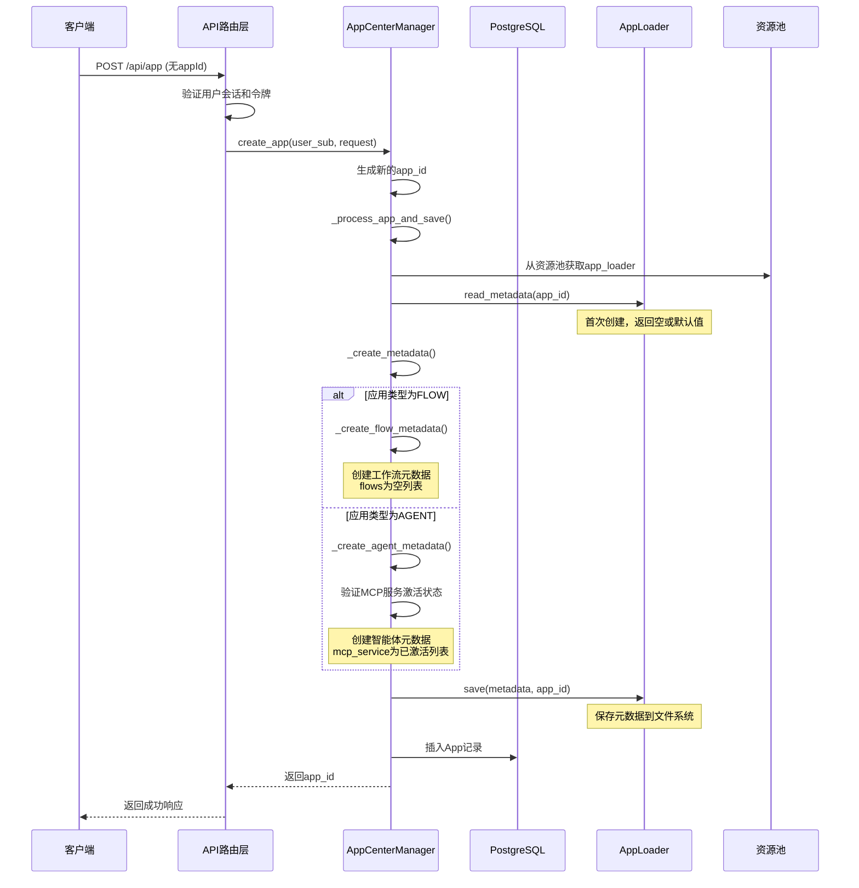
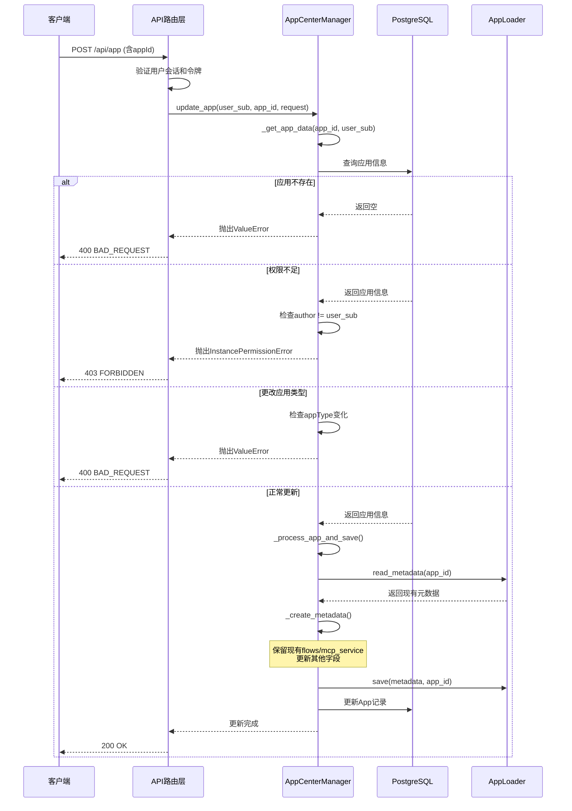
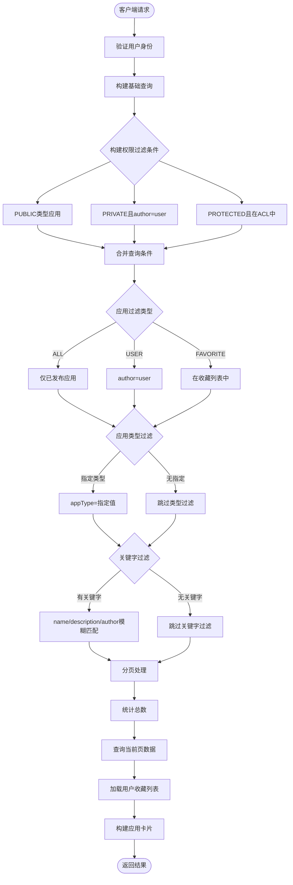
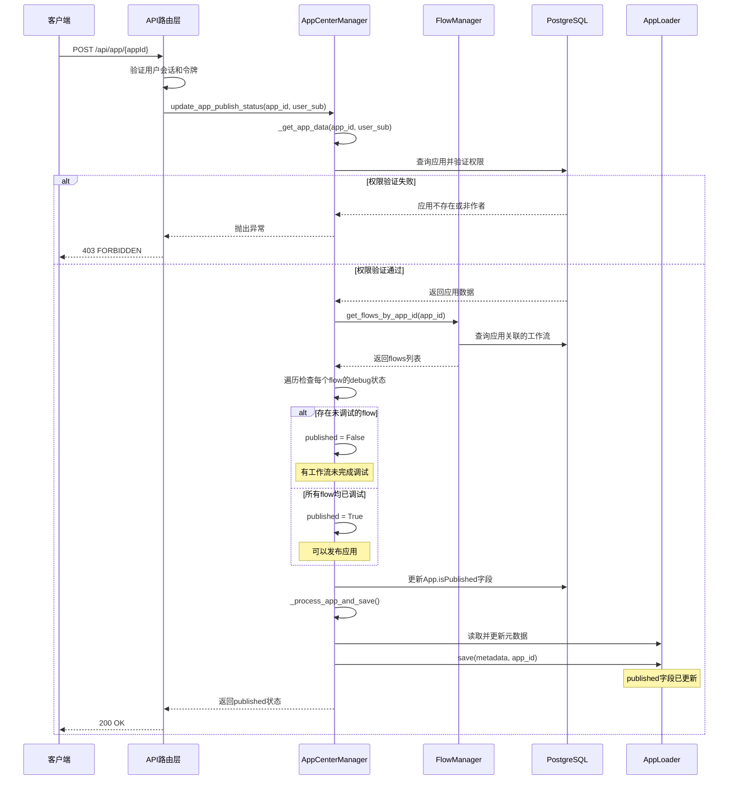
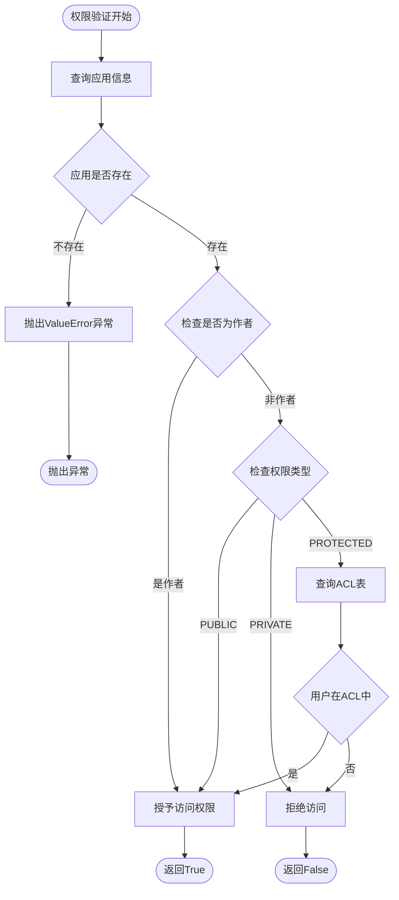
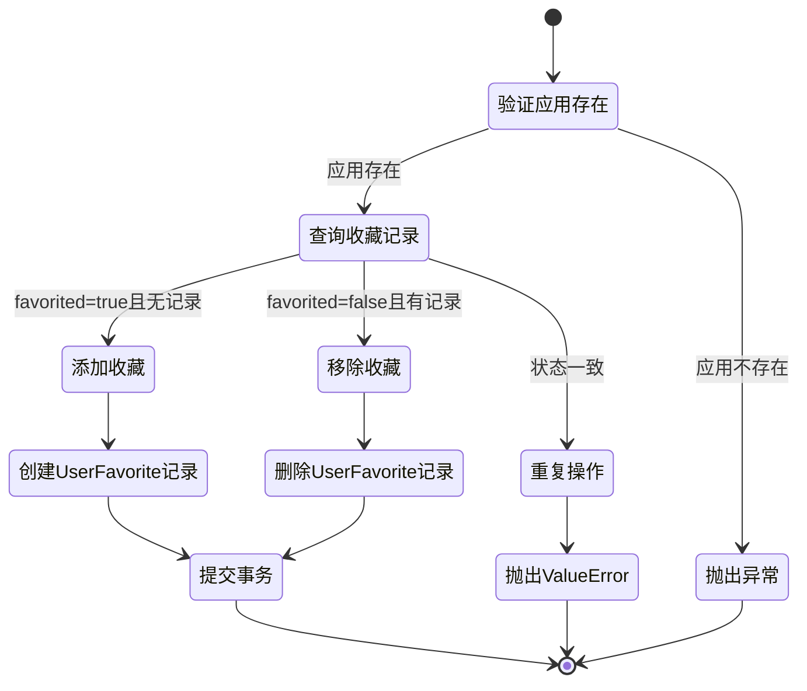
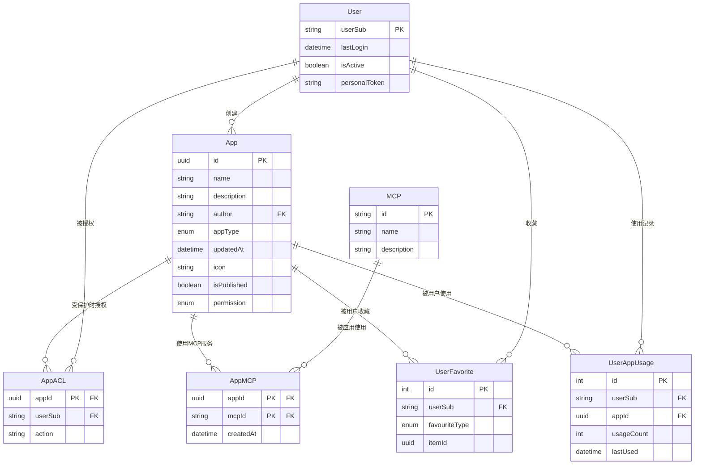
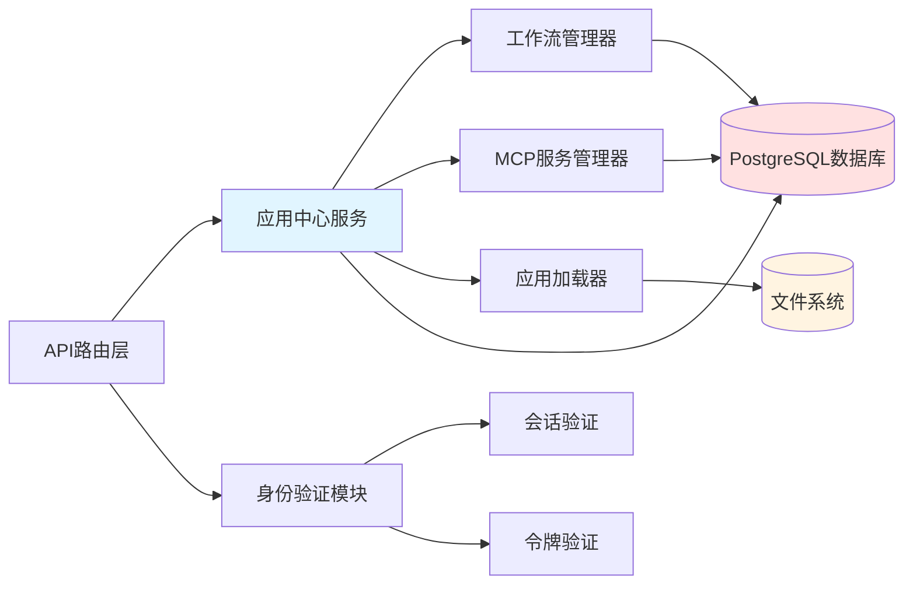

# 应用中心服务模块文档

## 模块概述

应用中心服务模块负责管理系统中的应用生命周期，包括应用的创建、更新、查询、删除、发布、收藏等核心功能。该模块支持两种应用类型：工作流应用（FLOW）和智能体应用（AGENT），并提供了完善的权限控制机制。

### 核心职责

- **应用管理**：提供应用的CRUD操作，支持工作流和智能体两种应用类型
- **权限控制**：实现基于所有权和访问控制列表的权限验证机制
- **应用检索**：支持按关键字、类型、作者、收藏状态等条件筛选应用
- **使用追踪**：记录和查询用户的应用使用历史
- **发布管理**：控制应用的发布状态，确保只有调试完成的应用可以发布

---

## 数据结构

### 应用卡片数据

用于应用列表展示的卡片信息：

```json
{
  "appId": "550e8400-e29b-41d4-a716-446655440000",
  "appType": "flow",
  "icon": "/icons/app-icon.png",
  "name": "文档处理助手",
  "description": "智能化文档分析与处理工具",
  "author": "user123",
  "favorited": true,
  "published": true
}
```

### 应用详细信息

工作流应用完整配置：

```json
{
  "appId": "550e8400-e29b-41d4-a716-446655440000",
  "appType": "flow",
  "published": true,
  "name": "文档处理助手",
  "description": "智能化文档分析与处理工具",
  "icon": "/icons/app-icon.png",
  "links": [
    {
      "title": "使用文档",
      "url": "https://docs.example.com/guide"
    }
  ],
  "recommendedQuestions": [
    "如何批量处理PDF文档？",
    "支持哪些文档格式？"
  ],
  "dialogRounds": 5,
  "permission": {
    "visibility": "protected",
    "authorizedUsers": ["user456", "user789"]
  },
  "workflows": [
    {
      "id": "660e8400-e29b-41d4-a716-446655440001",
      "name": "PDF提取流程",
      "description": "从PDF中提取文本和图像",
      "debug": true
    }
  ],
  "mcpService": []
}
```

智能体应用完整配置：

```json
{
  "appId": "770e8400-e29b-41d4-a716-446655440002",
  "appType": "agent",
  "published": false,
  "name": "代码审查助手",
  "description": "自动化代码审查与建议",
  "icon": "/icons/code-review.png",
  "links": [],
  "recommendedQuestions": [],
  "dialogRounds": 3,
  "permission": {
    "visibility": "private",
    "authorizedUsers": null
  },
  "workflows": [],
  "mcpService": [
    {
      "id": "880e8400-e29b-41d4-a716-446655440003",
      "name": "Git分析服务",
      "description": "提供Git仓库分析能力"
    }
  ]
}
```

### 最近使用应用列表

```json
{
  "applications": [
    {
      "appId": "550e8400-e29b-41d4-a716-446655440000",
      "name": "文档处理助手"
    },
    {
      "appId": "770e8400-e29b-41d4-a716-446655440002",
      "name": "代码审查助手"
    }
  ]
}
```

---

## API接口定义

### 1. 获取应用列表

**端点**: `GET /api/app`

**请求参数**:

- `createdByMe` (boolean, 可选): 仅显示当前用户创建的应用
- `favorited` (boolean, 可选): 仅显示收藏的应用
- `keyword` (string, 可选): 搜索关键字，匹配应用名称、描述或作者
- `appType` (string, 可选): 应用类型过滤（flow/agent）
- `page` (integer, 必需): 页码，从1开始

**请求示例**:

```http
GET /api/app?keyword=文档&appType=flow&page=1
```

**响应示例**:

```json
{
  "code": 200,
  "message": "OK",
  "result": {
    "currentPage": 1,
    "totalApps": 42,
    "applications": [
      {
        "appId": "550e8400-e29b-41d4-a716-446655440000",
        "appType": "flow",
        "icon": "/icons/app-icon.png",
        "name": "文档处理助手",
        "description": "智能化文档分析与处理工具",
        "author": "user123",
        "favorited": true,
        "published": true
      }
    ]
  }
}
```

### 2. 创建或更新应用

**端点**: `POST /api/app`

**请求体（创建应用）**:

```json
{
  "appType": "flow",
  "name": "新应用",
  "description": "这是一个新创建的应用",
  "icon": "/icons/new-app.png",
  "links": [
    {
      "title": "帮助文档",
      "url": "https://help.example.com"
    }
  ],
  "recommendedQuestions": ["如何开始？"],
  "dialogRounds": 3,
  "permission": {
    "visibility": "public"
  }
}
```

**请求体（更新应用）**:

```json
{
  "appId": "550e8400-e29b-41d4-a716-446655440000",
  "appType": "flow",
  "name": "更新后的应用名称",
  "description": "更新后的描述",
  "icon": "/icons/updated-icon.png",
  "links": [],
  "recommendedQuestions": [],
  "dialogRounds": 5,
  "permission": {
    "visibility": "protected",
    "authorizedUsers": ["user456"]
  }
}
```

**响应示例**:

```json
{
  "code": 200,
  "message": "OK",
  "result": {
    "appId": "550e8400-e29b-41d4-a716-446655440000"
  }
}
```

### 3. 获取应用详情

**端点**: `GET /api/app/{appId}`

**请求示例**:

```http
GET /api/app/550e8400-e29b-41d4-a716-446655440000
```

**响应示例**: 参见"数据结构"章节中的应用详细信息

### 4. 删除应用

**端点**: `DELETE /api/app/{appId}`

**请求示例**:

```http
DELETE /api/app/550e8400-e29b-41d4-a716-446655440000
```

**响应示例**:

```json
{
  "code": 200,
  "message": "OK",
  "result": {
    "appId": "550e8400-e29b-41d4-a716-446655440000"
  }
}
```

### 5. 发布应用

**端点**: `POST /api/app/{appId}`

**请求示例**:

```http
POST /api/app/550e8400-e29b-41d4-a716-446655440000
```

**响应示例**:

```json
{
  "code": 200,
  "message": "OK",
  "result": {
    "appId": "550e8400-e29b-41d4-a716-446655440000"
  }
}
```

### 6. 修改收藏状态

**端点**: `PUT /api/app/{appId}`

**请求体**:

```json
{
  "favorited": true
}
```

**响应示例**:

```json
{
  "code": 200,
  "message": "OK",
  "result": {
    "appId": "550e8400-e29b-41d4-a716-446655440000",
    "favorited": true
  }
}
```

### 7. 获取最近使用应用

**端点**: `GET /api/app/recent`

**请求参数**:

- `count` (integer, 可选): 返回数量，范围1-10，默认5

**请求示例**:

```http
GET /api/app/recent?count=3
```

**响应示例**: 参见"数据结构"章节中的最近使用应用列表

---

## 核心业务流程

### 应用创建流程



### 应用更新流程



### 应用查询流程



### 应用发布流程



### 权限验证流程



### 收藏功能流程



---

## 核心方法说明

### validate_user_app_access

验证用户是否有权访问指定应用。

- **功能描述**: 验证用户对指定应用的访问权限
- **验证流程**:
  - 从数据库查询应用的作者和权限类型
  - 若用户是应用作者，直接授予访问权限
  - 根据权限类型执行相应的验证逻辑
- **权限判断规则**:
  - `PUBLIC`: 所有用户均可访问
  - `PRIVATE`: 仅作者可访问
  - `PROTECTED`: 需检查用户是否在访问控制列表中
- **异常情况**: 应用不存在时抛出`ValueError`异常

### validate_app_belong_to_user

验证应用是否属于指定用户。

- **功能描述**: 确认应用所有权归属
- **验证逻辑**: 在数据库中查询同时满足应用ID和作者匹配的记录
- **异常情况**: 找不到匹配记录时抛出`ValueError`异常
- **使用场景**: 更新、删除等需要所有权验证的操作

### fetch_apps

获取用户可访问的应用列表，并支持多维度筛选。

- **功能描述**: 获取并筛选用户可访问的应用列表
- **权限过滤**: 构建CTE表达式，包含三类应用
  - 公开应用(PUBLIC)
  - 用户自己创建的私有应用(PRIVATE)
  - 用户在ACL中的受保护应用(PROTECTED)
- **过滤维度**:
  - **过滤类型**: 全部(仅已发布)、用户创建、收藏(已发布)
  - **应用类型**: 工作流(FLOW)或智能体(AGENT)
  - **关键字**: 在应用名称、描述和作者字段中进行模糊匹配
- **分页处理**: 支持分页查询
- **结果构建**: 为每个应用构建卡片对象并标注收藏状态

### fetch_app_metadata_by_id

根据应用ID获取完整的元数据信息。

- **功能描述**: 获取应用的完整配置信息
- **执行步骤**:
  1. 在数据库中验证应用是否存在
  2. 通过应用加载器从文件系统读取元数据
- **元数据类型**:
  - 工作流应用元数据
  - 智能体应用元数据
- **异常情况**: 应用存在但元数据文件缺失时抛出`ValueError`异常
- **核心作用**: 获取应用完整配置的核心入口

### create_app

创建新应用的入口方法。

- **功能描述**: 创建新应用并初始化配置
- **执行步骤**:
  1. 生成新的应用ID
  2. 调用内部处理方法完成元数据创建和持久化
- **应用类型处理**:
  - **工作流应用**: 初始化时工作流列表为空
  - **智能体应用**: 验证MCP服务激活状态，仅添加已激活服务
- **返回结果**: 新生成的应用ID

### update_app

更新现有应用的入口方法。

- **功能描述**: 更新已存在应用的配置信息
- **验证检查**:
  - 验证用户对应用的所有权
  - 确保只有应用作者可以执行更新操作
  - 检查是否尝试更改应用类型(不允许)
- **更新策略**:
  - 保留现有的工作流列表或MCP服务列表
  - 只更新用户提交的基本信息和权限配置
- **调用流程**: 验证通过后调用内部处理方法更新元数据

### update_app_publish_status

更新应用的发布状态。

- **功能描述**: 控制应用的发布状态
- **执行步骤**:
  1. 验证用户所有权
  2. 查询应用关联的所有工作流
  3. 检查每个工作流的调试状态
- **发布条件**: 所有工作流都已完成调试
- **更新范围**: 同时更新数据库和元数据文件
- **返回结果**: 最终的发布状态(有未调试工作流则返回false)

### modify_favorite_app

修改用户对应用的收藏状态。

- **功能描述**: 添加或取消应用收藏
- **执行流程**:
  1. 验证应用是否存在
  2. 查询用户当前对该应用的收藏记录
- **操作逻辑**:
  - **添加收藏**: 请求添加且当前无记录时，创建新收藏记录
  - **取消收藏**: 请求取消且当前有记录时，删除收藏记录
- **异常情况**: 请求状态与当前状态一致时抛出`ValueError`异常(重复操作)

### delete_app

删除指定应用。

- **功能描述**: 删除应用及其关联数据
- **验证步骤**:
  1. 从数据库查询应用信息，验证应用是否存在
  2. 检查当前用户是否为应用作者
- **删除范围**:
  - 删除数据库中的应用记录
  - 级联删除ACL记录、收藏记录等关联数据
- **注意事项**: 只删除数据库记录，不删除文件系统中的元数据文件

### get_recently_used_apps

获取用户最近使用的应用列表。

- **功能描述**: 查询用户的应用使用历史
- **查询条件**:
  - 在用户应用使用表中查询指定用户的记录
  - 按最后使用时间降序排列
  - 限制返回数量
- **结果构建**: 为每个应用ID查询应用名称，构建列表项
- **数据处理**: 已删除的应用会被跳过
- **使用场景**: 在用户界面展示最近使用历史

### update_recent_app

更新用户的应用使用记录。

- **功能描述**: 记录或更新应用使用信息
- **查询逻辑**: 在用户应用使用表中查找当前用户的所有记录
- **更新策略**:
  - **已有记录**: 更新最后使用时间并将使用次数加一
  - **无记录**: 创建新的使用记录
- **数据过滤**: 过滤掉全零UUID的应用ID
- **异常情况**: 用户在数据库中不存在时抛出`ValueError`异常

### _get_app_data

内部方法：从数据库获取应用数据并可选择性验证作者身份。

- **功能描述**: 获取应用数据并执行权限验证
- **执行步骤**: 通过应用ID查询数据库中的应用记录
- **作者检查**: 启用时比对当前用户与应用作者是否一致
- **异常情况**:
  - 查询不到记录时抛出`ValueError`异常
  - 作者不一致时抛出`InstancePermissionError`异常
- **核心作用**: 其他业务方法执行权限验证的基础工具

### _create_metadata

内部方法：根据应用类型创建相应的元数据对象。

- **功能描述**: 创建应用元数据对象
- **验证步骤**: 验证是否提供了必要的数据源(新建数据或现有数据)
- **通用参数**: 构建参数集合，包括ID、作者、图标、名称、描述、对话轮次和权限配置
- **类型分派**:
  - 工作流应用 → 调用`_create_flow_metadata`
  - 智能体应用 → 调用`_create_agent_metadata`
- **异常情况**: 应用类型与元数据类型不匹配时抛出`ValueError`异常

### _create_flow_metadata

内部方法：创建工作流应用的元数据对象。

- **功能描述**: 生成工作流应用的完整元数据
- **基础创建**: 基于通用参数创建工作流元数据
- **特有字段**:
  - 相关链接(links)
  - 推荐问题(recommendedQuestions)
- **工作流列表处理**:
  - 提供现有元数据时保留现有列表
  - 否则初始化为空列表
- **发布状态处理**:
  - 创建场景：默认为未发布
  - 更新场景：保留现有状态或使用传入参数

### _create_agent_metadata

内部方法：创建智能体应用的元数据对象。

- **功能描述**: 生成智能体应用的完整元数据
- **基础创建**: 基于通用参数创建智能体元数据
- **MCP服务列表处理**:
  - 提供新服务数据时，逐个验证激活状态
  - 仅添加已激活的服务到元数据中
  - 未提供服务数据时初始化为空列表
- **发布状态**: 使用传入的参数值，创建时默认为未发布

### _process_app_and_save

内部方法：处理应用元数据的创建和持久化。

- **功能描述**: 元数据处理和持久化的统一入口
- **执行步骤**:
  1. 从应用加载器读取现有的应用元数据
  2. 调用元数据创建方法生成新的元数据对象
  3. 通过应用加载器将元数据保存到文件系统
- **核心作用**: 创建、更新、发布等操作的最终执行节点
- **数据同步**: 确保内存中的元数据对象与文件系统中的持久化数据保持同步

---

## 数据模型关系



---

## 异常处理机制

### ValueError异常

在以下场景中抛出值错误异常：

- 应用ID无效或应用不存在
- 尝试更改应用类型
- 元数据创建时缺少必要参数
- 应用类型与元数据类型不匹配
- 收藏操作重复执行
- 用户不存在于系统中

### InstancePermissionError异常

在以下场景中抛出实例权限错误异常：

- 非应用作者尝试更新应用
- 非应用作者尝试删除应用
- 非应用作者尝试发布应用

### 通用异常

其他未预期的异常会被路由层捕获，统一返回500内部服务器错误响应，并记录详细的异常日志用于排查问题。

---

## 权限模型

### 权限类型

系统支持三种权限类型：

1. **PUBLIC（公开）**: 所有用户均可访问和使用该应用
2. **PRIVATE（私有）**: 仅应用作者本人可以访问和使用
3. **PROTECTED（受保护）**: 应用作者和授权用户列表中的用户可以访问

### 所有权验证

只有应用作者可以执行以下操作：

- 更新应用配置
- 删除应用
- 发布应用
- 修改应用权限设置

### 访问权限验证

用户访问应用时的权限判断优先级：

1. 如果用户是应用作者，直接授予访问权限
2. 如果应用是公开类型，授予访问权限
3. 如果应用是私有类型，拒绝访问
4. 如果应用是受保护类型，检查用户是否在ACL表中

---

## 应用类型差异

### 工作流应用（FLOW）

工作流应用通过可视化的流程编排实现业务逻辑，支持以下特性：

- 包含多个工作流（workflows），每个工作流是独立的执行单元
- 配置相关链接（links），提供外部参考资源
- 设置推荐问题（recommendedQuestions），引导用户使用
- 发布前必须确保所有工作流都已完成调试

### 智能体应用（AGENT）

智能体应用通过AI模型和外部服务集成实现智能交互，支持以下特性：

- 集成MCP服务（mcpService），扩展智能体能力
- 创建或更新时验证MCP服务的激活状态
- 不包含工作流和推荐问题配置
- 发布状态独立管理，不依赖子组件状态

---

## 与其他模块的交互



### 依赖的外部模块

- **FlowManager**: 查询应用关联的工作流信息，用于发布状态判断
- **MCPServiceManager**: 验证MCP服务的激活状态，用于智能体应用配置
- **AppLoader**: 从文件系统读取和保存应用元数据
- **PostgreSQL**: 持久化应用基本信息、权限配置、收藏和使用记录

### 被依赖的场景

- **对话服务**: 在创建对话时验证用户对应用的访问权限
- **工作流服务**: 在执行工作流时获取应用配置信息
- **用户界面**: 展示应用列表、详情和使用历史

---

## 状态管理

### 应用发布状态

应用发布状态（isPublished）控制应用是否在应用中心公开展示：

- **未发布（False）**: 仅在"我的应用"中可见，不出现在应用中心主列表
- **已发布（True）**: 根据权限配置在应用中心对相应用户可见

工作流应用的发布状态由其包含的所有工作流的调试状态决定，所有工作流都必须完成调试才能发布。智能体应用的发布状态可以独立设置。

### 应用收藏状态

用户可以将任何有访问权限的已发布应用添加到收藏列表。收藏状态记录在UserFavorite表中，与应用本身的状态独立。用户可以通过收藏过滤器快速访问收藏的应用。

### 应用使用状态

系统自动跟踪用户对应用的使用情况，包括使用次数和最后使用时间。这些数据用于生成最近使用应用列表，帮助用户快速访问常用应用。使用记录的更新通过update_recent_app方法在应用启动时触发。
