# Blacklist模块设计文档

## 概述

Blacklist 模块是 openEuler Intelligence 框架中的内容审核与风控模块,负责处理问题黑名单、用户黑名单以及用户举报功能。该模块通过三个核心管理器实现内容过滤、用户信用分管理和举报审核流程,确保系统内容安全和用户行为规范。

## 架构设计

### 模块结构

```text
apps/
├── models/blacklist.py          # 黑名单数据模型
├── services/blacklist.py        # 黑名单服务层
├── routers/blacklist.py         # 黑名单路由层
└── schemas/
    ├── blacklist.py            # 黑名单请求响应数据结构
    └── response_data.py        # 通用响应数据结构
```

### 数据模型关系


## 核心功能

### 1. 问题黑名单管理 (QuestionBlacklistManager)

#### 功能流程图

```mermaid
flowchart TD
    A[问题黑名单操作] --> B{操作类型}

    B -->|检测问题| C[check_blacklisted_questions]
    B -->|获取列表| D[get_blacklisted_questions]
    B -->|修改/删除| E[change_blacklisted_questions]

    C --> C1[查询已审核黑名单]
    C1 --> C2{输入问题是否包含黑名单内容}
    C2 -->|包含| C3[返回False:拦截]
    C2 -->|不包含| C4[返回True:放行]

    D --> D1[根据审核状态查询]
    D1 --> D2[应用分页参数]
    D2 --> D3[返回黑名单列表]

    E --> E1[根据ID查询黑名单记录]
    E1 --> E2{记录是否存在}
    E2 -->|不存在| E3[返回False]
    E2 -->|存在| E4{是否为删除操作}
    E4 -->|是| E5[删除记录]
    E4 -->|否| E6[更新问题和答案]
    E5 --> E7[提交事务]
    E6 --> E7
    E7 --> E8[返回True]

    style C3 fill:#ffebee
    style C4 fill:#e8f5e8
    style E3 fill:#ffebee
    style E8 fill:#e8f5e8
```



#### 主要方法

1. **check_blacklisted_questions(input_question)**: 检测给定问题是否触及黑名单。通过模糊匹配方式查询已审核的黑名单记录,如果输入问题包含黑名单问题内容则返回拦截信号。

2. **get_blacklisted_questions(limit, offset, is_audited)**: 分页获取黑名单问题列表。根据审核状态筛选记录,支持获取已生效黑名单或待审核举报内容。

3. **change_blacklisted_questions(blacklist_id, question, answer,
   is_deletion)**: 修改或删除黑名单记录。管理员可以更新问题和答案内容,
   或彻底删除某条黑名单规则。

### 2. 用户黑名单管理 (UserBlacklistManager)

#### 用户信用分更新流程


#### 核心逻辑

1. **信用分机制**: 用户信用分范围为0-100,信用分小于等于0的用户被视为黑名单用户,无法继续使用系统功能。

2. **白名单保护**: 被标记为白名单的用户不受信用分限制,任何信用分变更操作对白名单用户无效。

3. **状态校验**: 在执行信用分变更前检查用户当前状态,如果用户已处于目标状态(已封禁/已解禁)则直接返回成功,避免重复操作。

4. **边界保护**: 信用分更新时自动限制在0-100范围内,防止数值溢出。

#### 用户黑名单主要方法

1. **get_blacklisted_users(limit, offset)**: 分页获取所有信用分小于等于0的
   黑名单用户标识列表。

2. **check_blacklisted_users(user_sub)**: 检测指定用户是否被拉黑。
   同时检查信用分和白名单状态,白名单用户即使信用分为0也不会被拦截。

3. **change_blacklisted_users(user_sub, credit_diff, credit_limit)**:
   修改用户信用分。传入负值用于封禁用户,传入正值用于解禁用户。
   系统会自动计算新信用分并确保其在有效范围内。

### 3. 举报管理 (AbuseManager)

#### 举报审核完整流程


#### 举报数据流转


#### 举报管理核心逻辑

1. **归属验证**: 用户只能举报属于自己的问答对记录,系统通过用户标识和
   问答对ID双重校验确保合法性。

2. **内容解密**: 问答对内容在数据库中以加密形式存储,举报时需要解密
   获取原始问题和答案文本。

3. **幂等保护**: 同一问答对只能被举报一次,重复举报请求返回成功但不
   创建新记录。

4. **两阶段审核**: 举报内容首先进入待审核状态(isAudited=False),
   管理员审核后决定是否生效或删除。

5. **审核操作**: 管理员可以批准举报使黑名单生效(isAudited=True),
   或拒绝举报并删除记录。

#### 举报管理主要方法

1. **change_abuse_report(user_sub, record_id, reason_type, reason)**:
   用户提交举报。验证问答对归属关系,解密内容后创建待审核黑名单记录,
   记录举报类型和原因。

2. **audit_abuse_report(record_id, is_deletion)**: 管理员审核举报。
   批准时将黑名单记录标记为已审核状态使其生效,拒绝时删除举报记录。

## API接口设计

### 接口列表

| 方法 | 路径 | 权限 | 功能 | 描述 |
|------|------|------|------|------|
| GET | `/api/blacklist/user` | 管理员 | 获取黑名单用户 | 分页获取信用分≤0的用户列表 |
| POST | `/api/blacklist/user` | 管理员 | 操作黑名单用户 | 封禁或解禁指定用户 |
| GET | `/api/blacklist/question` | 管理员 | 获取黑名单问题 | 分页获取已生效的黑名单问题 |
| POST | `/api/blacklist/question` | 管理员 | 操作黑名单问题 | 修改或删除黑名单问题 |
| POST | `/api/blacklist/complaint` | 普通用户 | 提交举报 | 用户举报不当问答对 |
| GET | `/api/blacklist/abuse` | 管理员 | 获取待审核举报 | 分页获取待审核的举报记录 |
| POST | `/api/blacklist/abuse` | 管理员 | 审核举报 | 批准或拒绝用户举报 |

### 请求响应示例

#### 1. 获取黑名单用户

**请求**:

```http
GET /api/blacklist/user?page=0
Authorization: Bearer <session_token>
X-Personal-Token: <personal_token>
```

**响应**:

```json
{
  "code": 200,
  "message": "ok",
  "result": {
    "user_subs": [
      "user-sub-123",
      "user-sub-456",
      "user-sub-789"
    ]
  }
}
```

#### 2. 封禁/解禁用户

**请求 - 封禁用户**:

```http
POST /api/blacklist/user
Content-Type: application/json
Authorization: Bearer <session_token>
X-Personal-Token: <personal_token>

{
  "user_sub": "user-sub-123",
  "is_ban": 1
}
```

**请求 - 解禁用户**:

```json
{
  "user_sub": "user-sub-123",
  "is_ban": 0
}
```

**响应**:

```json
{
  "code": 200,
  "message": "ok",
  "result": {}
}
```

**错误响应**:

```json
{
  "code": 500,
  "message": "Change user blacklist error.",
  "result": {}
}
```

#### 3. 获取黑名单问题

**请求**:

```http
GET /api/blacklist/question?page=0
Authorization: Bearer <session_token>
X-Personal-Token: <personal_token>
```

**响应**:

```json
{
  "code": 200,
  "message": "ok",
  "result": {
    "question_list": [
      {
        "id": 1,
        "recordId": "550e8400-e29b-41d4-a716-446655440000",
        "question": "如何破解系统密码",
        "answer": "很抱歉,我无法回答此类问题。",
        "isAudited": true,
        "reasonType": "安全风险",
        "reason": "涉及系统安全破解",
        "updatedAt": "2024-01-15T10:30:00Z"
      },
      {
        "id": 2,
        "recordId": "660e8400-e29b-41d4-a716-446655440001",
        "question": "如何获取他人隐私信息",
        "answer": "此类问题违反隐私保护政策,无法提供帮助。",
        "isAudited": true,
        "reasonType": "隐私侵犯",
        "reason": "涉及非法获取他人信息",
        "updatedAt": "2024-01-16T14:20:00Z"
      }
    ]
  }
}
```

#### 4. 修改/删除黑名单问题

**请求 - 修改问题**:

```http
POST /api/blacklist/question
Content-Type: application/json
Authorization: Bearer <session_token>
X-Personal-Token: <personal_token>

{
  "id": "1",
  "question": "如何破解系统密码或绕过认证",
  "answer": "很抱歉,我无法回答任何与系统安全破解相关的问题。",
  "is_deletion": 0
}
```

**请求 - 删除问题**:

```json
{
  "id": "1",
  "question": "",
  "answer": "",
  "is_deletion": 1
}
```

**响应**:

```json
{
  "code": 200,
  "message": "ok",
  "result": {}
}
```

**错误响应**:

```json
{
  "code": 500,
  "message": "Modify question blacklist error.",
  "result": {}
}
```

#### 5. 用户提交举报

**请求**:

```http
POST /api/blacklist/complaint
Content-Type: application/json
Authorization: Bearer <session_token>
X-Personal-Token: <personal_token>

{
  "record_id": "770e8400-e29b-41d4-a716-446655440002",
  "reason_type": "内容不当",
  "reason": "回答内容包含误导性信息,可能对用户造成损失"
}
```

**响应**:

```json
{
  "code": 200,
  "message": "ok",
  "result": {}
}
```

**错误响应**:

```json
{
  "code": 500,
  "message": "Report abuse complaint error.",
  "result": {}
}
```

#### 6. 获取待审核举报

**请求**:

```http
GET /api/blacklist/abuse?page=0
Authorization: Bearer <session_token>
X-Personal-Token: <personal_token>
```

**响应**:

```json
{
  "code": 200,
  "message": "ok",
  "result": {
    "question_list": [
      {
        "id": 3,
        "recordId": "770e8400-e29b-41d4-a716-446655440002",
        "question": "openEuler系统如何配置网络",
        "answer": "直接修改/etc/network/interfaces文件即可",
        "isAudited": false,
        "reasonType": "内容不当",
        "reason": "回答内容包含误导性信息,可能对用户造成损失",
        "updatedAt": "2024-01-17T09:15:00Z"
      }
    ]
  }
}
```

#### 7. 审核举报

**请求 - 批准举报(黑名单生效)**:

```http
POST /api/blacklist/abuse
Content-Type: application/json
Authorization: Bearer <session_token>
X-Personal-Token: <personal_token>

{
  "id": "770e8400-e29b-41d4-a716-446655440002",
  "is_deletion": 0
}
```

**请求 - 拒绝举报(删除记录)**:

```json
{
  "id": "770e8400-e29b-41d4-a716-446655440002",
  "is_deletion": 1
}
```

**响应**:

```json
{
  "code": 200,
  "message": "ok",
  "result": {}
}
```

**错误响应**:

```json
{
  "code": 500,
  "message": "Audit abuse question error.",
  "result": {}
}
```

## 数据流转图

### 整体架构数据流


### 问题检测流程


## 安全机制

### 1. 权限隔离

- **管理员专属接口**: 用户黑名单、问题黑名单和举报审核功能仅对管理员开放,通过`verify_admin`依赖注入确保权限。
- **用户举报保护**: 用户只能举报属于自己的问答对,系统通过用户标识和问答对ID双重验证防止恶意举报。

### 2. 数据安全

- **内容加密**: 问答对内容在数据库中加密存储,举报时需解密读取原始内容。
- **白名单机制**: 白名单用户不受信用分限制,确保关键用户账户不会被误封。

### 3. 业务安全

- **幂等性保证**: 重复举报、重复封禁/解禁操作具有幂等性,避免重复操作导致数据异常。
- **状态校验**: 执行操作前检查目标对象是否存在及当前状态,防止无效操作。
- **边界保护**: 用户信用分限制在0-100范围内,防止数值溢出。

### 4. 审核机制

- **两阶段审核**: 用户举报不直接生效,需管理员审核后决定是否加入黑名单,防止恶意举报滥用。
- **模糊匹配检测**: 黑名单问题检测采用模糊匹配(ILIKE),可拦截包含黑名单关键词的变体问题。

## 错误处理

### 常见错误场景

| 错误场景 | HTTP状态码 | 错误信息 | 处理建议 |
|---------|-----------|---------|---------|
| 用户不存在 | 500 | Change user blacklist error. | 检查user_sub是否正确 |
| 黑名单记录不存在 | 500 | Modify question blacklist error. | 检查黑名单ID是否有效 |
| 举报记录不合法 | 500 | Report abuse complaint error. | 确认问答对ID正确且属于当前用户 |
| 待审核问题不存在 | 500 | Audit abuse question error. | 检查record_id是否有效且为待审核状态 |
| 权限不足 | 403 | Forbidden | 确认用户具有管理员权限 |
| 会话过期 | 401 | Unauthorized | 重新登录获取会话令牌 |

### 错误响应格式

```json
{
  "code": 500,
  "message": "具体错误信息",
  "result": {}
}
```
