# Comment Module Documentation

## 模块概述

评论模块（Comment Module）负责处理用户对问答记录（Record）的反馈功能，包括点赞（Like）、点踩（Dislike）以及详细的反馈意见收集。该模块是系统用户体验反馈机制的核心组件。

## 目录结构

```text
apps/
├── routers/
│   └── comment.py          # FastAPI路由层，处理HTTP请求
├── services/
│   └── comment.py          # 业务逻辑层，评论管理器
├── models/
│   └── comment.py          # 数据库模型定义
└── schemas/
    ├── comment.py          # 请求数据模型
    └── record.py           # 记录相关数据模型（包含评论）
```

## 核心组件

### 1. 数据模型层 (models/comment.py)

#### Comment Table Schema

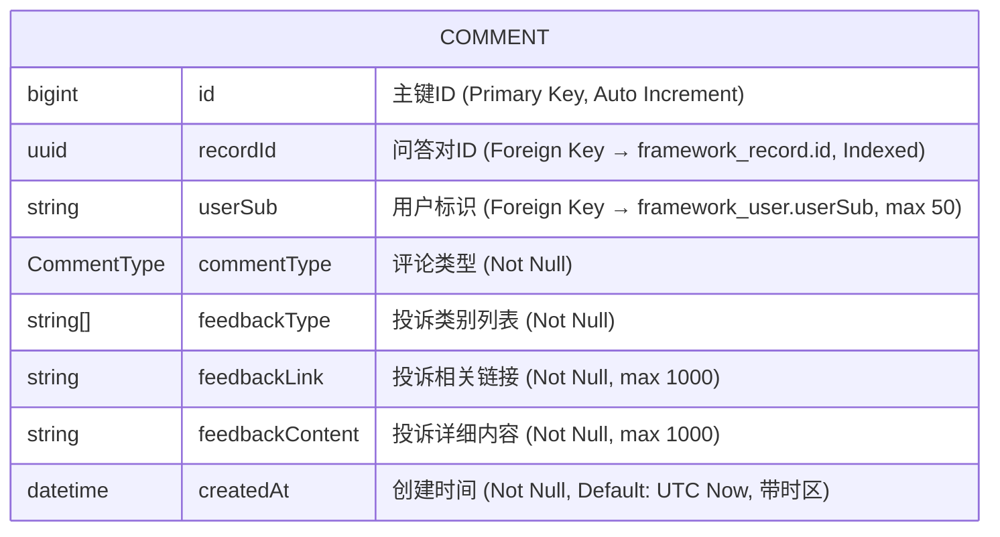

#### CommentType Enum

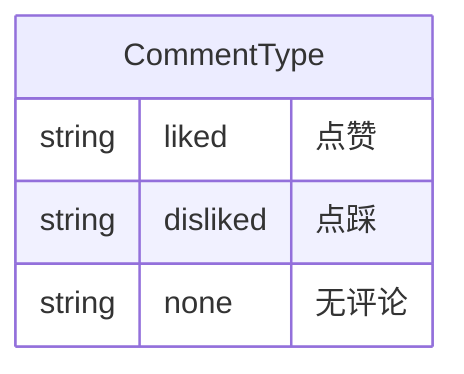

### 2. 业务逻辑层 (services/comment.py)

#### CommentManager

提供评论的核心业务逻辑操作：

- **query_comment(record_id: str)**: 根据问答ID查询评论
- **update_comment(record_id: str, data: RecordComment, user_sub: str)**: 创建或更新评论

### 3. 路由层 (routers/comment.py)

#### API Endpoint

- **POST /api/comment**: 添加或更新评论
  - 认证要求: Session验证 + Personal Token验证
  - 请求体: AddCommentData
  - 响应: ResponseData

### 4. 数据传输对象 (schemas)

#### AddCommentData (请求模型)

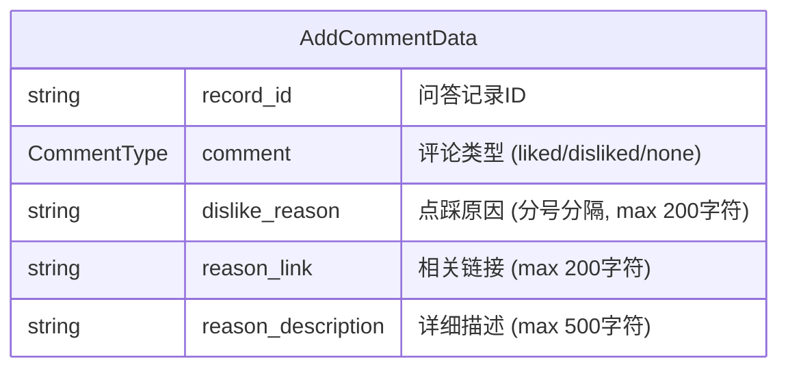

#### RecordComment (内部数据模型)

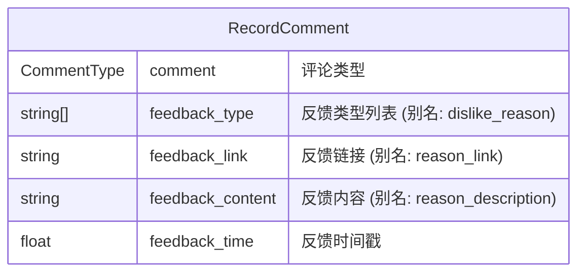

## 架构设计

### 系统架构图

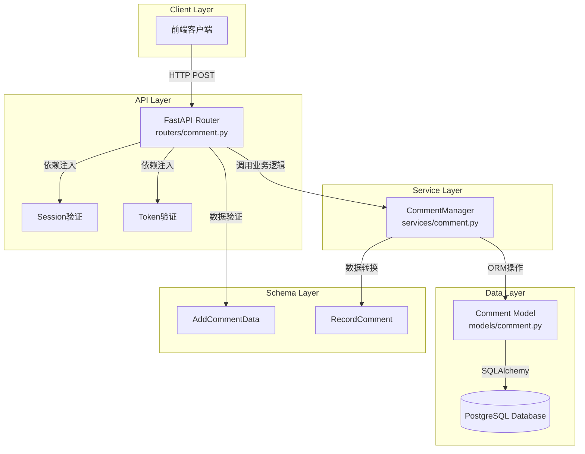

### 数据流程图

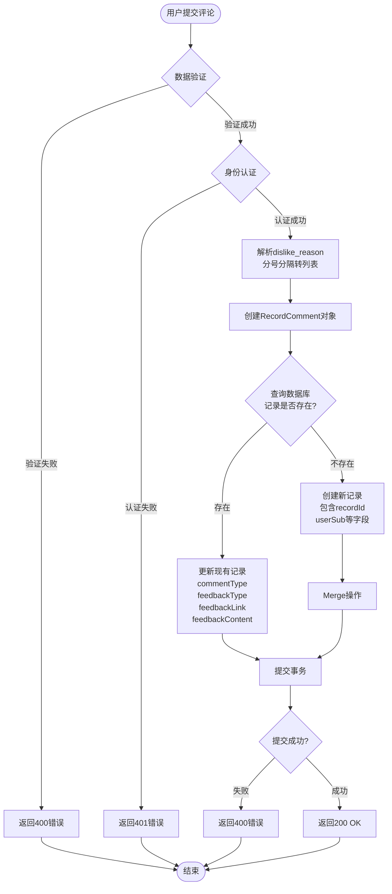

## 时序图

### 添加评论完整流程

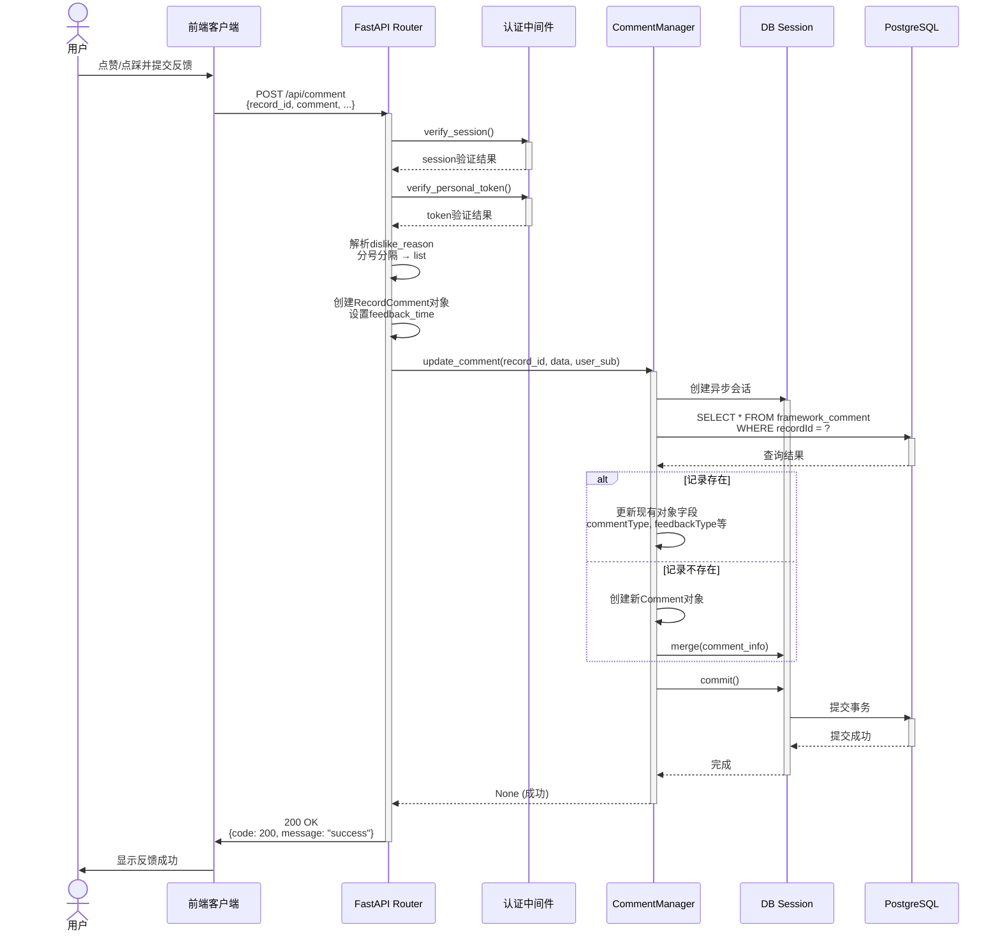

### 查询评论流程

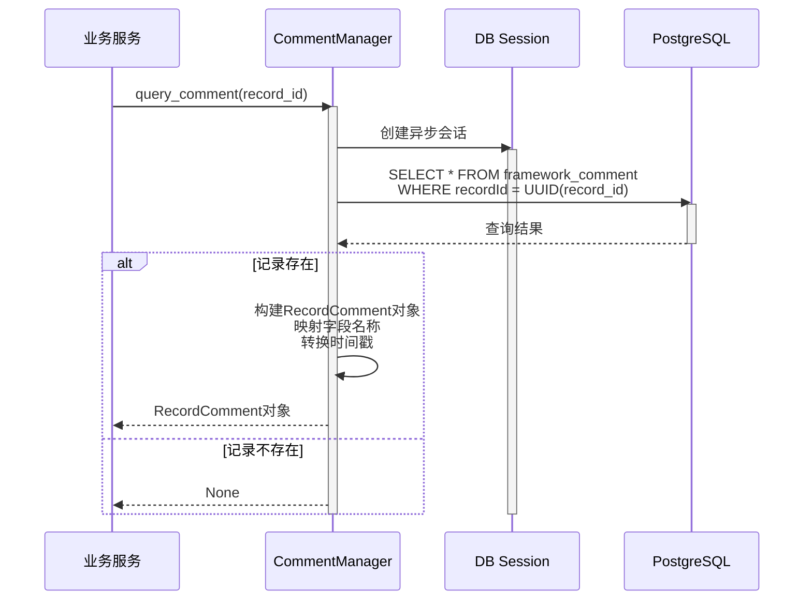

## 状态图

### 评论状态转换

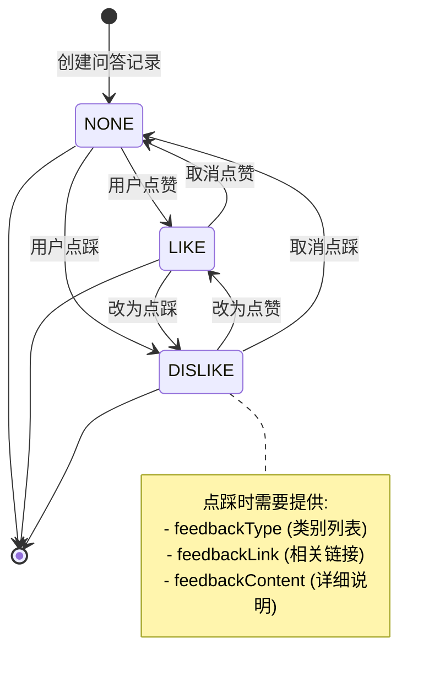

## 类图

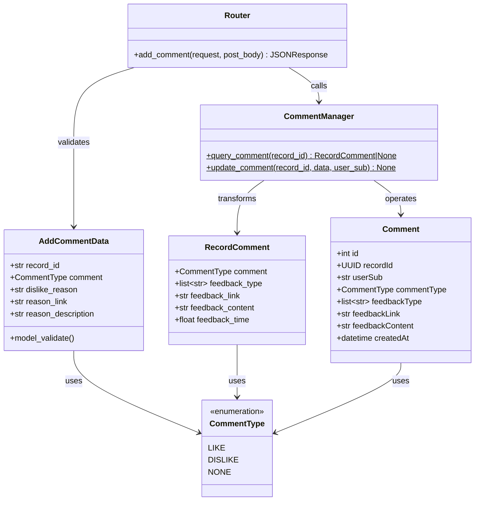

## 数据库ER图

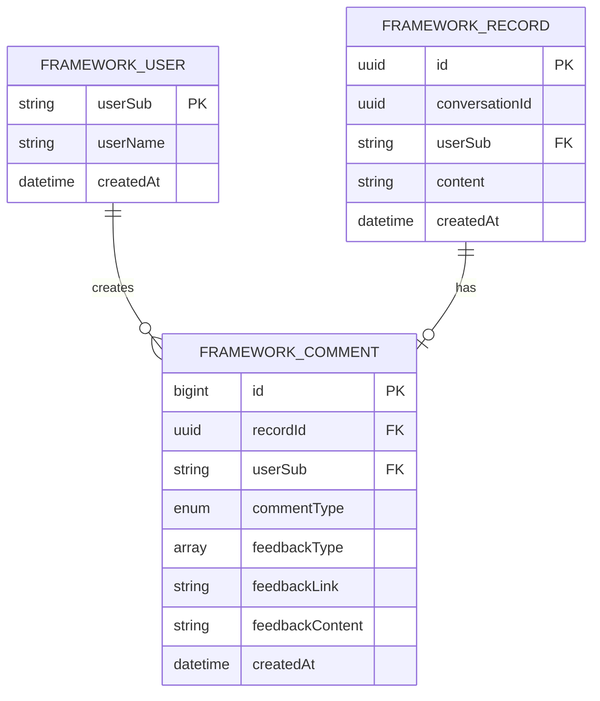

## 核心业务逻辑

### 1. 评论创建/更新逻辑

评论模块采用幂等性设计，支持对同一问答记录进行多次评论更新。核心流程如下：

#### 步骤一：查询现有评论

系统首先根据问答记录ID查询数据库中是否已存在对应的评论记录。

#### 步骤二：判断操作类型

- 如果记录已存在，则执行更新操作，修改现有记录的评论类型、反馈类型、反馈链接和反馈内容
- 如果记录不存在，则创建新的评论记录，包含问答记录ID、用户标识、评论类型等完整信息

#### 步骤三：数据持久化

使用数据库事务确保数据一致性，通过SQLAlchemy的merge操作实现UPSERT语义，自动处理插入或更新逻辑。

### 2. 数据转换逻辑

#### API → Service 层转换

路由层接收到前端请求后，需要进行数据格式转换：

- 将分号分隔的字符串格式的点踩原因转换为数组格式
- 将API字段名映射为内部数据模型字段名
- 生成当前时间戳作为反馈时间

#### Service → Model 层映射

业务逻辑层将处理后的数据映射到数据库模型：

- 评论类型字段直接映射
- 反馈类型列表映射为PostgreSQL数组类型
- 反馈链接和反馈内容直接映射
- 用户标识和记录ID保持原有格式

#### Model → Schema 层查询映射

查询操作时将数据库模型数据转换为API响应格式：

- 数据库字段名转换为前端友好的字段名
- 时间戳格式转换，将数据库的datetime对象转换为Unix时间戳
- 数组类型数据保持原有格式返回给前端

## 接口文档

### POST /api/comment

添加或更新评论

#### 认证要求

- Session验证 (verify_session)
- Personal Token验证 (verify_personal_token)

#### 请求

**Headers:**

```http
Content-Type: application/json
Authorization: Bearer <token>
Cookie: session=<session_id>
```

**Body:**

```json
{
    "record_id": "550e8400-e29b-41d4-a716-446655440000",
    "comment": "disliked",
    "dislike_reason": "答非所问;信息不准确;",
    "reason_link": "https://example.com/issue/123",
    "reason_description": "回答内容与问题不符，建议补充相关文档引用。"
}
```

**字段说明:**

| 字段 | 类型 | 必填 | 说明 | 限制 |
|------|------|------|------|------|
| record_id | string | 是 | 问答记录UUID | UUID格式 |
| comment | string | 是 | 评论类型 | "liked", "disliked", "none" |
| dislike_reason | string | 否 | 点踩原因 | 分号分隔，最长200字符 |
| reason_link | string | 否 | 相关链接 | 最长200字符 |
| reason_description | string | 否 | 详细描述 | 最长500字符 |

#### 响应

**成功 (200 OK):**

```json
{
    "code": 200,
    "message": "success",
    "result": {}
}
```

**失败 (400 Bad Request):**

```json
{
    "code": 400,
    "message": "record_id not found",
    "result": {}
}
```

**失败 (401 Unauthorized):**

```json
{
    "code": 401,
    "message": "Authentication failed"
}
```

#### 示例

**cURL:**

```bash
curl -X POST "http://localhost:8000/api/comment" \
  -H "Content-Type: application/json" \
  -H "Authorization: Bearer eyJhbGc..." \
  --cookie "session=abc123..." \
  -d '{
    "record_id": "550e8400-e29b-41d4-a716-446655440000",
    "comment": "liked",
    "dislike_reason": "",
    "reason_link": "",
    "reason_description": ""
  }'
```

## 关键特性

### 1. 幂等性设计

- 同一个 record_id 的评论支持多次更新
- 使用 SQLAlchemy 的 `merge` 操作实现 UPSERT 语义
- 自动识别创建或更新操作

### 2. 数据完整性

- recordId 外键约束 → framework_record.id
- userSub 外键约束 → framework_user.userSub
- 索引优化：recordId 字段建立索引提高查询性能

### 3. 字段别名映射

使用 Pydantic 的 `Field(alias=...)` 实现前端友好的字段命名：

| 内部字段 | API别名 |
|----------|---------|
| feedback_type | dislike_reason |
| feedback_link | reason_link |
| feedback_content | reason_description |

### 4. 时间处理

- 数据库存储：`datetime` 对象，带时区（UTC）
- API传输：`float` 类型的 Unix 时间戳（秒，保留3位小数）

### 5. 数组字段处理

- API输入：分号分隔的字符串 `"reason1;reason2;"`
- 数据转换：`split(";")[:-1]` → `["reason1", "reason2"]`
- 数据库存储：PostgreSQL ARRAY 类型

## 错误处理

常见错误场景：

| 错误场景 | HTTP状态码 | 处理方式 |
|----------|-----------|----------|
| Session验证失败 | 401 | 依赖注入层拦截 |
| Token验证失败 | 401 | 依赖注入层拦截 |
| record_id不存在 | 400 | 业务逻辑层返回None |
| UUID格式错误 | 400 | Pydantic验证失败 |
| 字段长度超限 | 422 | Pydantic验证失败 |
| 数据库连接失败 | 500 | 异常传播至错误处理中间件 |
| 外键约束违反 | 500 | 数据库异常 |

## 安全考虑

### 1. 认证与授权

- **双重认证**：Session + Personal Token
- **用户隔离**：userSub 关联确保数据隔离
- **依赖注入**：在路由层统一进行身份验证

### 2. 输入验证

- **字段长度限制**：
  - dislike_reason: 200字符
  - reason_link: 200字符
  - reason_description: 500字符
- **类型校验**：Pydantic自动验证数据类型
- **枚举约束**：CommentType限定为三个固定值
