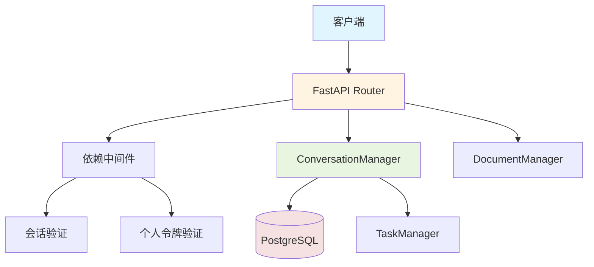
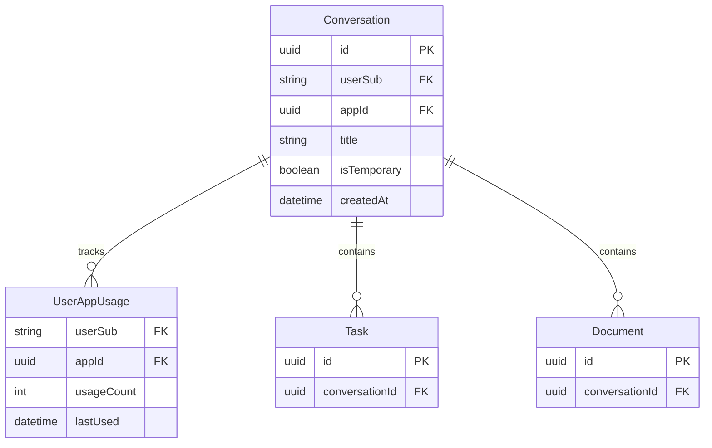
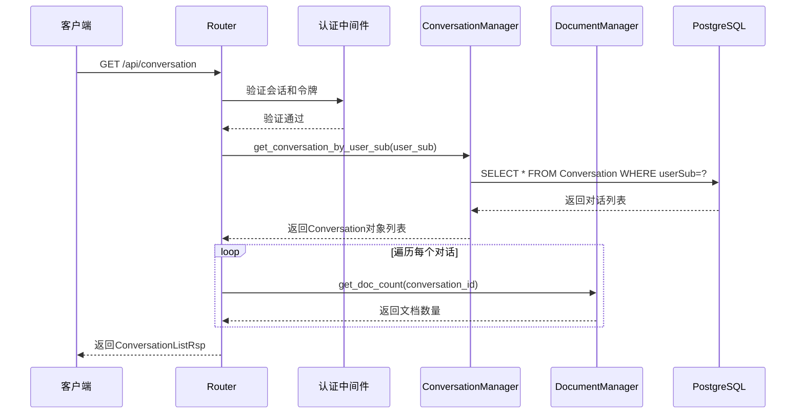
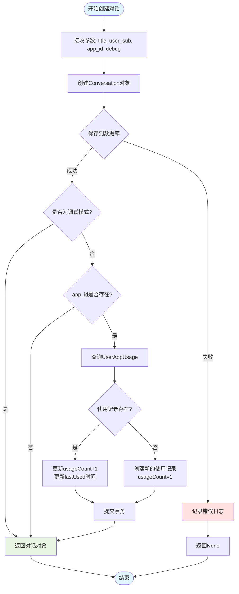
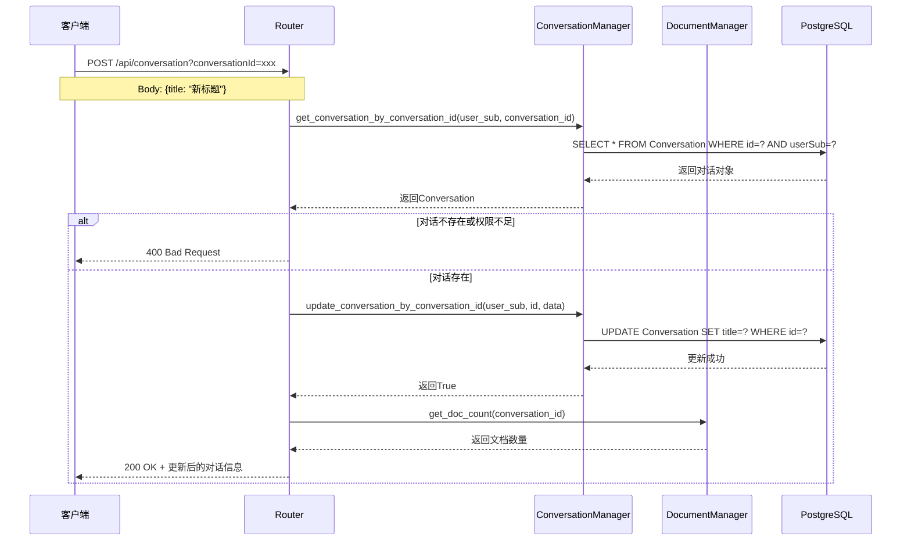
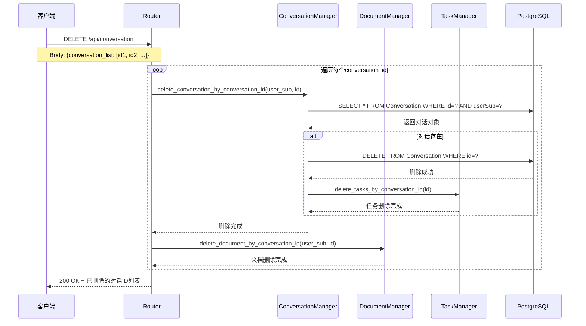
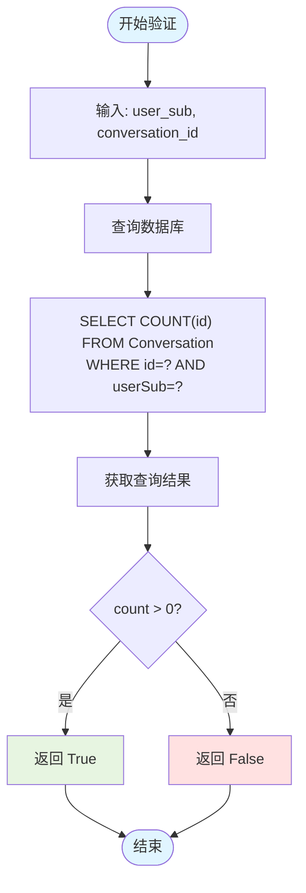
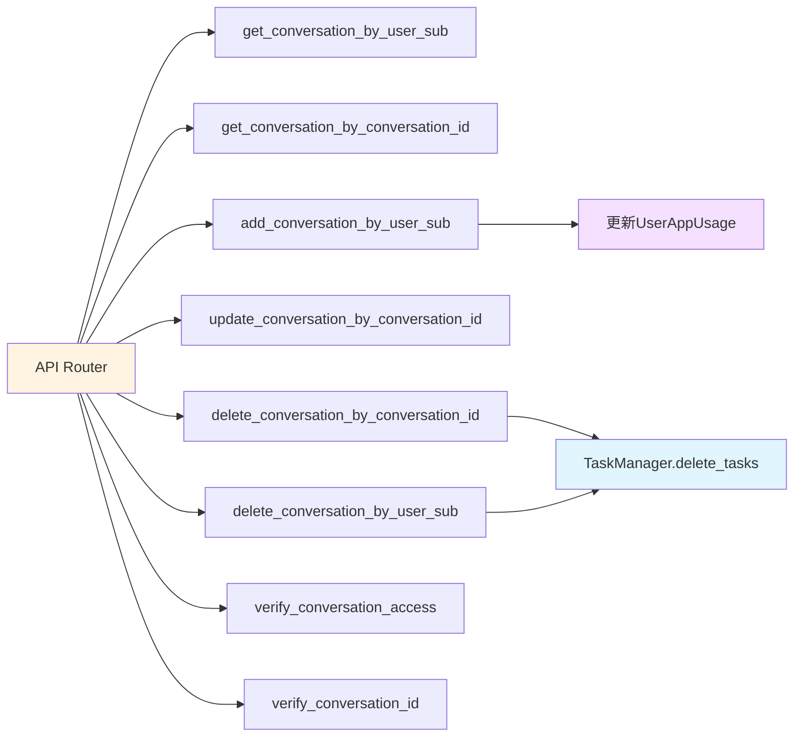

# Conversation 模块设计文档

## 1. 模块概述

Conversation 模块负责管理用户的对话会话，包括对话的创建、查询、更新、删除等核心功能。该模块由服务层（`services/conversation.py`）和路由层（`routers/conversation.py`）组成，提供完整的对话生命周期管理能力。

### 1.1 主要组件

- **ConversationManager**: 对话管理器，提供对话的底层数据操作
- **Router**: FastAPI 路由层，提供 RESTful API 接口

### 1.2 核心功能

- 获取用户对话列表
- 创建新对话
- 更新对话信息
- 删除对话及关联资源
- 对话权限验证
- App 使用统计

## 2. 模块架构

### 2.1 整体架构图



### 2.2 数据模型关系



## 3. 核心流程

### 3.1 获取对话列表流程



**流程说明：**

1. 客户端发起 GET 请求获取对话列表
2. 通过认证中间件验证用户身份
3. 从数据库查询用户的所有非临时对话
4. 按创建时间倒序排列
5. 为每个对话获取关联文档数量
6. 返回格式化的对话列表响应

### 3.2 创建对话流程



**流程说明：**

1. 创建 Conversation 对象并设置基本属性
2. 尝试保存到数据库
3. 如果非调试模式且提供了 app_id，则更新 App 使用统计
4. 如果 UserAppUsage 记录存在，增加计数器；否则创建新记录
5. 返回创建的对话对象

### 3.3 更新对话流程



**流程说明：**

1. 客户端发送更新请求，包含新的标题
2. 验证对话是否存在且属于当前用户
3. 如果验证失败，返回 400 错误
4. 如果验证通过，更新对话信息
5. 获取文档数量并返回完整的对话信息

### 3.4 删除对话流程



**流程说明：**

1. 客户端发送删除请求，包含要删除的对话ID列表
2. 遍历每个对话ID
3. 从数据库删除对话记录
4. 级联删除关联的任务（通过 TaskManager）
5. 级联删除关联的文档（通过 DocumentManager）
6. 返回成功删除的对话ID列表

### 3.5 对话权限验证流程



## 4. API 接口定义

### 4.1 获取对话列表

**接口:** `GET /api/conversation`

**认证:** 需要会话验证和个人令牌验证

**响应示例:**

```json
{
  "code": 200,
  "message": "success",
  "result": {
    "conversations": [
      {
        "conversationId": "uuid",
        "title": "对话标题",
        "docCount": 5,
        "createdTime": "2025-01-15 10:30:00",
        "appId": "uuid",
        "debug": false
      }
    ]
  }
}
```

### 4.2 更新对话

**接口:** `POST /api/conversation?conversationId={uuid}`

**请求体:**

```json
{
  "title": "新的对话标题"
}
```

**响应示例:**

```json
{
  "code": 200,
  "message": "success",
  "result": {
    "conversationId": "uuid",
    "title": "新的对话标题",
    "docCount": 5,
    "createdTime": "2025-01-15 10:30:00",
    "appId": "uuid",
    "debug": false
  }
}
```

### 4.3 删除对话

**接口:** `DELETE /api/conversation`

**请求体:**

```json
{
  "conversation_list": ["uuid1", "uuid2"]
}
```

**响应示例:**

```json
{
  "code": 200,
  "message": "success",
  "result": {
    "conversationIdList": ["uuid1", "uuid2"]
  }
}
```

## 5. ConversationManager 类方法

### 5.1 方法列表

| 方法名 | 功能描述 | 参数 | 返回值 |
|-------|---------|------|--------|
| `get_conversation_by_user_sub` | 获取用户的对话列表 | `user_sub: str` | `list[Conversation]` |
| `get_conversation_by_conversation_id` | 通过ID获取对话 | `user_sub: str, conversation_id: UUID` | `Conversation \| None` |
| `verify_conversation_access` | 验证对话访问权限 | `user_sub: str, conversation_id: UUID` | `bool` |
| `add_conversation_by_user_sub` | 创建新对话 | `title: str, user_sub: str, app_id: UUID, debug: bool` | `Conversation \| None` |
| `update_conversation_by_conversation_id` | 更新对话信息 | `user_sub: str, conversation_id: UUID, data: dict` | `bool` |
| `delete_conversation_by_conversation_id` | 删除指定对话 | `user_sub: str, conversation_id: UUID` | `None` |
| `delete_conversation_by_user_sub` | 删除用户所有对话 | `user_sub: str` | `None` |
| `verify_conversation_id` | 验证对话ID有效性 | `user_sub: str, conversation_id: UUID` | `bool` |

### 5.2 方法调用关系



## 6. 关键特性

### 6.1 权限控制

所有操作都基于 `user_sub` 进行权限验证，确保用户只能访问自己的对话：

```python
and_(
    Conversation.id == conversation_id,
    Conversation.userSub == user_sub,
)
```

### 6.2 临时对话（Debug 模式）

- 通过 `isTemporary` 字段标识调试对话
- 临时对话不会出现在对话列表中
- 临时对话不会更新 App 使用统计

### 6.3 级联删除

删除对话时，会自动删除关联资源：

- 通过 TaskManager 删除关联任务
- 通过 DocumentManager 删除关联文档

### 6.4 App 使用统计

创建非调试对话时，会自动维护 App 使用统计：

- 增加 `usageCount` 计数
- 更新 `lastUsed` 时间戳
- 如果记录不存在，则创建新记录

## 7. 错误处理

### 7.1 异常捕获

创建对话时使用 try-except 捕获异常：

```python
try:
    # 数据库操作
except Exception:
    logger.exception("[ConversationManager] 新建对话失败")
    return None
```

### 7.2 状态码定义

| 状态码 | 场景 | 说明 |
|-------|------|------|
| 200 | 成功 | 操作成功完成 |
| 400 | 客户端错误 | 对话不存在或无权限 |
| 500 | 服务器错误 | 数据库操作失败 |
