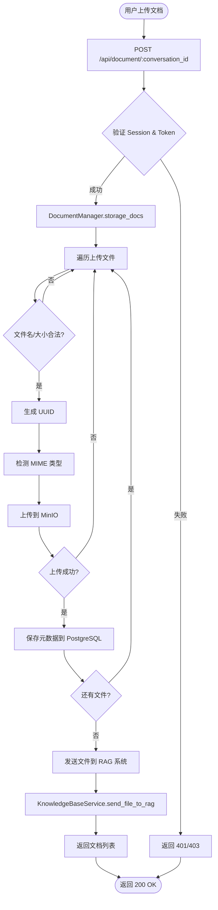
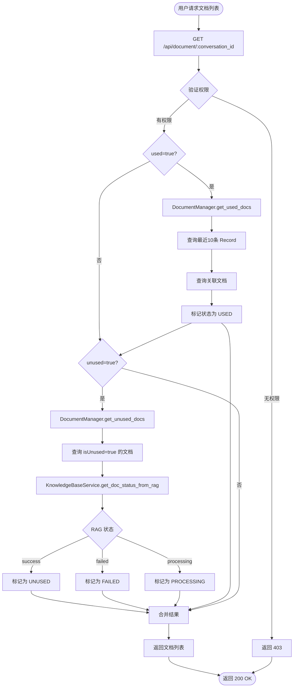
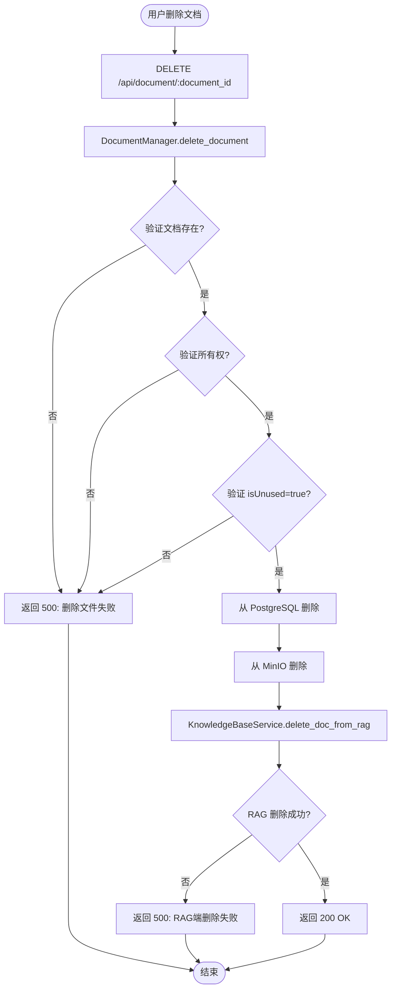
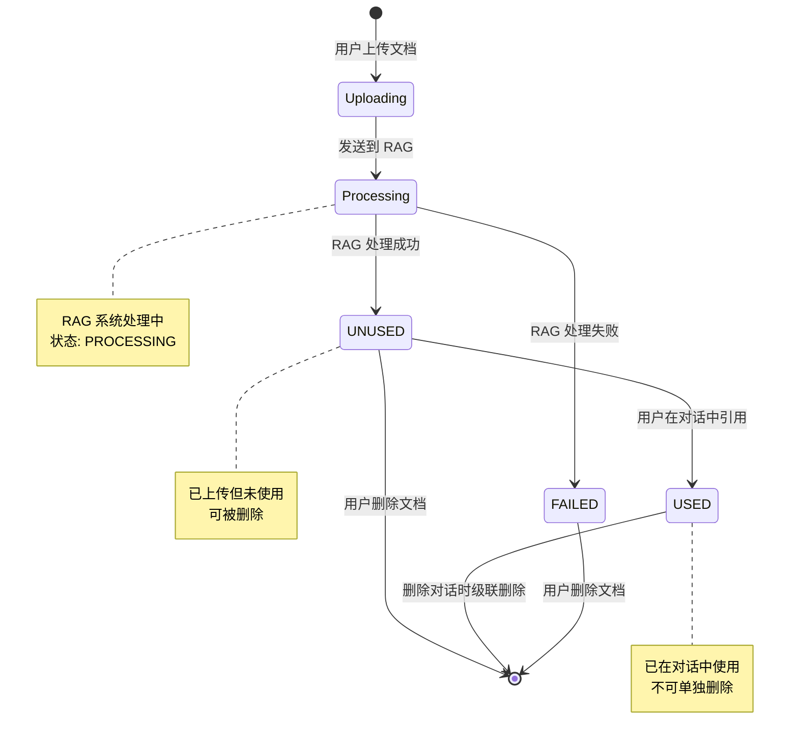
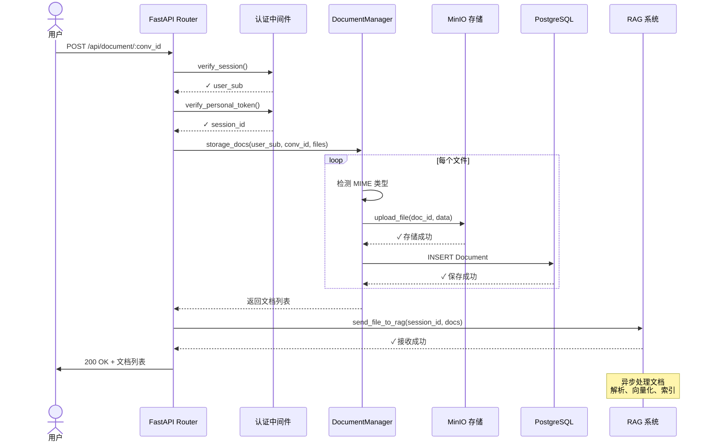
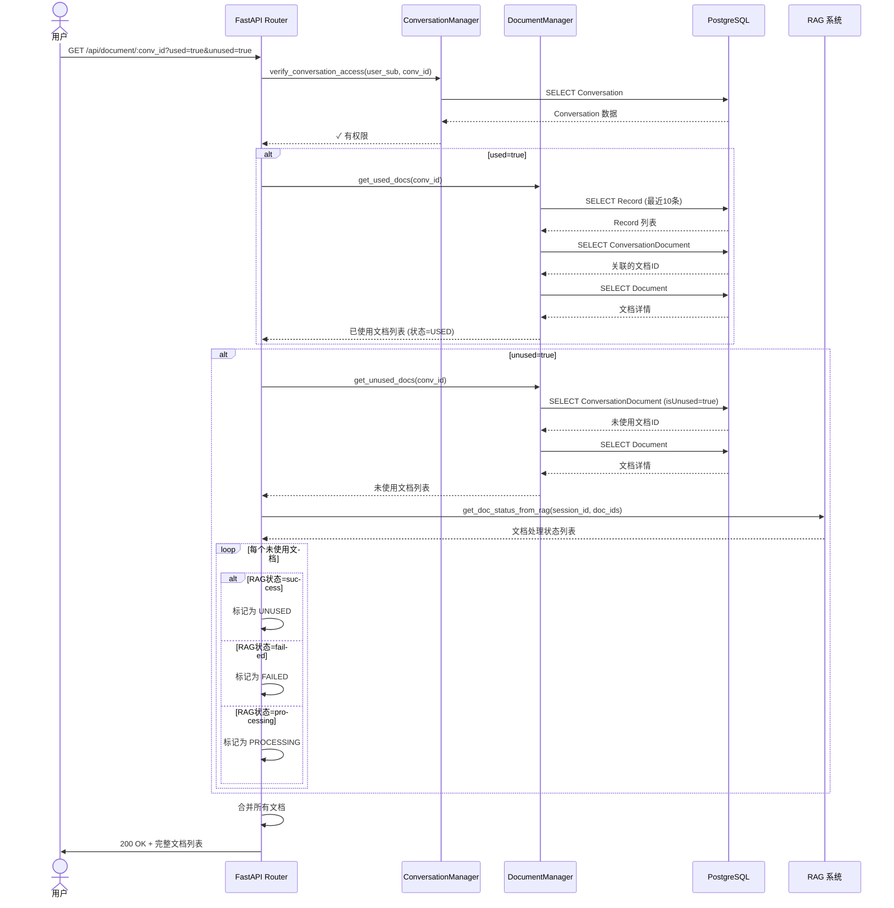
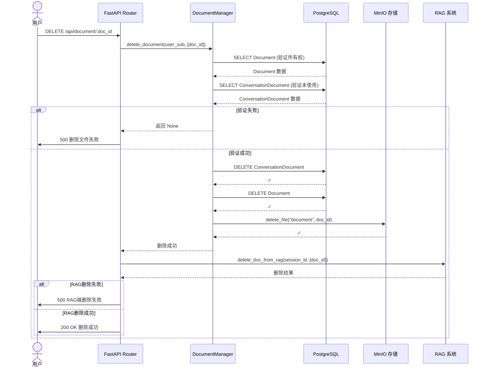
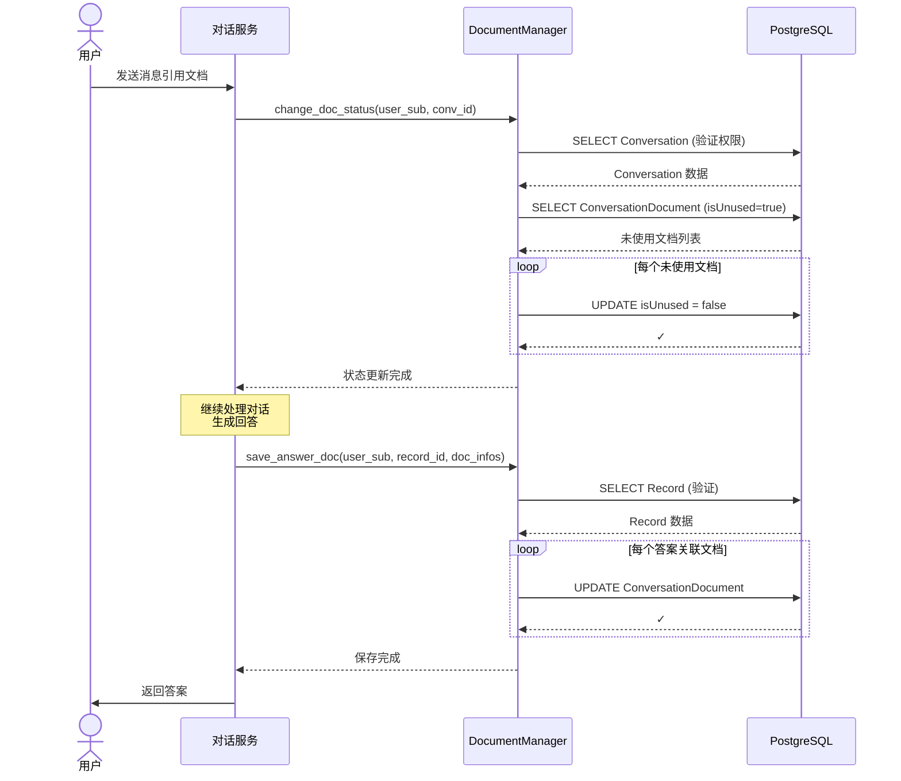
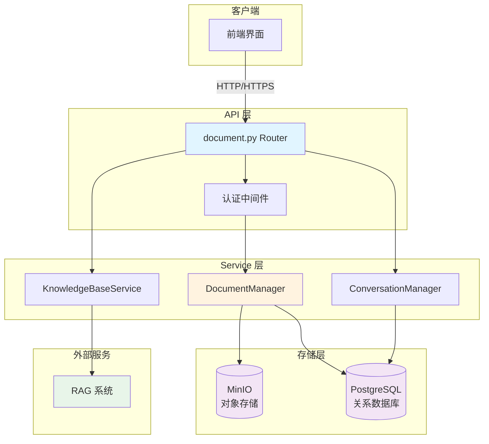
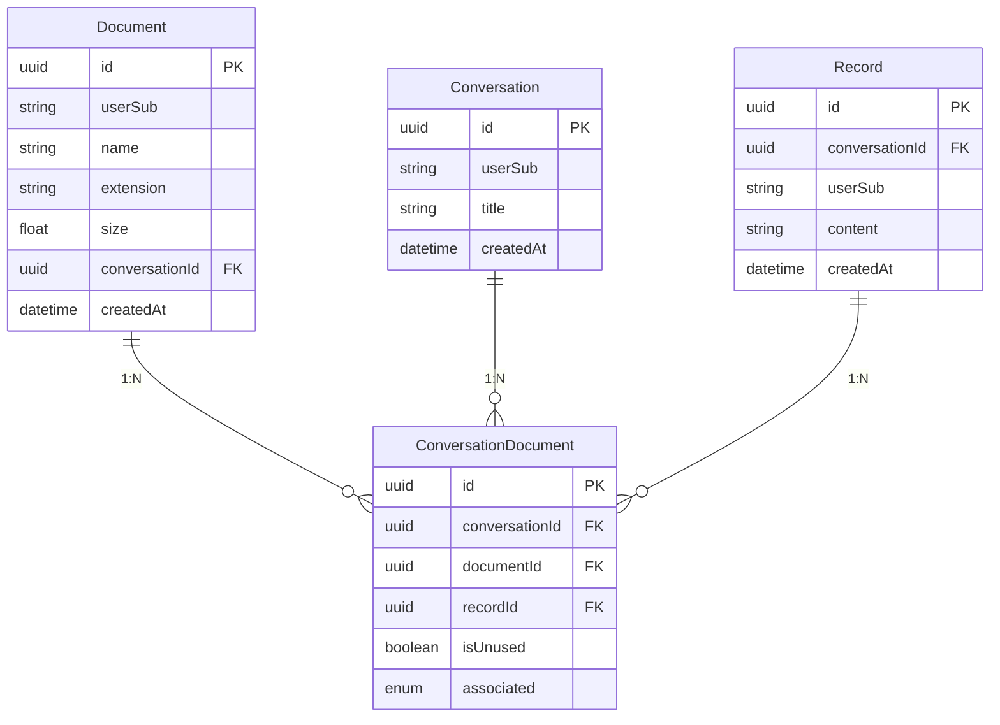

# Document 文档管理模块

## 1. 模块概述

Document 模块负责处理文档上传、存储、检索和删除等核心功能。该模块分为两层：

- **Router 层** (`apps/routers/document.py`): 提供 RESTful API 接口
- **Service 层** (`apps/services/document.py`): 提供文档管理的核心业务逻辑

### 1.1 核心功能

1. 文档上传到指定对话
2. 查询对话的文档列表（已使用/未使用）
3. 删除单个文档
4. 文档状态管理（unused -> used）
5. 与 RAG 系统集成

### 1.2 技术架构

- **存储**: MinIO (对象存储) + PostgreSQL (元数据)
- **文件类型检测**: python-magic
- **异步处理**: asyncio + asyncer
- **API 框架**: FastAPI

## 2. 数据模型

### 2.1 Document (文档实体)

```python
{
    "id": "uuid",
    "userSub": "string",          # 用户标识
    "name": "string",             # 文件名
    "extension": "string",        # MIME 类型
    "size": "float",              # 文件大小 (KB)
    "conversationId": "uuid",     # 所属对话ID
    "createdAt": "datetime"       # 创建时间
}
```

### 2.2 ConversationDocument (对话-文档关联)

```python
{
    "id": "uuid",
    "conversationId": "uuid",     # 对话ID
    "documentId": "uuid",         # 文档ID
    "recordId": "uuid",           # 关联的记录ID
    "isUnused": "boolean",        # 是否未使用
    "associated": "enum"          # 关联类型: QUESTION/ANSWER
}
```

## 3. API 接口文档

### 3.1 上传文档

**接口**: `POST /api/document/{conversation_id}`

**功能**: 上传一个或多个文档到指定对话

**请求参数**:

- Path: `conversation_id` (UUID) - 对话ID
- Body: `multipart/form-data`
  - `documents`: 文件列表

**请求示例**:

```http
POST /api/document/550e8400-e29b-41d4-a716-446655440000
Content-Type: multipart/form-data

--boundary
Content-Disposition: form-data; name="documents"; filename="example.pdf"
Content-Type: application/pdf

[binary data]
--boundary--
```

**响应示例** (成功):

```json
{
    "code": 200,
    "message": "上传成功",
    "result": {
        "documents": [
            {
                "id": "123e4567-e89b-12d3-a456-426614174000",
                "name": "example.pdf",
                "type": "application/pdf",
                "size": 2048.5
            }
        ]
    }
}
```

**响应 Schema**:

```python
UploadDocumentRsp:
  - code: int
  - message: str
  - result: UploadDocumentMsg
    - documents: list[BaseDocumentItem]
      - id: UUID
      - name: str
      - type: str
      - size: float
```

### 3.2 获取文档列表

**接口**: `GET /api/document/{conversation_id}`

**功能**: 获取指定对话的文档列表

**请求参数**:

- Path: `conversation_id` (UUID) - 对话ID
- Query:
  - `used` (boolean, default=False) - 是否包含已使用文档
  - `unused` (boolean, default=True) - 是否包含未使用文档

**请求示例**:

```http
GET /api/document/550e8400-e29b-41d4-a716-446655440000?used=true
```

**响应示例** (成功):

```json
{
    "code": 200,
    "message": "获取成功",
    "result": {
        "documents": [
            {
                "id": "123e4567-e89b-12d3-a456-426614174000",
                "name": "example.pdf",
                "type": "application/pdf",
                "size": 2048.5,
                "status": "USED",
                "created_at": "2025-01-15T10:30:00Z"
            }
        ]
    }
}
```

**响应示例** (无权限):

```json
{
    "code": 403,
    "message": "无权限访问",
    "result": {}
}
```

**文档状态说明**:

- `USED`: 已在对话中使用
- `UNUSED`: 已上传但未使用（RAG 处理成功）
- `PROCESSING`: RAG 正在处理中
- `FAILED`: RAG 处理失败

**响应 Schema**:

```python
ConversationDocumentRsp:
  - code: int
  - message: str
  - result: ConversationDocumentMsg
    - documents: list[ConversationDocumentItem]
      - id: UUID
      - name: str
      - type: str
      - size: float
      - status: DocumentStatus
      - created_at: datetime
```

### 3.3 删除文档

**接口**: `DELETE /api/document/{document_id}`

**功能**: 删除单个未使用的文档

**请求参数**:

- Path: `document_id` (string) - 文档ID

**请求示例**:

```http
DELETE /api/document/123e4567-e89b-12d3-a456-426614174000
```

**响应示例** (成功):

```json
{
    "code": 200,
    "message": "删除成功",
    "result": {}
}
```

**响应示例** (Framework侧删除失败):

```json
{
    "code": 500,
    "message": "删除文件失败",
    "result": {}
}
```

**响应示例** (RAG侧删除失败):

```json
{
    "code": 500,
    "message": "RAG端删除文件失败",
    "result": {}
}
```

**注意**: 只能删除 `isUnused=True` 的文档，已使用的文档无法删除。

## 4. DocumentManager 核心方法

### 4.1 storage_docs

**功能**: 存储多个文档到 MinIO 和数据库

**输入参数**:

- 用户标识符
- 对话ID
- 待上传文件列表

**返回值**: 成功上传的文档信息列表

**处理流程**:

1. 遍历每个上传文件
2. 使用 python-magic 检测文件 MIME 类型
3. 上传到 MinIO 对象存储（bucket名称为"document"）
4. 保存文档元数据到 PostgreSQL 数据库
5. 返回成功上传的文档列表

**MinIO 存储配置**:

- 存储桶名称: document
- 对象名称: 文档的UUID
- 分块大小: 10MB
- 元数据: 使用Base64编码存储文件名

### 4.2 get_unused_docs

**功能**: 获取对话中未使用的文档

**输入参数**: 对话ID

**返回值**: 未使用的文档列表

**查询逻辑**:

从 ConversationDocument 表中查询标记为"未使用"的记录，
然后根据文档ID从 Document 表获取完整的文档信息。

### 4.3 get_used_docs

**功能**: 获取对话中最近 N 次问答使用的文档

**输入参数**:

- 对话ID
- 记录数量（可选，默认10条）
- 文档类型（可选，可筛选"问题"或"答案"关联的文档）

**返回值**: 已使用的文档列表

**查询逻辑**:

1. 查询该对话最近 N 条对话记录
2. 查询这些记录关联的所有文档ID
3. 从 Document 表获取文档详情并去重返回

### 4.4 delete_document

**功能**: 删除未使用的文档

**输入参数**:

- 用户标识符
- 待删除文档ID列表

**返回值**: 无

**删除步骤**:

1. 验证文档所有权（检查文档是否属于当前用户）
2. 验证文档未使用状态（只能删除未使用的文档）
3. 从 PostgreSQL 数据库删除文档记录
4. 从 MinIO 对象存储删除文件数据

**安全机制**:

- 权限控制: 只能删除自己上传的文档
- 状态保护: 只能删除未使用的文档，已使用的文档不可删除

### 4.5 change_doc_status

**功能**: 将文档状态从"未使用"改为"已使用"

**输入参数**:

- 用户标识符
- 对话ID

**返回值**: 无

**使用场景**:

当用户在对话中发送消息并引用已上传的文档时，
系统调用此方法将对话中的所有未使用文档标记为已使用状态。

**处理逻辑**:

查询该对话下所有标记为"未使用"的文档，
将它们的状态批量更新为"已使用"。

### 4.6 save_answer_doc

**功能**: 保存与答案关联的文档

**输入参数**:

- 用户标识符
- 对话记录ID
- 文档关联信息列表

**返回值**: 无

**处理逻辑**:

1. 验证对话记录存在且属于当前用户
2. 更新文档关联表（ConversationDocument），设置：
   - 文档状态为"已使用"
   - 关联类型为"答案"
   - 关联的记录ID

**使用场景**:

当AI生成答案时，如果答案中引用或生成了文档，
系统调用此方法将这些文档与答案记录关联起来。

## 5. 流程图

### 5.1 文档上传流程



### 5.2 文档列表查询流程



### 5.3 文档删除流程



### 5.4 文档状态转换流程



## 6. 时序图

### 6.1 文档上传完整时序



### 6.2 文档列表查询时序



### 6.3 文档删除时序



### 6.4 文档状态变更时序



## 7. 架构图

### 7.1 整体架构



### 7.2 数据库关系图



## 8. 错误处理

### 8.1 常见错误码

| 错误码 | 说明 | 处理建议 |
|--------|------|----------|
| 400 | 请求参数错误 | 检查请求格式和参数 |
| 401 | 未认证 | 检查 Session Token |
| 403 | 无权限访问 | 验证对话所有权 |
| 404 | 资源不存在 | 确认文档/对话ID正确 |
| 500 | 服务器内部错误 | 查看日志，联系管理员 |

### 8.2 异常处理机制

**文档上传异常处理**:

在上传多个文档时，如果某个文档上传失败，系统会跳过该文档继续处理其他文档，
并记录详细错误日志。最终只返回成功上传的文档列表。

**特点**:

- 部分失败不影响整体流程
- 只返回成功上传的文档
- 详细错误日志便于排查

## 9. 集成说明

### 9.1 与 RAG 系统集成

**文档上传后发送到 RAG**:

调用 KnowledgeBaseService.send_file_to_rag 方法，
将文档发送到 RAG 系统进行异步处理（解析、向量化、索引）。

**查询文档处理状态**:

调用 KnowledgeBaseService.get_doc_status_from_rag 方法，
获取文档在 RAG 系统中的处理状态。

**从 RAG 删除文档**:

调用 KnowledgeBaseService.delete_doc_from_rag 方法，
从 RAG 系统中删除文档的索引数据。

### 9.2 RAG 状态映射

| RAG 状态 | Framework 状态 | 说明 |
|----------|----------------|------|
| success | UNUSED | 文档已解析，可供检索 |
| failed | FAILED | 文档解析失败 |
| processing | PROCESSING | 文档处理中 |
| - | USED | 已在对话中引用 |

## 10. 配置参数

### 10.1 MinIO 配置

- **BUCKET_NAME**: "document"
- **PART_SIZE**: 10MB (10 \* 1024 \* 1024 字节)

### 10.2 查询配置

- **DEFAULT_RECORD_NUM**: 10 (获取最近10条记录的文档)

### 10.3 文件名编码

使用 Base64 编码存储文件名，避免特殊字符导致的问题。
