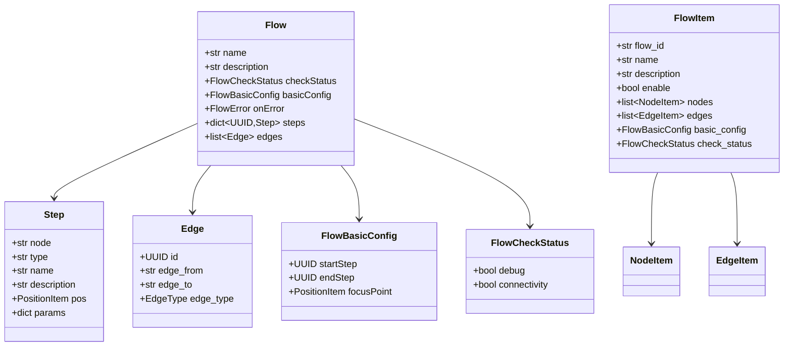
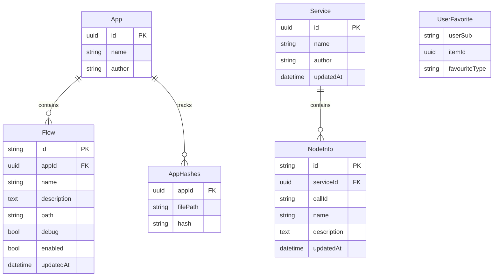
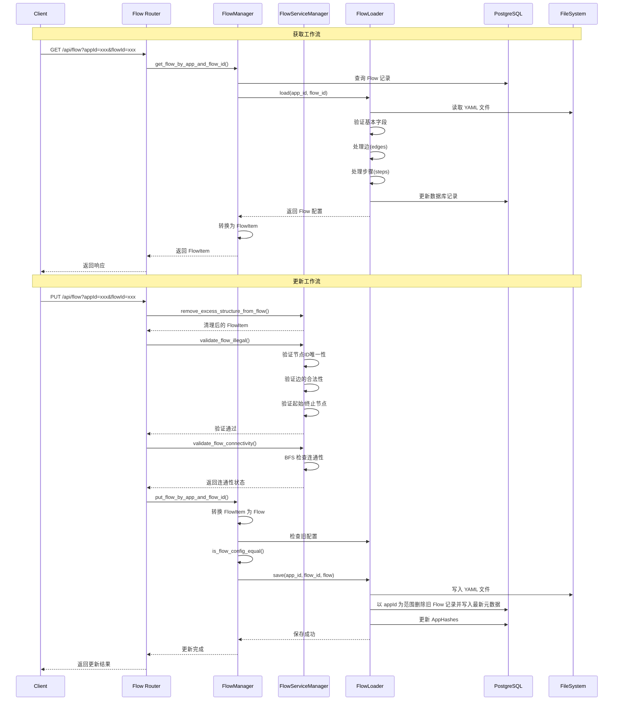
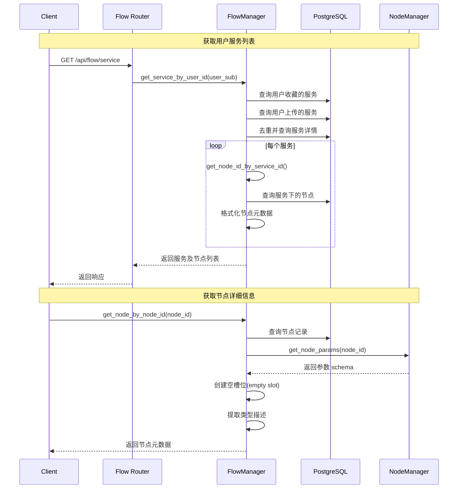
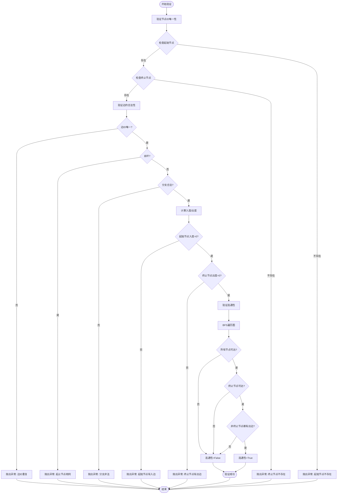
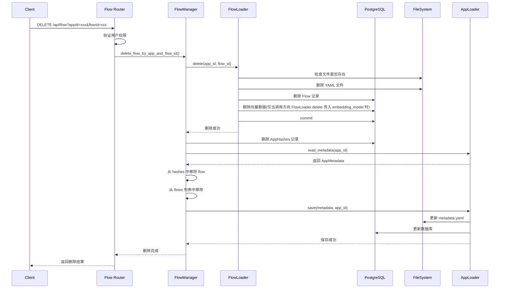
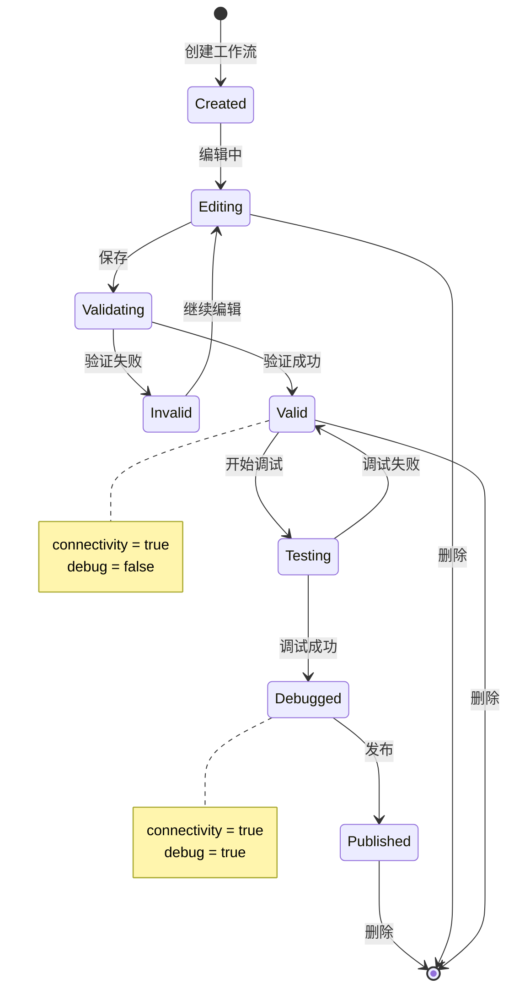
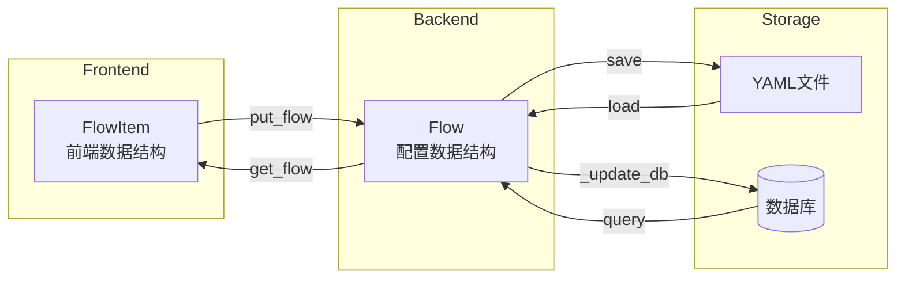
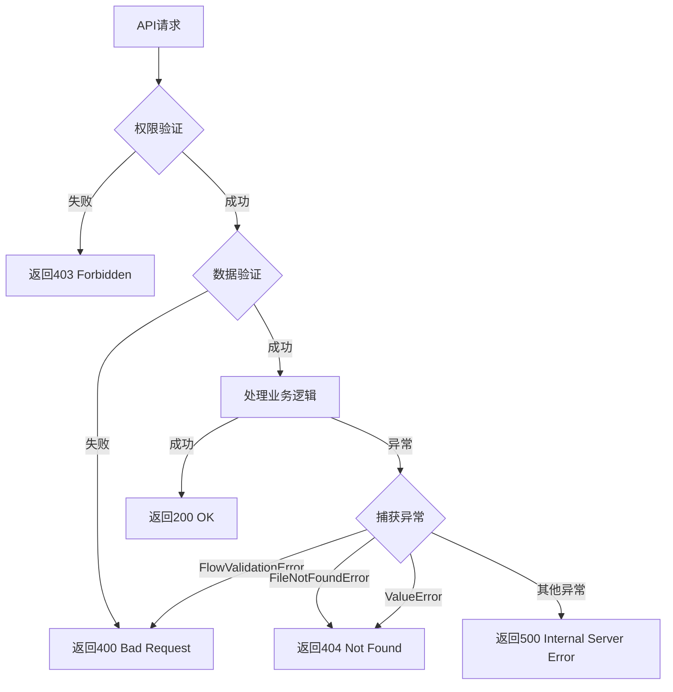
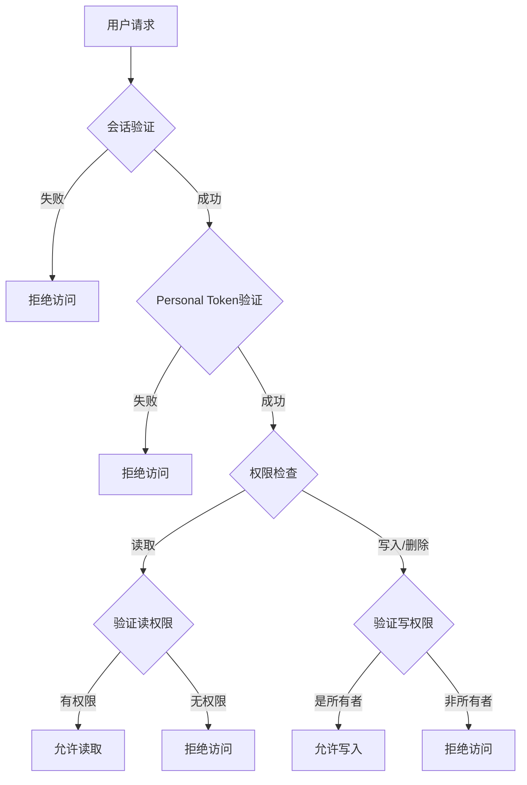

# FlowManager 模块设计文档

## 1. 概述

FlowManager 模块是 openEuler Intelligence 框架中负责工作流（Flow）管理的核心模块。当前实现重点覆盖已有 Flow 的读取、更新、删除，以及节点元数据管理、服务管理等功能（独立的“新建 Flow”流程尚未单独提供专用接口）。

### 1.1 核心组件

- **FlowManager**: 工作流管理的主要服务类，提供工作流和节点的 CRUD 操作
- **FlowServiceManager**: 工作流拓扑验证和处理服务
- **FlowLoader**: 工作流配置文件的加载和保存
- **Flow API Router**: FastAPI 路由层，提供 RESTful API 接口

## 2. 数据模型

### 2.1 核心数据结构



### 2.2 数据库模型



## 3. 核心功能

### 3.1 工作流管理流程



Note: 上述流程不会自动触发向量索引同步，如需同步需在业务层额外调用 `_update_vector` 或传入 embedding 模型。

### 3.2 节点和服务管理流程



### 3.3 工作流验证流程



### 3.4 工作流删除流程



## 4. API 接口

### 4.1 接口列表

| 方法 | 路径 | 功能 | 认证 |
|------|------|------|------|
| GET | `/api/flow/service` | 获取用户可访问的服务及节点列表 | 需要 |
| GET | `/api/flow` | 获取指定工作流的拓扑结构 | 需要 |
| PUT | `/api/flow` | 更新工作流拓扑结构 | 需要 |
| DELETE | `/api/flow` | 删除工作流 | 需要 |

### 4.2 接口详情

#### 4.2.1 获取服务列表

**HTTP 请求：**

```http
GET /api/flow/service
Authorization: Bearer <token>
```

**返回示例：**

```json
{
  "code": 200,
  "message": "Node所在Service获取成功",
  "result": {
    "services": [
      {
        "serviceId": "00000000-0000-0000-0000-000000000000",
        "name": "系统",
        "data": [
          {
            "nodeId": "start",
            "callId": "Start",
            "name": "开始",
            "updatedAt": 1234567890.123
          }
        ],
        "createdAt": null
      }
    ]
  }
}
```

#### 4.2.2 获取工作流

**HTTP 请求：**

```http
GET /api/flow?appId={uuid}&flowId={string}
Authorization: Bearer <token>
```

**返回示例：**

```json
{
  "code": 200,
  "message": "应用的Workflow获取成功",
  "result": {
    "flow": {
      "flowId": "main",
      "name": "主工作流",
      "description": "这是一个示例工作流",
      "enable": true,
      "nodes": [...],
      "edges": [...],
      "basicConfig": {
        "startStep": "uuid",
        "endStep": "uuid",
        "focusPoint": {"x": 0, "y": 0}
      },
      "checkStatus": {
        "debug": false,
        "connectivity": true
      }
    }
  }
}
```

#### 4.2.3 更新工作流

**HTTP 请求：**

```http
PUT /api/flow?appId={uuid}&flowId={string}
Authorization: Bearer <token>
Content-Type: application/json

{
  "flow": {
    "flowId": "main",
    "name": "主工作流",
    "nodes": [...],
    "edges": [...],
    "basicConfig": {...}
  }
}
```

**返回示例：**

```json
{
  "code": 200,
  "message": "应用下流更新成功",
  "result": {
    "flow": {...}
  }
}
```

#### 4.2.4 删除工作流

**HTTP 请求：**

```http
DELETE /api/flow?appId={uuid}&flowId={string}
Authorization: Bearer <token>
```

**返回示例：**

```json
{
  "code": 200,
  "message": "应用下流程删除成功",
  "result": {
    "flowId": "main"
  }
}
```

## 5. 核心类详解

### 5.1 FlowManager

位置：`apps/services/flow.py`

**主要方法：**

| 方法 | 功能 | 参数 | 返回值 |
|------|------|------|--------|
| `get_flows_by_app_id` | 获取应用的所有工作流 | `app_id: UUID` | `list[FlowInfo]` |
| `get_node_id_by_service_id` | 获取服务下的节点列表 | `service_id: UUID` | `list[NodeMetaDataBase]` |
| `get_service_by_user_id` | 获取用户的服务列表 | `user_sub: str` | `list[NodeServiceItem]` |
| `get_node_by_node_id` | 获取节点详细信息 | `node_id: str` | `NodeMetaDataItem` |
| `get_flow_by_app_and_flow_id` | 获取工作流详情 | `app_id: UUID, flow_id: str` | `FlowItem` |
| `put_flow_by_app_and_flow_id` | 保存/更新工作流 | `app_id: UUID, flow_id: str, flow_item: FlowItem` | `None` |
| `delete_flow_by_app_and_flow_id` | 删除工作流 | `app_id: UUID, flow_id: str` | `None` |
| `update_flow_debug_by_app_and_flow_id` | 更新调试状态 | `app_id: UUID, flow_id: str, debug: bool` | `bool` |
| `is_flow_config_equal` | 比较两个工作流配置是否相等 | `flow_config_1: Flow, flow_config_2: Flow` | `bool` |

### 5.2 FlowServiceManager

位置：`apps/services/flow_service.py`

**主要方法：**

| 方法 | 功能 | 异常 |
|------|------|------|
| `remove_excess_structure_from_flow` | 移除工作流中的多余结构（无效边） | `FlowBranchValidationError` |
| `validate_flow_illegal` | 验证工作流是否合法 | `FlowNodeValidationError`, `FlowEdgeValidationError` |
| `validate_flow_connectivity` | 验证工作流连通性（BFS） | - |
| `_validate_node_ids` | 验证节点ID唯一性 | `FlowNodeValidationError` |
| `_validate_edges` | 验证边的合法性 | `FlowEdgeValidationError` |
| `_validate_node_degrees` | 验证起始/终止节点的度数 | `FlowNodeValidationError` |

### 5.3 FlowLoader

位置：`apps/scheduler/pool/loader/flow.py`

**主要方法：**

| 方法 | 功能 | 异常 |
|------|------|------|
| `load` | 从文件系统加载工作流，并刷新数据库中的基本元数据 | `FileNotFoundError`, `RuntimeError` |
| `save` | 保存工作流到文件系统，并在数据库中以“先删后插”方式写入最新元数据 | - |
| `delete` | 删除工作流文件和数据库记录（不传 embedding_model 时不会触发向量清理） | - |
| `_load_yaml_file` | 加载YAML文件 | - |
| `_validate_basic_fields` | 验证基本字段 | - |
| `_process_edges` | 将 YAML 的 `from/to/type` 转换为内部字段，分支通过 `stepId.branchId` 字符串表示 | - |
| `_process_steps` | 处理步骤的类型和文档信息 | `ValueError` |
| `_update_db` | 同步 FlowInfo 和 AppHashes（覆盖同一 appId 的旧记录） | - |
| `_update_vector` | 预留的向量更新方法（当前调用路径未触发） | - |

> **实现提示**
>
> - FlowLoader 的 `save`/`load` 都会调用 `_update_db`，该方法会删除同一 `appId` 下的旧 `FlowInfo` 记录后再写入新记录，调用侧需要在保存多个 Flow 时显式传入完整集合。
> - 向量数据的增量更新需要外部显式调用 `_update_vector` 或在删除时传入 embedding 模型；默认调用路径不会同步向量索引。

## 6. 状态管理

### 6.1 工作流状态



### 6.2 工作流检查状态

- **debug**：是否经过调试（当工作流内容修改后会重置为 false）
- **connectivity**：图的连通性检查
  - 起始节点到终止节点是否联通
  - 除终止节点外所有节点是否都有出边
  - 所有节点是否都可从起始节点到达

## 7. 数据转换

### 7.1 FlowItem 与 Flow 转换



**转换关键点：**

1. **NodeItem → Step**
   - `step_id` 作为字典 key
   - `node_id` 映射到 `node`
   - `call_id` 映射到 `type`
   - `parameters["input_parameters"]` 映射到 `params`

2. **EdgeItem → Edge**
   - `source_branch` + `branch_id` 组合成 `edge_from`（用 "." 连接）
   - `target_branch` 映射到 `edge_to`
   - `type` 转换为 `EdgeType` 枚举

3. **边格式处理**
   - 存储：`edge_from = "step_id.branch_id"`（有分支时）
   - 存储：`edge_from = "step_id"`（无分支时）
   - 解析：按 "." 分割，长度为 2 表示有分支

## 8. 异常处理

### 8.1 异常类型

| 异常类 | 触发条件 | 处理方式 |
|--------|----------|----------|
| `FlowNodeValidationError` | 节点ID重复、起始/终止节点不存在、度数错误 | 返回400错误 |
| `FlowEdgeValidationError` | 边ID重复、自环、分支非法 | 返回400错误 |
| `FlowBranchValidationError` | 分支字段缺失/为空、分支重复、非法字符 | 返回400错误 |
| `ValueError` | 应用不存在、工作流不存在、配置错误 | 返回404/500错误 |
| `FileNotFoundError` | 工作流文件不存在 | 返回404错误 |
| `RuntimeError` | YAML文件格式错误 | 返回500错误 |

### 8.2 错误处理流程



## 9. 性能优化

### 9.1 并发处理

- 使用 `async/await` 异步处理
- 数据库查询使用连接池
- 文件I/O使用 `aiofiles` 异步操作

### 9.2 数据库优化

- 创建复合索引: `idx_app_id_id`, `idx_app_id_name`
- 批量查询减少数据库往返
- 使用 `select().where().order_by()` 优化查询

### 9.3 缓存策略

- FlowLoader 通过 Pool 单例复用
- 节点参数 schema 可缓存
- 向量化数据独立存储和更新

## 10. 安全性

### 10.1 访问控制



### 10.2 数据验证

- 输入参数使用 Pydantic 模型验证
- 分支ID禁止包含"."等非法字符
- 节点/边ID唯一性检查
- YAML文件格式验证

### 10.3 文件安全

- 文件路径使用 `anyio.Path` 安全处理
- 限制文件访问在 `data_dir` 范围内
- 文件hash值校验（AppHashes表）

## 11. 扩展性

### 11.1 支持的节点类型

- **START**: 起始节点
- **END**: 终止节点
- **CHOICE**: 分支节点（多出边）
- **Empty**: 空节点（工具被删除时的占位符）
- **自定义节点**: 通过Service和NodeInfo扩展

### 11.2 支持的边类型

- **NORMAL**: 普通边
- **其他自定义类型**: 通过 `EdgeType` 枚举扩展

### 11.3 插件机制

- 通过 `Pool().get_call()` 动态加载节点实现
- Service机制支持用户自定义服务
- 节点参数schema动态生成

## 12. 配置示例

### 12.1 YAML配置文件示例

```yaml
name: 示例工作流
description: 这是一个示例工作流配置
checkStatus:
  debug: false
  connectivity: true
basicConfig:
  startStep: a1b2c3d4-e5f6-7890-abcd-ef1234567890
  endStep: f1e2d3c4-b5a6-7890-dcba-fe0987654321
  focusPoint:
    x: 0.0
    y: 0.0
onError:
  use_llm: true
steps:
  a1b2c3d4-e5f6-7890-abcd-ef1234567890:
    type: Start
    node: start
    name: 开始
    description: 工作流起始节点
    pos:
      x: 100.0
      y: 100.0
    params: {}
  b2c3d4e5-f6a7-8901-bcde-f12345678901:
    type: ApiCall
    node: api_node_123
    name: API调用
    description: 调用外部API
    pos:
      x: 300.0
      y: 100.0
    params:
      url: https://api.example.com
      method: GET
  f1e2d3c4-b5a6-7890-dcba-fe0987654321:
    type: End
    node: end
    name: 结束
    description: 工作流结束节点
    pos:
      x: 500.0
      y: 100.0
    params: {}
edges:
  - id: edge001
    edge_from: a1b2c3d4-e5f6-7890-abcd-ef1234567890
    edge_to: b2c3d4e5-f6a7-8901-bcde-f12345678901
    edge_type: NORMAL
  - id: edge002
    edge_from: b2c3d4e5-f6a7-8901-bcde-f12345678901
    edge_to: f1e2d3c4-b5a6-7890-dcba-fe0987654321
    edge_type: NORMAL
```

## 13. 文件存储结构

```text
data_dir/
└── semantics/
    └── app/
        └── {app_id}/
            ├── metadata.yaml         # 应用元数据
            └── flow/
                ├── main.yaml         # 主工作流
                ├── {flow_id}.yaml    # 其他工作流
                └── ...
```

## 14. 总结

FlowManager 模块提供了完整的工作流管理功能，具有以下特点:

✅ **完整的CRUD操作**: 支持工作流的创建、读取、更新、删除
✅ **严格的数据验证**: 多层验证确保工作流配置正确性
✅ **连通性检查**: BFS算法验证图的连通性
✅ **权限控制**: 完善的用户权限和访问控制
✅ **异步处理**: 高性能的异步I/O操作
✅ **扩展性强**: 支持自定义节点和边类型
✅ **数据一致性**: 数据库与文件系统双重存储保证一致性

该模块是 openEuler Intelligence 框架工作流引擎的核心组件，为上层应用提供了稳定可靠的工作流管理服务。
