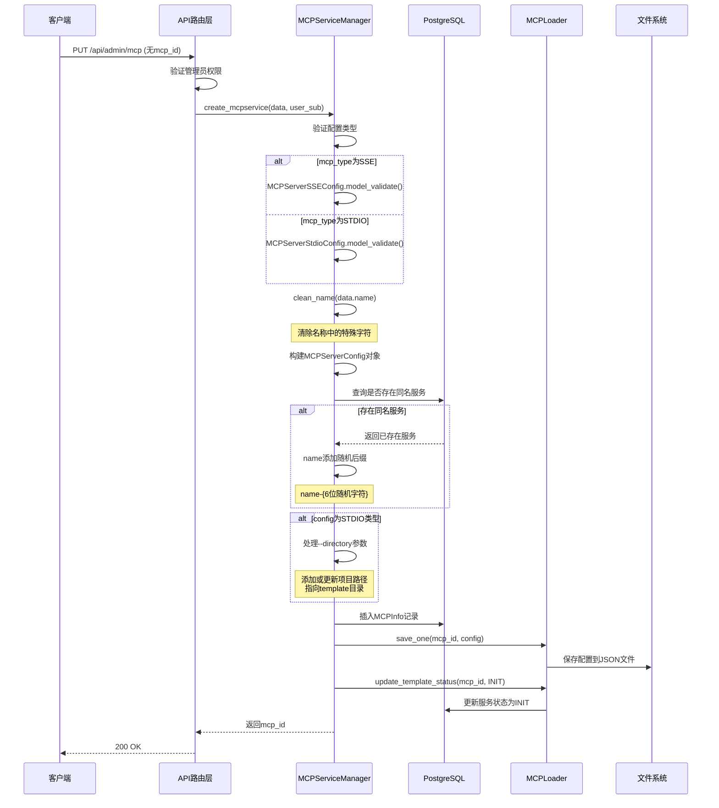
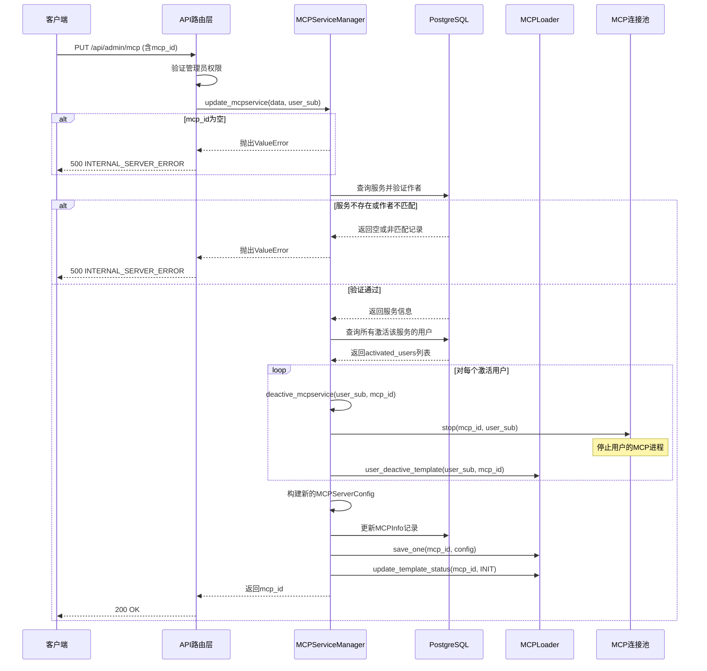
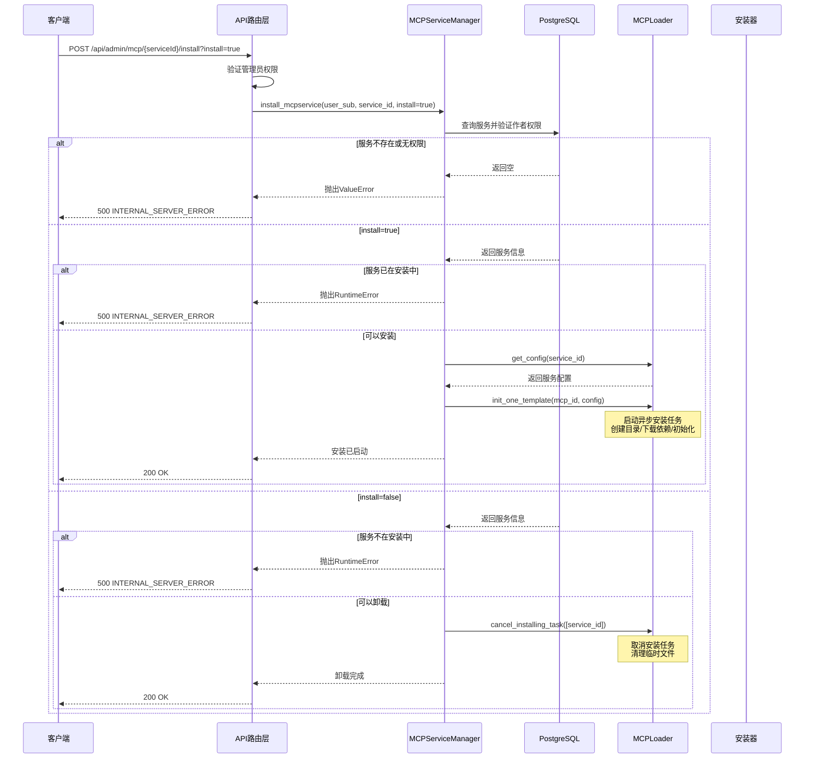
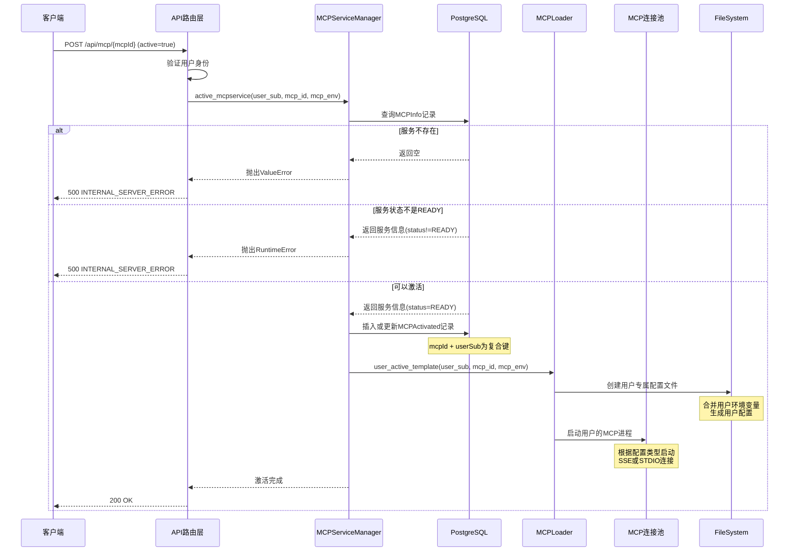
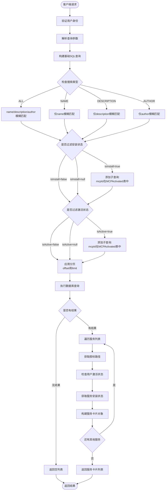
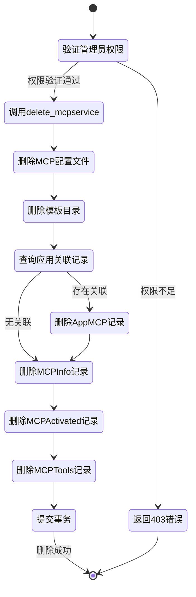
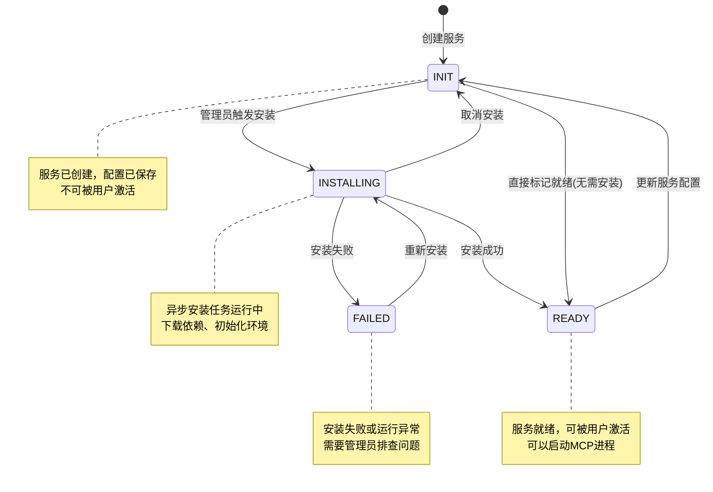
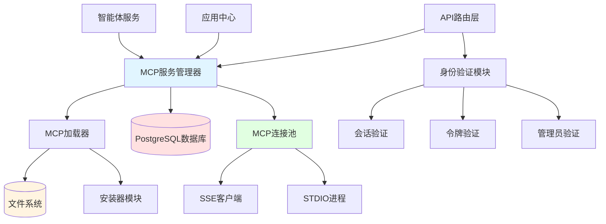

# MCP服务管理模块文档

## 模块概述

MCP服务管理模块负责管理系统中的MCP（Model Context Protocol）服务生命周期，
包括服务的创建、更新、查询、删除、安装、激活等核心功能。该模块支持两种MCP服务类型：
SSE（Server-Sent Events）和STDIO（标准输入输出），
并提供了完善的服务状态管理机制。

### 核心职责

- **服务管理**：提供MCP服务的CRUD操作，支持SSE和STDIO两种通信类型
- **权限控制**：实现基于作者身份和管理员权限的访问控制机制
- **服务检索**：支持按关键字、名称、描述、作者等条件筛选服务
- **状态追踪**：管理服务的安装、激活状态，确保服务正确运行
- **工具管理**：维护MCP服务提供的工具列表，支持工具查询和更新

---

## 数据结构

### 服务卡片数据

用于服务列表展示的卡片信息：

```json
{
  "mcpserviceId": "filesystem-service",
  "icon": "/static/mcp/filesystem-service.png",
  "name": "文件系统服务",
  "description": "提供文件读写和目录操作能力",
  "author": "admin@example.com",
  "isActive": true,
  "status": "ready"
}
```

### 服务详细信息（查看模式）

普通用户查看服务详情：

```json
{
  "serviceId": "filesystem-service",
  "icon": "/static/mcp/filesystem-service.png",
  "name": "文件系统服务",
  "description": "提供文件读写和目录操作能力",
  "overview": "这是一个功能强大的文件系统服务，支持常见的文件操作，包括读取、写入、删除和目录管理。",
  "status": "ready",
  "tools": [
    {
      "id": "tool-001",
      "mcpId": "filesystem-service",
      "name": "read_file",
      "description": "读取指定路径的文件内容",
      "inputSchema": {
        "type": "object",
        "properties": {
          "path": {
            "type": "string",
            "description": "文件路径"
          }
        },
        "required": ["path"]
      }
    },
    {
      "id": "tool-002",
      "mcpId": "filesystem-service",
      "name": "write_file",
      "description": "写入内容到指定文件",
      "inputSchema": {
        "type": "object",
        "properties": {
          "path": {
            "type": "string",
            "description": "文件路径"
          },
          "content": {
            "type": "string",
            "description": "文件内容"
          }
        },
        "required": ["path", "content"]
      }
    }
  ]
}
```

### 服务配置信息（编辑模式）

管理员编辑服务配置：

```json
{
  "serviceId": "database-connector",
  "icon": "/static/mcp/database-connector.png",
  "name": "数据库连接器",
  "description": "提供数据库查询和操作能力",
  "overview": "支持MySQL、PostgreSQL等主流数据库的连接和查询",
  "mcpType": "sse",
  "data": {
    "database-connector": {
      "url": "http://localhost:8080/sse",
      "env": {
        "DB_HOST": "localhost",
        "DB_PORT": "5432"
      }
    }
  }
}
```

### STDIO类型服务配置

```json
{
  "serviceId": "python-runtime",
  "name": "Python运行时",
  "description": "提供Python代码执行能力",
  "overview": "支持Python脚本的安全执行和结果返回",
  "mcpType": "stdio",
  "data": {
    "python-runtime": {
      "command": "python",
      "args": ["-m", "mcp_server", "--directory", "/path/to/project"],
      "env": {
        "PYTHONPATH": "/usr/local/lib/python3.9"
      }
    }
  }
}
```

### 服务列表响应

```json
{
  "code": 200,
  "message": "OK",
  "result": {
    "currentPage": 1,
    "services": [
      {
        "mcpserviceId": "filesystem-service",
        "icon": "/static/mcp/filesystem-service.png",
        "name": "文件系统服务",
        "description": "提供文件读写和目录操作能力",
        "author": "admin@example.com",
        "isActive": true,
        "status": "ready"
      },
      {
        "mcpserviceId": "database-connector",
        "icon": "/static/mcp/database-connector.png",
        "name": "数据库连接器",
        "description": "提供数据库查询和操作能力",
        "author": "admin@example.com",
        "isActive": false,
        "status": "init"
      }
    ]
  }
}
```

---

## API接口定义

### 1. 获取MCP服务列表

**端点**: `GET /api/mcp`

**权限**: 需要会话验证和个人令牌验证

**请求参数**:

- `searchType` (SearchType, 可选): 搜索类型，枚举值：ALL/NAME/DESCRIPTION/AUTHOR，默认ALL
- `keyword` (string, 可选): 搜索关键字
- `page` (integer, 必需): 页码，从1开始，最小值1
- `isInstall` (boolean, 可选): 过滤已安装/未安装的服务
- `isActive` (boolean, 可选): 过滤已激活/未激活的服务

**请求示例**:

```http
GET /api/mcp?searchType=NAME&keyword=文件&page=1&isActive=true
```

**响应示例**:

```json
{
  "code": 200,
  "message": "OK",
  "result": {
    "currentPage": 1,
    "services": [
      {
        "mcpserviceId": "filesystem-service",
        "icon": "/static/mcp/filesystem-service.png",
        "name": "文件系统服务",
        "description": "提供文件读写和目录操作能力",
        "author": "admin@example.com",
        "isActive": true,
        "status": "ready"
      }
    ]
  }
}
```

**错误响应**:

```json
{
  "code": 500,
  "message": "ERROR",
  "result": {}
}
```

### 2. 创建或更新MCP服务

**端点**: `PUT /api/admin/mcp`

**权限**: 需要管理员权限

**请求体（创建服务，无mcp_id）**:

```json
{
  "name": "新MCP服务",
  "description": "服务描述",
  "overview": "详细介绍",
  "mcp_type": "stdio",
  "config": {
    "new-service-id": {
      "command": "node",
      "args": ["server.js", "--directory", "/path/to/project"],
      "env": {
        "NODE_ENV": "production"
      }
    }
  }
}
```

**请求体（更新服务，含mcp_id）**:

```json
{
  "mcp_id": "existing-service",
  "name": "更新的服务名称",
  "description": "更新的描述",
  "overview": "更新的详细介绍",
  "mcp_type": "sse",
  "config": {
    "existing-service": {
      "url": "http://localhost:9000/sse",
      "env": {
        "API_KEY": "new-key"
      }
    }
  }
}
```

**响应示例**:

```json
{
  "code": 200,
  "message": "OK",
  "result": {
    "serviceId": "new-service-id",
    "name": "新MCP服务"
  }
}
```

**错误响应（创建失败）**:

```json
{
  "code": 500,
  "message": "MCP服务创建失败: 配置验证失败",
  "result": {}
}
```

**错误响应（更新失败）**:

```json
{
  "code": 500,
  "message": "更新MCP服务失败: MCP服务未找到或无权限",
  "result": {}
}
```

### 3. 安装/卸载MCP服务

**端点**: `POST /api/admin/mcp/{serviceId}/install`

**权限**: 需要管理员权限

**请求参数**:

- `serviceId` (string, 路径参数): 服务ID
- `install` (boolean, 查询参数): true表示安装，false表示卸载，默认true

**请求示例**:

```http
POST /api/admin/mcp/filesystem-service/install?install=true
```

**响应示例**:

```json
{
  "code": 200,
  "message": "OK",
  "result": {}
}
```

**错误响应**:

```json
{
  "code": 500,
  "message": "[MCPService] 安装mcp服务失败: MCP服务未找到或无权限",
  "result": {}
}
```

### 4. 获取MCP服务详情

**端点**: `GET /api/admin/mcp/{serviceId}`

**权限**: 需要管理员权限

**请求参数**:

- `serviceId` (string, 路径参数): 服务ID
- `edit` (boolean, 查询参数): 是否为编辑模式，默认false

**请求示例（查看模式）**:

```http
GET /api/admin/mcp/filesystem-service?edit=false
```

**响应示例（查看模式）**: 参见"数据结构"章节中的服务详细信息（查看模式）

**请求示例（编辑模式）**:

```http
GET /api/admin/mcp/filesystem-service?edit=true
```

**响应示例（编辑模式）**: 参见"数据结构"章节中的服务配置信息（编辑模式）

**错误响应（服务不存在）**:

```json
{
  "code": 404,
  "message": "MCP服务有关信息不存在",
  "result": {}
}
```

### 5. 删除MCP服务

**端点**: `DELETE /api/admin/mcp/{serviceId}`

**权限**: 需要管理员权限

**请求示例**:

```http
DELETE /api/admin/mcp/filesystem-service
```

**响应示例**:

```json
{
  "code": 200,
  "message": "OK",
  "result": {
    "serviceId": "filesystem-service"
  }
}
```

**错误响应**:

```json
{
  "code": 500,
  "message": "ERROR",
  "result": {}
}
```

### 6. 上传服务图标

**端点**: `POST /api/admin/mcp/icon`

**权限**: 需要管理员权限

**请求参数**:

- `serviceId` (string, 路径参数): 服务ID
- `icon` (UploadFile, 表单数据): 图标文件

**请求示例**:

```http
POST /api/admin/mcp/icon?serviceId=filesystem-service
Content-Type: multipart/form-data

--boundary
Content-Disposition: form-data; name="icon"; filename="icon.png"
Content-Type: image/png

[binary data]
--boundary--
```

**响应示例**:

```json
{
  "code": 200,
  "message": "OK",
  "result": {
    "serviceId": "filesystem-service",
    "url": "/static/mcp/filesystem-service.png"
  }
}
```

**错误响应（文件大小超限）**:

```json
{
  "code": 400,
  "message": "图标文件为空或超过1MB",
  "result": {}
}
```

**错误响应（服务不存在）**:

```json
{
  "code": 403,
  "message": "MCP服务未找到: filesystem-service",
  "result": {}
}
```

### 7. 激活/取消激活MCP服务

**端点**: `POST /api/mcp/{mcpId}`

**权限**: 需要会话验证和个人令牌验证

**请求参数**:

- `mcpId` (string, 路径参数): MCP服务ID

**请求体（激活）**:

```json
{
  "active": true,
  "mcp_env": {
    "CUSTOM_VAR": "custom_value",
    "API_ENDPOINT": "https://api.example.com"
  }
}
```

**请求体（取消激活）**:

```json
{
  "active": false
}
```

**响应示例**:

```json
{
  "code": 200,
  "message": "OK",
  "result": {
    "serviceId": "filesystem-service"
  }
}
```

**错误响应（激活失败）**:

```json
{
  "code": 500,
  "message": "[MCPService] 激活mcp服务失败: MCP服务未准备就绪",
  "result": {}
}
```

**错误响应（取消激活失败）**:

```json
{
  "code": 500,
  "message": "[MCPService] 取消激活mcp服务失败: MCP服务无进程",
  "result": {}
}
```

---

## 核心业务流程

### 服务创建流程



### 服务更新流程



### 服务安装流程



### 服务激活流程



### 服务查询流程



### 服务删除流程



---

## 核心方法说明

### is_active

判断指定用户是否已激活指定MCP服务。

- **功能描述**: 检查用户对MCP服务的激活状态
- **查询逻辑**: 在MCPActivated表中查找同时匹配mcpId和userSub的记录
- **返回值**: 存在记录返回True，否则返回False
- **使用场景**: 服务列表展示时标注激活状态，权限验证

### get_icon_path

获取MCP服务图标的访问路径。

- **功能描述**: 生成服务图标的URL路径
- **查找逻辑**: 检查图标存储目录下是否存在以服务ID命名的PNG文件
- **路径格式**: `/static/mcp/{mcp_id}.png`
- **返回值**: 图标存在返回完整路径，否则返回空字符串
- **注意事项**: 仅检查PNG格式图标

### get_service_status

获取MCP服务的当前安装状态。

- **功能描述**: 查询服务在系统中的安装状态
- **状态枚举**: INIT(初始化)、INSTALLING(安装中)、READY(就绪)、FAILED(失败)
- **查询逻辑**: 从MCPInfo表中读取status字段
- **默认值**: 服务不存在时返回FAILED状态
- **使用场景**: 判断服务是否可以被激活或安装

### fetch_mcp_services

获取符合条件的MCP服务列表，支持多维度筛选和分页。

- **功能描述**: 查询并构建服务卡片列表
- **执行步骤**:
  1. 调用内部搜索方法获取数据库记录
  2. 遍历每条记录并构建MCPServiceCardItem对象
  3. 为每个服务加载图标、激活状态和安装状态
- **过滤维度**:
  - **搜索类型**: 全部字段、名称、描述、作者
  - **关键字**: 模糊匹配相应字段
  - **安装状态**: 已安装或未安装
  - **激活状态**: 已激活或未激活
- **分页支持**: 根据页码计算偏移量并限制返回数量
- **使用场景**: API接口返回服务列表

### get_mcp_service

获取MCP服务的基本信息记录。

- **功能描述**: 从数据库查询服务的基本信息
- **返回数据**: MCPInfo模型对象，包含id、name、description、author等字段
- **返回值**: 服务存在返回对象，否则返回None
- **使用场景**: 服务详情查询、权限验证的前置步骤

### get_mcp_config

获取MCP服务的完整配置信息。

- **功能描述**: 从配置文件加载服务的详细配置
- **执行步骤**: 调用MCPLoader的get_config方法读取JSON配置文件
- **返回数据**: MCPServerConfig对象和图标路径的元组
- **配置类型**: 根据mcpType字段可能是SSEConfig或StdioConfig
- **使用场景**: 服务编辑、服务安装时获取配置

### get_mcp_tools

获取MCP服务提供的工具列表。

- **功能描述**: 查询服务注册的所有工具
- **查询逻辑**: 从MCPTools表中筛选指定mcpId的所有记录
- **返回数据**: MCPTools对象列表，包含工具名称、描述、输入模式等信息
- **使用场景**: 服务详情页面展示工具列表，智能体选择可用工具

### _search_mcpservice

内部方法：根据多个条件构建并执行MCP服务的搜索查询。

- **功能描述**: 构建复杂的数据库查询并执行
- **查询构建**:
  1. 创建基础SELECT语句
  2. 根据搜索类型添加WHERE条件
  3. 根据过滤条件添加子查询
  4. 应用分页限制
- **搜索类型处理**:
  - ALL: 使用OR连接name、description、author三个字段的LIKE条件
  - NAME: 仅匹配name字段
  - DESCRIPTION: 仅匹配description字段
  - AUTHOR: 仅匹配author字段
- **安装状态过滤**: 通过子查询检查mcpId是否在MCPActivated表中
- **激活状态过滤**: 同样使用子查询，并额外过滤userSub
- **返回结果**: MCPInfo对象列表或空列表

### create_mcpservice

创建新的MCP服务。

- **功能描述**: 创建并初始化新的MCP服务
- **执行步骤**:
  1. 根据mcp_type验证并构建配置对象
  2. 清理服务名称中的特殊字符
  3. 检查是否存在同名服务，如有则添加随机后缀
  4. 对于STDIO类型服务，处理--directory参数
  5. 保存配置到文件系统
  6. 在数据库中插入MCPInfo记录
  7. 更新服务状态为INIT
- **配置类型**:
  - SSE: 需要提供url和可选的env
  - STDIO: 需要提供command、args和可选的env
- **项目路径处理**: STDIO类型会自动添加或更新--directory参数指向模板目录
- **返回值**: 新创建的服务ID

### update_mcpservice

更新已存在的MCP服务配置。

- **功能描述**: 修改服务的配置信息
- **验证检查**:
  1. 确保mcp_id不为空
  2. 验证服务存在且当前用户是作者
- **执行步骤**:
  1. 查询所有激活该服务的用户
  2. 依次取消所有用户的激活状态
  3. 停止所有相关的MCP进程
  4. 更新配置文件和数据库记录
  5. 重置服务状态为INIT
- **重要影响**: 更新操作会强制取消所有用户的激活，需要用户重新激活
- **返回值**: 服务ID

### delete_mcpservice

删除MCP服务及其关联数据。

- **功能描述**: 完整删除服务及其依赖
- **执行步骤**:
  1. 调用MCPLoader删除配置文件和模板目录
  2. 删除AppMCP表中的应用关联记录
  3. 数据库级联删除MCPInfo、MCPActivated、MCPTools等记录
- **删除范围**:
  - 文件系统：配置JSON文件、模板项目目录、用户配置文件
  - 数据库：服务基本信息、激活记录、工具列表、应用关联
- **注意事项**: 删除操作不可逆，会影响所有使用该服务的应用

### active_mcpservice

激活用户的MCP服务实例。

- **功能描述**: 为指定用户启动MCP服务
- **执行步骤**:
  1. 查询服务基本信息并验证存在性
  2. 检查服务状态是否为READY
  3. 在数据库中记录激活关系
  4. 调用Loader创建用户专属配置
  5. 启动MCP进程并加入连接池
- **环境变量处理**: 合并系统配置和用户提供的mcp_env参数
- **状态要求**: 只有READY状态的服务可以被激活
- **异常情况**:
  - 服务不存在: 抛出ValueError
  - 服务未就绪: 抛出RuntimeError

### deactive_mcpservice

取消用户的MCP服务激活状态。

- **功能描述**: 停止用户的MCP服务实例
- **执行步骤**:
  1. 从MCP连接池中停止对应进程
  2. 调用Loader删除用户配置文件
  3. 数据库中保留激活记录(供安装状态查询)
- **异常处理**: 如果进程不存在，记录警告但不抛出异常
- **使用场景**: 用户主动取消激活、服务更新时强制取消激活

### clean_name

清理服务名称中的非法字符。

- **功能描述**: 移除或替换文件系统不支持的字符
- **替换规则**: 将 `\ / : * ? " < > |` 等特殊字符替换为下划线
- **正则表达式**: `r'[\\\/:*?"<>|]'`
- **使用场景**: 创建服务时处理用户输入的名称，确保可以作为文件名使用

### save_mcp_icon

上传并保存MCP服务的图标文件。

- **功能描述**: 处理图标上传、验证和存储
- **执行步骤**:
  1. 检查MIME类型是否在允许列表中
  2. 使用PIL打开图像并转换为RGB模式
  3. 调整图像尺寸为64x64像素
  4. 压缩并保存为PNG格式
- **验证规则**:
  - 文件大小: 不超过1MB
  - 格式类型: 必须在ALLOWED_ICON_MIME_TYPES中
- **存储路径**: `{MCP_ICON_PATH}/{mcp_id}.png`
- **返回值**: 图标的访问URL路径

### is_user_actived

判断用户是否已激活指定MCP服务（与is_active功能相同）。

- **功能描述**: 检查用户激活状态
- **实现方式**: 与is_active方法完全相同的查询逻辑
- **返回值**: 布尔值表示激活状态
- **注意**: 此方法为冗余方法，功能与is_active重复

### query_mcp_tools

查询MCP服务的工具列表（与get_mcp_tools功能相同）。

- **功能描述**: 获取服务提供的工具信息
- **实现方式**: 与get_mcp_tools方法完全相同的查询逻辑
- **返回值**: MCPTools对象列表
- **注意**: 此方法为冗余方法，功能与get_mcp_tools重复

### install_mcpservice

安装或卸载MCP服务（管理员操作）。

- **功能描述**: 控制服务的安装状态
- **验证步骤**:
  1. 查询服务是否存在
  2. 验证当前用户是否为作者
- **安装分支**:
  - 检查服务是否已在安装中，避免重复安装
  - 调用Loader的init_one_template方法启动异步安装任务
  - 安装任务包括：下载依赖、初始化环境、更新状态
- **卸载分支**:
  - 检查服务是否在安装中，只能卸载安装中的服务
  - 调用Loader的cancel_installing_task方法取消安装任务
  - 清理已创建的临时文件和目录
- **异常情况**:
  - 服务不存在或无权限: ValueError
  - 状态不符合操作要求: RuntimeError

---

## 数据模型关系


---

## 服务状态机



---

## 核心业务规则

### 权限控制规则

#### 管理员权限

以下操作需要管理员权限（admin_router）

- 创建MCP服务
- 更新MCP服务配置
- 删除MCP服务
- 安装/卸载服务
- 上传服务图标
- 获取服务详情（含编辑模式）

#### 作者权限

只有服务作者可以执行

- 更新服务时，验证author字段匹配当前用户
- 删除服务时，验证author字段匹配当前用户
- 安装/卸载时，验证author字段匹配当前用户

#### 普通用户权限

所有用户可以执行

- 查询服务列表
- 激活/取消激活服务

### 服务状态规则

#### 安装规则

- INIT状态的服务可以触发安装，进入INSTALLING状态
- INSTALLING状态的服务不能重复安装
- FAILED状态的服务可以重新安装
- 安装成功后自动转为READY状态

#### 激活规则

- 只有READY状态的服务可以被用户激活
- INIT、INSTALLING、FAILED状态的服务激活会抛出异常
- 激活时会创建用户专属配置和进程

#### 更新规则

- 更新服务配置时，必须先取消所有用户的激活状态
- 更新后服务状态重置为INIT
- 需要重新安装才能使用

### 名称唯一性规则

#### 同名处理

- 创建服务时检查name字段是否重复
- 如果存在同名服务，自动在名称后添加6位随机字符
- 格式：`{原名称}-{6位hex}`
- 确保服务名称在系统中的唯一性

### 图标管理规则

#### 文件限制

- 文件大小：不超过1MB
- 文件格式：仅支持ALLOWED_ICON_MIME_TYPES中的MIME类型
- 图片尺寸：自动调整为64x64像素
- 存储格式：统一转换为PNG格式

#### 存储策略

- 文件名：使用服务ID作为文件名
- 存储路径：`{ICON_PATH}/mcp/{mcp_id}.png`
- 访问路径：`/static/mcp/{mcp_id}.png`
- 覆盖策略：上传新图标会覆盖旧图标

---

## 配置类型说明

### SSE类型配置

Server-Sent Events类型的MCP服务通过HTTP连接实现：

#### SSE配置字段

- `url`: 服务端点地址，必需
- `env`: 环境变量字典，可选

#### SSE使用场景

- 远程MCP服务
- 云端服务集成
- 跨网络的服务调用

#### 连接方式

- 客户端向指定URL发起HTTP连接
- 服务端通过SSE协议推送事件
- 支持断线重连

### STDIO类型配置

标准输入输出类型的MCP服务通过进程通信实现：

#### STDIO配置字段

- `command`: 启动命令，必需（如python、node）
- `args`: 命令参数列表，必需
- `env`: 环境变量字典，可选

#### STDIO使用场景

- 本地MCP服务
- Python/Node.js脚本服务
- 需要文件系统访问的服务

#### 进程管理

- 系统为每个用户启动独立进程
- 通过stdin/stdout进行通信
- 进程生命周期由MCP连接池管理

#### 目录参数处理

- 系统自动处理`--directory`参数
- 查找args列表中的--directory标志
- 如果存在，更新下一个参数为模板项目路径
- 如果不存在，自动追加--directory和路径

---

## 异常处理机制

### ValueError异常

在以下场景中抛出值错误异常：

- MCP服务ID为空（更新操作）
- 服务不存在
- 服务未找到或无权限（非作者尝试操作）
- 图标格式不支持
- 激活服务时服务不存在

### RuntimeError异常

在以下场景中抛出运行时错误异常：

- 激活服务时服务状态不是READY
- 安装时服务已在安装中
- 卸载时服务不在安装中状态

### HTTPException异常

在以下场景中抛出HTTP异常：

- 上传图标时服务不存在（403 FORBIDDEN）

### 通用异常

其他未预期的异常会被路由层捕获，统一返回500内部服务器错误响应，
并记录详细的异常日志用于排查问题。
日志格式：`[MCPServiceManager] 操作描述失败: {异常信息}`

---

## 文件系统布局

```text
{MCP_PATH}/
├── template/                    # 服务模板目录
│   ├── {mcp_id}/               # 单个服务目录
│   │   ├── config.json         # 服务配置文件
│   │   └── project/            # 服务项目文件
│   │       ├── package.json    # 依赖配置(Node.js)
│   │       ├── requirements.txt # 依赖配置(Python)
│   │       └── src/            # 源代码
│   └── ...
└── user/                        # 用户配置目录
    ├── {user_sub}/             # 单个用户目录
    │   ├── {mcp_id}.json       # 用户专属配置
    │   └── ...
    └── ...

{ICON_PATH}/
└── mcp/                         # MCP图标目录
    ├── {mcp_id}.png            # 服务图标文件
    └── ...
```

### 目录说明

- **template目录**: 存储服务的模板配置和项目文件
  - config.json: 包含MCPServerConfig的JSON序列化数据
  - project/: 服务的实际项目代码和依赖

- **user目录**: 存储用户激活服务时的个性化配置
  - 每个用户一个子目录
  - 配置文件包含合并后的环境变量

- **mcp图标目录**: 统一存储所有MCP服务的图标文件
  - 64x64像素的PNG格式
  - 文件名为服务ID

---

## 与其他模块的交互



### 依赖的外部模块

- **MCPLoader**: 管理配置文件的读写、服务模板的初始化和用户配置的生成
- **MCP连接池**: 管理SSE连接和STDIO进程，提供启动和停止接口
- **PostgreSQL**: 持久化服务信息、激活记录、工具列表等数据
- **安装器模块**: 执行异步安装任务，下载依赖并初始化环境
- **身份验证模块**: 验证用户会话、个人令牌和管理员权限

### 被依赖的场景

- **应用中心服务**: 智能体应用创建时验证MCP服务激活状态
- **智能体服务**: 执行智能体对话时调用MCP服务提供的工具
- **工作流服务**: 工作流节点中可能使用MCP工具
- **管理界面**: 展示服务列表、管理服务配置

---

## 工具管理机制

### 工具注册流程

MCP服务启动后，通过协议自动注册工具到MCPTools表：

1. MCP进程启动并连接
2. 服务端发送工具列表声明
3. 系统解析工具信息并存储
4. 每个工具包含名称、描述和输入模式

### 工具查询接口

系统提供两个查询方法（功能相同）：

- `get_mcp_tools(mcp_id)`: 查询指定服务的工具列表
- `query_mcp_tools(mcp_id)`: 功能同上（冗余方法）

### 工具数据结构

每个工具包含以下字段：

- **id**: 工具唯一标识
- **mcpId**: 所属服务ID
- **name**: 工具名称（如read_file）
- **description**: 功能描述
- **inputSchema**: JSON Schema格式的输入参数定义

### 工具生命周期

- **创建**: 服务首次启动并注册时创建
- **更新**: 服务重新启动时可能更新工具列表
- **删除**: 服务删除时级联删除所有工具记录
