# Parameter 模块设计文档

## 1. 模块概述

Parameter 模块负责管理流程步骤的参数信息,包括获取前置步骤的输出参数、获取不同数据类型支持的操作符等核心功能。该模块由服务层(`services/parameter.py`)和路由层(`routers/parameter.py`)组成,为流程编排中的参数选择和条件判断提供支撑。

### 1.1 主要组件

- **ParameterManager**: 参数管理器,提供参数查询和类型映射功能
- **Router**: FastAPI 路由层,提供 RESTful API 接口

### 1.2 核心功能

- 获取指定步骤的前置参数树
- 根据参数类型获取支持的操作符
- 操作符与绑定类型的映射关系管理
- 参数路径的图遍历和拓扑排序

## 2. 模块架构

### 2.1 整体架构图

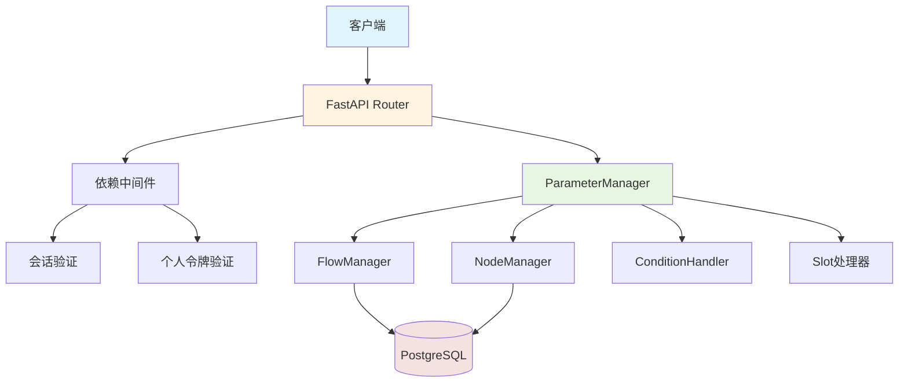

### 2.2 数据类型与操作符关系

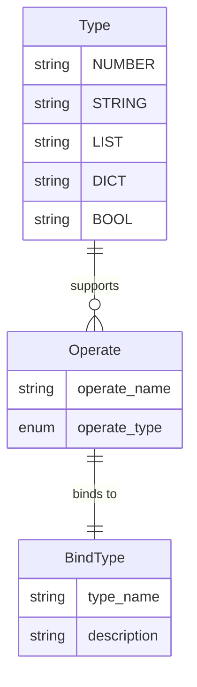

## 3. 核心流程

### 3.1 获取前置参数流程

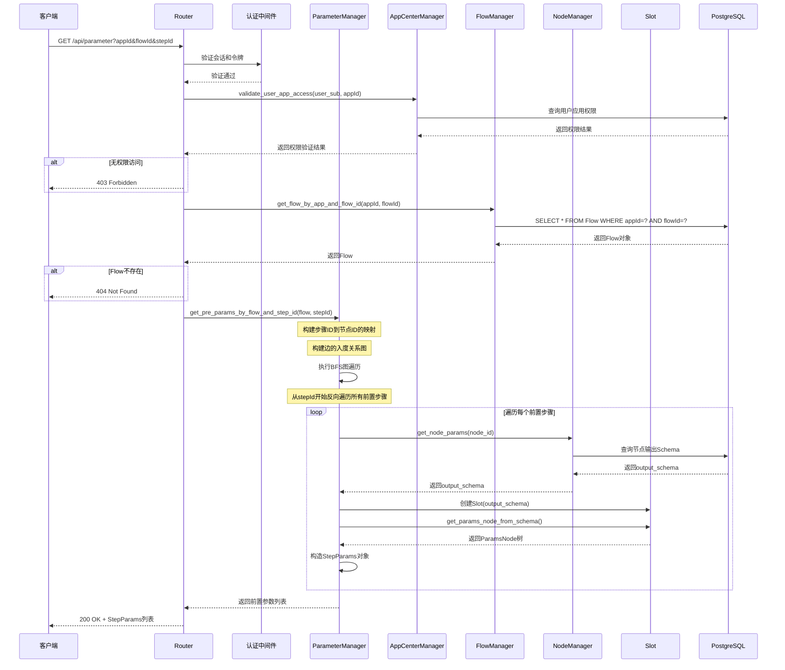

**流程说明:**

1. 客户端发起获取参数请求,提供应用ID、流程ID和步骤ID
2. 验证用户身份和应用访问权限
3. 查询指定的流程对象
4. 构建步骤间的依赖关系图(通过边的入度关系)
5. 使用BFS算法从当前步骤反向遍历所有前置步骤
6. 排除起始步骤和结束步骤
7. 为每个有效的前置步骤获取节点输出Schema
8. 通过Slot处理器将Schema转换为ParamsNode树结构
9. 返回所有前置步骤的参数信息

### 3.2 获取操作符流程

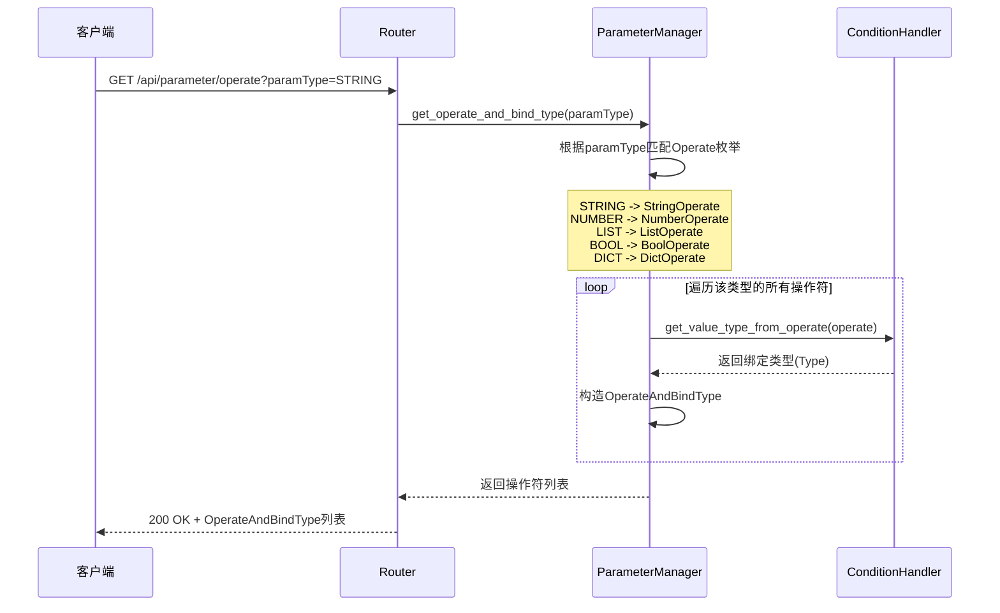

**流程说明:**

1. 客户端请求指定参数类型支持的操作符
2. 根据参数类型匹配对应的操作符枚举类
3. 遍历该类型的所有操作符
4. 通过ConditionHandler查询每个操作符绑定的值类型
5. 构造操作符与绑定类型的映射关系
6. 返回完整的操作符列表

### 3.3 参数图遍历算法

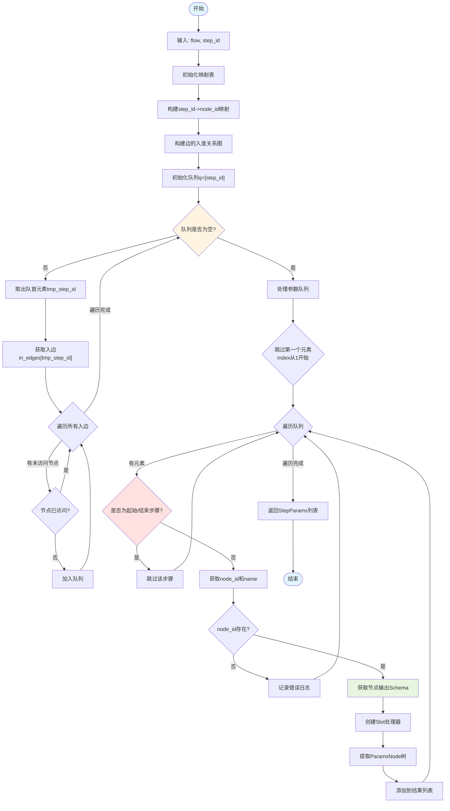

**算法说明:**

1. **初始化阶段**: 构建步骤ID到节点ID的映射和边的入度关系图
2. **BFS遍历**: 从目标步骤开始,反向遍历所有可达的前置步骤
3. **过滤阶段**: 排除起始步骤、结束步骤和队列首元素(当前步骤自身)
4. **参数提取**: 为每个有效步骤获取输出Schema并转换为参数树
5. **结果构造**: 组装包含步骤ID、名称和参数节点的完整信息

## 4. API 接口定义

### 4.1 获取步骤参数

**接口:** `GET /api/parameter`

**认证:** 需要会话验证和个人令牌验证

**查询参数:**

| 参数名 | 类型 | 必填 | 说明 |
|-------|------|------|------|
| appId | UUID | 是 | 应用ID |
| flowId | string | 是 | 流程ID |
| stepId | UUID | 是 | 步骤ID |

**响应示例:**

```json
{
  "code": 200,
  "message": "获取参数成功",
  "result": [
    {
      "stepId": "a1b2c3d4-e5f6-7890-abcd-ef1234567890",
      "name": "API调用步骤",
      "paramsNode": {
        "paramName": "root",
        "paramPath": "/root",
        "paramType": "dict",
        "subParams": [
          {
            "paramName": "statusCode",
            "paramPath": "/root/statusCode",
            "paramType": "number",
            "subParams": null
          },
          {
            "paramName": "responseBody",
            "paramPath": "/root/responseBody",
            "paramType": "dict",
            "subParams": [
              {
                "paramName": "data",
                "paramPath": "/root/responseBody/data",
                "paramType": "list",
                "subParams": null
              },
              {
                "paramName": "message",
                "paramPath": "/root/responseBody/message",
                "paramType": "string",
                "subParams": null
              }
            ]
          }
        ]
      }
    },
    {
      "stepId": "b2c3d4e5-f6a7-8901-bcde-f12345678901",
      "name": "数据转换步骤",
      "paramsNode": {
        "paramName": "root",
        "paramPath": "/root",
        "paramType": "dict",
        "subParams": [
          {
            "paramName": "transformedData",
            "paramPath": "/root/transformedData",
            "paramType": "list",
            "subParams": null
          },
          {
            "paramName": "count",
            "paramPath": "/root/count",
            "paramType": "number",
            "subParams": null
          }
        ]
      }
    }
  ]
}
```

**错误响应:**

```json
{
  "code": 403,
  "message": "用户没有权限访问该流",
  "result": []
}
```

```json
{
  "code": 404,
  "message": "未找到该流",
  "result": []
}
```

### 4.2 获取操作符列表

**接口:** `GET /api/parameter/operate`

**认证:** 需要会话验证和个人令牌验证

**查询参数:**

| 参数名 | 类型 | 必填 | 说明 |
|-------|------|------|------|
| paramType | Type | 是 | 参数类型(string/number/list/dict/bool) |

**响应示例 (STRING类型):**

```json
{
  "code": 200,
  "message": "获取操作成功",
  "result": [
    {
      "operate": "string_equal",
      "bind_type": "string"
    },
    {
      "operate": "string_not_equal",
      "bind_type": "string"
    },
    {
      "operate": "string_contains",
      "bind_type": "string"
    },
    {
      "operate": "string_not_contains",
      "bind_type": "string"
    },
    {
      "operate": "string_starts_with",
      "bind_type": "string"
    },
    {
      "operate": "string_ends_with",
      "bind_type": "string"
    },
    {
      "operate": "string_length_equal",
      "bind_type": "number"
    },
    {
      "operate": "string_length_greater_than",
      "bind_type": "number"
    },
    {
      "operate": "string_length_greater_than_or_equal",
      "bind_type": "number"
    },
    {
      "operate": "string_length_less_than",
      "bind_type": "number"
    },
    {
      "operate": "string_length_less_than_or_equal",
      "bind_type": "number"
    },
    {
      "operate": "string_regex_match",
      "bind_type": "string"
    }
  ]
}
```

**响应示例 (NUMBER类型):**

```json
{
  "code": 200,
  "message": "获取操作成功",
  "result": [
    {
      "operate": "number_equal",
      "bind_type": "number"
    },
    {
      "operate": "number_not_equal",
      "bind_type": "number"
    },
    {
      "operate": "number_greater_than",
      "bind_type": "number"
    },
    {
      "operate": "number_less_than",
      "bind_type": "number"
    },
    {
      "operate": "number_greater_than_or_equal",
      "bind_type": "number"
    },
    {
      "operate": "number_less_than_or_equal",
      "bind_type": "number"
    }
  ]
}
```

**响应示例 (BOOL类型):**

```json
{
  "code": 200,
  "message": "获取操作成功",
  "result": [
    {
      "operate": "bool_equal",
      "bind_type": "bool"
    },
    {
      "operate": "bool_not_equal",
      "bind_type": "bool"
    }
  ]
}
```

**响应示例 (DICT类型):**

```json
{
  "code": 200,
  "message": "获取操作成功",
  "result": [
    {
      "operate": "dict_equal",
      "bind_type": "dict"
    },
    {
      "operate": "dict_not_equal",
      "bind_type": "dict"
    },
    {
      "operate": "dict_contains_key",
      "bind_type": "string"
    },
    {
      "operate": "dict_not_contains_key",
      "bind_type": "string"
    }
  ]
}
```

## 5. ParameterManager 类方法

### 5.1 方法列表

| 方法名 | 功能描述 | 参数 | 返回值 |
|-------|---------|------|--------|
| `get_operate_and_bind_type` | 获取指定类型支持的操作符列表 | `param_type: Type` | `list[OperateAndBindType]` |
| `get_pre_params_by_flow_and_step_id` | 获取指定步骤的前置参数树 | `flow: FlowItem, step_id: UUID` | `list[StepParams]` |

### 5.2 方法调用关系

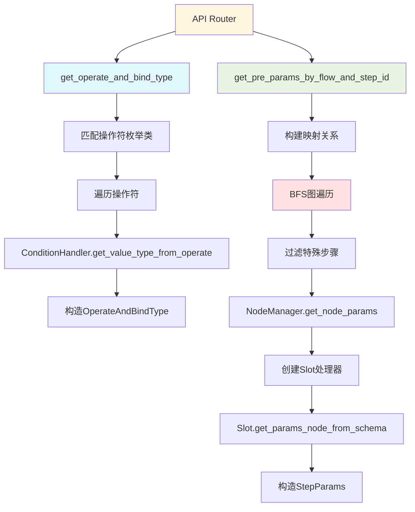

## 6. 数据结构详解

### 6.1 ParamsNode 结构

ParamsNode 是参数节点的树形结构表示,用于描述参数的层级关系:

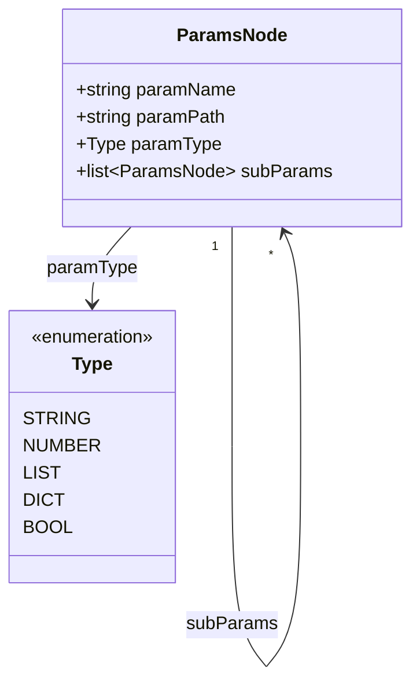

**字段说明:**

- `paramName`: 参数名称,表示该参数的标识符
- `paramPath`: 参数路径,使用JSON Pointer格式(如 `/root/data/items`)
- `paramType`: 参数类型,支持string/number/list/dict/bool五种基础类型
- `subParams`: 子参数列表,仅当类型为dict时存在,用于表示嵌套结构

### 6.2 StepParams 结构

StepParams 封装了步骤级别的参数信息:

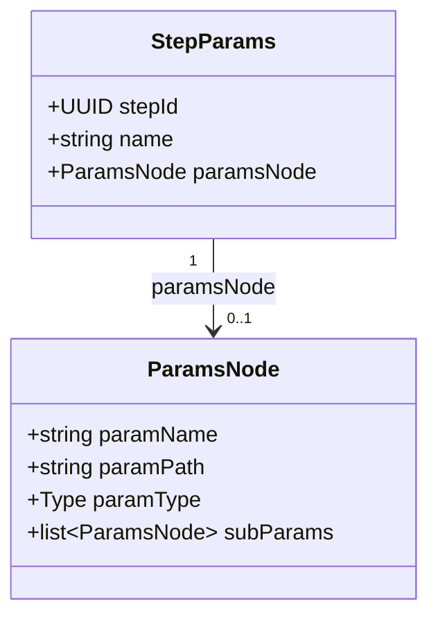

**字段说明:**

- `stepId`: 步骤的唯一标识符
- `name`: 步骤的显示名称
- `paramsNode`: 该步骤输出的参数树根节点

### 6.3 OperateAndBindType 结构

OperateAndBindType 描述了操作符与其绑定值类型的映射关系:

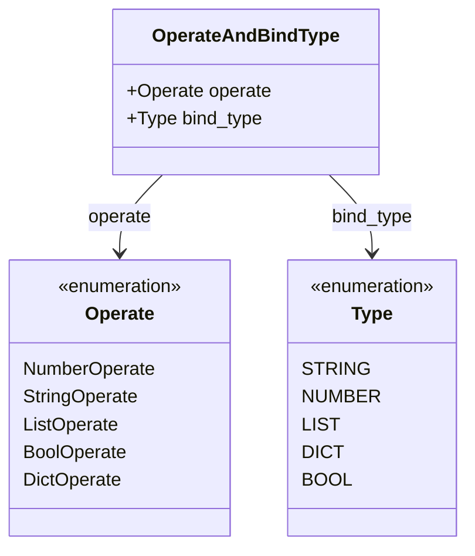

**字段说明:**

- `operate`: 操作符名称,如 `string_equal`、`number_greater_than` 等
- `bind_type`: 该操作符右侧值应该绑定的数据类型

## 7. 操作符类型系统

### 7.1 类型与操作符映射

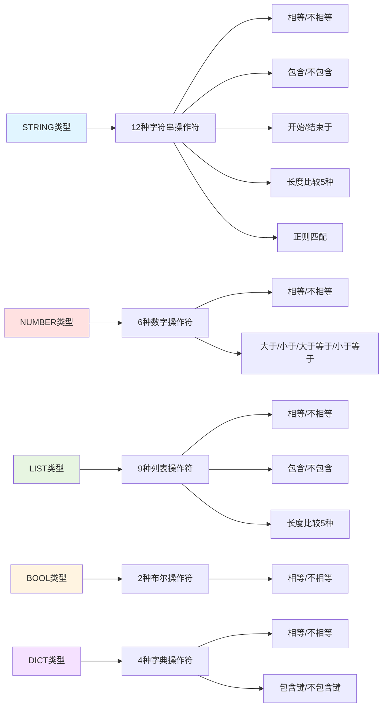

### 7.2 操作符绑定规则

不同操作符对右侧值的类型要求不同:

| 操作符 | 左值类型 | 绑定类型 | 说明 |
|-------|---------|---------|------|
| `string_equal` | STRING | STRING | 字符串完全匹配 |
| `string_contains` | STRING | STRING | 包含子字符串 |
| `string_length_equal` | STRING | NUMBER | 字符串长度比较 |
| `string_regex_match` | STRING | STRING | 正则表达式匹配 |
| `number_greater_than` | NUMBER | NUMBER | 数值大小比较 |
| `list_contains` | LIST | ANY | 列表元素包含检查 |
| `list_length_equal` | LIST | NUMBER | 列表长度比较 |
| `dict_contains_key` | DICT | STRING | 字典键存在性检查 |
| `dict_equal` | DICT | DICT | 字典完全匹配 |
| `bool_equal` | BOOL | BOOL | 布尔值比较 |

## 8. 关键特性

### 8.1 图遍历算法

使用广度优先搜索(BFS)算法反向遍历流程图:

- **时间复杂度**: O(V + E),V为步骤数,E为边数
- **空间复杂度**: O(V),需要存储访问队列和映射表
- **遍历顺序**: 按依赖关系从远到近排列前置步骤
- **去重处理**: 自动去除重复访问的步骤节点

### 8.2 Schema 到参数树的转换

通过 Slot 处理器将 JSON Schema 转换为 ParamsNode 树:

- **类型映射**: 将JSON Schema的类型映射到系统定义的五种基础类型
- **递归解析**: 递归处理object和array类型的嵌套结构
- **路径构建**: 自动生成JSON Pointer格式的参数路径
- **错误容忍**: 遇到不支持的类型时记录日志并跳过

### 8.3 权限控制

多层级权限验证机制:

1. **会话验证**: 验证用户登录状态
2. **令牌验证**: 验证个人访问令牌有效性
3. **应用访问验证**: 通过 AppCenterManager 验证用户是否有权限访问指定应用
4. **流程验证**: 验证流程是否存在于指定应用下

### 8.4 特殊步骤过滤

在构建前置参数列表时,会过滤掉特殊步骤:

- **起始步骤**: 由 `flow.basic_config.startStep` 标识
- **结束步骤**: 由 `flow.basic_config.endStep` 标识
- **当前步骤**: 队列的第一个元素(索引0)即为当前步骤自身

### 8.5 操作符扩展性

操作符系统支持灵活扩展:

- 通过枚举类定义新的操作符
- 通过 ConditionHandler 配置操作符的绑定类型
- 类型系统与操作符系统解耦,便于独立维护

## 9. 错误处理

异常场景：

| 场景 | HTTP状态码 | 处理方式 |
|-----|-----------|---------|
| 用户无应用访问权限 | 403 | 返回空结果列表和提示信息 |
| 流程不存在 | 404 | 返回空结果列表和提示信息 |
| 节点ID不存在 | 200 | 记录错误日志,跳过该步骤,继续处理 |
| Schema解析失败 | 200 | 记录异常日志,跳过该步骤,继续处理 |
| 参数类型不匹配 | 200 | 返回空操作符列表 |

## 10. 依赖关系

### 10.1 上游依赖

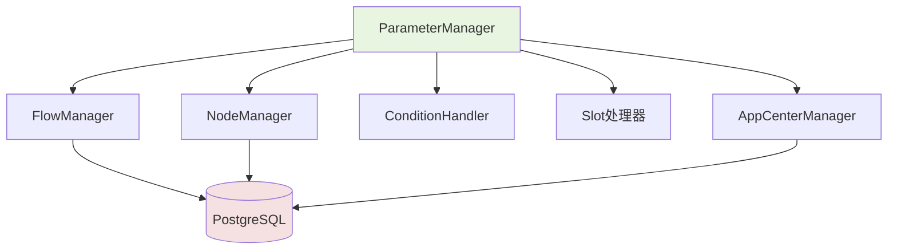

**依赖说明:**

- **FlowManager**: 提供流程查询功能
- **NodeManager**: 提供节点参数Schema查询
- **ConditionHandler**: 提供操作符类型映射
- **Slot**: 提供Schema解析和参数树构建
- **AppCenterManager**: 提供应用权限验证

### 10.2 下游使用场景

Parameter 模块主要服务于以下场景:

- **Choice节点配置**: 在配置条件分支时选择前置步骤的输出参数
- **参数绑定**: 在配置节点输入参数时引用前置步骤的输出
- **条件判断编辑器**: UI组件根据参数类型显示支持的操作符
- **表达式验证**: 验证用户输入的条件表达式是否符合类型规则

## 11. 使用示例

### 11.1 获取前置参数的典型场景

假设有以下流程:

```text
[开始] -> [API调用] -> [数据转换] -> [条件判断] -> [结束]
```

当用户在"条件判断"步骤配置条件时:

1. 前端调用 `GET /api/parameter?stepId=条件判断ID`
2. 后端通过BFS遍历得到前置步骤: `[数据转换, API调用]`
3. 获取"数据转换"的输出Schema并转换为参数树
4. 获取"API调用"的输出Schema并转换为参数树
5. 返回两个StepParams对象,供前端渲染参数选择器

### 11.2 操作符选择的典型场景

用户选择了一个STRING类型的参数后:

1. 前端调用 `GET /api/parameter/operate?paramType=STRING`
2. 后端返回12种字符串操作符及其绑定类型
3. 前端渲染操作符下拉列表,如"等于"、"包含"、"匹配正则"等
4. 用户选择"长度等于"操作符时,前端根据绑定类型(NUMBER)显示数字输入框
