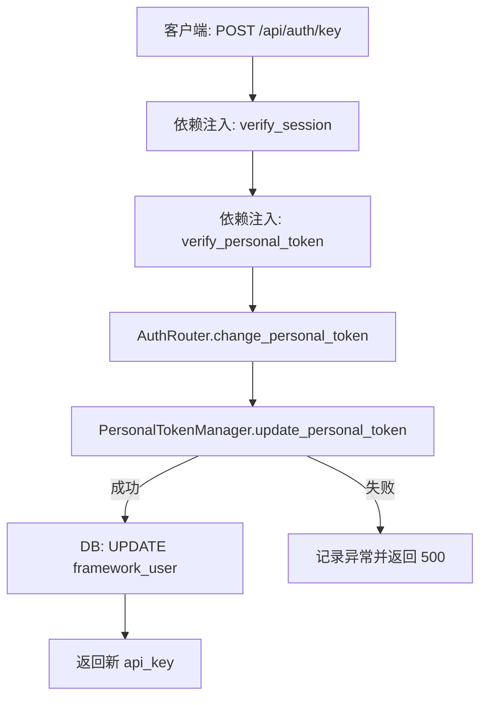
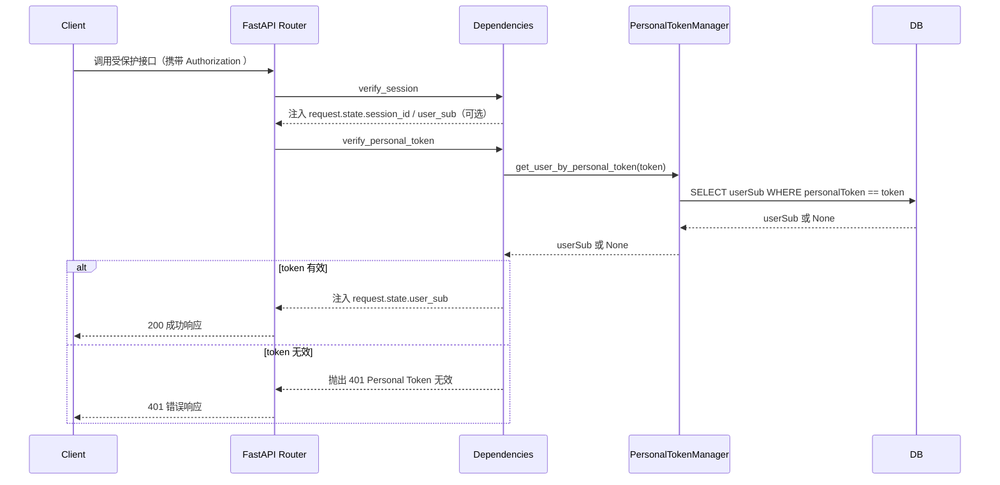

# 个人令牌（API Key）服务设计

本文档描述 openEuler Intelligence 框架中与账号 API Key（Personal Token）相关的鉴权策略、核心流程、接口规范以及已知限制。实现参考：

- `apps/services/personal_token.py`：个人令牌生成、校验
- `apps/dependency/user.py`：请求依赖校验（`verify_personal_token`、`verify_session`）
- `apps/routers/auth.py`：重置个人令牌接口 `/api/auth/key`
- 使用举例：`apps/routers/user.py` 等路由均依赖 `verify_personal_token`

## 架构与职责

- 个人令牌用于对用户调用进行鉴权，是接口级依赖；受保护路由在鉴权通过后再处理请求。
- 依赖执行顺序为：`verify_session`（可选，遇到 `Bearer` 开头的 Authorization 时解析出 session_id）→ `verify_personal_token`（必选）。`verify_personal_token` 会直接把 `Authorization` 头的完整内容视作个人令牌。
- 当前实现要求客户端发送的 `Authorization` 头只能包含纯个人令牌字符串；若携带 `Bearer <session-id>` 会被视为无效令牌并返回 401。
- 个人令牌的生成与更新由 `PersonalTokenManager.update_personal_token` 负责；校验由 `verify_personal_token` 委托 `PersonalTokenManager.get_user_by_personal_token` 完成。

## 流程图（重置 API Key）



Note: 现实实现中 `update_personal_token` 使用 `User.id` 作为过滤条件且缺少显式 `commit`，导致数据库更新不会落库；接口仍返回“新 api_key”。

## 时序图（受保护资源访问）



## 数据模型摘要

- 用户表 `User` 至少包含：`userSub`（用户唯一标识）、`personalToken`（个人令牌）。
- 个人令牌生成逻辑：`sha256(uuid4().hex)[:16]`（16 位十六进制字符串）。

## 接口规范

### 1) 重置个人令牌

- 路径：`POST /api/auth/key`
- 认证：依赖 `verify_session` 与 `verify_personal_token`
- 作用：为当前用户生成新的 API Key，并写入数据库，返回给客户端。

请求示例（当前实现中 Authorization 仅用于携带个人令牌；会话头可不传）：

```bash
curl -X POST \
  -H "Authorization: <Personal-Token>" \
  https://your-host/api/auth/key
```

成功响应（200）：

```json
{
  "code": 200,
  "message": "success",
  "result": {
    "api_key": "9f1a2b3c4d5e6f70"
  }
}
```

失败响应（500，示例）：

```json
{
  "code": 500,
  "message": "failed to update personal token",
  "result": {}
}
```

错误场景（401 未通过鉴权，示例）：

```json
{
  "detail": "Personal Token 无效"
}
```

### 2) 受保护资源的通用调用方式

- 大多数受保护路由（如 `GET /api/user`、`PUT /api/user/llm` 等）必须提供合法的个人令牌；缺失时直接返回 401。
- `Authorization` 头的值应为纯个人令牌字符串，不应带 `Bearer` 等前缀。
- 会话 `Bearer` 头若与个人令牌同时存在，会被整体按个人令牌解析，最终导致 401。

请求示例（以 `GET /api/user` 为例，客户端/Shell）：

```bash
curl -X GET \
  -H "Authorization: <Personal-Token>" \
  "https://your-host/api/user?page_size=10&page_num=1"
```

成功响应（节选）：

```json
{
  "code": 200,
  "message": "用户数据详细信息获取成功",
  "result": {
    "userInfoList": [
      { "userName": "alice", "userSub": "alice" }
    ],
    "total": 42
  }
}
```

## 安全与最佳实践

- 当前实现只接受个人令牌鉴权；需要会话鉴权时，必须调整依赖逻辑或提供回退方案。
- 后端不回显旧密钥，仅在重置操作时返回新密钥一次；客户端需妥善保存。
- 个人令牌长度固定 16 位，可按需在前后端增加强度与轮换策略。
- 服务侧可结合访问频率限制与审计日志，及时发现异常使用。

## 关键实现参考

为避免直接引用代码，这里以自然语言描述关键逻辑：

- 个人令牌校验（路由依赖）
  - 从请求头读取 `Authorization`，将其作为个人令牌使用；若缺失则返回未授权错误。
  - 通过个人令牌查询对应的用户唯一标识；若查无此人则返回未授权错误。
  - 校验通过后，将用户唯一标识写入请求上下文，供后续处理使用。

- 重置个人令牌（POST /api/auth/key）
  - 在受保护路由中，同时执行会话解析与个人令牌校验；当前只有个人令牌校验会真正影响放行。
- 生成方式为对随机 UUID 进行哈希处理并截取固定长度（16 位十六进制字符串）。
  - 理论上应将新令牌写入数据库并返回响应；但由于实现缺陷实际不会持久化。

- 令牌-用户映射与更新
  - “令牌查用户”：按“令牌等于用户表中的个人令牌字段”的条件检索，返回匹配到的用户标识；异常会被记录并视为查找失败。
  - “更新令牌”：按用户标识定位记录并写入新生成的令牌；当前实现缺少 `commit` 且使用 `User.id` 过滤（与传入的 `user_sub` 类型不符），导致数据库值保持不变。

  ## 已知限制与建议

  1. **Session 依赖仅作补充**：`verify_session` 不会放行缺少个人令牌的请求，浏览器若只携带 `Bearer <session-id>` 会被 `verify_personal_token` 拒绝。若需要仅依靠会话鉴权，需要调整依赖顺序或放宽 `verify_personal_token` 的空值处理。
  2. **令牌更新未持久化**：`update_personal_token` 返回的新令牌不会写回数据库（缺少 `commit` 且过滤字段不符），调用方应当在修复代码前避免依赖该接口更新数据。
  3. **令牌格式固定**：个人令牌固定为 16 位十六进制字符串，当前没有长度或复杂度配置项；若需要更强安全性，需要扩展生成逻辑与存储字段长度。
