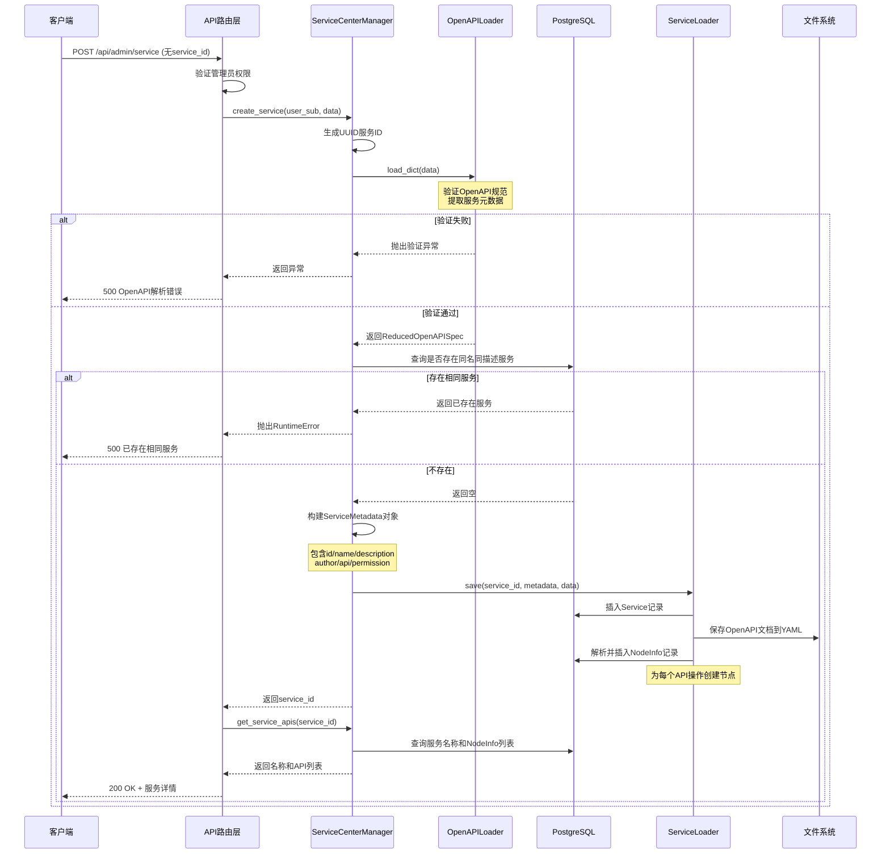
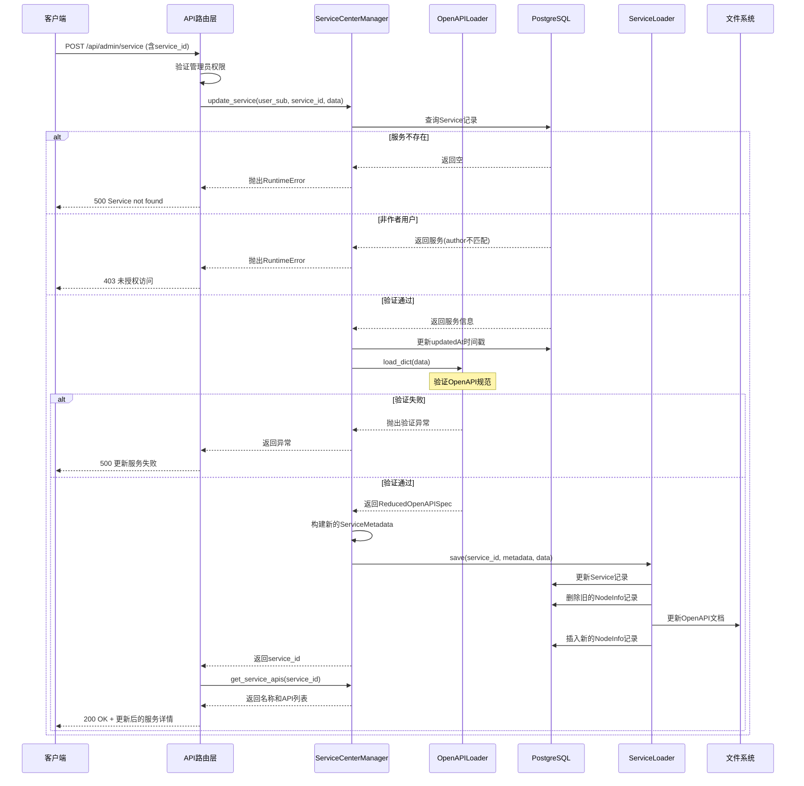
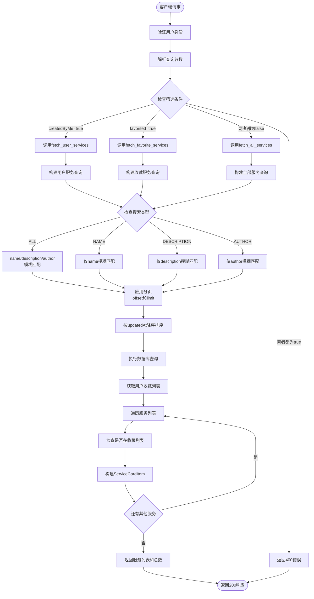
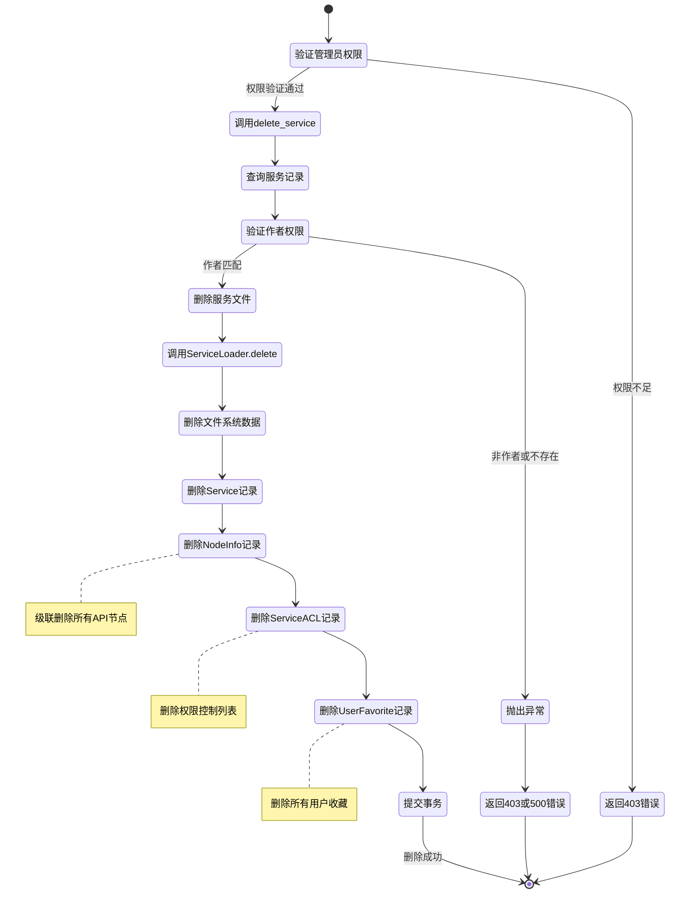
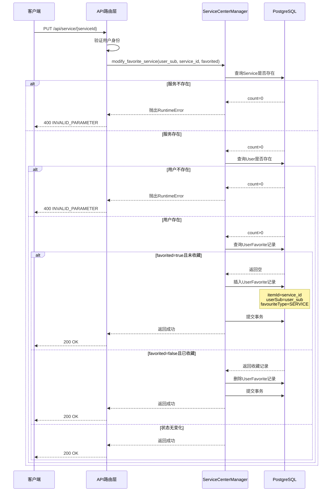
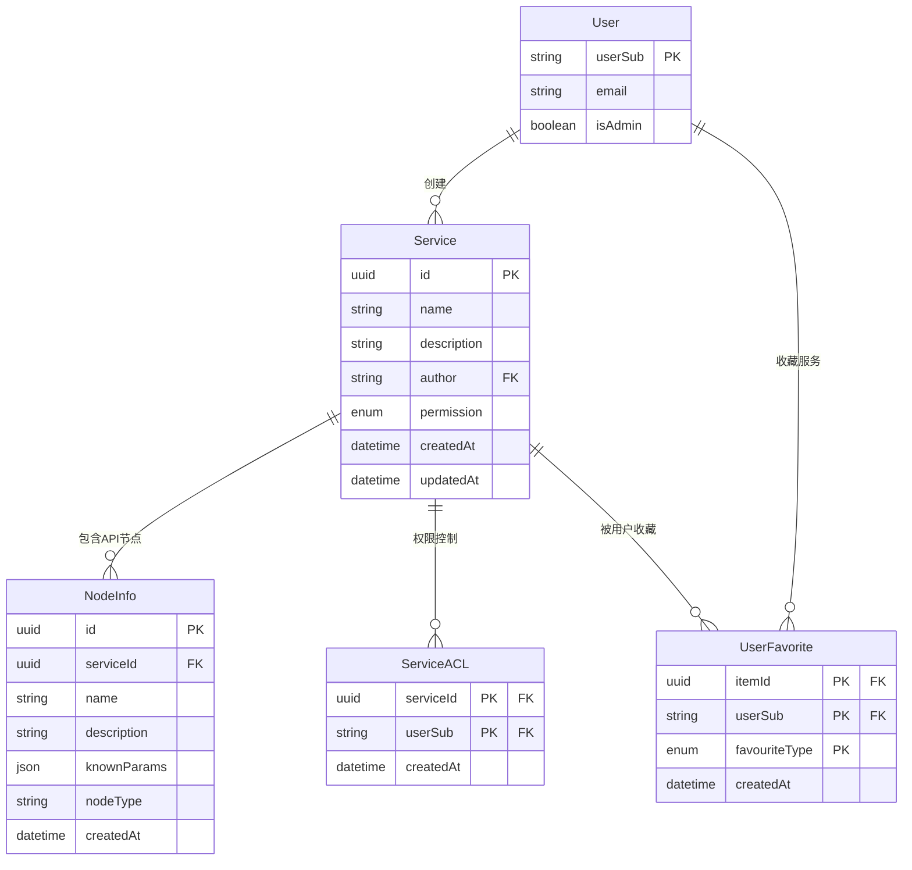
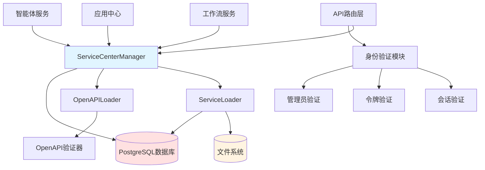

# 语义接口中心管理模块文档

## 模块概述

语义接口中心管理模块负责管理系统中的OpenAPI服务生命周期，包括服务的创建、更新、查询、删除、收藏等核心功能。该模块支持基于OpenAPI规范的服务注册和管理，提供了完善的权限控制和服务检索机制。

### 核心职责

- **服务管理**：提供OpenAPI服务的CRUD操作，支持上传和解析OpenAPI规范文档
- **权限控制**：实现基于作者身份和管理员权限的访问控制机制
- **服务检索**：支持按关键字、名称、描述、作者等条件筛选服务，支持分页查询
- **收藏管理**：维护用户对服务的收藏状态，支持个性化服务列表
- **API解析**：解析OpenAPI规范文档，提取服务元数据和API列表

---

## 数据结构

### 服务卡片数据

用于服务列表展示的卡片信息：

```json
{
  "serviceId": "550e8400-e29b-41d4-a716-446655440000",
  "icon": "",
  "name": "天气查询服务",
  "description": "提供实时天气查询和预报功能",
  "author": "user@example.com",
  "favorited": true
}
```

### 服务详细信息（查看模式）

普通用户查看服务API列表：

```json
{
  "serviceId": "550e8400-e29b-41d4-a716-446655440000",
  "name": "天气查询服务",
  "apis": [
    {
      "name": "getCurrentWeather",
      "path": "GET /weather/current",
      "description": "获取当前天气信息"
    },
    {
      "name": "getForecast",
      "path": "GET /weather/forecast",
      "description": "获取未来7天天气预报"
    },
    {
      "name": "getHistoricalData",
      "path": "GET /weather/history",
      "description": "查询历史天气数据"
    }
  ]
}
```

### 服务配置信息（编辑模式）

管理员编辑服务配置时获取完整OpenAPI文档：

```json
{
  "serviceId": "550e8400-e29b-41d4-a716-446655440000",
  "name": "天气查询服务",
  "data": {
    "openapi": "3.1.0",
    "info": {
      "title": "天气查询服务",
      "version": "1.0.0",
      "description": "提供实时天气查询和预报功能"
    },
    "servers": [
      {
        "url": "https://api.weather.example.com/v1"
      }
    ],
    "paths": {
      "/weather/current": {
        "get": {
          "operationId": "getCurrentWeather",
          "summary": "获取当前天气信息",
          "parameters": [
            {
              "name": "city",
              "in": "query",
              "required": true,
              "schema": {
                "type": "string"
              }
            }
          ],
          "responses": {
            "200": {
              "description": "成功返回天气信息"
            }
          }
        }
      }
    }
  }
}
```

### 服务列表响应

```json
{
  "code": 200,
  "message": "OK",
  "result": {
    "currentPage": 1,
    "totalCount": 25,
    "services": [
      {
        "serviceId": "550e8400-e29b-41d4-a716-446655440000",
        "icon": "",
        "name": "天气查询服务",
        "description": "提供实时天气查询和预报功能",
        "author": "user@example.com",
        "favorited": true
      },
      {
        "serviceId": "660e8400-e29b-41d4-a716-446655440001",
        "icon": "",
        "name": "地图导航服务",
        "description": "提供地图搜索和路线规划功能",
        "author": "admin@example.com",
        "favorited": false
      }
    ]
  }
}
```

### 服务创建/更新请求

```json
{
  "service_id": "550e8400-e29b-41d4-a716-446655440000",
  "data": {
    "openapi": "3.1.0",
    "info": {
      "title": "新服务名称",
      "version": "1.0.0",
      "description": "服务描述信息"
    },
    "servers": [
      {
        "url": "https://api.example.com/v1"
      }
    ],
    "paths": {
      "/endpoint": {
        "get": {
          "operationId": "operationName",
          "summary": "操作描述"
        }
      }
    }
  }
}
```

### 收藏状态修改请求

```json
{
  "favorited": true
}
```

---

## API接口定义

### 1. 获取服务列表

**端点**: `GET /api/service`

**权限**: 需要会话验证和个人令牌验证

**请求参数**:

- `createdByMe` (boolean, 可选): 筛选我创建的服务，默认false
- `favorited` (boolean, 可选): 筛选我收藏的服务，默认false
- `searchType` (SearchType, 可选): 搜索类型，枚举值：ALL/NAME/DESCRIPTION/AUTHOR，默认ALL
- `keyword` (string, 可选): 搜索关键字
- `page` (integer, 必需): 页码，从1开始
- `pageSize` (integer, 可选): 每页数量，默认16

**参数约束**:

- `createdByMe`和`favorited`不能同时为true
- 页码最小值为1

**请求示例**:

```http
GET /api/service?createdByMe=false&favorited=true&searchType=NAME&keyword=天气&page=1&pageSize=10
```

**响应示例**:

```json
{
  "code": 200,
  "message": "OK",
  "result": {
    "currentPage": 1,
    "totalCount": 3,
    "services": [
      {
        "serviceId": "550e8400-e29b-41d4-a716-446655440000",
        "icon": "",
        "name": "天气查询服务",
        "description": "提供实时天气查询和预报功能",
        "author": "user@example.com",
        "favorited": true
      }
    ]
  }
}
```

**错误响应（无效参数）**:

```json
{
  "code": 400,
  "message": "INVALID_PARAMETER",
  "result": {}
}
```

**错误响应（服务器错误）**:

```json
{
  "code": 500,
  "message": "ERROR",
  "result": {}
}
```

### 2. 创建或更新服务

**端点**: `POST /api/admin/service`

**权限**: 需要管理员权限

**请求体（创建服务，无service_id）**:

```json
{
  "data": {
    "openapi": "3.1.0",
    "info": {
      "title": "新服务",
      "version": "1.0.0",
      "description": "新服务描述"
    },
    "servers": [
      {
        "url": "https://api.newservice.com"
      }
    ],
    "paths": {
      "/resource": {
        "get": {
          "operationId": "getResource",
          "summary": "获取资源"
        }
      }
    }
  }
}
```

**请求体（更新服务，含service_id）**:

```json
{
  "service_id": "550e8400-e29b-41d4-a716-446655440000",
  "data": {
    "openapi": "3.1.0",
    "info": {
      "title": "更新后的服务名",
      "version": "2.0.0",
      "description": "更新后的描述"
    },
    "servers": [
      {
        "url": "https://api.updatedservice.com"
      }
    ],
    "paths": {
      "/resource": {
        "get": {
          "operationId": "getResource",
          "summary": "获取资源"
        }
      }
    }
  }
}
```

**响应示例**:

```json
{
  "code": 200,
  "message": "OK",
  "result": {
    "serviceId": "550e8400-e29b-41d4-a716-446655440000",
    "name": "新服务",
    "apis": [
      {
        "name": "getResource",
        "path": "GET /resource",
        "description": "获取资源"
      }
    ]
  }
}
```

**错误响应（创建失败）**:

```json
{
  "code": 500,
  "message": "OpenAPI解析错误: Invalid schema format",
  "result": {}
}
```

**错误响应（权限不足）**:

```json
{
  "code": 403,
  "message": "未授权访问",
  "result": {}
}
```

### 3. 获取服务详情

**端点**: `GET /api/service/{serviceId}`

**权限**: 需要会话验证和个人令牌验证

**请求参数**:

- `serviceId` (UUID, 路径参数): 服务ID
- `edit` (boolean, 查询参数): 是否为编辑模式，默认false

**请求示例（查看模式）**:

```http
GET /api/service/550e8400-e29b-41d4-a716-446655440000?edit=false
```

**响应示例（查看模式）**:

```json
{
  "code": 200,
  "message": "OK",
  "result": {
    "serviceId": "550e8400-e29b-41d4-a716-446655440000",
    "name": "天气查询服务",
    "apis": [
      {
        "name": "getCurrentWeather",
        "path": "GET /weather/current",
        "description": "获取当前天气信息"
      }
    ]
  }
}
```

**请求示例（编辑模式）**:

```http
GET /api/service/550e8400-e29b-41d4-a716-446655440000?edit=true
```

**响应示例（编辑模式）**: 返回完整OpenAPI文档数据

**错误响应（权限不足）**:

```json
{
  "code": 403,
  "message": "未授权访问",
  "result": {}
}
```

**错误响应（服务器错误）**:

```json
{
  "code": 500,
  "message": "ERROR",
  "result": {}
}
```

### 4. 删除服务

**端点**: `DELETE /api/admin/service/{serviceId}`

**权限**: 需要管理员权限

**请求参数**:

- `serviceId` (UUID, 路径参数): 服务ID

**请求示例**:

```http
DELETE /api/admin/service/550e8400-e29b-41d4-a716-446655440000
```

**响应示例**:

```json
{
  "code": 200,
  "message": "OK",
  "result": {
    "serviceId": "550e8400-e29b-41d4-a716-446655440000"
  }
}
```

**错误响应（权限不足）**:

```json
{
  "code": 403,
  "message": "未授权访问",
  "result": {}
}
```

**错误响应（服务器错误）**:

```json
{
  "code": 500,
  "message": "ERROR",
  "result": {}
}
```

### 5. 修改服务收藏状态

**端点**: `PUT /api/service/{serviceId}`

**权限**: 需要会话验证和个人令牌验证

**请求参数**:

- `serviceId` (UUID, 路径参数): 服务ID

**请求体（收藏）**:

```json
{
  "favorited": true
}
```

**请求体（取消收藏）**:

```json
{
  "favorited": false
}
```

**响应示例**:

```json
{
  "code": 200,
  "message": "OK",
  "result": {
    "serviceId": "550e8400-e29b-41d4-a716-446655440000",
    "favorited": true
  }
}
```

**错误响应（无效参数）**:

```json
{
  "code": 400,
  "message": "INVALID_PARAMETER",
  "result": {}
}
```

**错误响应（服务器错误）**:

```json
{
  "code": 500,
  "message": "ERROR",
  "result": {}
}
```

---

## 核心业务流程

### 服务创建流程



### 服务更新流程



### 服务查询流程



### 服务删除流程



### 收藏管理流程



---

## 核心方法说明

### fetch_all_services

获取所有可访问的服务列表，支持搜索和分页。

- **功能描述**: 查询系统中所有服务并构建卡片列表
- **执行步骤**:
  1. 调用内部查询构建方法生成SQL语句
  2. 根据搜索类型和关键字添加WHERE条件
  3. 按更新时间降序排序并应用分页
  4. 执行查询获取Service记录列表
  5. 获取当前用户的收藏服务ID列表
  6. 遍历每条记录构建ServiceCardItem对象
  7. 标注每个服务的收藏状态
- **搜索维度**:
  - **ALL**: 同时匹配name、description、author三个字段
  - **NAME**: 仅匹配服务名称
  - **DESCRIPTION**: 仅匹配描述信息
  - **AUTHOR**: 仅匹配作者标识
- **分页计算**: offset = (page - 1) * pageSize
- **返回值**: 服务卡片列表和总数的元组

### fetch_user_services

获取指定用户创建的服务列表，支持搜索和分页。

- **功能描述**: 查询用户作为作者的所有服务
- **特殊处理**:
  - 当搜索类型为AUTHOR时，验证关键字是否包含在用户标识中
  - 如果不包含，直接返回空列表
  - 自动将关键字替换为完整的user_sub进行精确匹配
- **执行步骤**:
  1. 构建包含author条件的查询语句
  2. 根据搜索类型添加额外的过滤条件
  3. 应用分页和排序
  4. 获取用户收藏列表并标注收藏状态
- **使用场景**: "我创建的"服务列表展示

### fetch_favorite_services

获取用户收藏的服务列表，支持搜索和分页。

- **功能描述**: 查询用户已收藏的所有服务
- **执行步骤**:
  1. 首先从UserFavorite表获取用户收藏的服务ID列表
  2. 构建Service表查询，限制ID在收藏列表中
  3. 根据搜索类型和关键字添加过滤条件
  4. 应用分页和排序
  5. 构建卡片对象时直接标记favorited为True
- **优化逻辑**: 预先获取收藏ID列表，避免每个服务单独查询收藏状态
- **使用场景**: "我收藏的"服务列表展示

### create_service

创建新的OpenAPI服务并注册到系统中。

- **功能描述**: 验证OpenAPI规范并创建服务
- **执行步骤**:
  1. 生成UUID作为服务唯一标识
  2. 调用验证器解析并验证OpenAPI文档
  3. 从文档中提取服务名称、描述、服务器地址
  4. 在数据库中查询是否存在同名且同描述的服务
  5. 如果存在则抛出异常，防止重复创建
  6. 构建ServiceMetadata对象，设置默认权限为PUBLIC
  7. 调用ServiceLoader保存服务元数据和文档
  8. ServiceLoader解析OpenAPI的paths部分创建NodeInfo记录
- **验证内容**:
  - OpenAPI版本兼容性
  - 必需字段完整性（info、paths）
  - Servers配置有效性
  - Schema格式正确性
- **权限默认值**: 新创建的服务默认为PUBLIC权限
- **返回值**: 新创建的服务UUID

### update_service

更新已存在的OpenAPI服务配置。

- **功能描述**: 修改服务的OpenAPI文档和元数据
- **权限验证**:
  1. 查询Service记录确认服务存在
  2. 比对author字段与当前用户标识
  3. 非作者用户抛出权限异常
- **执行步骤**:
  1. 更新Service表的updatedAt字段为当前时间
  2. 验证新的OpenAPI文档格式
  3. 构建新的ServiceMetadata对象
  4. 调用ServiceLoader更新文件系统和数据库
  5. 删除旧的NodeInfo记录并插入新的记录
- **影响范围**:
  - Service表基本信息
  - 文件系统中的OpenAPI YAML文档
  - NodeInfo表中的API节点记录
- **注意事项**: 更新操作不影响已有的收藏关系和权限配置
- **返回值**: 服务UUID

### get_service_apis

获取服务提供的API操作列表。

- **功能描述**: 从数据库中查询服务的所有API节点
- **执行步骤**:
  1. 查询Service表获取服务名称
  2. 查询NodeInfo表获取所有关联的节点记录
  3. 遍历节点记录提取name、description和knownParams
  4. 从knownParams中提取method和url构建路径字符串
  5. 构建ServiceApiData对象列表
- **路径格式**: "METHOD URL"（如："GET /weather/current"）
- **参数来源**: knownParams字段存储解析后的HTTP方法和URL
- **返回值**: 服务名称和API数据列表的元组
- **使用场景**: 服务详情页面展示API列表，工作流节点选择API

### get_service_data

获取服务的完整OpenAPI文档数据，用于编辑场景。

- **功能描述**: 从文件系统读取原始OpenAPI YAML文档
- **权限验证**:
  1. 查询Service记录并验证存在性
  2. 验证author字段与当前用户匹配
  3. 同时满足两个条件才允许访问
- **执行步骤**:
  1. 构建文件路径：{data_dir}/semantics/service/{service_id}/openapi/api.yaml
  2. 使用异步文件操作打开YAML文件
  3. 使用yaml.safe_load解析文件内容
  4. 返回服务名称和解析后的字典数据
- **文件格式**: YAML格式的OpenAPI 3.x规范文档
- **异常处理**: 文件不存在或解析失败会抛出异常
- **使用场景**: 管理员编辑服务配置时获取完整文档

### get_service_metadata

获取服务的元数据信息，包含权限验证逻辑。

- **功能描述**: 读取服务的metadata.yaml文件
- **权限验证逻辑**:
  1. 查询ServiceACL表获取允许访问的用户列表
  2. 如果当前用户在ACL列表中，可访问PRIVATE服务
  3. 如果不在ACL列表中，只能访问PUBLIC服务或自己创建的服务
  4. 使用复杂的OR/AND条件组合实现权限控制
- **执行步骤**:
  1. 根据权限规则查询Service记录
  2. 构建文件路径：{data_dir}/semantics/service/{service_id}/metadata.yaml
  3. 读取并解析YAML文件
  4. 使用ServiceMetadata模型验证并构建对象
- **元数据内容**: id、name、description、author、api、permission等
- **使用场景**: 工作流或智能体引用服务时验证权限并获取配置

### delete_service

删除服务及其所有关联数据。

- **功能描述**: 完整清理服务的所有痕迹
- **权限验证**:
  1. 查询Service记录确认存在
  2. 验证author字段与当前用户匹配
  3. 同时满足才允许删除
- **执行步骤**:
  1. 调用ServiceLoader.delete删除文件系统数据
  2. ServiceLoader删除整个服务目录
  3. 数据库中删除ServiceACL记录（权限列表）
  4. 数据库中删除UserFavorite记录（所有用户收藏）
  5. 数据库级联删除Service和NodeInfo记录
  6. 提交事务完成删除
- **删除范围**:
  - 文件系统：{data_dir}/semantics/service/{service_id}/目录
  - 数据库：Service、NodeInfo、ServiceACL、UserFavorite表
- **不可逆操作**: 删除后无法恢复，需谨慎操作
- **影响范围**: 所有引用该服务的工作流和智能体需要重新配置

### modify_favorite_service

修改用户对服务的收藏状态。

- **功能描述**: 添加或移除用户的服务收藏
- **验证步骤**:
  1. 使用COUNT查询验证Service记录存在
  2. 使用COUNT查询验证User记录存在
  3. 任一不存在则返回失败
- **执行逻辑**:
  - **添加收藏**: 查询UserFavorite不存在且favorited=true时插入新记录
  - **取消收藏**: 查询UserFavorite存在且favorited=false时删除记录
  - **无变化**: 其他情况不执行数据库操作，直接返回成功
- **复合键**: UserFavorite表使用(itemId, userSub, favouriteType)作为唯一键
- **类型标识**: favouriteType固定为UserFavoriteType.SERVICE
- **幂等性**: 多次调用相同参数不会产生错误，状态最终一致
- **使用场景**: 服务列表中的收藏按钮点击事件

### _get_favorite_service_ids_by_user

内部方法：获取用户收藏的所有服务ID列表。

- **功能描述**: 从UserFavorite表提取用户收藏的服务UUID
- **查询条件**:
  - userSub等于指定用户标识
  - favouriteType等于SERVICE类型
- **执行步骤**:
  1. 构建查询语句筛选UserFavorite记录
  2. 执行查询获取所有匹配的记录对象
  3. 遍历记录提取itemId字段
  4. 构建UUID列表返回
- **返回值**: UUID列表，可能为空
- **使用场景**: 服务列表查询时批量获取收藏状态，避免N+1查询问题

### _validate_service_data

内部方法：验证OpenAPI文档数据的有效性。

- **功能描述**: 调用OpenAPILoader解析并验证文档
- **验证步骤**:
  1. 检查数据字典不为空
  2. 调用OpenAPILoader.load_dict方法
  3. 验证OpenAPI规范版本
  4. 验证必需的info和paths部分
  5. 提取服务器地址和基本信息
  6. 构建ReducedOpenAPISpec简化对象
- **验证规则**:
  - 必需包含info.title和info.description
  - 必需包含至少一个path定义
  - Servers配置必需有效
  - Schema定义符合JSON Schema规范
- **返回值**: ReducedOpenAPISpec对象，包含id、description、servers等精简信息
- **异常抛出**: 验证失败时抛出ValueError或ValidationError
- **使用场景**: 创建和更新服务前的数据验证步骤

### _build_service_query

内部方法：构建服务查询的SQL语句。

- **功能描述**: 根据搜索条件生成通用的Service查询
- **执行步骤**:
  1. 创建基础SELECT语句针对Service表
  2. 根据keyword和searchType添加WHERE条件
  3. 使用LIKE操作符进行模糊匹配
  4. 添加ORDER BY按updatedAt降序排序
  5. 应用OFFSET和LIMIT实现分页
- **搜索类型处理**:
  - **ALL**: 使用OR连接name、description、author的LIKE条件
  - **NAME**: 仅添加name LIKE条件
  - **DESCRIPTION**: 仅添加description LIKE条件
  - **AUTHOR**: 仅添加author LIKE条件
- **模糊匹配**: 使用"%{keyword}%"格式进行全文匹配
- **返回值**: SQLAlchemy Select对象，可直接执行或进一步组合
- **使用场景**: fetch_all_services内部调用

### _build_user_service_query

内部方法：构建用户创建服务的查询SQL语句。

- **功能描述**: 在通用查询基础上添加作者过滤
- **执行步骤**:
  1. 创建基础SELECT并添加author=user_sub条件
  2. 如果有keyword，使用AND组合作者条件和搜索条件
  3. 根据searchType选择搜索字段
  4. 应用排序和分页
- **条件组合**: 使用and_和or_组合复杂的WHERE条件
- **返回值**: SQLAlchemy Select对象
- **使用场景**: fetch_user_services内部调用

### _build_favorite_service_query

内部方法：构建收藏服务的查询SQL语句。

- **功能描述**: 限制查询结果在用户收藏范围内
- **执行步骤**:
  1. 调用_get_favorite_service_ids_by_user获取收藏ID列表
  2. 创建基础SELECT并添加id.in_(fav_ids)条件
  3. 如果有keyword，使用AND组合收藏条件和搜索条件
  4. 根据searchType选择搜索字段
  5. 应用排序和分页
- **特殊处理**: 如果收藏列表为空，查询仍会执行但不会返回结果
- **返回值**: SQLAlchemy Select对象
- **使用场景**: fetch_favorite_services内部调用

---

## 数据模型关系



---

## 核心业务规则

### 权限控制规则

#### 管理员权限

以下操作需要管理员权限（admin_router）

- 创建服务
- 更新服务配置
- 删除服务

#### 作者权限

只有服务作者可以执行

- 更新服务时，验证author字段匹配当前用户
- 删除服务时，验证author字段匹配当前用户
- 编辑模式查看服务时，验证author字段匹配当前用户

#### 普通用户权限

所有用户可以执行

- 查询服务列表（所有服务、我创建的、我收藏的）
- 查看模式获取服务详情和API列表
- 修改自己的收藏状态

#### 服务访问权限

服务元数据访问遵循以下规则

- **PUBLIC服务**: 所有用户可访问
- **PRIVATE服务**: 仅作者和ServiceACL列表中的用户可访问
- **ACL管理**: 通过ServiceACL表维护授权用户列表

### 服务唯一性规则

#### 重复检测

创建服务时检测是否存在相同服务

- 同时匹配name和description字段
- 存在相同服务时抛出异常
- 防止重复注册相同的OpenAPI服务

#### 服务标识

- 使用UUID作为服务唯一标识
- UUID在创建时生成，永不改变
- 作为文件系统路径和数据库主键

### 收藏管理规则

#### 收藏唯一性

- UserFavorite表使用(itemId, userSub, favouriteType)复合主键
- 同一用户不能重复收藏同一服务
- 数据库约束自动保证唯一性

#### 收藏状态

- favorited=true: 如果未收藏则插入记录
- favorited=false: 如果已收藏则删除记录
- 操作具有幂等性，多次执行结果一致

#### 级联删除

- 服务删除时自动删除所有用户的收藏记录
- 用户删除时自动删除该用户的所有收藏

### 查询筛选规则

#### 互斥条件

- createdByMe和favorited参数不能同时为true
- 同时为true时返回400错误
- 两个参数都为false时查询所有服务

#### 搜索范围

- **ALL**: 在name、description、author三个字段中搜索
- **NAME**: 仅在服务名称中搜索
- **DESCRIPTION**: 仅在描述信息中搜索
- **AUTHOR**: 仅在作者标识中搜索

#### 分页规则

- 页码从1开始，最小值为1
- 默认每页16条记录
- offset计算：(page - 1) * pageSize
- 返回当前页码和总记录数

---

## 文件系统布局

```text
{data_dir}/semantics/service/
├── {service_id}/                   # 单个服务目录
│   ├── metadata.yaml              # 服务元数据
│   │   ├── id                     # 服务UUID
│   │   ├── name                   # 服务名称
│   │   ├── description            # 服务描述
│   │   ├── author                 # 作者标识
│   │   ├── api                    # API配置
│   │   │   └── server             # 服务器地址
│   │   └── permission             # 权限类型
│   └── openapi/                   # OpenAPI文档目录
│       └── api.yaml               # OpenAPI 3.x规范文档
└── ...
```

### 目录说明

- **service目录**: 存储所有注册的服务数据
  - 每个服务一个子目录，使用UUID命名
  - metadata.yaml: ServiceMetadata对象的YAML序列化
  - api.yaml: 完整的OpenAPI规范文档

### 文件格式

#### metadata.yaml示例

```yaml
id: 550e8400-e29b-41d4-a716-446655440000
name: 天气查询服务
description: 提供实时天气查询和预报功能
author: user@example.com
api:
  server:
    - url: https://api.weather.example.com/v1
permission:
  type: PUBLIC
```

#### api.yaml示例

```yaml
openapi: 3.1.0
info:
  title: 天气查询服务
  version: 1.0.0
  description: 提供实时天气查询和预报功能
servers:
  - url: https://api.weather.example.com/v1
paths:
  /weather/current:
    get:
      operationId: getCurrentWeather
      summary: 获取当前天气信息
      parameters:
        - name: city
          in: query
          required: true
          schema:
            type: string
      responses:
        '200':
          description: 成功返回天气信息
```

---

## 与其他模块的交互



### 依赖的外部模块

- **ServiceLoader**: 管理服务文件的读写、解析OpenAPI文档并创建NodeInfo记录
- **OpenAPILoader**: 验证OpenAPI规范文档的合法性，提取服务元数据
- **PostgreSQL**: 持久化服务信息、API节点、权限控制、收藏记录等数据
- **身份验证模块**: 验证用户会话、个人令牌和管理员权限

### 被依赖的场景

- **工作流服务**: 工作流节点引用OpenAPI服务的API操作
- **应用中心服务**: 智能体应用配置时选择可用的服务和API
- **智能体服务**: 对话执行时调用服务API完成任务
- **管理界面**: 展示服务列表、管理服务配置和权限

---

## API节点解析机制

### NodeInfo创建流程

ServiceLoader在保存服务时解析OpenAPI文档并创建NodeInfo记录：

1. 遍历OpenAPI的paths部分
2. 对每个路径的每个HTTP方法创建一个NodeInfo
3. 提取operationId作为节点名称
4. 提取summary或description作为节点描述
5. 将HTTP方法和URL存储在knownParams字段
6. 设置nodeType为对应的操作类型

### 节点数据结构

每个NodeInfo包含以下字段：

- **id**: 节点唯一标识UUID
- **serviceId**: 所属服务ID
- **name**: 操作名称（来自operationId）
- **description**: 操作描述
- **knownParams**: JSON格式存储method和url
- **nodeType**: 节点类型标识

### 节点查询接口

get_service_apis方法查询并格式化节点信息：

- 从NodeInfo表查询指定serviceId的所有记录
- 提取knownParams中的method和url
- 格式化为"METHOD URL"字符串（如"GET /weather/current"）
- 构建ServiceApiData对象列表返回

### 节点生命周期

- **创建**: 服务首次创建或更新时解析生成
- **更新**: 服务更新时删除旧节点并重新解析创建
- **删除**: 服务删除时级联删除所有关联节点

---

## OpenAPI规范支持

### 支持的版本

- OpenAPI 3.0.x
- OpenAPI 3.1.x

### 必需字段

- **openapi**: 版本号字符串
- **info.title**: 服务标题（映射为服务name）
- **info.description**: 服务描述
- **servers**: 至少一个服务器地址
- **paths**: 至少一个路径定义

### 可选字段

- **info.version**: 版本号
- **components**: 可重用的Schema定义
- **security**: 安全认证配置
- **tags**: 标签分类

### 验证器功能

OpenAPILoader执行以下验证：

- JSON/YAML格式正确性
- 必需字段完整性检查
- Schema定义的类型正确性
- 引用（$ref）的有效性
- 服务器URL格式验证

### 简化对象

ReducedOpenAPISpec包含提取的核心信息：

- **id**: 服务标题（info.title）
- **description**: 服务描述
- **servers**: 服务器地址列表

---

## 异常处理机制

### ValueError异常

在以下场景中抛出值错误异常：

- OpenAPI文档数据为空
- 文档验证失败（格式错误、缺少必需字段）
- 服务不存在
- 用户或服务查询失败

### RuntimeError异常

在以下场景中抛出运行时错误异常：

- 创建服务时已存在同名同描述服务
- 更新服务时服务不存在
- 更新服务时用户不是作者
- 删除服务时服务不存在或权限不足
- 收藏操作时服务或用户不存在

### InstancePermissionError异常

在以下场景中抛出权限错误异常：

- 更新服务时非作者尝试操作
- 编辑模式查看服务时非作者尝试访问
- 删除服务时非作者尝试操作

### 通用异常处理

路由层捕获所有异常并统一处理：

- 记录详细的异常日志：`[ServiceCenter] 操作描述失败`
- 返回500内部服务器错误响应
- 对于特定异常返回403或400状态码
- 不泄露敏感的内部错误信息

---

## 服务状态与权限

### 权限类型

服务支持两种权限类型：

- **PUBLIC**: 所有用户可访问和查询
- **PRIVATE**: 仅作者和ACL列表用户可访问

### 权限默认值

- 新创建的服务默认为PUBLIC权限
- 可通过更新ServiceMetadata修改权限类型

### ACL管理

ServiceACL表维护私有服务的授权用户：

- 复合主键：(serviceId, userSub)
- 作者自动拥有访问权限
- ACL列表用户可访问PRIVATE服务的元数据
- 服务删除时级联删除ACL记录
