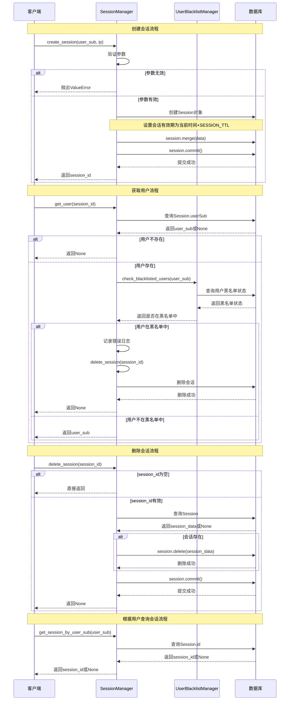
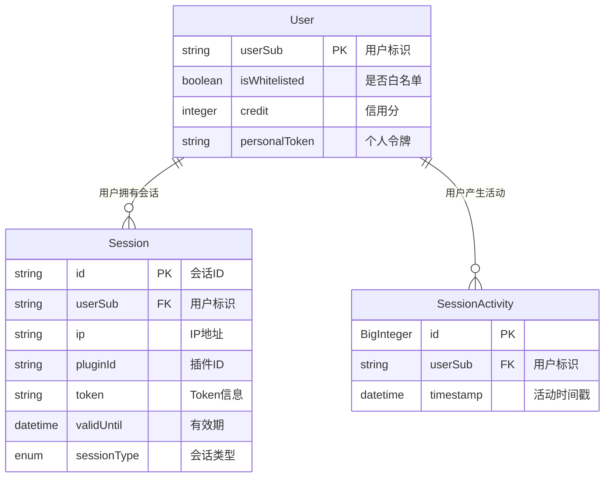

# Session模块设计文档

## 概述

Session模块是Euler Copilot框架中的会话管理系统，负责创建、删除和验证用户会话。该模块实现了基于数据库的会话存储机制，支持会话创建、会话删除、用户信息获取以及黑名单用户检查功能，确保系统安全性和用户身份验证的可靠性。

## 核心功能

- **会话创建**: 为用户创建新的浏览器会话
- **会话删除**: 删除指定的会话记录
- **用户信息获取**: 从会话中获取用户标识
- **黑名单检查**: 验证用户是否在黑名单中
- **会话查询**: 根据用户标识查询会话

## 数据模型

### Session实体

- **表名**: `framework_session`
- **主键**: `id` (String(255), 默认为随机生成的16字节十六进制字符串)
- **字段**:
  - `userSub`: 用户标识 (String(50), 外键关联framework_user.userSub)
  - `ip`: IP地址 (String(255), 可为空)
  - `pluginId`: 插件ID (String(255), 可为空)
  - `token`: Token信息 (String(2000), 可为空)
  - `validUntil`: 有效期 (DateTime, 时区感知)
  - `sessionType`: 会话类型 (Enum(SessionType))

### SessionType枚举

- `ACCESS_TOKEN`: 访问令牌
- `REFRESH_TOKEN`: 刷新令牌
- `PLUGIN_TOKEN`: 插件令牌
- `CODE`: 代码类型会话

## 配置常量

- `SESSION_TTL`: 会话有效期，单位为分钟 (默认: 30 \* 24 \* 60，即30天)

## 服务层

### SessionManager类

#### 静态方法

- `create_session(user_sub, ip)`: 创建浏览器会话
- `delete_session(session_id)`: 删除浏览器会话
- `get_user(session_id)`: 从会话中获取用户
- `get_session_by_user_sub(user_sub)`: 根据用户标识获取会话

## 时序图



## ER图



## 流程图

```mermaid
flowchart TD
    subgraph "创建会话流程"
        A1[客户端请求创建会话] --> B1{验证参数}
        B1 -->|参数无效| C1[抛出ValueError]
        B1 -->|参数有效| D1[创建Session对象]
        D1 --> E1[设置会话有效期]
        E1 --> F1[保存到数据库]
        F1 --> G1[返回session_id]
    end
    
    subgraph "获取用户流程"
        A2[客户端请求获取用户] --> B2[查询会话]
        B2 --> C2{会话存在?}
        C2 -->|不存在| D2[返回None]
        C2 -->|存在| E2[查询黑名单]
        E2 --> F2{用户在黑名单?}
        F2 -->|是| G2[记录错误日志]
        G2 --> H2[删除会话]
        H2 --> I2[返回None]
        F2 -->|否| J2[返回user_sub]
    end
    
    subgraph "删除会话流程"
        A3[客户端请求删除会话] --> B3{session_id为空?}
        B3 -->|是| C3[直接返回]
        B3 -->|否| D3[查询会话]
        D3 --> E3{会话存在?}
        E3 -->|是| F3[删除会话]
        E3 -->|否| G3[提交事务]
        F3 --> G3
        G3 --> H3[返回None]
    end
    
    subgraph "根据用户查询会话流程"
        A4[客户端请求查询会话] --> B4[查询数据库]
        B4 --> C4[返回session_id或None]
    end
    
    style A1 fill:#e1f5fe
    style G1 fill:#c8e6c9
    style A2 fill:#e1f5fe
    style D2 fill:#fff3e0
    style I2 fill:#fff3e0
    style J2 fill:#c8e6c9
    style A3 fill:#e1f5fe
    style H3 fill:#c8e6c9
    style A4 fill:#e1f5fe
    style C4 fill:#c8e6c9
```



## 安全考虑

1. **会话有效期**: 会话设置了30天的默认有效期，防止长期未使用的会话被滥用
2. **IP地址验证**: 创建会话时验证IP地址，防止无效请求
3. **用户黑名单检查**: 获取用户信息时检查用户是否在黑名单中，增强系统安全性
4. **会话自动清理**: 对于黑名单用户的会话自动删除，防止未授权访问
5. **参数验证**: 对输入参数进行严格验证，防止无效数据

## 性能优化

1. **数据库索引**: 对userSub和id字段建立索引，提高查询效率
2. **异步操作**: 所有数据库操作使用异步方式，提高并发性能
3. **连接池管理**: 使用数据库连接池管理连接，减少连接开销
4. **最小化查询**: get_user方法只查询必要的userSub字段，而非整个Session对象

## 与其他模块的交互

1. **UserBlacklistManager**: 用于检查用户是否在黑名单中
2. **PostgreSQL数据库**: 用于存储和检索会话数据
3. **认证系统**: 提供会话创建和验证功能
4. **路由层**: 使用会话管理功能进行用户身份验证

## 异常处理

### ValueError异常

- **触发条件**: 当创建会话时提供的IP地址或用户标识为空
- **错误信息**: "用户IP错误！" 或 "用户名错误！"
- **处理方式**: 向上层抛出异常，由调用方处理

## 配置说明

```toml
# 会话配置
SESSION_TTL = 43200  # 会话有效期(分钟)，默认30天
```

## 使用示例

```python
# 创建会话
session_id = await SessionManager.create_session(user_sub="user123", ip="192.168.1.1")

# 获取用户信息
user_sub = await SessionManager.get_user(session_id)
if user_sub:
    # 用户有效，处理业务逻辑
else:
    # 用户无效或在黑名单中

# 删除会话
await SessionManager.delete_session(session_id)

# 根据用户查询会话
session_id = await SessionManager.get_session_by_user_sub(user_sub)
```

## 扩展性

1. **会话类型扩展**: SessionType枚举可以扩展支持更多会话类型
2. **会话属性扩展**: Session模型可以添加更多字段以支持额外功能
3. **验证机制扩展**: 可以增加更多的验证逻辑，如设备指纹验证
4. **分布式会话**: 可以扩展支持分布式环境下的会话管理
