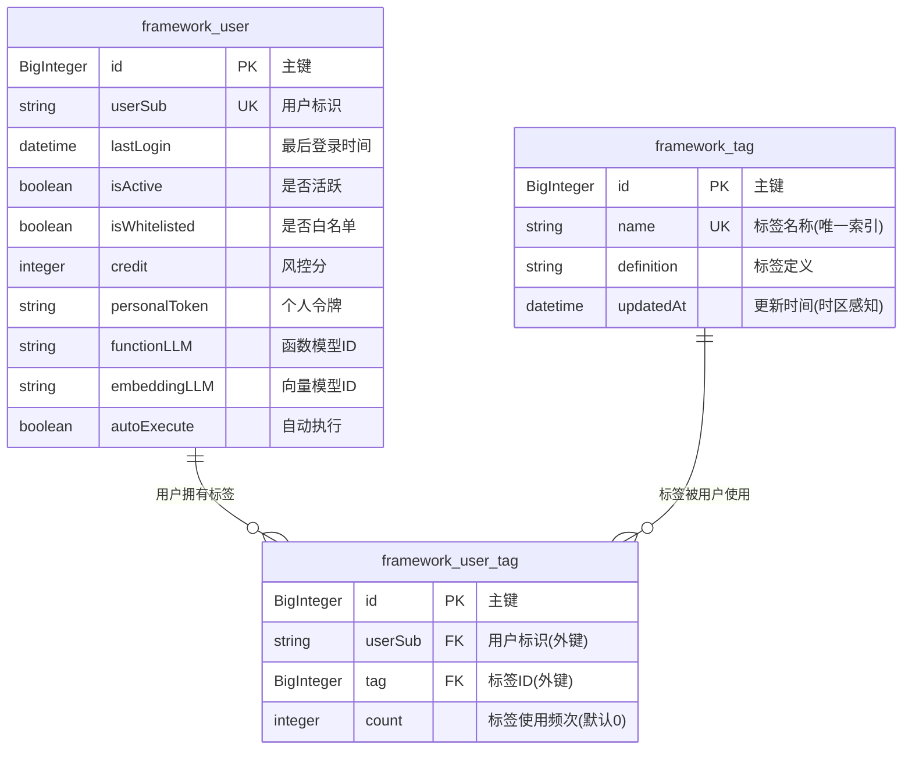
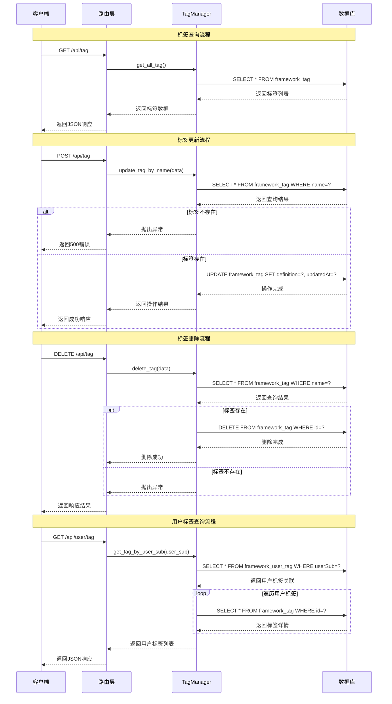
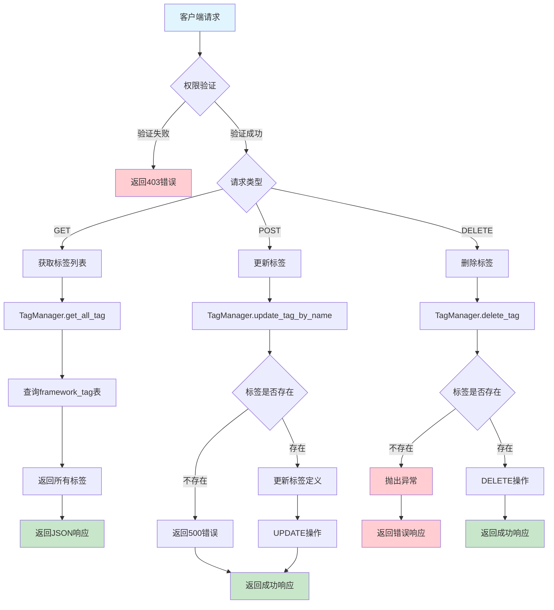
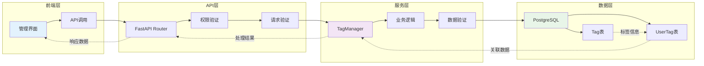

# Tag模块设计文档

## 概述

Tag 模块是 openEuler Intelligence 框架中的用户标签管理系统，用于管理用户分类标签的定义、更新和删除操作，并提供用户标签关联功能。当前公开的管理 API 仅支持查询/修改/删除已有标签，新增标签需通过后端内部调用 `TagManager.add_tag` 完成。

## 核心功能

- **标签管理**: 查询、更新、删除标签（新增操作需后端内部调用）
- **用户标签关联**: 管理用户与标签的关联关系
- **标签统计**: 统计标签使用频次
- **权限控制**: 仅管理员可进行标签管理操作

## 数据模型

### 数据表说明

- **framework_tag**: 标签基础信息表，存储标签的定义和元数据
- **framework_user_tag**: 用户标签关联表，记录用户与标签的多对多关系及使用频次
- **framework_user**: 用户基础信息表，通过userSub字段与标签系统关联

## API接口

### 管理接口 (需要管理员权限)

#### GET /api/tag

- **功能**: 获取所有标签列表
- **权限**: 管理员
- **返回**: 标签信息列表

#### POST /api/tag

- **功能**: 更新已有标签定义
- **权限**: 管理员
- **请求体**: `PostTagData`
  - `tag`: 标签名称
  - `description`: 标签描述
- **逻辑**: 标签存在时更新 `definition` 和 `updatedAt`；标签不存在时抛出 `ValueError`（接口返回 500）。

#### DELETE /api/tag

- **功能**: 删除标签
- **权限**: 管理员
- **请求体**: `PostTagData`
- **逻辑**: 根据标签名称删除对应标签

## 服务层

### TagManager类

#### 静态方法

- `get_all_tag()`: 获取所有标签
- `get_tag_by_name(name)`: 根据名称获取标签
- `get_tag_by_user_sub(user_sub)`: 获取用户的所有标签
- `add_tag(data)`: 添加新标签（当前路由未调用）
- `update_tag_by_name(data)`: 更新标签定义，标签不存在时抛出 `ValueError`
- `delete_tag(data)`: 删除标签

## 时序图

## 流程图

## 数据流转图

## 安全考虑

1. **权限控制**: 所有标签管理操作需要管理员权限
2. **数据验证**: 输入数据长度和格式验证
