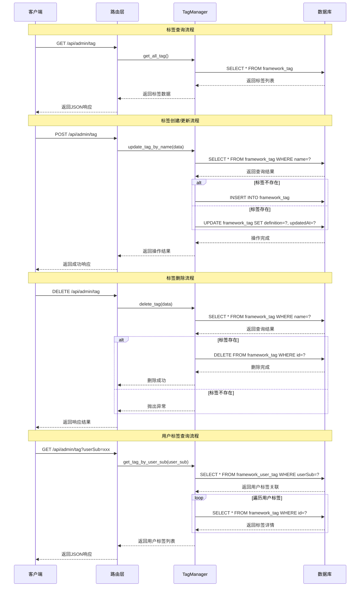
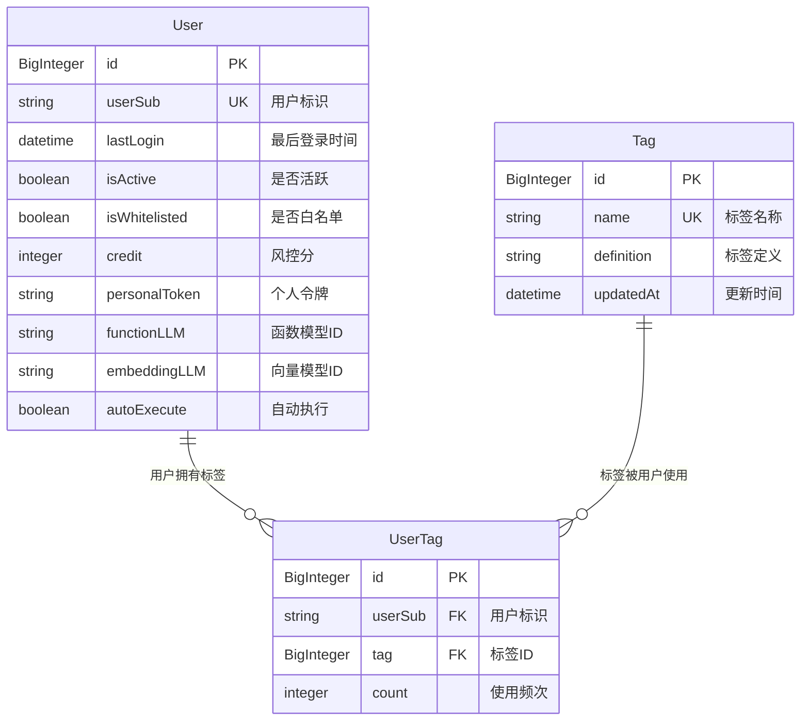
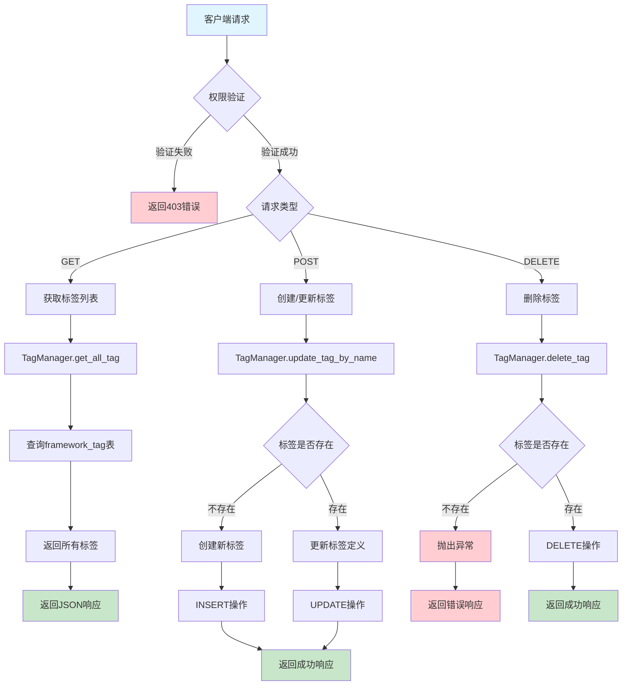

# Tag模块设计文档

## 概述

Tag模块是Euler Copilot框架中的用户标签管理系统，用于管理用户分类标签的定义、创建、更新和删除操作。该模块支持标签的CRUD操作，并提供用户标签关联功能。

## 核心功能

- **标签管理**: 创建、查询、更新、删除标签
- **用户标签关联**: 管理用户与标签的关联关系
- **标签统计**: 统计标签使用频次
- **权限控制**: 仅管理员可进行标签管理操作

## 数据模型

### Tag实体

- **表名**: `framework_tag`
- **主键**: `id` (BigInteger, 自增)
- **字段**:
  - `name`: 标签名称 (String(255), 唯一索引)
  - `definition`: 标签定义 (String(2000))
  - `updatedAt`: 更新时间 (DateTime, 时区感知)

### UserTag关联实体

- **表名**: `framework_user_tag`
- **主键**: `id` (BigInteger, 自增)
- **字段**:
  - `userSub`: 用户标识 (String(50), 外键关联framework_user.userSub)
  - `tag`: 标签ID (BigInteger, 外键关联framework_tag.id)
  - `count`: 标签使用频次 (Integer, 默认0)

## API接口

### 管理接口 (需要管理员权限)

#### GET /api/admin/tag

- **功能**: 获取所有标签列表
- **权限**: 管理员
- **返回**: 标签信息列表

#### POST /api/admin/tag

- **功能**: 添加或更新标签
- **权限**: 管理员
- **请求体**: `PostTagData`
  - `tag`: 标签名称
  - `description`: 标签描述
- **逻辑**: 如果标签不存在则创建，存在则更新

#### DELETE /api/admin/tag

- **功能**: 删除标签
- **权限**: 管理员
- **请求体**: `PostTagData`
- **逻辑**: 根据标签名称删除对应标签

## 服务层

### TagManager类

#### 静态方法

- `get_all_tag()`: 获取所有标签
- `get_tag_by_name(name)`: 根据名称获取标签
- `get_tag_by_user_sub(user_sub)`: 获取用户的所有标签
- `add_tag(data)`: 添加新标签
- `update_tag_by_name(data)`: 更新标签定义
- `delete_tag(data)`: 删除标签

## 时序图

## ER图

## 流程图

## 数据流转图

## 安全考虑

1. **权限控制**: 所有标签管理操作需要管理员权限
2. **数据验证**: 输入数据长度和格式验证
3. **错误处理**: 完善的异常处理和错误信息返回
4. **SQL注入防护**: 使用SQLAlchemy ORM防止SQL注入

## 性能优化

1. **索引优化**: 标签名称建立唯一索引，提高查询效率
2. **连接池**: 使用数据库连接池管理连接
3. **异步操作**: 所有数据库操作使用异步方式
4. **缓存策略**: 可考虑对频繁查询的标签信息进行缓存

## 扩展性

1. **标签分类**: 可扩展支持标签分类和层级结构
2. **标签权限**: 可扩展支持标签级别的权限控制
3. **标签统计**: 可扩展更丰富的标签使用统计分析
4. **批量操作**: 可扩展支持批量标签管理操作
