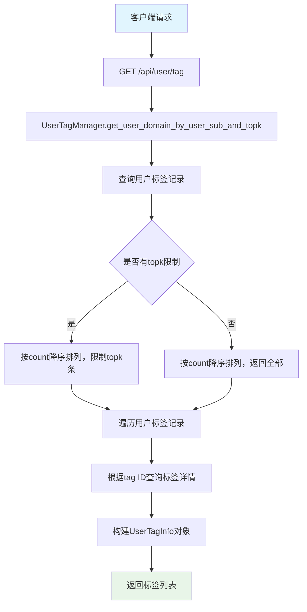

# User模块设计文档

## 概述

User 模块是 openEuler Intelligence 框架中的核心用户管理模块，负责处理用户信息的CRUD操作、用户LLM配置管理、用户标签管理等功能。该模块采用分层架构设计，包含数据模型层、服务层和路由层。

## 架构设计

### 模块结构

```text
apps/
├── models/user.py          # 用户数据模型
├── services/user.py        # 用户服务层
├── routers/user.py         # 用户路由层
├── schemas/
│   ├── user.py            # 用户响应数据结构
│   ├── request_data.py    # 用户请求数据结构
│   └── response_data.py   # 通用响应数据结构
└── services/
    ├── user_tag.py        # 用户标签服务
    ├── llm.py            # LLM管理服务
    └── personal_token.py  # 个人令牌服务
```

### 数据模型关系


## 核心功能

### 1. 用户管理 (UserManager)

#### 功能流程图


#### 主要方法

1. **list_user(n, page)**: 分页获取用户列表
2. **get_user(user_sub)**: 根据用户标识获取用户信息
3. **update_user(user_sub, data)**: 更新用户信息，支持创建新用户
4. **delete_user(user_sub)**: 删除用户及相关数据

### 2. 用户LLM配置管理

#### LLM配置更新时序图


Note: 该流程不会校验 Function LLM 是否存在；当新的 embedding LLM 未找到时，系统仅记录错误日志，接口仍返回成功。

#### 核心逻辑

1. **模型验证**: 当前实现不会主动校验 Function LLM/Embedding LLM 是否存在；仅在后续向量化阶段尝试按 ID 查询模型
2. **数据更新**: 将请求中的 `functionLLM`、`embeddingLLM` 直接写入用户表
3. **向量化处理**: 当 embedding 模型发生变化时尝试初始化新模型并触发向量化；若模型缺失将记录错误但不回滚已保存的字段

### 3. 用户标签管理

#### 用户标签获取流程



#### 标签更新流程


## API接口设计

### 路由配置

```python
router = APIRouter(
    prefix="/api/user",
    tags=["user"],
    dependencies=[Depends(verify_session), Depends(verify_personal_token)],
)
```

### 接口列表

| 方法 | 路径 | 功能 | 描述 |
|------|------|------|------|
| POST | `/api/user/user` | 更新用户信息 | 更新当前登录用户的基本信息 |
| GET | `/api/user` | 获取用户列表 | 分页获取除当前用户外的所有用户 |
| PUT | `/api/user/llm` | 更新用户LLM配置 | 更新用户选择的Function和Embedding模型 |
| GET | `/api/user/tag` | 获取用户标签 | 获取用户最常涉及的领域标签 |

### 请求响应结构

#### 更新用户信息请求

```json
{
  "userName": "用户名",
  "autoExecute": false,
  "agreementConfirmed": true,
  "lastLogin": "2024-01-01T00:00:00Z"
}
```

#### 更新LLM配置请求

```json
{
  "functionLLM": "function-model-id",
  "embeddingLLM": "embedding-model-id"
}
```

#### 用户列表响应

```json
{
  "code": 200,
  "message": "用户数据详细信息获取成功",
  "result": {
    "total": 100,
    "userInfoList": [
      {
        "userSub": "user-123",
        "userName": "张三"
      }
    ]
  }
}
```

## 数据流转图


## 安全机制

### 1. 身份验证

- **会话验证**: 通过`verify_session`依赖验证用户会话
- **个人令牌**: 通过`verify_personal_token`依赖验证个人访问令牌

### 2. 数据隔离

- 用户只能访问和修改自己的数据
- 用户列表接口排除当前用户，避免自我操作

### 3. 数据完整性

- 用户删除时自动清理相关对话记录
- LLM配置更新时验证模型存在性
- 标签更新时验证标签有效性

## 性能优化

### 1. 数据库优化

- 用户标识(userSub)建立唯一索引
- 分页查询避免一次性加载大量数据
- 使用数据库事务确保数据一致性

### 2. 缓存策略

- 用户信息可以考虑缓存，减少数据库查询
- 标签数据可以定期更新，避免实时计算

### 3. 异步处理

- 向量化过程异步执行，不阻塞用户请求
- 使用异步数据库会话提高并发性能

## 错误处理

### 常见错误场景

1. **用户不存在**: 返回404状态码
2. **LLM模型不存在**: 返回500状态码，包含错误信息
3. **标签不存在**: 返回500状态码
4. **权限不足**: 返回403状态码
5. **数据验证失败**: 返回400状态码

### 错误响应格式

```json
{
  "code": 500,
  "message": "具体错误信息",
  "result": null
}
```

## 扩展性设计

### 1. 模块化设计

- 服务层独立，便于单元测试
- 数据模型与业务逻辑分离
- 支持插件式扩展

### 2. 配置化

- 用户权限配置化
- LLM模型配置化
- 标签系统可扩展

### 3. 监控和日志

- 完整的操作日志记录
- 性能指标监控
- 错误追踪和告警

## 总结

User模块作为openEuler Intelligence框架的核心组件，提供了完整的用户管理功能。通过分层架构设计、完善的错误处理机制和良好的扩展性，确保了系统的稳定性和可维护性。模块支持用户信息管理、LLM配置、标签系统等核心功能，为用户提供了个性化的AI助手体验。
