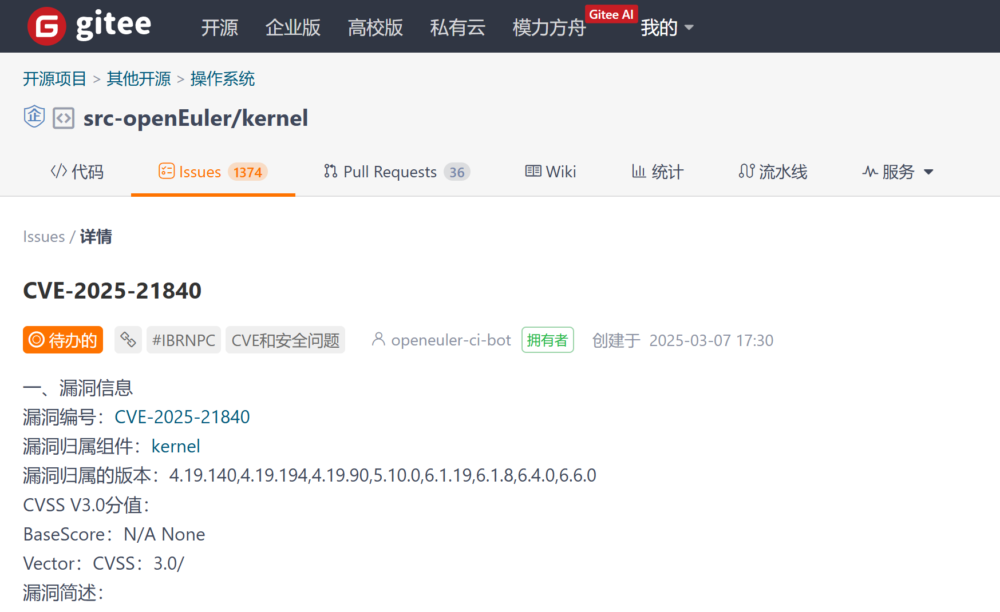
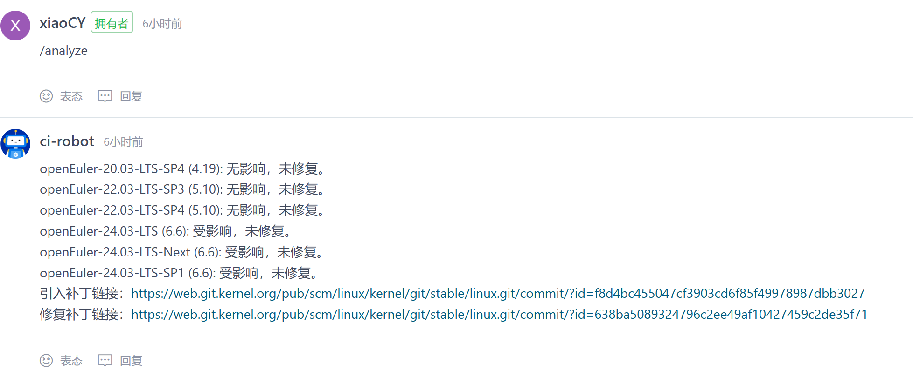
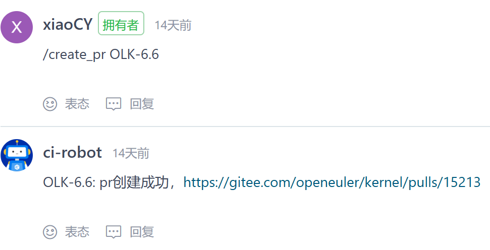

# openEuler 智能化漏洞修补用户指南

## 简介

智能化漏洞修补提供了对openEuler的kernel仓库（[https://gitee.com/openeuler/kernel](https://gitee.com/openeuler/kernel)）进行智能化修补的能力，当前提供了CVE影响范围分析和补丁PR创建的功能。在代表CVE的issue下面评论/analyze和/create_pr命令来执行功能。

## 功能入口

在src-openEuler的kernel仓库（[https://gitee.com/src-openeuler/kernel.git](https://gitee.com/src-openeuler/kernel.git)）中，对代表CVE的issue下面进行评论。



## /analyze命令

`/analyze`命令提供了对CVE影响范围进行分析的能力。通过在issue下面评论`/analyze`，即可自动对当前维护范围内的openEuler版本进行分析，判断每一个openEuler版本是否引入该CVE，是否修复该CVE。



> [!NOTE]说明  
> /analyze命令无参数

CVE是否引入存在如下几种情况：

* 无影响
* 受影响

CVE是否修复存在如下几种情况：

* 未修复
* 已修复

在评论的最后，会贴上引入补丁链接与修复补丁链接。

## /create_pr命令

`/create_pr`命令提供了对CVE的补丁进行智能化修复的能力。通过在issue下面评论`/create_pr <branch_name>`，即可自动获得漏洞补丁，并通过创建PR来合入openEuler下的linux仓库（[https://gitee.com/openeuler/kernel.git](https://gitee.com/openeuler/kernel.git)）中。


`/create_pr`命令存在参数，包括如下几种情况：

```shell
# 对OLK-5.10分支创建补丁PR
/create_pr OLK-5.10

# 对OLK-5.10、OLK-6.6分支创建PR
/create_pr OLK-5.10 OLK-6.6

# 对当前所有的上游分支，包括openEuler-1.0-LTS、OLK-5.10、OLK-6.6三个分支
/create_pr
```

返回结果如下：

* pr创建成功
* 没有修复补丁
* 无法修复，存在冲突

如果补丁代码与修复分支存在冲突的话，会提示`无法修复，存在冲突`。该能力将会在后续的版本中进行迭代强化。
