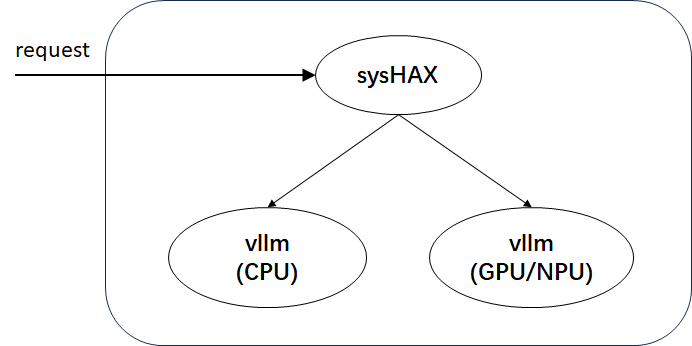

# sysHAX Deployment Guide

## Overview

sysHAX is positioned as K+X heterogeneous fusion inference acceleration, mainly containing two functional components:

- Dynamic inference scheduling
- CPU inference acceleration

**Dynamic inference scheduling**: For inference tasks, the prefill phase belongs to compute-intensive tasks, while the decode phase belongs to memory-intensive tasks. Therefore, from the perspective of computational resources, the prefill phase is suitable for execution on GPU/NPU and other hardware, while the decode phase can be executed on CPU and other hardware.

**CPU inference acceleration**: Accelerates CPU inference performance through NUMA affinity, parallel optimization, operator optimization, and other methods on the CPU.

sysHAX consists of two delivery components:



The delivery components include:

- sysHAX: Responsible for request processing and scheduling of prefill and decode requests
- vllm: vllm is a large model inference service that includes both GPU/NPU and CPU during deployment, used for processing prefill and decode requests respectively. From the perspective of developer usability, vllm will be released using containerization.

vllm is a **high-throughput, low-memory-usage large language model (LLM) inference and service engine** that supports **CPU computation acceleration** and provides efficient operator dispatch mechanisms, including:

- Schedule: Optimizes task distribution to improve parallel computation efficiency
- Prepare Input: Efficient data preprocessing to accelerate input construction
- Ray framework: Utilizes distributed computing to improve inference throughput
- Sample (model post-processing): Optimizes sampling strategies to improve generation quality
- Framework post-processing: Integrates multiple optimization strategies to improve overall inference performance

This engine combines **efficient computation scheduling and optimization strategies** to provide **faster, more stable, and more scalable** solutions for LLM inference.

## Environment Preparation

| Server Model | Kunpeng 920 Series CPU |
| ------------ | ---------------------- |
| GPU          | Nvidia A100            |
| OS           | openEuler 22.03 LTS and above |
| Python       | 3.9 and above          |
| Docker       | 25.0.3 and above       |

- Docker 25.0.3 can be installed via `dnf install moby`.

## Deployment Process

First, check whether NVIDIA drivers and CUDA drivers are already installed using `nvidia-smi` and `nvcc -V`. If not, you need to install NVIDIA drivers and CUDA drivers first.

### Install NVIDIA Container Toolkit (Container Engine Plugin)

If NVIDIA Container Toolkit is already installed, you can skip this step. Otherwise, follow the installation process below:

<https://docs.nvidia.com/datacenter/cloud-native/container-toolkit/latest/install-guide.html>

- Execute the `systemctl restart docker` command to restart docker, making the container engine plugin configuration in the docker config file effective.

### Container-based vllm Setup

The following process deploys vllm in a GPU container.

```shell
docker pull hub.oepkgs.net/neocopilot/syshax/syshax-vllm-gpu:0.2.0

docker run --name vllm_gpu \
    --ipc="shareable" \
    --shm-size=64g \
    --gpus=all \
    -p 8001:8001 \
    -v /home/models:/home/models \
    -w /home/ \
    -itd hub.oepkgs.net/neocopilot/syshax/syshax-vllm-gpu:0.2.0 bash
```

In the above script:

- `--ipc="shareable"`: Allows the container to share IPC namespace for inter-process communication.
- `--shm-size=64g`: Sets the container shared memory to 64G.
- `--gpus=all`: Allows the container to use all GPU devices on the host
- `-p 8001:8001`: Port mapping, mapping the host's port 8001 to the container's port 8001. Developers can modify this as needed.
- `-v /home/models:/home/models`: Directory mounting, mapping the host's `/home/models` to `/home/models` inside the container for model sharing. Developers can modify the mapping directory as needed.

```shell
vllm serve /home/models/DeepSeek-R1-Distill-Qwen-32B \
    --served-model-name=ds-32b \
    --host 0.0.0.0 \
    --port 8001 \
    --dtype=half \
    --swap_space=16 \
    --block_size=16 \
    --preemption_mode=swap \
    --max_model_len=8192 \
    --tensor-parallel-size 2 \
    --gpu_memory_utilization=0.8
```

In the above script:

- `--tensor-parallel-size 2`: Enables tensor parallelism, splitting the model across 2 GPUs. Requires at least 2 GPUs. Developers can modify this as needed.
- `--gpu_memory_utilization=0.8`: Limits GPU memory usage to 80% to avoid service crashes due to memory exhaustion. Developers can modify this as needed.

The following process deploys vllm in a CPU container.

```shell
docker pull hub.oepkgs.net/neocopilot/syshax/syshax-vllm-cpu:0.2.0

docker run --name vllm_cpu \
    --ipc container:vllm_gpu \
    --shm-size=64g \
    --privileged \
    -p 8002:8002 \
    -v /home/models:/home/models \
    -w /home/ \
    -itd hub.oepkgs.net/neocopilot/syshax/syshax-vllm-cpu:0.2.0 bash
```

In the above script:

- `--ipc container:vllm_gpu`: Shares the IPC (inter-process communication) namespace with the container named vllm_gpu. Allows this container to exchange data directly through shared memory, avoiding cross-container copying.

```shell
INFERENCE_OP_MODE=fused OMP_NUM_THREADS=160 CUSTOM_CPU_AFFINITY=0-159 SYSHAX_QUANTIZE=q8_0 \
vllm serve /home/models/DeepSeek-R1-Distill-Qwen-32B \
    --served-model-name=ds-32b \
    --host 0.0.0.0 \
    --port 8002 \
    --dtype=half \
    --block_size=16 \
    --preemption_mode=swap \
    --max_model_len=8192
```

In the above script:

- `INFERENCE_OP_MODE=fused`: Enables CPU inference acceleration
- `OMP_NUM_THREADS=160`: Specifies the number of CPU inference threads to start as 160. This environment variable only takes effect after specifying INFERENCE_OP_MODE=fused.
- `CUSTOM_CPU_AFFINITY=0-159`: Specifies the CPU binding scheme, which will be explained in detail later.
- `SYSHAX_QUANTIZE=q8_0`: Specifies the quantization scheme as q8_0. The current version supports 2 quantization schemes: `q8_0`, `q4_0`.

Note: The GPU container must be started first before starting the CPU container.

Use lscpu to check the current machine's hardware configuration, focusing on:

```shell
Architecture:             aarch64
  CPU op-mode(s):         64-bit
  Byte Order:             Little Endian
CPU(s):                   160
  On-line CPU(s) list:    0-159
Vendor ID:                HiSilicon
  BIOS Vendor ID:         HiSilicon
  Model name:             -
    Model:                0
    Thread(s) per core:   1
    Core(s) per socket:   80
    Socket(s):            2
NUMA:
  NUMA node(s):           4
  NUMA node0 CPU(s):      0-39
  NUMA node1 CPU(s):      40-79
  NUMA node2 CPU(s):      80-119
  NUMA node3 CPU(s):      120-159
```

This machine has 160 physical cores, no SMT enabled, 4 NUMA nodes, with 40 cores on each NUMA.

Use these two environment variables to set the CPU binding scheme: `OMP_NUM_THREADS=160 CUSTOM_CPU_AFFINITY=0-159`. In these two environment variables, the first one is the number of CPU inference threads to start, and the second one is the IDs of the CPUs to bind. In CPU inference acceleration, to achieve NUMA affinity, CPU binding operations are required, following these rules:

- The number of started threads must match the number of bound CPUs;
- The number of CPUs used on each NUMA must be the same to maintain load balancing.

For example, in the above script, CPUs 0-159 are bound. Among them, 0-39 belong to NUMA node 0, 40-79 belong to NUMA node 1, 80-119 belong to NUMA node 2, and 120-159 belong to NUMA node 3. Each NUMA uses 40 CPUs, ensuring load balancing across all NUMAs.

### sysHAX Installation

sysHAX installation:

```shell
dnf install sysHAX
```

Before starting sysHAX, some basic configuration is needed:

```shell
syshax init
syshax config services.gpu.port 8001
syshax config services.cpu.port 8002
syshax config services.conductor.port 8010
syshax config models.default ds-32b
```

Additionally, you can use `syshax config --help` to view all configuration commands.

After configuration is complete, start the sysHAX service with the following command:

```shell
syshax run
```

When starting the sysHAX service, service connectivity testing will be performed. sysHAX complies with openAPI standards. Once the service is started, you can use APIs to call the large model service. You can test it with the following script:

```shell
curl http://0.0.0.0:8010/v1/chat/completions -H "Content-Type: application/json" -d '{
    "model": "ds-32b",
    "messages": [
        {
            "role": "user",
            "content": "Introduce openEuler."
        }
    ],
    "stream": true,
    "max_tokens": 1024
}'
```
