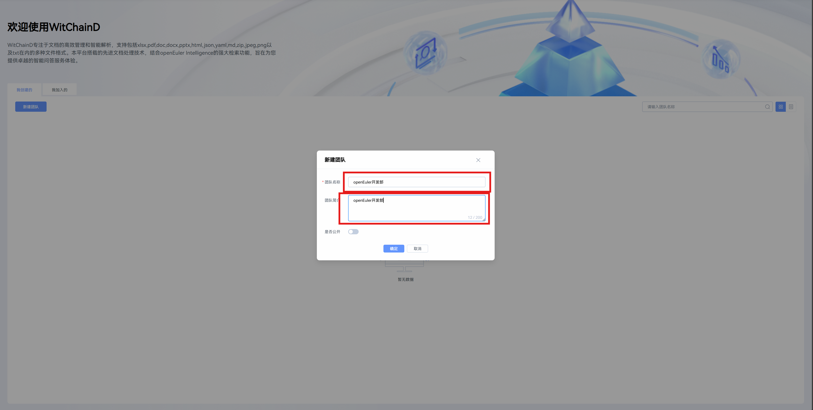
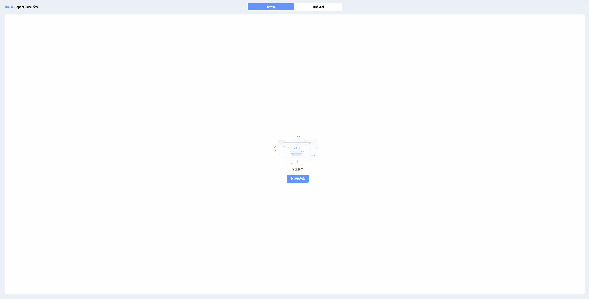
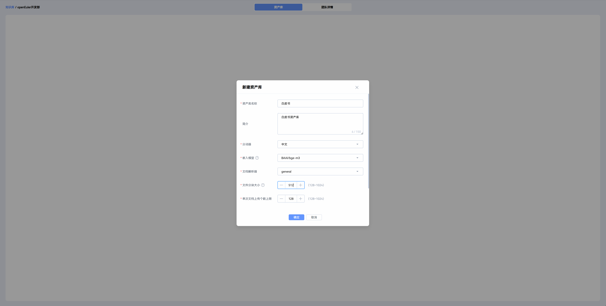
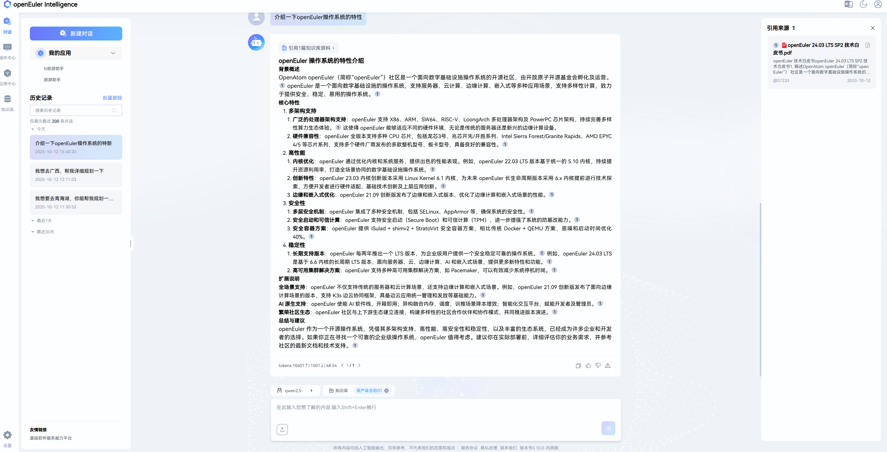
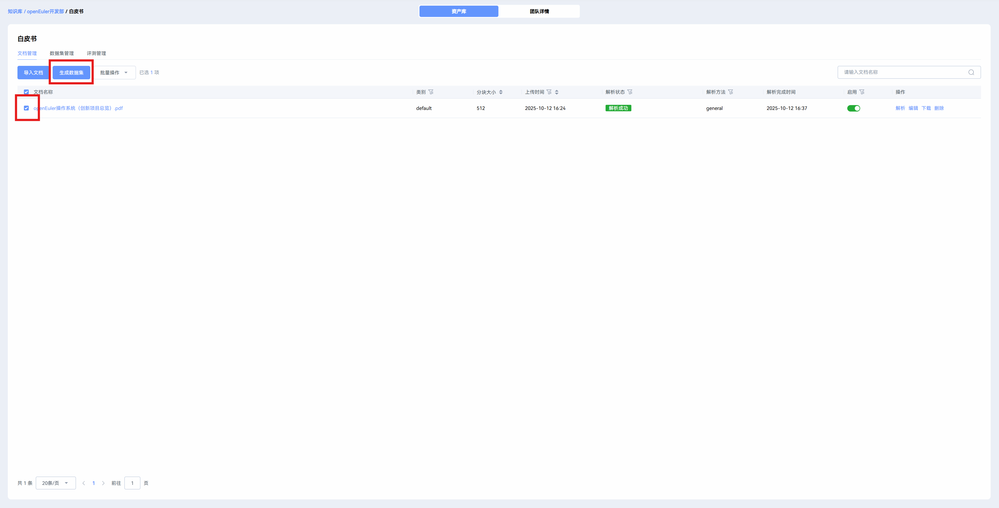
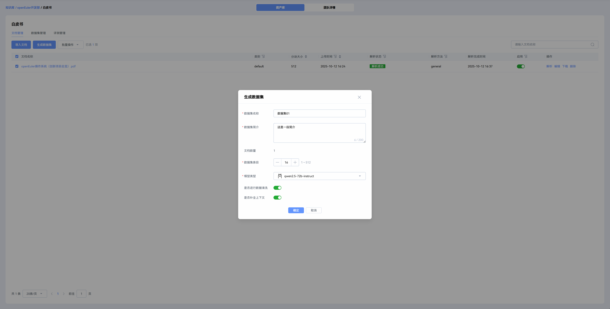
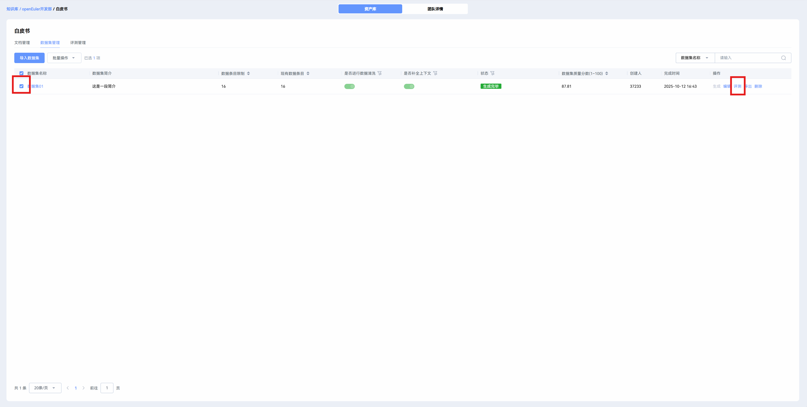

# witChainD User Guide – Knowledge Base Management

## 1. Overview

After the deployment of openEuler intelligence is completed, witChainD is integrated into the web page, allowing you to use witChainD for knowledge base management. Below is an introduction to the usage of witChainD.

1. Overview
2. Create Team
3. Create Asset Library
4. Upload Documents
5. Generate Dataset
6. Accuracy Test
7. Summary

## 2. Create Team

To create a new team, click "Create Team" to set up your own team. Enter the team name and team description in the corresponding fields, optionally set whether to make the team public, then click "Confirm".

After creating the team, the newly created team will be displayed on the witChainD page.

## 3. Create Asset Library

Click the newly created team to enter the **Team Asset Library Page**, then click "Create Asset Library".

Fill in information such as the asset library name and description.

After clicking "Confirm", a prompt will pop up asking whether to import documents. You can choose to import documents directly, or enter the newly created asset library later to import documents.

After creating the team asset library, the newly created knowledge base will be displayed on the team page.

## 4. Upload Documents

Click an asset library to enter the **Asset Library Page**, then click "Import Documents", select files and import them (multiple files can be selected for import).

After the import is completed, the newly imported documents will be displayed in the asset library and parsed. Once parsing is finished, you can perform related operations on the documents, such as using them to generate a dataset.

After successful parsing, click the document name to view the parsing status. You can also click "Reparse" to re-analyze the document, and set different parsing methods through the edit function.

The parsing results are roughly as follows:

After uploading the documents, you can select a knowledge base to start a conversation in openEuler intelligence.

The citation numbers in each answer match the citation sources on the right.

## Supplementary Chapters Below

These chapters are used to verify the effect and status of imported documents, helping developers optimize the system.

## 5. Generate Dataset

You can select imported document sets to generate a dataset. Check the documents needed for dataset generation and click "Generate Dataset".

Fill in relevant information and select required configurations, then click "Generate" to wait for the dataset generation in the **Dataset Management Page**.

You can click on a dataset name to view the dataset generation status. The results are roughly as follows:

## 6. Accuracy Test

For dataset evaluation, check the dataset and click **Generate**.

Fill in relevant evaluation information and configurations, then click "Confirm" to evaluate the selected dataset.

After the dataset evaluation is completed, you can click the test name to view the dataset test status. The results are roughly as follows:

## 7. Summary

Based on the above process, users can quickly get started with witChainD. Welcome to experience and explore more functional scenarios.
