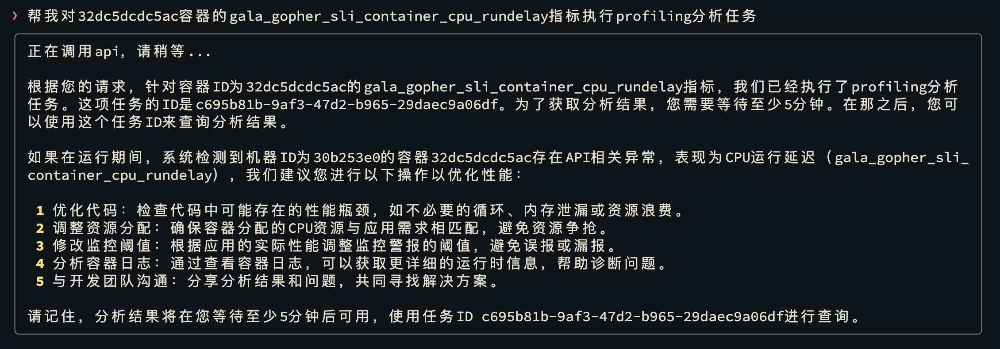

# Smart Plugin: Intelligent Diagnosis

After deploying the intelligent diagnosis tool, you can use the EulerCopilot intelligent agent framework to perform diagnostics on your local machine.
In intelligent diagnosis mode, the intelligent agent framework service can call local diagnostic tools to diagnose abnormal conditions, analyze them, and generate reports.

## Operation Steps

**Step 1** Switch to "Smart Plugin" mode

```bash
copilot -p
```


**Step 2** Abnormal Event Detection

```bash
Help me perform abnormal event detection
```

Press `Ctrl + O` to ask a question, then select "Intelligent Diagnosis" from the plugin list.


**Step 3** View Abnormal Event Details

```bash
View abnormal event details for XXX container
```


**Step 4** Execute Abnormal Event Analysis

```bash
Please perform profiling analysis on XXX metrics for XXX container
```



**Step 5** View Abnormal Event Analysis Report

Wait 5 to 10 minutes, then view the analysis report.

```bash
View the profiling report corresponding to <profiling-id>
```


