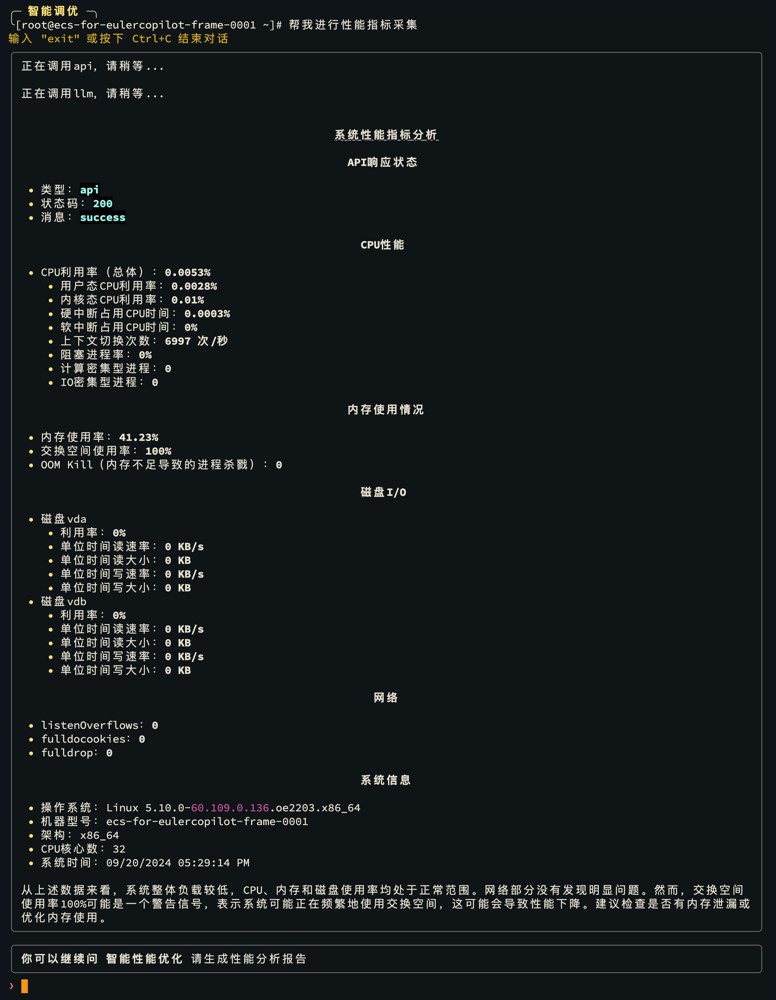
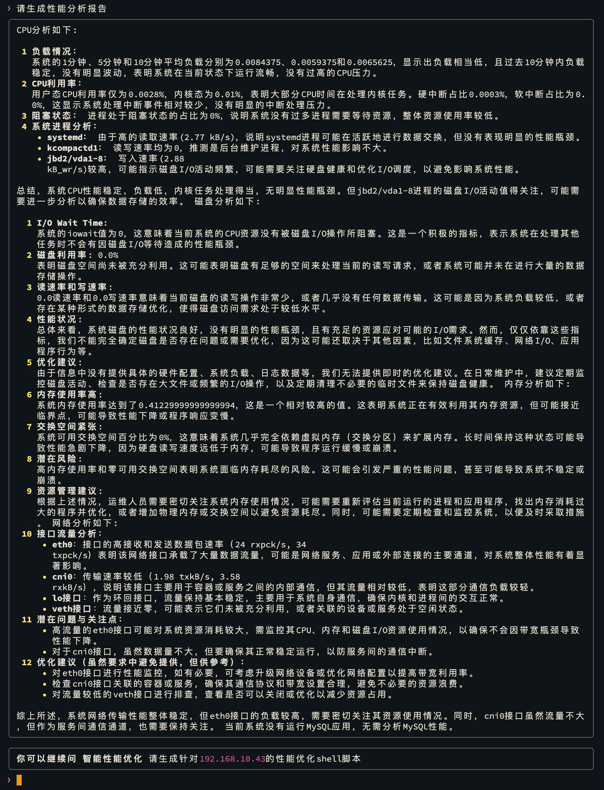
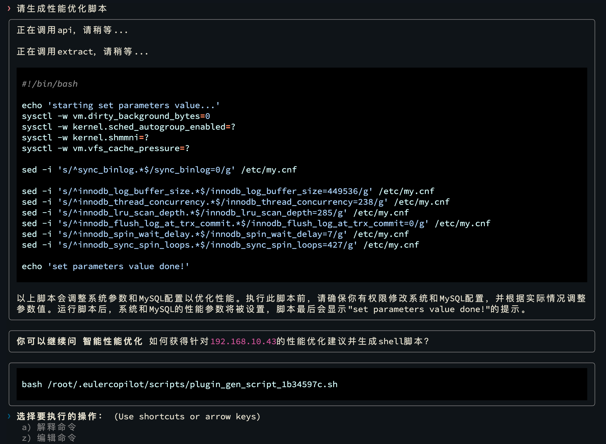
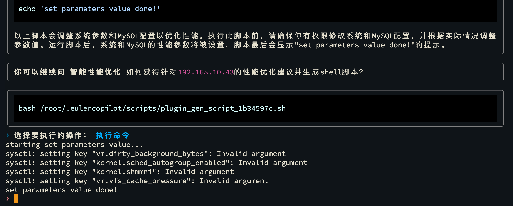
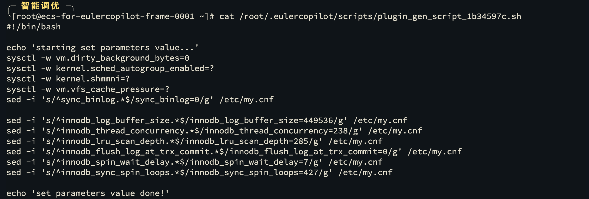

# Smart Plugin: Intelligent Tuning

After deploying the intelligent tuning tool, you can use the EulerCopilot agent framework to perform tuning on the local machine.
In intelligent tuning mode, the agent framework service can call the local tuning tool to collect performance metrics and generate performance analysis reports and performance optimization recommendations.

## Operation Steps

**Step 1** Switch to "Intelligent Tuning" mode

```bash
copilot -t
```


**Step 2** Collect Performance Metrics

```bash
Help me collect performance metrics
```



**Step 3** Generate Performance Analysis Report

```bash
Help me generate a performance analysis report
```



**Step 4** Generate Performance Optimization Recommendations

```bash
Please generate a performance optimization script
```



**Step 5** Select "Execute Command" to run the optimization script



- Script content as shown in the figure:
  

## Remote Tuning

If you need to perform remote tuning on other machines, please add the corresponding machine's IP address before the questions in the examples above.

For example: `Please perform performance metrics collection on the machine 192.168.1.100.`

Before performing remote tuning, please ensure that the target machine has deployed the intelligent tuning tool, and also ensure that the EulerCopilot agent framework can access the target machine.
