# Command Line Assistant User Guide

## Introduction

EulerCopilot Command Line Assistant is a command line (Shell) AI assistant that allows you to quickly generate and execute Shell commands, thereby improving your work efficiency. Additionally, the standard version based on Gitee AI online service comes with built-in knowledge about openEuler, helping you learn and use the openEuler operating system.

## System Requirements

- Operating System: openEuler 22.03 LTS SP3, or openEuler 24.03 LTS and above
- Command Line Software:
  - Linux Desktop Environment: Supports built-in terminals in desktop environments such as GNOME, KDE, DDE, etc.
  - Remote SSH Connection: Supports terminals compatible with xterm-256 and UTF-8 character sets

## Installation

EulerCopilot Command Line Assistant can be installed through the OEPKGS repository.

### Configure OEPKGS Repository

```bash
sudo dnf config-manager --add-repo https://repo.oepkgs.net/openeuler/rpm/`sed 's/release //;s/[()]//g;s/ /-/g' /etc/openEuler-release`/extras/`uname -m`
```

```bash
sudo dnf clean all
```

```bash
sudo dnf makecache
```

### Install Command Line Assistant

```bash
sudo dnf install eulercopilot-cli
```

If you encounter `Error: GPG check FAILED`, use `--nogpgcheck` to skip the check.

```bash
sudo dnf install --nogpgcheck eulercopilot-cli
```

## Initialization

```bash
copilot --init
```

Then follow the prompts to enter your API Key to complete the configuration.

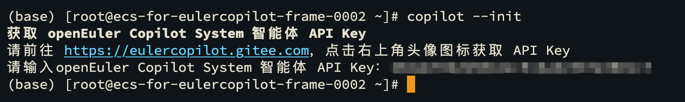

Please exit the terminal or reconnect your SSH session before first use to make the configuration effective.

- **View Assistant Help Page**

  ```bash
  copilot --help
  ```

  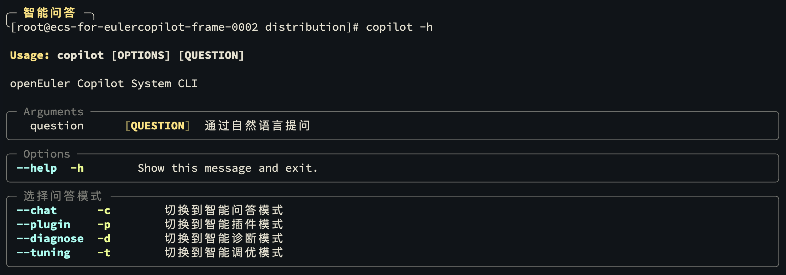

## Usage

Enter your question in the terminal and press `Ctrl + O` to ask.

### Shortcuts

- After entering a natural language question, press `Ctrl + O` to directly ask the AI.
- Pressing `Ctrl + O` directly will automatically fill in the command prefix `copilot`, and you can press `Enter` after entering parameters to execute.

### Smart Q&A

After the command line assistant is initialized, it defaults to smart Q&A mode.
The current mode will be displayed in the **top-left corner** of the command prompt.
If the current mode is not "Smart Q&A", execute `copilot -c` (`copilot --chat`) to switch to smart Q&A mode.

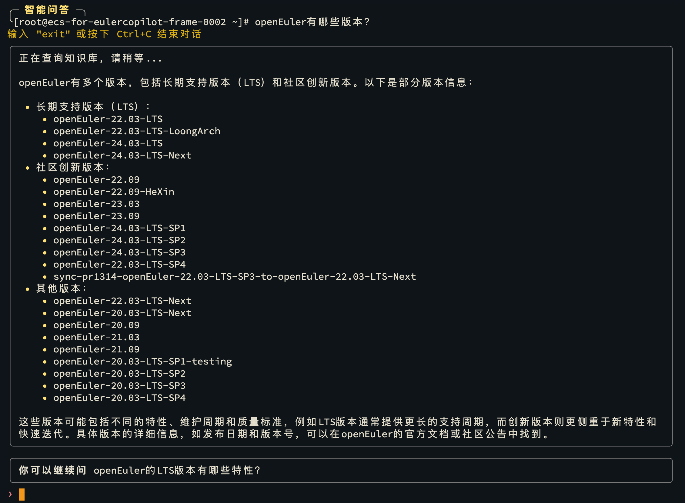

After the AI answers, it will generate recommended questions based on the Q&A history. You can copy and paste them into the command line for follow-up questions. After entering a follow-up question, press `Enter` to ask.


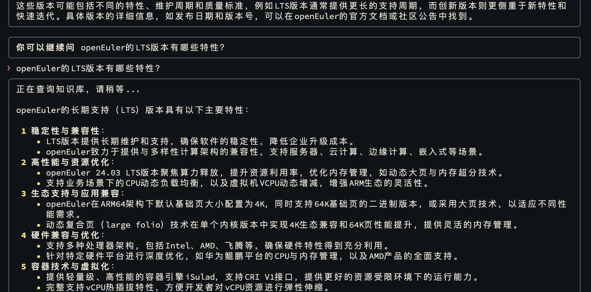

Smart Q&A mode supports continuous follow-up questions, with each follow-up question able to associate with up to 3 historical Q&A contexts.

Enter `exit` to exit smart Q&A mode and return to the Linux command line.

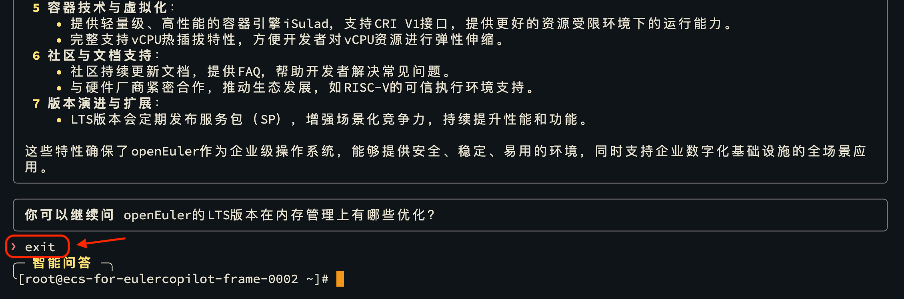

- If you encounter program errors during Q&A, you can press `Ctrl + C` to immediately exit the current Q&A, then try asking again.

### Shell Commands

The AI will return Shell commands based on your question. EulerCopilot Command Line Assistant can explain, edit, or execute these commands and display the command execution results.

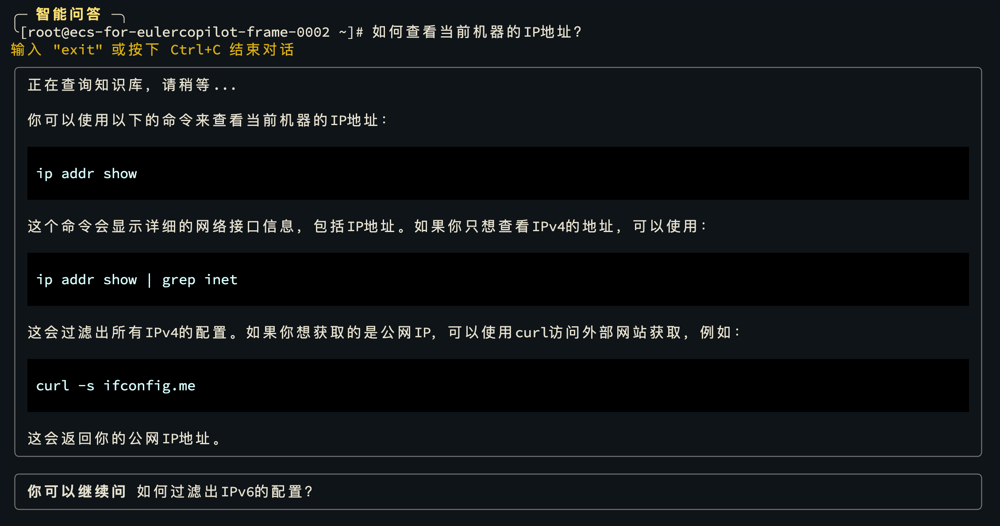

The command line assistant will automatically extract commands from the AI's response and display related operations. You can use the up and down arrow keys to select operations and press `Enter` to confirm.

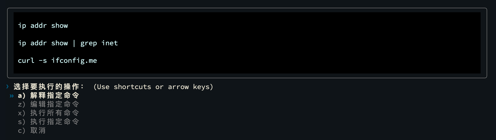

#### Explanation

If the AI only returns one command, selecting explanation will directly request the AI to explain the command and display the answer.
If the AI answers with multiple commands, selecting will display a command list, and you can choose **one** command at a time to request AI explanation.

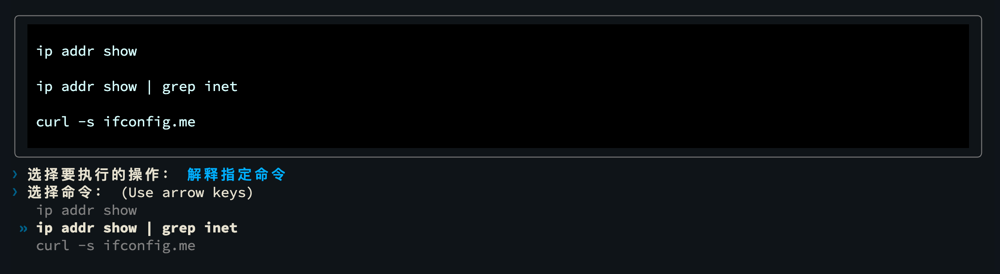

After completing the explanation, you can continue to select other operations.

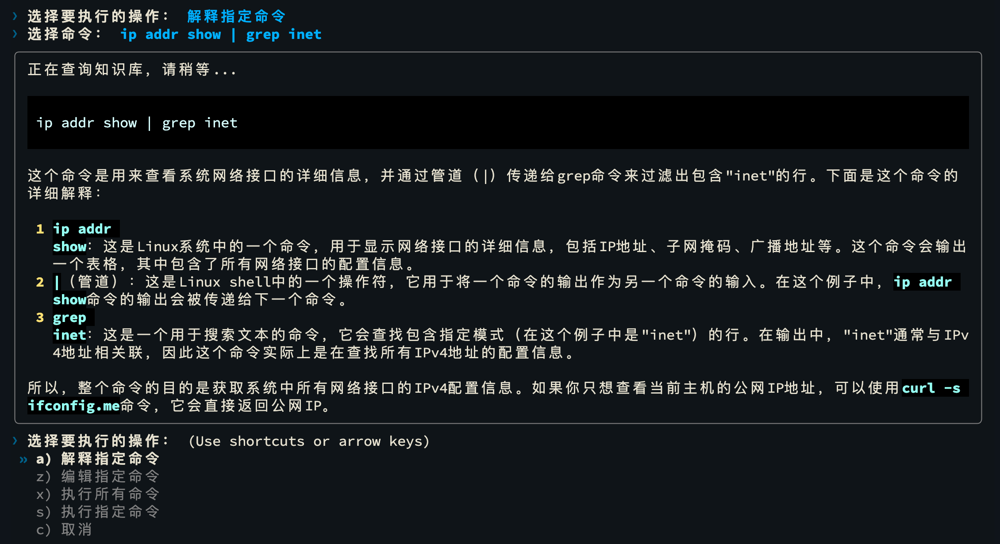

#### Edit


Select a command to edit, and press `Enter` to confirm after editing.

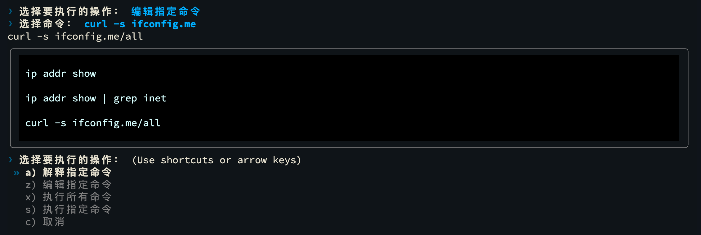

After completing the edit, you can continue editing other commands or select other operations.

#### Execute

If the AI only returns one command, selecting execute will directly execute the command and display the execution result.
If the AI answers with multiple commands, selecting will display a command list, and you can choose **multiple** commands to execute.

You can use the up and down arrow keys to move the cursor, press the `Spacebar` to select commands, and press `Enter` to execute the selected commands.
Selected commands will display with **blue highlighting**, as shown in the figure.

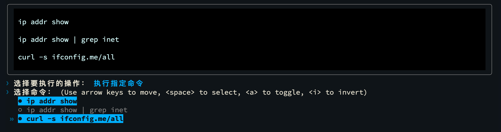

If no commands are selected and you press `Enter` directly, it will skip executing commands and proceed directly to the next round of Q&A.

After pressing `Enter`, the selected commands will be executed from top to bottom in sequence.

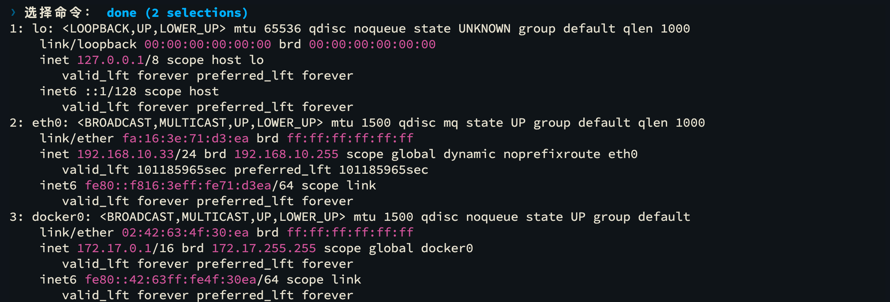

If errors occur during execution, the command line assistant will display error messages and **terminate command execution**, entering the next round of Q&A.
You can prompt the AI to correct commands or ask the AI to regenerate commands in the next round of Q&A.

## Uninstallation

```bash
sudo dnf remove eulercopilot-cli
```

Then use the following command to delete the configuration file.

```bash
rm ~/.config/eulercopilot/config.json
```

After uninstallation is complete, please restart the terminal or reconnect your SSH session to restore the configuration.
