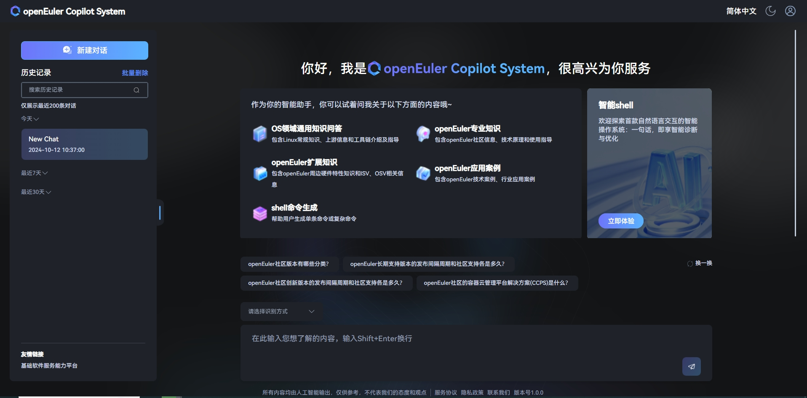

# **EulerCopilot Intelligent Assistant Deployment Guide**

Version Information
Current Version: v0.9.5
Update Date: April 1, 2025

## Product Overview

EulerCopilot is an intelligent Q&A tool that solves the convenience of acquiring operating system knowledge and empowers developers and operations personnel in the OS domain model. As a knowledge acquisition tool for operating systems that enables OS productivity (such as A-Ops / A-Tune / x2openEuler / EulerMaker / EulerDevOps / StratoVirt / iSulad, etc.), it transforms the traditional command delivery method to a natural semantic approach and combines with the intelligent agent task planning capabilities, lowering the threshold for developing and using operating system features.

This guide provides system deployment instructions for the EulerCopilot intelligent assistant based on automated scripts, supporting both one-click automatic deployment and manual step-by-step deployment methods.

### Component Introduction

| Component                     | Port            | Description             |
| ----------------------------- | --------------- | ----------------------- |
| euler-copilot-framework       | 8002 (internal port) | Intelligent agent framework service  |
| euler-copilot-web             | 8080            | Intelligent agent frontend interface |
| euler-copilot-rag             | 9988 (internal port) | Retrieval-Augmented Generation service |
| authhub-backend-service       | 11120 (internal port) | Authentication service backend |
| authhub-web-service           | 8000            | Authentication service frontend |
| mysql                         | 3306 (internal port) | MySQL database |
| redis                         | 6379 (internal port) | Redis database |
| minio                         | 9000 (internal port) 9001 (external port) | minio database |
| mongo                         | 27017 (internal port) | mongo database |
| postgres                      | 5432 (internal port) | Vector database |
| secret_inject                 | None            | Secure configuration file replication tool |

### Software Requirements

| Type | Version Requirements | Description |
|------|----------------------|-------------|
| Operating System | openEuler 22.03 LTS and above | None |
| K3s | >= v1.30.2, with Traefik Ingress tool | K3s provides a lightweight Kubernetes cluster, easy to deploy and manage |
| Helm | >= v3.15.3 | Helm is a Kubernetes package management tool, aimed at quickly installing, upgrading, and uninstalling EulerCopilot services |
| python | >=3.9.9 | Python 3.9.9 and above provides the runtime environment for model download and installation |

---

### Hardware Specifications

| Hardware Resources | Minimum Configuration | Recommended Configuration |
|--------------------|-----------------------|-----------------------------|
| CPU | 4 cores | 16 cores or above |
| RAM | 4 GB | 64 GB |
| Storage | 32 GB | 64 GB |
| Large Model Name | deepseek-llm-7b-chat | DeepSeek-R1-Llama-8B |
| GPU Memory | NVIDIA RTX A4000 8GB | NVIDIA A100 80GB * 2 |

**Key Notes**:

- For pure CPU environments, it is recommended to implement functionality by calling the OpenAI interface or using the built-in model deployment method.
- If k8s cluster environment exists, there is no need to install k3s separately, requiring version >= 1.28

---

### Deployment View


---

### Domain Name Configuration

Two service domain names need to be prepared:

- Authhub authentication service: `authhub.eulercopilot.local`
- EulerCopilot web service: `www.eulercopilot.local`

```bash
# Configure on local Windows host
# Open C:\Windows\System32\drivers\etc\hosts to add records
# Replace 127.0.0.1 with the target server IP
127.0.0.1 authhub.eulercopilot.local
127.0.0.1 www.eulercopilot.local
```

## Quick Start

### 1. Resource Acquisition

- **Obtain Deployment Scripts**
  [Official Git repository of EulerCopilot](https://gitee.com/openeuler/euler-copilot-framework)
  Switch to the dev branch, click to download ZIP, and upload to the target server

  ```bash
  unzip euler-copilot-framework.tar -d /home
  ```

- **Resource List**

  - **Download Address**
    [EulerCopilot Resource Repository](https://repo.oepkgs.net/openEuler/rpm/openEuler-22.03-LTS/contrib/eulercopilot)
  - **Image Files**

    ```bash
    # Use script to automatically download all images (execute in network-connected environment)
    cd /home/euler-copilot-framework/deploy/scripts/9-other-script/
    # Execute image download (version number can be replaced)
    ./save_images.sh 0.9.5  # Automatically saved to directory /home/eulercopilot/images
    # Upload to target server
    scp /home/eulercopilot/images/* root@target-server:/home/eulercopilot/images/
    ```

    - **Model deployment files**: `bge-m3-Q4_K_M.gguf`, `deepseek-llm-7b-chat-Q4_K_M.gguf`, `ollama-linux-arm64.tgz/ollama-linux-amd64.tgz`
    - **Tool packages**: `helm-v3.15.0-linux-arm64.tar.gz/helm-v3.15.0-linux-amd64.tar.gz`, `k3s-airgap-images-arm64.tar.zst/k3s-airgap-images-amd64.tar.zst`, `k3s-arm64/k3s-amd64`, `k3s-install.sh`

- **Key Notes**

  - **Network Requirements**
    - Manual download requires ensuring there is a Windows environment with access to external network files. All downloads must be completed and then transferred to the offline environment.
    - Script download requires execution on a network-connected server, only completing image downloads, then transfer to the offline environment.
  - **Ensure the target server has the following directories**

    ```bash
    /home/eulercopilot/
    ├── images/      # Store image files
    ├── models/      # Store model files
    └── tools/       # Store tool packages
    ```

### 2. Deploy EulerCopilot

#### One-click Deployment

```bash
cd /home/euler-copilot-framework/deploy/scripts
```

```bash
bash deploy.sh
```

```bash
# Enter 0 for one-click automatic deployment
==============================
        Main Deployment Menu
==============================
0) One-click automatic deployment
1) Manual step-by-step deployment
2) Restart services
3) Uninstall all components and clear data
4) Exit program
==============================
Please enter option number (0-3): 0
```

---

#### Manual Step-by-step Deployment

```bash
# Choose 1 -> 1 to enter manual step-by-step deployment
==============================
        Main Deployment Menu
==============================
0) One-click automatic deployment
1) Manual step-by-step deployment
2) Restart services
3) Uninstall all components and clear data
4) Exit program
==============================
Please enter option number (0-3): 1
```

```bash
# Enter option number (0-9) for step-by-step deployment
==============================
        Manual Step-by-step Deployment Menu
==============================
1) Execute environment check script
2) Install k3s and helm
3) Install Ollama
4) Deploy Deepseek model
5) Deploy Embedding model
6) Install databases
7) Install AuthHub
8) Install EulerCopilot
9) Return to main menu
==============================
Please enter option number (0-9):
```

---

**Key Notes**:

1. Resource preparation is required before installing and deploying
2. During the deployment process, you need to input the Authhub domain and EulerCopilot domain. If not input, default domains `authhub.eulercopilot.local`, `www.eulercopilot.local` will be used.

#### Restart Services

```bash
# Enter option to restart services
==============================
        Service Restart Menu
==============================
Restartable service list:
1) authhub-backend
2) authhub
3) framework
4) minio
5) mongo
6) mysql
7) pgsql
8) rag
9) rag-web
10) redis
11) web
12) Return to main menu
==============================
Please enter the number of the service to restart (1-12):
```

#### Uninstall All Components

```bash
sudo ./deploy.sh
# Choose 2 for complete uninstallation
==============================
        Main Deployment Menu
==============================
0) One-click automatic deployment
1) Manual step-by-step deployment
2) Uninstall all components and clear data
3) Exit program
==============================
Please enter option number (0-3): 2
```

---

**Key Notes**:

- During the deployment process, you need to input the Authhub domain and EulerCopilot domain. If not input, default domains `authhub.eulercopilot.local`, `www.eulercopilot.local` will be used.
- When resources are insufficient, refer to FAQ to evaluate resource availability
- View component logs

```bash
kubectl logs <pod name> -n euler-copilot
```

- View service status

```bash
kubectl get pod -n euler-copilot
```

- Modify large model configuration and update EulerCopilot

```bash
cd /home/euler-copilot-framework/deploy/chart/euler-copilot
```

```bash
vim values.yaml
```

```bash
helm upgrade euler-copilot -n euler-copilot .
```

## Installation Verification

Congratulations, **EulerCopilot** has been successfully deployed! To begin your usage, enter the `https://Your EulerCopilot domain` link in your browser to access the EulerCopilot web interface:

When visiting for the first time, you need to click the **Register Now** button on the page to create a new account and complete the login process.




## Build Custom Domain-Specific Intelligent Q&A

Click on the knowledge base to log into the local knowledge base management page. For detailed information, please refer to the documentation [Local Asset Repository Construction Guide](../../../advance/knowledge_base/deploy_guide/witchaind_deployment.md)
**Default account for knowledge base login `admin`, password `123456`**

---

## Appendix

### Large Model Preparation

#### GPU Environment

The deployed deepseek large model can be used directly. Refer to the following deployment method:

1. Download model files

   ```bash
   huggingface-cli download --resume-download Qwen/Qwen1.5-14B-Chat --local-dir Qwen1.5-14B-Chat
   ```

2. Create terminal control

   ```bash
   screen -S control
   ```

   ```bash
   python3 -m fastchat.serve.controller
   ```

   Press Ctrl A+D to put it in the background

3. Create new terminal api

   ```bash
   screen -S api
   ```

   ```bash
   python3 -m fastchat.serve.openai_api_server --host 0.0.0.0 --port 30000 --api-keys sk-123456
   ```

   Press Ctrl A+D to put it in the background
   If the current environment's Python version is 3.12 or 3.9, a conda virtual environment with Python 3.10 can be created

   ```bash
   mkdir -p /root/py310
   ```

   ```bash
   conda create --prefix=/root/py310 python==3.10.14
   ```

   ```bash
   conda activate /root/py310
   ```

4. Create new terminal worker

   ```bash
   screen -S worker
   ```

   ```bash
   screen -r worker
   ```

   Install fastchat and vllm

   ```bash
   pip install fschat vllm
   ```

   Install dependencies:

   ```bash
   pip install fschat[model_worker]
   ```

   ```bash
   python3 -m fastchat.serve.vllm_worker --model-path /root/models/Qwen1.5-14B-Chat/ --model-name qwen1.5 --num-gpus 8 --gpu-memory-utilization=0.7 --dtype=half
   ```

   Press Ctrl A+D to put it in the background

5. Modify the large model parameters in the configuration as follows, and update the service.

   ```bash
   vim /home/euler-copilot-framework/deploy/chart/euler_copilot/values.yaml
   ```

   Modify the following parts

   ```yaml
   # Model settings
   models:
     # Large model for Q&A; must be OpenAI-compatible interface
     answer:
       # [Required] Interface URL (without "v1" suffix)
       url: http://172.168.178.107:11434
       # [Required] Interface API Key; defaults to empty
       key: sk-123456
       # [Required] Model name
       name: deepseek-llm-7b-chat:latest
       # [Required] Maximum context length for the model; recommended >= 8192
       ctx_length: 8192
       # Maximum output length for the model, recommended >= 2048
       max_tokens: 2048
       # Model for Function Call; recommended to use a specific inference framework
     functioncall:
       # Inference framework type, default is ollama
       # Available framework types: ["vllm", "sglang", "ollama", "openai"]
       backend:
       # Model address; if not filled, same as Q&A model
       url: ollama
       # API Key; if not filled, same as Q&A model
       key:
       # Model name; if not filled, same as Q&A model
       name:
       # Maximum context length; if not filled, same as Q&A model
       ctx_length:
       # Maximum output length; if not filled, same as Q&A model
       max_tokens:
     # Model for data vectorization (Embedding)
     embedding:
       # Inference framework type, default is openai
       # [Required] Embedding interface type: ["openai", "mindie"]
       type: openai
       # [Required] Embedding URL (with "v1" suffix)
       url: http://172.168.178.107:11434
       # [Required] Embedding model API Key
       key: sk-123456
       # [Required] Embedding model name
       name: bge-m3:latest
   ```

   ```bash
   # Update the service
   helm upgrade -n euler-copilot euler-copilot .
   # Restart framework service
   kubectl get pod -n euler-copilot
   kubectl delete pod framework-deploy-65b669fc58-q9bw7 -n euler-copilot
   ```

#### NPU Environment

NPU environment deployment can refer to the link [MindIE Installation Guide](https://www.hiascend.com/document/detail/zh/mindie/10RC2/whatismindie/mindie_what_0001.html)

### FAQ

#### 1. Resolve Hugging Face Connection Error

If encountering connection errors like the following:

```text
urllib3.exceptions.NewConnectionError: <urllib3.connection.HTTPSConnection object>: Failed to establish a new connection: [Errno 101] Network is unreachable
```

Try the following solutions:

- Update the `huggingface_hub` package to the latest version.

  ```bash
  pip3 install -U huggingface_hub
  ```

- If network issues persist, try using a mirror site as the endpoint.

  ```bash
  export HF_ENDPOINT=https://hf-mirror.com
  ```

#### 2. Invoke Q&A Interface in RAG Container

After entering the corresponding RAG Pod, you can send POST requests via the `curl` command to get Q&A results. Please ensure that the specific question text is provided in the request body.

```bash
curl -k -X POST "http://localhost:9988/kb/get_answer" \
     -H "Content-Type: application/json" \
     -d '{
           "question": "Your question",
           "kb_sn": "default_test",
           "fetch_source": true
         }'
```

#### 3. Resolve `helm upgrade` Error

When the Kubernetes cluster is unreachable, you might encounter error messages similar to the following:

```text
Error: UPGRADE FAILED: Kubernetes cluster unreachable
```

Ensure the correct KUBECONFIG environment variable is set to point to a valid configuration file.

```bash
echo "export KUBECONFIG=/etc/rancher/k3s/k3s.yaml" >> /root/.bashrc
source /root/.bashrc
```

#### 4. Failed to View Pod Logs

If you encounter permission denied issues when viewing Pod logs, check if the proxy settings are correctly configured and add the local IP address to the `no_proxy` environment variable.

```bash
cat /etc/systemd/system/k3s.service.env
```

Edit the file to ensure it includes:

```bash
no_proxy=XXX.XXX.XXX.XXX
```

#### 5. Large Model Streaming Response Issue in GPU Environment

For some services where curl to the large model fails to stream responses, try changing the `"stream"` parameter in the request to `false`. Also, confirm that the compatible version of the Pydantic library is installed.

```bash
pip install pydantic==1.10.13
```

#### 6. sglang Model Deployment Guide

Deploy the sglang-based model following the steps below:

```bash
# 1. 激活名为 `myenv` 的 Conda 环境，该环境基于 Python 3.10 创建：
conda activate myenv

# 2. 安装 sglang 及其所有依赖项，指定版本为 0.3.0
pip install "sglang[all]==0.3.0"

# 3. 从特定索引安装 flashinfer，确保与您的 CUDA 和 PyTorch 版本兼容
pip install flashinfer -i https://flashinfer.ai/whl/cu121/torch2.4/

# 4. Start the server using sglang with the following configuration:
python -m sglang.launch_server \
    --served-model-name Qwen2.5-32B \
    --model-path Qwen2.5-32B-Instruct-AWQ \
    --host 0.0.0.0 \
    --port 8001 \
    --api-key "sk-12345" \
    --mem-fraction-static 0.5 \
    --tp 8
```

- Verify installation

  ```bash
  pip show sglang
  pip show flashinfer
  ```

**Important Notes:**

- API Key: Please ensure the API key in the `--api-key` parameter is correct
- Model Path: Ensure the path in the `--model-path` parameter is correct and the model files exist at that path
- CUDA Version: Ensure your system has CUDA 12.1 and PyTorch 2.4 installed, as the `flashinfer` package depends on these specific versions
- Thread Pool Size: Adjust the thread pool size based on your GPU resources and expected load. If you have 8 GPUs, you can choose --tp 8 to fully utilize these resources

#### 7. Get Embedding

Use curl to send a POST request to get embedding results:

```bash
curl -k -X POST http://localhost:11434/v1/embeddings \
     -H "Content-Type: application/json" \
     -d {"input": "The food was delicious and the waiter...", "model": "bge-m3", "encoding_format": "float"}
```

#### 8. Generate Certificates

To generate self-signed certificates, first download the [mkcert](https://github.com/FiloSottile/mkcert/releases) tool, then run the following commands:

```bash
mkcert -install
mkcert example.com 
```

Finally, copy the generated certificate and private key to values.yaml and apply it to the Kubernetes Secret.

```bash
vim /home/euler-copilot-framework_openeuler/deploy/chart_ssl/traefik-secret.yaml
```

```bash
kubectl apply -f traefik-secret.yaml
```

#### 9. Troubleshooting Methods

1. **Get Cluster Event Information**

   To better identify the cause of Pod failures, first check the events (Events) in the Kubernetes cluster. This can provide contextual information about Pod state changes.

   ```bash
   kubectl get events -n euler-copilot
   ```

2. **Verify Image Pull Status**

   Confirm whether the container image was successfully pulled. If the image fails to load correctly, it may be due to network issues or incorrect image repository configuration.

   ```bash
   k3s crictl images
   ```

3. **Review Pod Logs**

   Check the logs of related Pods to look for possible error messages or abnormal behavior. This is particularly useful for diagnosing application-level issues.

   ```bash
   kubectl logs rag-deploy-service-5b7887644c-sm58z -n euler-copilot
   ```

4. **Assess Resource Availability**

   Ensure the Kubernetes cluster has sufficient resources (such as CPU, memory, and storage) to support Pod operation. Insufficient resources may cause image pull failures or other performance issues, or cause Pod status to change from Running to Pending or Completed. Check disk space and ensure at least 30% is available. This helps maintain stable Pod operation. Refer to this link to mount a disk with larger space [How to move k3s data to another location](https://mrkandreev.name/snippets/how_to_move_k3s_data_to_another_location/)

   ```bash
   kubectl top nodes
   ```

5. **Confirm k3s Version Compatibility**

   If you encounter image pull failures with image size 0, please check if your k3s version meets the minimum requirements (v1.30.2 or higher). Lower versions may have compatibility issues.

   ```bash
   k3s -v
   ```

6. **Check Configuration**

   Check if the OIDC configuration and domain configuration in the `values.yaml` file are filled in correctly, and update the service after ensuring the configuration is correct.

   ```bash
   cat /home/euler-copilot-framework/deploy/chart/euler_copilot
   ```

   ```bash
   vim values.yaml | grep oidc
   ```

   ```bash
   helm upgrade euler-copilot -n euler-copilot .
   ```
