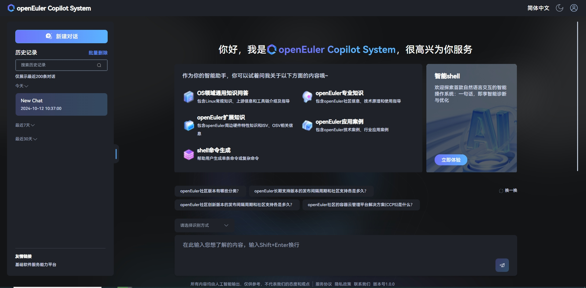

# **EulerCopilot Intelligent Assistant Deployment Guide**

Version Information
Current Version: v0.9.5
Update Date: April 1, 2025

## Product Overview

EulerCopilot is an intelligent Q&A tool that uses EulerCopilot to solve the convenience of operating system knowledge acquisition and empowers developers and operations personnel with OS domain models. As a tool for acquiring operating system knowledge and enabling operating system productivity tools (such as A-Ops / A-Tune / x2openEuler / EulerMaker / EulerDevOps / StratoVirt / iSulad, etc.), it subverts traditional command delivery methods, evolving from traditional command delivery methods to natural semantics, and combines intelligent agent task planning capabilities to lower the threshold for developing and using operating system features.

This guide provides deployment instructions for the EulerCopilot intelligent assistant system based on automated scripts, supporting both one-click automatic deployment and manual step-by-step deployment.

### Component Introduction

| Component                          | Port            | Description                  |
| ----------------------------- | --------------- | -------------------- |
| euler-copilot-framework       | 8002 (internal port) | Intelligent agent framework service         |
| euler-copilot-web             | 8080            | Intelligent agent frontend interface        |
| euler-copilot-rag             | 9988 (internal port) | Retrieval enhancement service           |
| authhub-backend-service       | 11120 (internal port) | Authentication service backend          |
| authhub-web-service           | 8000            | Authentication service frontend          |
| mysql                         | 3306 (internal port) | MySQL database           |
| redis                         | 6379 (internal port) | Redis database           |
| minio                         | 9000 (internal port) 9001(external port) | MinIO database       |
| mongo                         | 27017 (internal port)         | MongoDB database           |
| postgres                      | 5432 (internal port) | Vector database             |
| secret_inject                 | None              | Configuration file secure copy tool   |

### Software Requirements

|     Type        |      Version Requirements                         |  Description                                |
|----------------| -------------------------------------|--------------------------------------|
| Operating System    | openEuler 22.03 LTS and above         | None                                   |
| K3s        | >= v1.30.2, with Traefik Ingress tools   | K3s provides a lightweight Kubernetes cluster that is easy to deploy and manage |
| Helm       | >= v3.15.3                           | Helm is a Kubernetes package management tool designed to quickly install, upgrade, and uninstall EulerCopilot services |
| Python     | >=3.9.9                              | Python 3.9.9 and above provides the runtime environment for model download and installation |

---

### Hardware Specifications

| Hardware Resource      |  Minimum Configuration                  |    Recommended Configuration               |
|--------------|----------------------------|------------------------------|
| CPU          | 4 cores                     | 16 cores and above                 |
| RAM          | 4 GB                       | 64 GB                        |
| Storage         | 32 GB                      | 64G                         |
| Large Model Name    | deepseek-llm-7b-chat      | DeepSeek-R1-Llama-8B        |
| VRAM (GPU)   |  NVIDIA RTX A4000 8GB   | NVIDIA A100 80GB * 2         |

**Key Notes**:

- For pure CPU environments, it is recommended to implement functionality by calling OpenAI interfaces or using the built-in model deployment method.
- If it's a k8s cluster environment, there's no need to install k3s separately, requiring version >= 1.28

---

### Deployment View


---

### Domain Configuration

Prepare the following two service domains:

- AuthHub authentication service: `authhub.eulercopilot.local`
- EulerCopilot web service: `www.eulercopilot.local`

```bash
# Configure in local Windows host
# Open C:\Windows\System32\drivers\etc\hosts to add records
# Replace 127.0.0.1 with the target server's IP
127.0.0.1 authhub.eulercopilot.local
127.0.0.1 www.eulercopilot.local
```

## Quick Start

### 1. Get Deployment Scripts

- Download the latest deployment repository from EulerCopilot's official Git repository [euler-copilot-framework](https://gitee.com/openeuler/euler-copilot-framework)
- If you are using Kubernetes, there's no need to install the k3s tool.

```bash
# Use home directory as download example
cd /home
```

```bash
git clone https://gitee.com/openeuler/euler-copilot-framework.git -b dev
```

```bash
cd euler-copilot-framework/deploy/scripts
```

```bash
# Add executable permissions to script files
chmod -R +x ./*
```

### 2. Deploy EulerCopilot

#### **One-Click Deployment**

```bash
cd /home/euler-copilot-framework/deploy/scripts
```

```bash
bash deploy.sh
```

```bash
# Enter 0 for one-click automatic deployment
==============================
        Main Deployment Menu
==============================
0) One-Click Automatic Deployment
1) Manual Step-by-Step Deployment
2) Restart Services
3) Uninstall All Components and Clear Data
4) Exit Program
==============================
Please enter option number (0-3): 0
```

---

#### **Step-by-Step Deployment**

```bash
# Select 1 -> 1 to enter manual step-by-step deployment
==============================
        Main Deployment Menu
==============================
0) One-Click Automatic Deployment
1) Manual Step-by-Step Deployment
2) Restart Services
3) Uninstall All Components and Clear Data
4) Exit Program
==============================
Please enter option number (0-3): 1
```

```bash
# Enter option number (0-9) to deploy step by step
==============================
       Manual Step-by-Step Deployment Menu
==============================
1) Execute Environment Check Script
2) Install k3s and helm
3) Install Ollama
4) Deploy Deepseek Model
5) Deploy Embedding Model
6) Install Databases
7) Install AuthHub
8) Install EulerCopilot
9) Return to Main Menu
==============================
Please enter option number (0-9):
```

---

#### **Restart Services**

```bash
# Enter option to restart services
==============================
        Service Restart Menu
==============================
List of services that can be restarted:
1) authhub-backend
2) authhub
3) framework
4) minio
5) mongo
6) mysql
7) pgsql
8) rag
9) rag-web
10) redis
11) web
12) Return to Main Menu
==============================
Please enter the service number to restart (1-12):
```

#### **Uninstall All Components**

```bash
sudo ./deploy.sh
# Select 2 for complete uninstallation
==============================
        Main Deployment Menu
==============================
0) One-Click Automatic Deployment
1) Manual Step-by-Step Deployment
2) Uninstall All Components and Clear Data
3) Exit Program
==============================
Please enter option number (0-3): 2
```

---

**Key Notes**:

- During deployment, you need to enter the AuthHub domain and EulerCopilot domain. If not entered, the default domains `authhub.eulercopilot.local` and `www.eulercopilot.local` will be used.
- When resources are insufficient, refer to the FAQ section for solutions on evaluating resource availability
- View component logs

```bash
kubectl logs <pod-name> -n euler-copilot
```

- View service status

```bash
kubectl get pod -n euler-copilot
```

- Modify large model configuration and update EulerCopilot

```bash
cd /home/euler-copilot-framework/deploy/chart/euler-copilot
```

```bash
vim values.yaml
```

```bash
helm upgrade euler-copilot -n euler-copilot .
```

## Verify Installation

Congratulations! **EulerCopilot** has been successfully deployed! To start your experience, please enter the link `https://your-eulercopilot-domain` in your browser to access the EulerCopilot web interface:

On your first visit, you need to click the **Register Now** button on the page to create a new account and complete the login process.




## Build Domain-Specific Intelligent Q&A

Click on Knowledge Base to log into the local knowledge base management page. For detailed information, please refer to the document [Local Asset Library Construction Guide](../../../advance/knowledge_base/deploy_guide/knowledge_base_deployment.md)
**Knowledge Base default login account: `admin`, password: `123456`**

---

## Appendix

### Large Model Preparation

#### GPU Environment

You can directly use the deployed deepseek large model. Refer to the following deployment method:

1. Download model files:

   ```bash
   huggingface-cli download --resume-download Qwen/Qwen1.5-14B-Chat --local-dir Qwen1.5-14B-Chat
   ```

2. Create terminal control

   ```bash
   screen -S control
   ```

   ```bash
   python3 -m fastchat.serve.controller
   ```

   Press Ctrl A+D to put it in the background

3. Create new terminal api

   ```bash
   screen -S api
   ```

   ```bash
   python3 -m fastchat.serve.openai_api_server --host 0.0.0.0 --port 30000  --api-keys sk-123456
   ```

   Press Ctrl A+D to put it in the background
   If the current environment's Python version is 3.12 or 3.9, you can create a conda virtual environment with Python 3.10

   ```bash
   mkdir -p /root/py310
   ```

   ```bash
   conda create --prefix=/root/py310 python==3.10.14
   ```

   ```bash
   conda activate /root/py310
   ```

4. Create new terminal worker

   ```bash
   screen -S worker
   ```

   ```bash
   screen -r worker
   ```

   Install fastchat and vllm

   ```bash
   pip install fschat vllm
   ```

   Install dependencies:

   ```bash
   pip install fschat[model_worker]
   ```

   ```bash
   python3 -m fastchat.serve.vllm_worker --model-path /root/models/Qwen1.5-14B-Chat/ --model-name qwen1.5 --num-gpus 8 --gpu-memory-utilization=0.7 --dtype=half
   ```

   Press Ctrl A+D to put it in the background

5. Modify the configured large model parameters as follows and update the service.

   ```bash
   vim /home/euler-copilot-framework/deploy/chart/euler_copilot/values.yaml
   ```

   Modify the following section

   ```yaml
   # Model Settings
   models:
     # Large model for Q&A; needs to be OpenAI-compatible interface
     answer:
       # [Required] Interface URL (no need to include "v1" suffix)
       url: http://172.168.178.107:11434
       # [Required] Interface API Key; default is empty
       key: sk-123456
       # [Required] Model name
       name: deepseek-llm-7b-chat:latest
       # [Required] Model maximum context length; recommended >=8192
       ctx_length: 8192
       # Model maximum output length, recommended >=2048
       max_tokens: 2048
       # Model for Function Call; recommended to use specific inference framework
     functioncall:
       # Inference framework type, default is ollama
       # Available framework types: ["vllm", "sglang", "ollama", "openai"]
       backend:
       # Model address; if not filled, same as Q&A model
     url: ollama
       # API Key; if not filled, same as Q&A model
       key:
       # Model name; if not filled, same as Q&A model
       name:
       # Model maximum context length; if not filled, same as Q&A model
       ctx_length:
       # Model maximum output length; if not filled, same as Q&A model
       max_tokens:
     # Model for data vectorization (Embedding)
     embedding:
       # Inference framework type, default is openai
       # [Required] Embedding interface type: ["openai", "mindie"]
       type: openai
       # [Required] Embedding URL (needs to include "v1" suffix)
       url: http://172.168.178.107:11434
       # [Required] Embedding model API Key
       key: sk-123456
       # [Required] Embedding model name
       name: bge-m3:latest
   ```

   ```bash
   # Update service
   helm upgrade -n euler-copilot euler-copilot .
   # Restart framework service
   kubectl get pod -n euler-copilot
   kubectl delete pod framework-deploy-65b669fc58-q9bw7 -n euler-copilot
   ```

#### NPU Environment

For NPU environment deployment, refer to the link [MindIE Installation Guide](https://www.hiascend.com/document/detail/zh/mindie/10RC2/whatismindie/mindie_what_0001.html)

### FAQ

#### 1. Resolve Hugging Face Connection Errors

If you encounter the following connection error:

```text
urllib3.exceptions.NewConnectionError: <urllib3.connection.HTTPSConnection object>: Failed to establish a new connection: [Errno 101] Network is unreachable
```

Try the following solutions:

- Update the `huggingface_hub` package to the latest version.

  ```bash
  pip3 install -U huggingface_hub
  ```

- If network issues persist, try using mirror sites as endpoints.

  ```bash
  export HF_ENDPOINT=https://hf-mirror.com
  ```

#### 2. Call Q&A Interface in RAG Container

After entering the corresponding RAG Pod, you can send POST requests via `curl` commands to get Q&A results. Please ensure to provide specific question text in the request body.

```bash
curl -k -X POST "http://localhost:9988/kb/get_answer" \
     -H "Content-Type: application/json" \
     -d '{
           "question": "Your question",
           "kb_sn": "default_test",
           "fetch_source": true
         }'
```

#### 3. Resolve `helm upgrade` Errors

When the Kubernetes cluster is unreachable, you may encounter error messages similar to the following:

```text
Error: UPGRADE FAILED: Kubernetes cluster unreachable
```

Ensure that the correct KUBECONFIG environment variable is set to point to a valid configuration file.

```bash
echo "export KUBECONFIG=/etc/rancher/k3s/k3s.yaml" >> /root/.bashrc
source /root/.bashrc
```

#### 4. Failed to View Pod Logs

If you encounter permission denied issues when viewing Pod logs, check if proxy settings are correctly configured and add your local IP address to the `no_proxy` environment variable.

```bash
cat /etc/systemd/system/k3s.service.env
```

Edit the file and ensure it contains:

```bash
no_proxy=XXX.XXX.XXX.XXX
```

#### 5. Large Model Streaming Response Issues in GPU Environment

For cases where certain services cannot perform streaming responses when executing curl with large models, try modifying the `"stream"` parameter in the request to `false`. Additionally, confirm that a compatible version of the Pydantic library is installed.

```bash
pip install pydantic==1.10.13
```

#### 6. sglang Model Deployment Guide

Follow these steps to deploy models based on sglang:

```bash
# 1. Activate the conda environment named `myenv`, which is created based on Python 3.10:
conda activate myenv

# 2. Install sglang and all its dependencies, specifying version 0.3.0
pip install "sglang[all]==0.3.0"

# 3. Install flashinfer from a specific index to ensure compatibility with your CUDA and PyTorch versions
pip install flashinfer -i https://flashinfer.ai/whl/cu121/torch2.4/

# 4. Start the server using sglang with the following configuration:
python -m sglang.launch_server \
    --served-model-name Qwen2.5-32B \
    --model-path Qwen2.5-32B-Instruct-AWQ \
    --host 0.0.0.0 \
    --port 8001 \
    --api-key "sk-12345" \
    --mem-fraction-static 0.5 \
    --tp 8
```

- Verify installation

  ```bash
  pip show sglang
  pip show flashinfer
  ```

**Important Notes:**

- API Key: Please ensure the API key in the `--api-key` parameter is correct
- Model Path: Ensure the path in the `--model-path` parameter is correct and that the model files exist at that path.
- CUDA Version: Ensure you have CUDA 12.1 and PyTorch 2.4 installed on your system, as the `flashinfer` package depends on these specific versions.
- Thread Pool Size: Adjust the thread pool size based on your GPU resources and expected load. If you have 8 GPUs, you can choose --tp 8 to fully utilize these resources.

#### 7. Get Embedding

Use curl to send POST requests to get embedding results:

```bash
curl -k -X POST http://localhost:11434/v1/embeddings \
     -H "Content-Type: application/json" \
     -d {"input": "The food was delicious and the waiter...", "model": "bge-m3", "encoding_format": "float"}
```

#### 8. Generate Certificates

To generate self-signed certificates, first download the [mkcert](https://github.com/FiloSottile/mkcert/releases) tool, then run the following commands:

```bash
mkcert -install
mkcert example.com 
```

Finally, copy the generated certificate and private key to values.yaml and apply them to the Kubernetes Secret.

```bash
vim /home/euler-copilot-framework_openeuler/deploy/chart_ssl/traefik-secret.yaml
```

```bash
kubectl apply -f traefik-secret.yaml
```

#### 9. Troubleshooting Methods

1. **Get Cluster Event Information**

   To better locate the cause of Pod failures, first check the events in the Kubernetes cluster. This can provide contextual information about Pod state changes.

   ```bash
   kubectl get events -n euler-copilot
   ```

2. **Verify Image Pull Status**

   Confirm whether container images are successfully pulled. If images fail to load correctly, it may be due to network issues or incorrect image repository configuration.

   ```bash
   k3s crictl images
   ```

3. **Review Pod Logs**

   Check the logs of relevant Pods to look for possible error messages or abnormal behavior. This is particularly useful for diagnosing application-level issues.

   ```bash
   kubectl logs rag-deploy-service-5b7887644c-sm58z -n euler-copilot
   ```

4. **Evaluate Resource Availability**

   Ensure the Kubernetes cluster has sufficient resources (such as CPU, memory, and storage) to support Pod operation. Insufficient resources may cause image pull failures or other performance issues, or cause Pod status to change from Running to Pending or Completed. Check disk space and ensure at least 30% free space. This helps maintain stable Pod operation. Refer to this link to mount disks with larger space [How to move k3s data to another location](https://mrkandreev.name/snippets/how_to_move_k3s_data_to_another_location/)

   ```bash
   kubectl top nodes
   ```

5. **Confirm k3s Version Compatibility**

   If you encounter image pull failures with image size 0, please check if your k3s version meets the minimum requirements (v1.30.2 or higher). Lower versions may have compatibility issues.

   ```bash
   k3s -v
   ```

6. **Check Configuration**

   Check whether the OIDC configuration and domain configuration in the `values.yaml` file are filled in correctly, and update the service after ensuring the configuration is correct.

   ```bash
   cat /home/euler-copilot-framework/deploy/chart/euler_copilot
   ```

   ```bash
   vim values.yaml | grep oidc
   ```

   ```bash
   helm upgrade euler-copilot -n euler-copilot .
   ```
