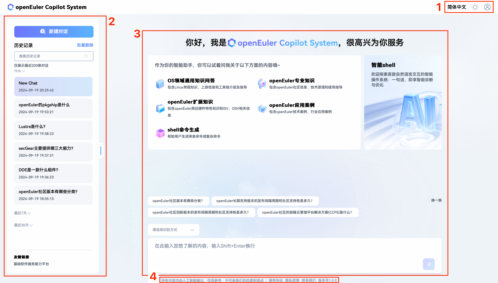

# Introduction

## Overview

This document introduces the usage of EulerCopilot, providing detailed descriptions of various features of the EulerCopilot online service web interface, along with common Q&A. For detailed information, please refer to the corresponding manuals.

## Target Audience

This document is primarily intended for EulerCopilot users. Users should possess the following experience and skills:

- Familiarity with openEuler operating system related information.
- Experience with AI dialogue systems.

## Revision History

| Document Version | Release Date | Revision Description |
|------------------|--------------|---------------------|
| 03               | 2024-09-19   | Updated new interface. |
| 02               | 2024-05-13   | Optimized intelligent dialogue operation guidance. |
| 01               | 2024-01-28   | First official release. |

## Introductions

### Disclaimer

- Usernames and passwords used during the process that are not part of the tool's own verification functionality are not used for other purposes and will not be saved in the system environment.
- Before engaging in dialogue or operations, you should confirm that you are the owner of the application or have obtained sufficient authorization consent from the owner.
- Dialogue results may contain internal information and related data of the applications you analyze. Please manage them appropriately.
- Unless otherwise stipulated by laws and regulations or bilateral contracts, the openEuler community makes no express or implied statements and warranties regarding analysis results, and makes no guarantees or commitments regarding the merchantability, satisfaction, non-infringement, or fitness for a particular purpose of analysis results.
- Any actions you take based on analysis records should comply with legal and regulatory requirements, and you bear the risks yourself.
- Without owner authorization, no individual or organization may use applications and related analysis records for any activities. The openEuler community is not responsible for any consequences arising therefrom, nor does it assume any legal liability. Legal liability will be pursued when necessary.

### EulerCopilot Introduction

EulerCopilot is an artificial intelligence assistant based on the openEuler operating system that helps users solve various technical problems and provides technical support and consulting services. It uses the most advanced natural language processing technology and machine learning algorithms to understand user questions and provide corresponding solutions.

### Application Scenarios

1. **OS Domain General Knowledge**: EulerCopilot can provide consultation on Linux general knowledge, upstream information, and toolchain introduction and guidance.
2. **openEuler Professional Knowledge**: EulerCopilot can provide consultation on openEuler community information, technical principles, and usage guidance.
3. **openEuler Extended Knowledge**: EulerCopilot can provide consultation on openEuler peripheral hardware feature knowledge and ISV, OSV related information.
4. **openEuler Application Cases**: EulerCopilot can provide openEuler technical cases and industry application cases.
5. **Shell Command Generation**: EulerCopilot can help users generate single shell commands or complex commands.

In summary, EulerCopilot can be applied to various scenarios, helping users improve work efficiency and understand related knowledge about Linux, openEuler, and more.

### Access and Usage

EulerCopilot is accessed and used through a web page via URL. For account registration and login, please refer to [Registration and Login](./registration_and_login.md). For usage methods, please refer to [Intelligent Q&A User Guide](./qa_guide.md).

### Interface Description

#### Interface Layout

The EulerCopilot interface mainly consists of the areas shown in Figure 1, with the functions of each area described in Table 1.

- Figure 1: EulerCopilot Interface

- Table 1: EulerCopilot Homepage Interface Area Description

| Area | Name | Description |
|------|------|-------------|
| 1    | Settings Management Area | Provides account login and logout operation entries and light/dark mode toggle functionality |
| 2    | Dialogue Management Area | Used for users to create new dialogues, manage dialogue history, and perform batch deletion of dialogue history |
| 3    | Dialogue Area | Used for dialogue chat between users and EulerCopilot |
| 4    | Service Agreement and Privacy Policy Area | Provides access to view service agreements and privacy policies |
