# Intelligent Q&A User Guide

## Start a Conversation

In the input box below the conversation area, you can enter the content you want to ask. Press `Shift + Enter` for line breaks, press `Enter` to send your question, or click "Send" to submit your question.

> **Note**
>
> The conversation area is located in the main part of the page, as shown in Figure 1.

- Figure 1 Conversation Area
  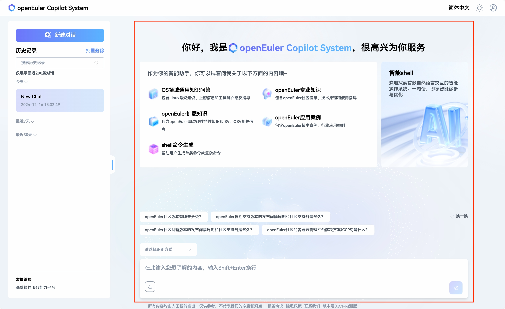

### Multi-turn Continuous Conversation

EulerCopilot intelligent Q&A supports multi-turn continuous conversations. You can simply continue asking follow-up questions in the same conversation, as shown in Figure 2.

- Figure 2 Multi-turn Conversation
  

### Regenerate Response

If you encounter situations where AI-generated content is incorrect or incomplete, you can ask AI to regenerate the answer. Click the "Regenerate" text on the bottom left of the AI response to have EulerCopilot answer your question again. After regenerating, pagination icons  and  will appear on the bottom right of the response. Click  or  to view different responses, as shown in Figure 3.

- Figure 3 Regenerate Response
  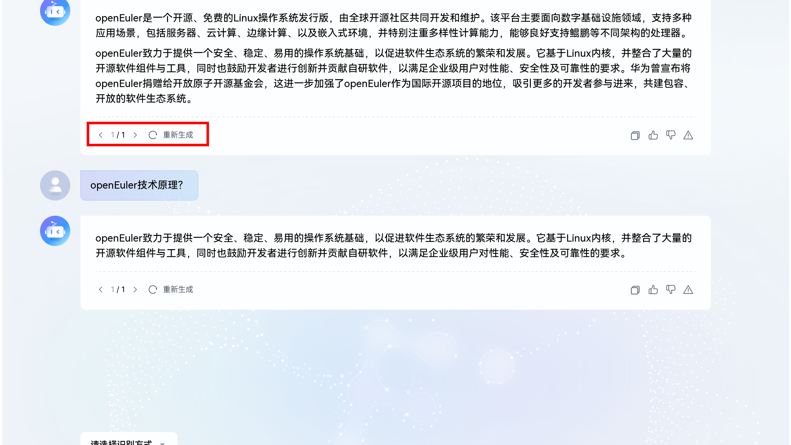

### Recommended Questions

Below the AI response, some recommended questions will be displayed. Click on them to ask questions, as shown in Figure 4.

- Figure 4 Recommended Questions
  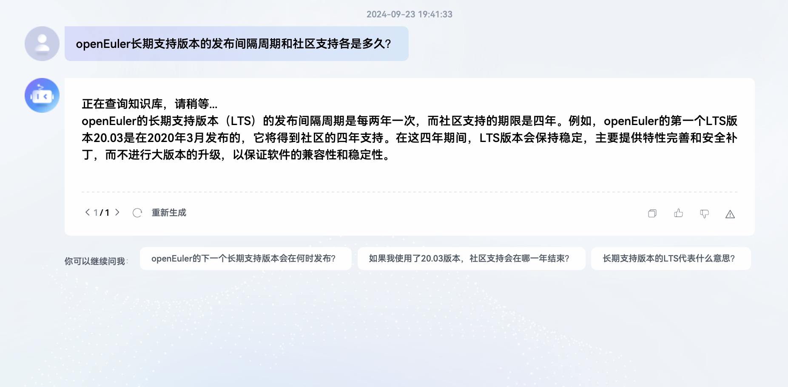

## Custom Background Knowledge

EulerCopilot supports file upload functionality. After uploading files, AI will use the uploaded file content as background knowledge and incorporate it when answering questions. The uploaded background knowledge only applies to the current conversation and will not affect other conversations.

### Upload Files

**Step 1** Click the "Upload File" button in the bottom left corner of the conversation area, as shown in Figure 5.

- Figure 5 Upload File Button
  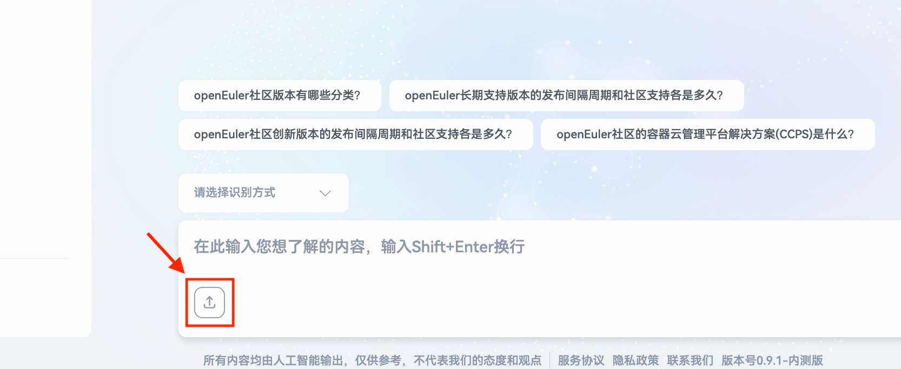

> **Note**
>
> Hover your mouse over the "Upload File" button to see prompts about the allowed file specifications and formats, as shown in Figure 6.

- Figure 6 Mouse Hover Shows Upload File Specification Prompts
  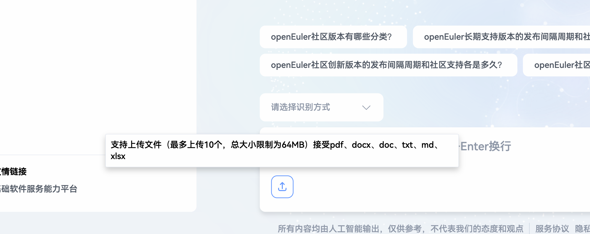

**Step 2** In the popup file selection dialog, select the file you want to upload and click "Open" to upload. You can upload up to 10 files with a total size limit of 64MB. Accepted formats include PDF, docx, doc, txt, md, and xlsx.

After starting the upload, the upload progress will be displayed below the conversation area, as shown in Figure 7.

- Figure 7 All Files Being Uploaded Simultaneously Are Arranged Below the Q&A Input Box
  

After file upload is complete, it will be automatically parsed, as shown in Figure 8. After parsing is complete, the file size information for each file will be displayed below the conversation area.

- Figure 8 After File Upload to Server, "Parsing" Will Be Displayed
  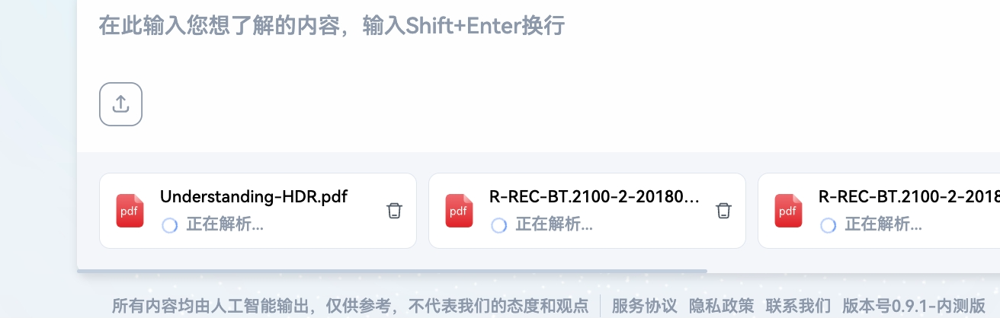

After successful file upload, the left history record area will display the number of uploaded files, as shown in Figure 9.

- Figure 9 The Uploaded File Count Will Be Displayed on the Conversation History Record Tab
  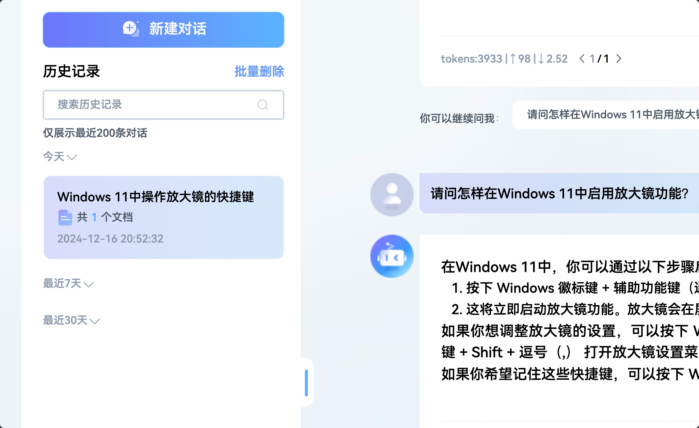

### Ask Questions About Files

After file upload is complete, you can ask questions about the files. The questioning method is the same as the regular conversation mode, as shown in Figure 10.
The answer result is shown in Figure 11.

- Figure 10 Ask Questions Related to the Uploaded Files
  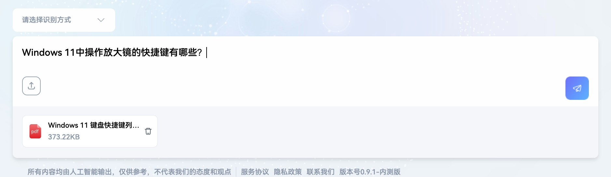

- Figure 11 AI Answers Based on Uploaded Background Knowledge
  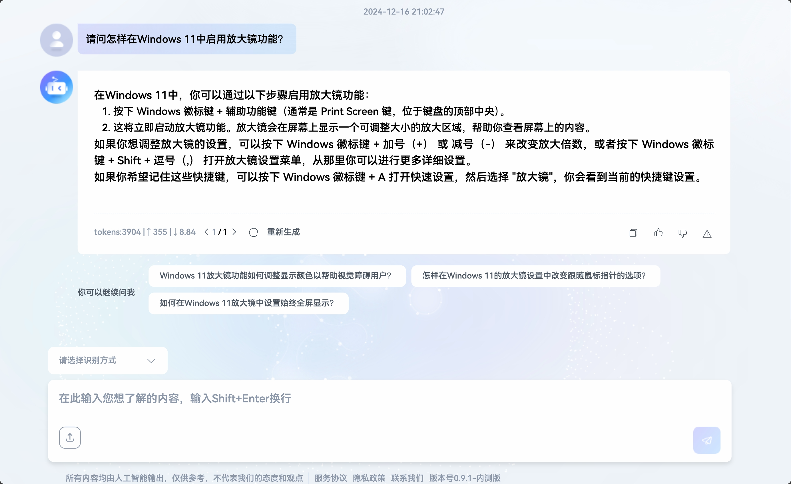

## Manage Conversations

> **Note**
>
> The conversation management area is on the left side of the page.

### Create New Conversation

Click the "New Conversation" button to create a new conversation, as shown in Figure 12.

- Figure 12 "New Conversation" Button is Located in the Upper Left of the Page
  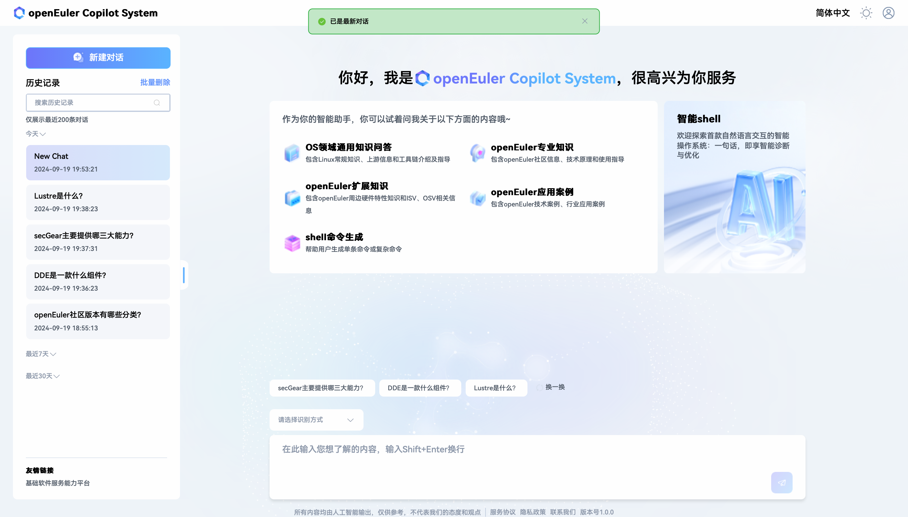

### Search Conversation History

Enter keywords in the history search input box on the left side of the page, then click  to search conversation history, as shown in Figure 13.

- Figure 13 Conversation History Search Box
  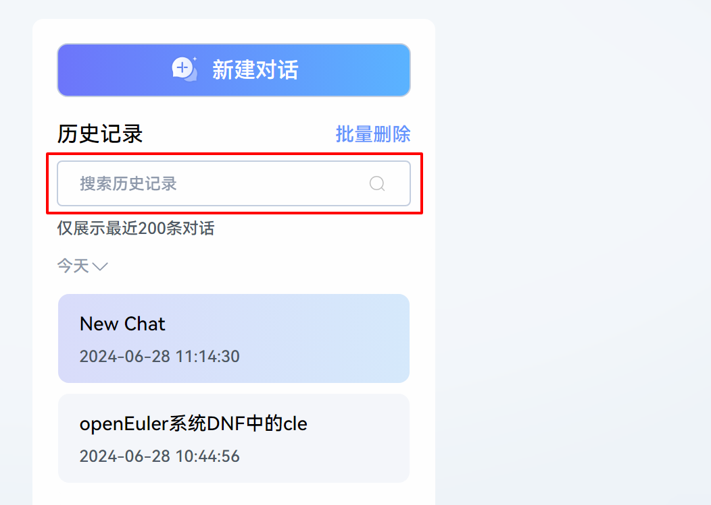

### Manage Individual Conversation History Records

The history record list is located below the history search bar. On the right side of each conversation history record, click  to edit the name of the conversation history record, as shown in Figure 14.

- Figure 14 Click "Edit" Icon to Rename History Record
  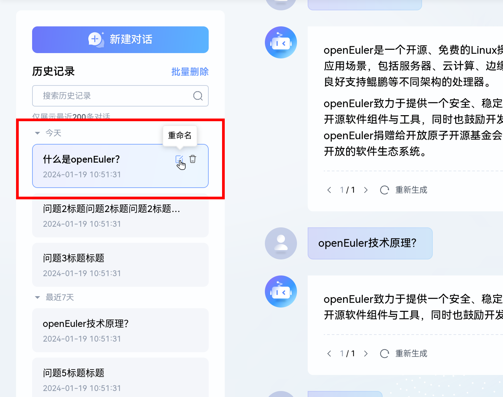

After rewriting the conversation history record name, click  on the right to complete the renaming, or click  on the right to abandon this renaming, as shown in Figure 15.

- Figure 15 Complete/Cancel Renaming History Record
  

Additionally, click the delete icon on the right side of the conversation history record, as shown in Figure 16, to perform secondary confirmation for deleting a single conversation history record. In the secondary confirmation popup, as shown in Figure 17, click "Confirm" to confirm deletion of the single conversation history record, or click "Cancel" to cancel this deletion.

- Figure 16 Click "Trash" Icon to Delete Single History Record
  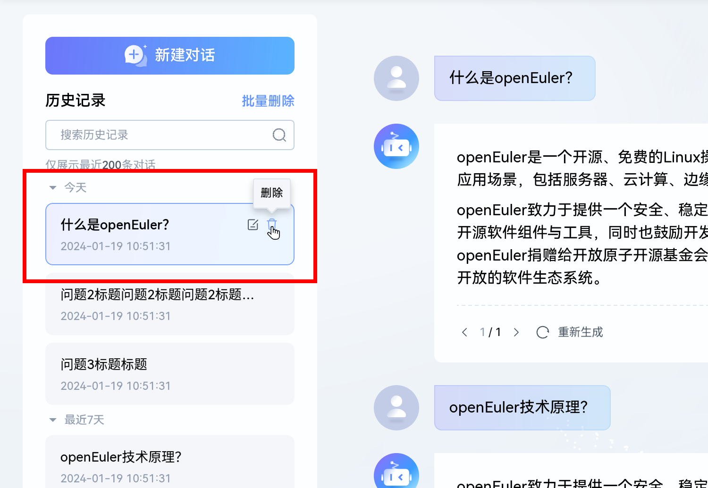

- Figure 17 Secondary Confirmation Before Deleting History Record
  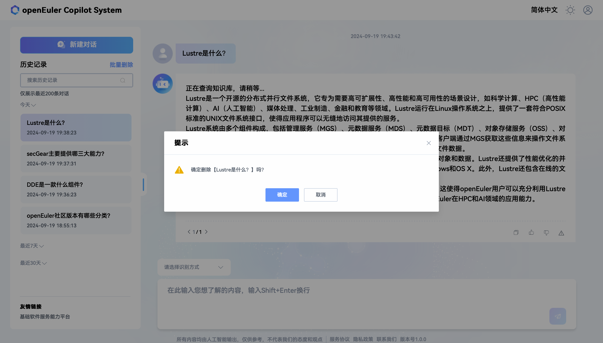

### Batch Delete Conversation History Records

First, click "Batch Delete", as shown in Figure 18.

- Figure 18 Batch Delete Function is Located Above the Right Side of the History Search Box
  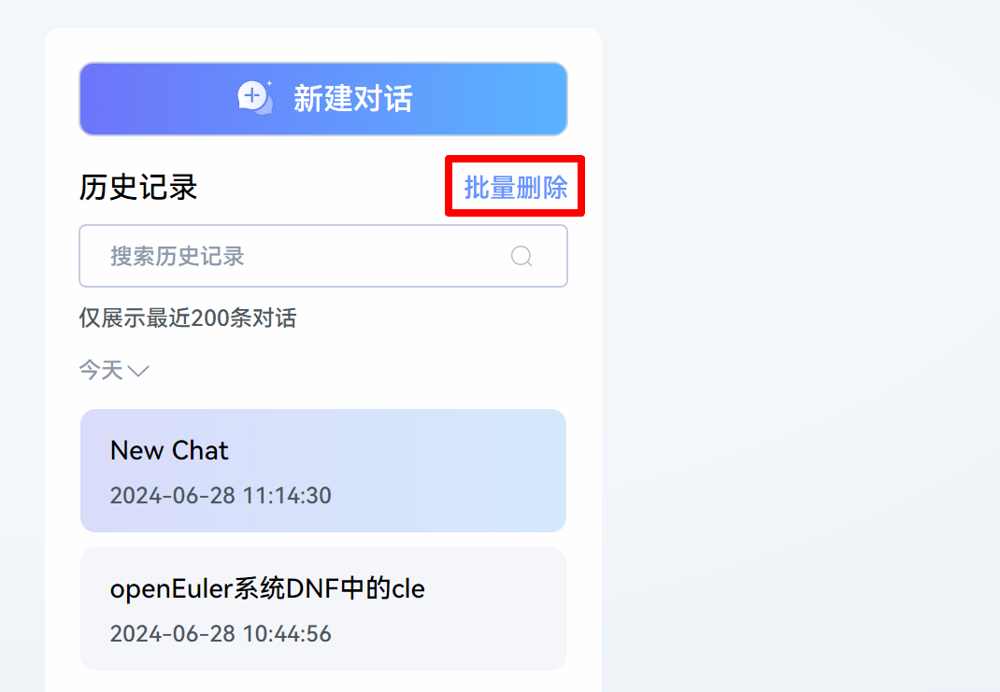

Then you can select history records for deletion, as shown in Figure 19. Click "Select All" to select all history records, or click on a single history record or the selection box on the left side of the history record to select individual history records.

- Figure 19 Check the Box on the Left to Select History Records for Batch Deletion
  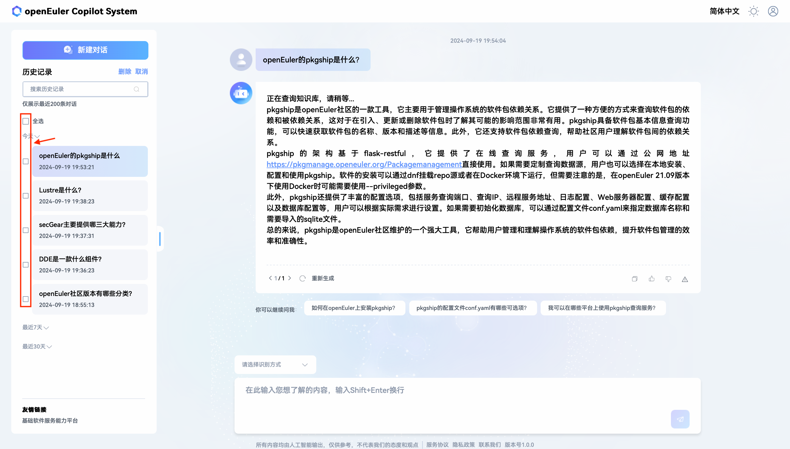

Finally, secondary confirmation is required for batch deleting history records, as shown in Figure 20. Click "Confirm" to delete, or click "Cancel" to cancel this deletion.

- Figure 20 Secondary Confirmation Before Deleting Selected History Records
  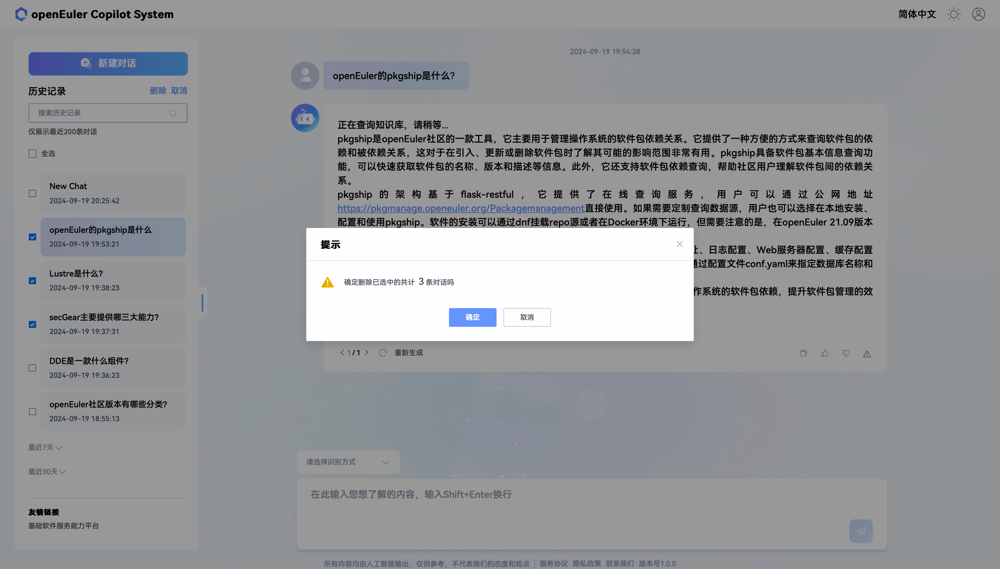

## Feedback and Report

In the conversation record area, on the bottom right side of the AI response, you can provide feedback on the conversation response, as shown in Figure 21. Click  to give the conversation response a thumbs up; click  to provide feedback on why you're dissatisfied with the response.

- Figure 21 Thumbs Up and Dissatisfaction Feedback
  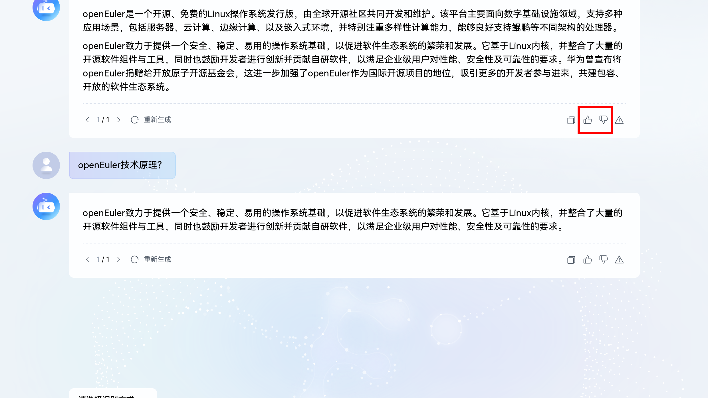

For feedback on dissatisfaction reasons, as shown in Figure 22, after clicking , the chatbot will display a dialog box for filling in feedback content, where you can choose relevant options for dissatisfaction reasons.

- Figure 22 Dissatisfaction Feedback for Response
  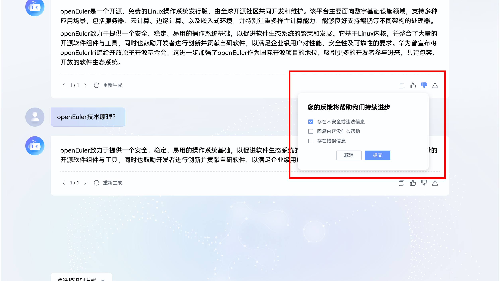

Among them, clicking "Contains Incorrect Information" requires filling in reference answer links and descriptions, as shown in Figure 23.

- Figure 23 Dissatisfaction Feedback for Response - Contains Incorrect Information
  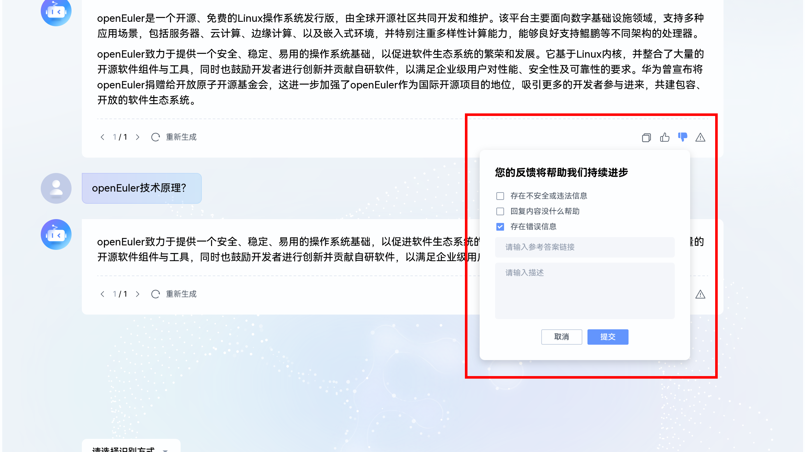

### Report

If you find that AI-generated content contains inappropriate information, you can click the report button in the bottom right corner, as shown in Figure 24. After clicking report, select the report type and submit. If there are no suitable options, please select "Other" and enter the reason, as shown in Figure 25.

- Figure 24 Report Button is Located in the Bottom Right Corner of the Conversation Block
  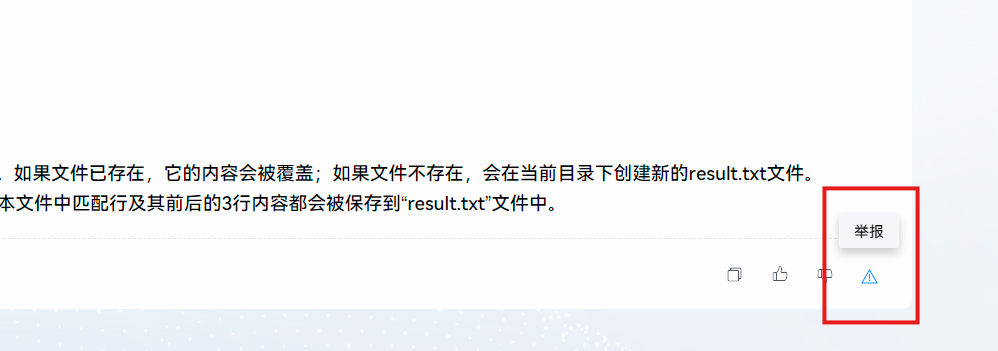

- Figure 25 After Clicking, You Can Select Report Type
  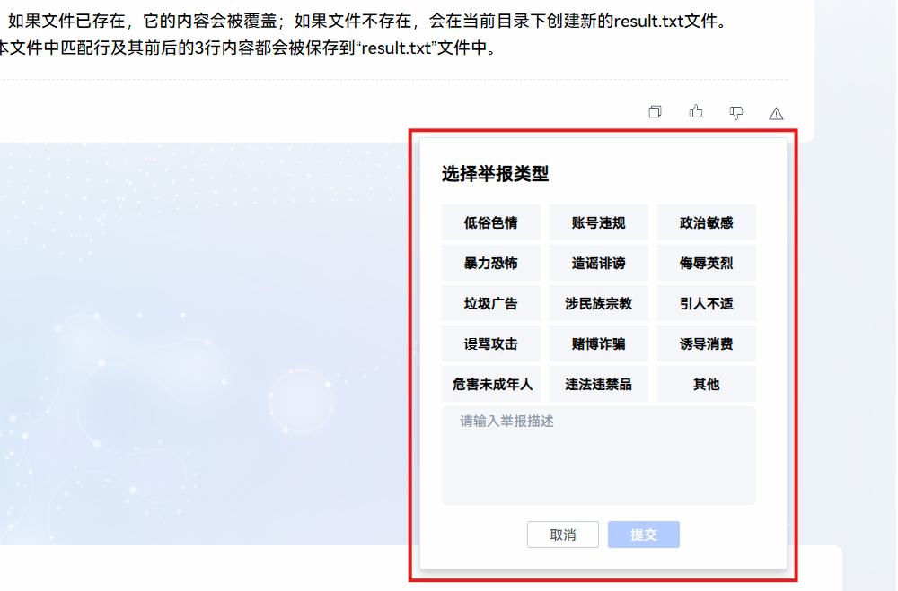

## View Service Agreement and Privacy Policy

Click on the text "Service Agreement" to view the service agreement, and click on the text "Privacy Policy" to view the privacy policy, as shown in Figures 26 and 27.

- Figure 26 Service Agreement and Privacy Policy Entry Points are Located in the Bottom Information Bar of the Page
  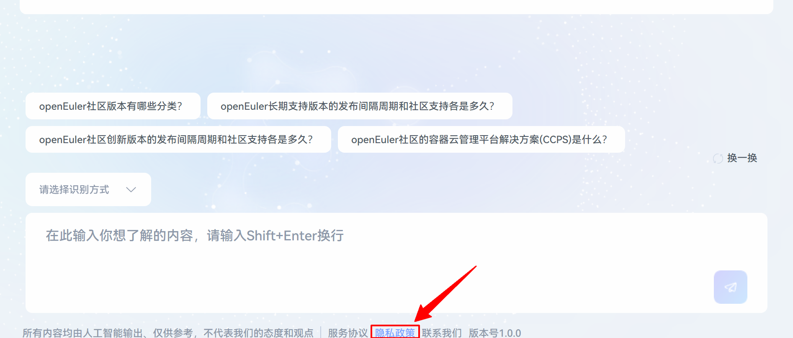

- Figure 27 After Clicking, Service Agreement or Privacy Policy Popup Will Be Displayed
  

## Appendix

### User Information Export Instructions

EulerCopilot backend has user information export functionality. If users need it, they must actively contact us through the <contact@openeuler.io> email. Operations staff will send the exported user information back to users via email.
