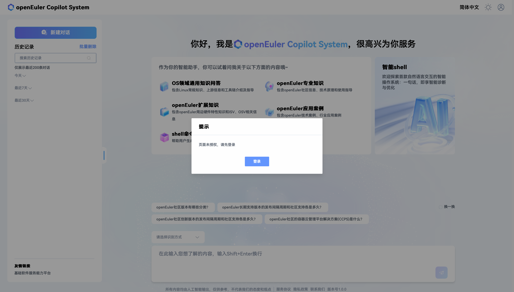
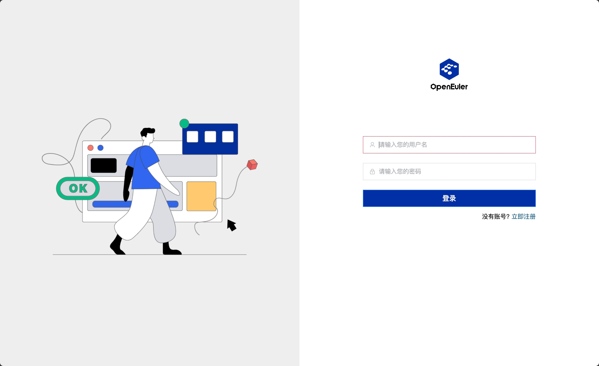
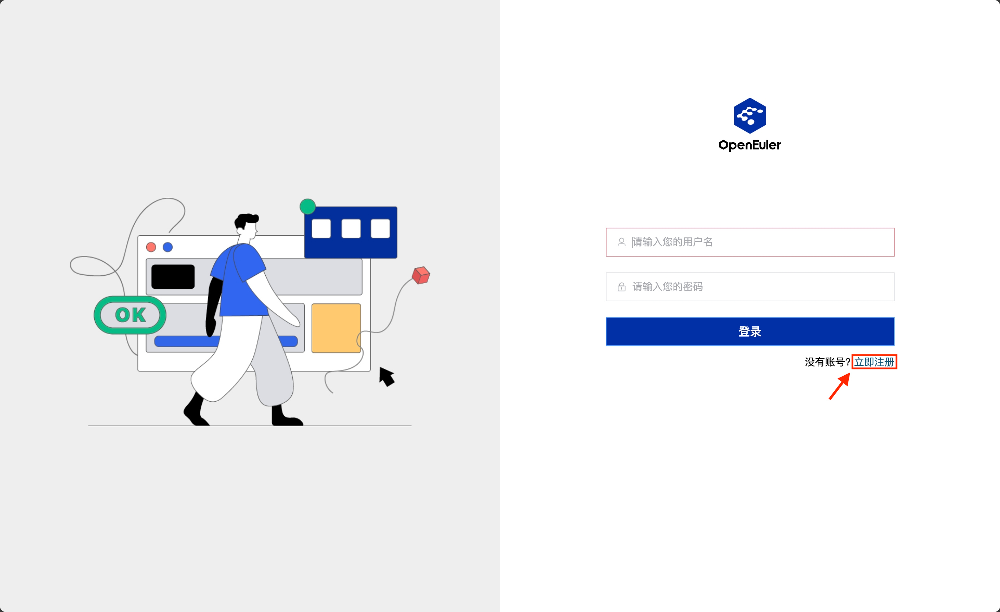
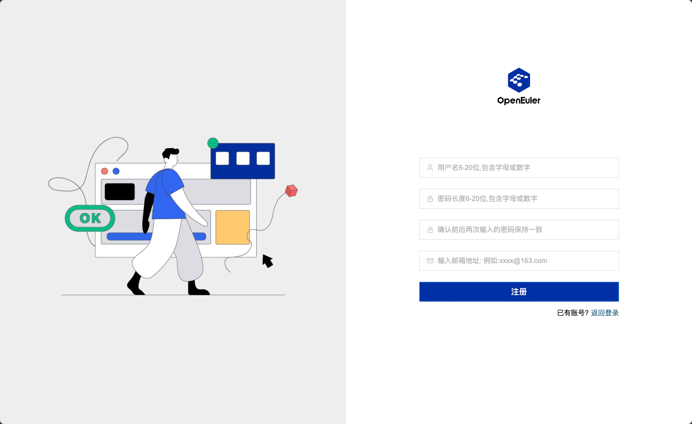
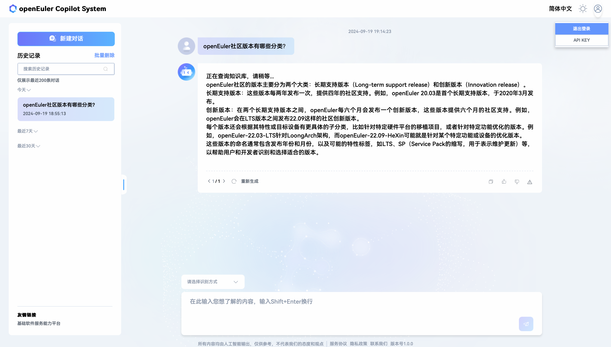

# Logging into EulerCopilot

This section introduces the specific steps to log into the deployed EulerCopilot web client.

## Browser Requirements

The browser requirements are shown in Table 1.

- Table 1 Browser Requirements

| Browser Type | Minimum Version | Recommended Version |
| ----- | ----- | ----- |
| Google Chrome | 72 | 121 or higher |
| Mozilla Firefox | 89 | 122 or higher |
| Apple Safari | 11.0 | 16.3 or higher |

## Procedure

**Step 1** Open the browser on your local PC, enter the configured domain name from the deployment guide in the address bar, and press `Enter`. When not logged in, accessing EulerCopilot will display a login prompt pop-up box, as shown in Figure 1.

- Figure 1 Not Logged In

**Step 2** Log into EulerCopilot (with an existing account).

Open the login interface, as shown in Figure 2.

- Figure 2 Logging into EulerCopilot

## Registering an EulerCopilot Account

**Step 1** Click "Register Now" in the bottom right corner of the login information input box, as shown in Figure 3.

- Figure 3 Register Now

**Step 2** Go to the account registration page and fill in the relevant information according to the page prompts, as shown in Figure 4.

- Figure 4 Account Registration

**Step 3** After filling in the account information as required by the page, click "Register" to successfully register. After registration, you can return to the login page.

## Logging Out

**Step 1** Click  to display the logout dropdown menu, as shown in Figure 5.

> **Note**
> The account management area is located at the top right of the page, as shown in Figure 5.

- Figure 5 Account Management Area

**Step 2** Click "Logout" to log out, as shown in Figure 5.
