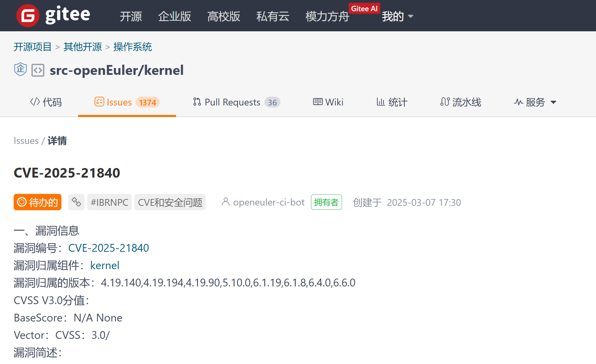
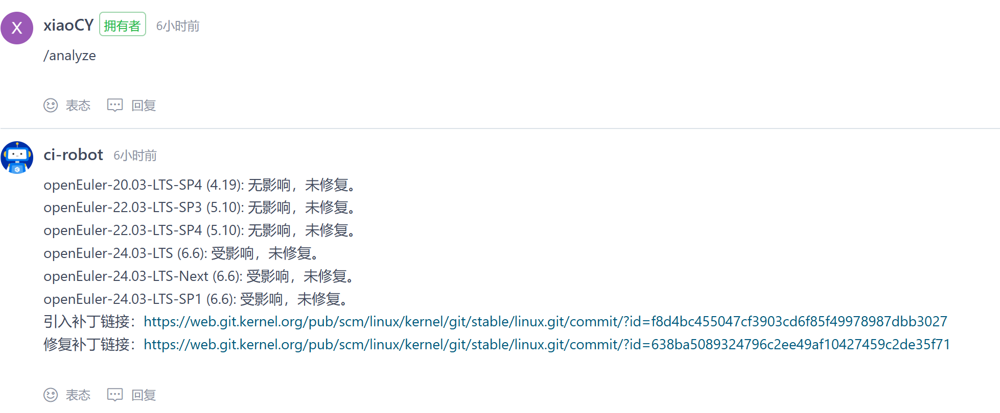
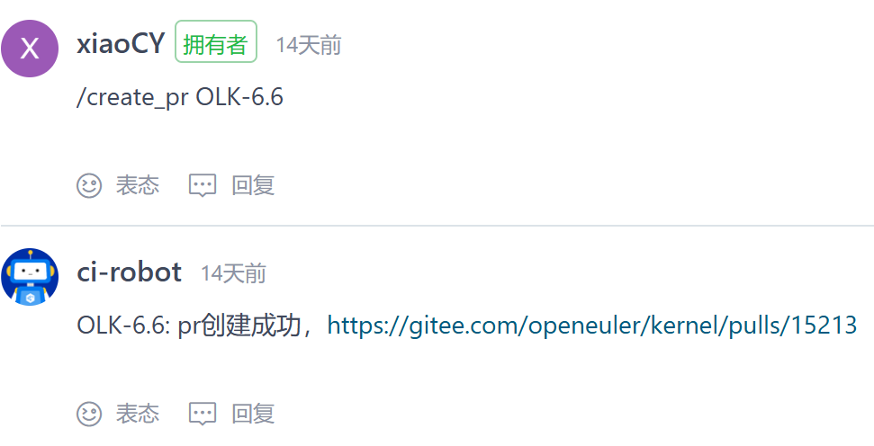

# openEuler Intelligent Vulnerability Patching User Guide

## Introduction

Intelligent vulnerability patching provides the capability to intelligently patch the openEuler kernel repository ([https://gitee.com/openeuler/kernel](https://gitee.com/openeuler/kernel)). Currently, it offers CVE impact scope analysis and patch PR creation functionality. Use the `/analyze` and `/create_pr` commands in the comments below CVE-representing issues to execute these features.

## Feature Entry

In the src-openEuler kernel repository ([https://gitee.com/src-openeuler/kernel.git](https://gitee.com/src-openeuler/kernel.git)), comment below the CVE-representing issues.



## /analyze Command

The `/analyze` command provides the capability to analyze the impact scope of CVEs. By commenting `/analyze` below an issue, it will automatically analyze the current maintenance scope of openEuler versions, determining whether each openEuler version introduces the CVE and whether it has been patched.



> [!NOTE]Note  
> The /analyze command takes no parameters

CVE introduction status includes the following scenarios:

* No impact
* Affected

CVE patching status includes the following scenarios:

* Not patched
* Patched

At the end of the comment, links to the introduction patch and the fix patch will be attached.

## /create_pr Command

The `/create_pr` command provides the capability to intelligently fix CVE patches. By commenting `/create_pr <branch_name>` below an issue, it will automatically obtain vulnerability patches and merge them into the openEuler linux repository ([https://gitee.com/openeuler/kernel.git](https://gitee.com/openeuler/kernel.git)) by creating PRs.



The `/create_pr` command accepts parameters, including the following scenarios:

```shell
# Create a patch PR for the OLK-5.10 branch
/create_pr OLK-5.10

# Create PRs for OLK-5.10 and OLK-6.6 branches
/create_pr OLK-5.10 OLK-6.6

# For all current upstream branches, including openEuler-1.0-LTS, OLK-5.10, and OLK-6.6 branches
/create_pr
```

Return results include:

* PR creation successful
* No fix patch available
* Cannot fix, conflicts exist

If there are conflicts between the patch code and the fix branch, it will prompt `Cannot fix, conflicts exist`. This capability will be iteratively enhanced in future versions.
