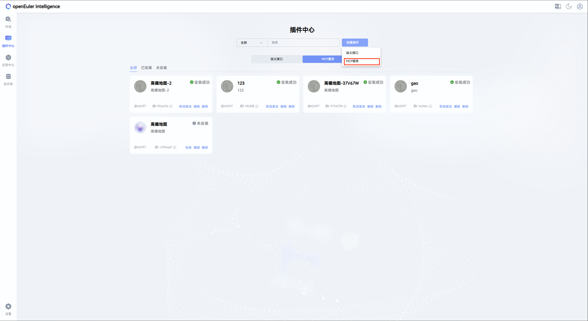
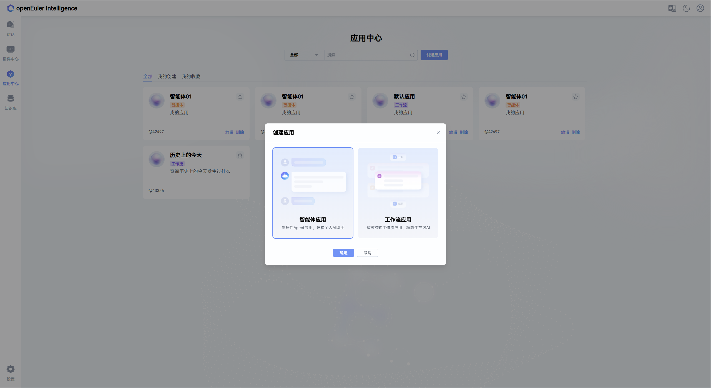
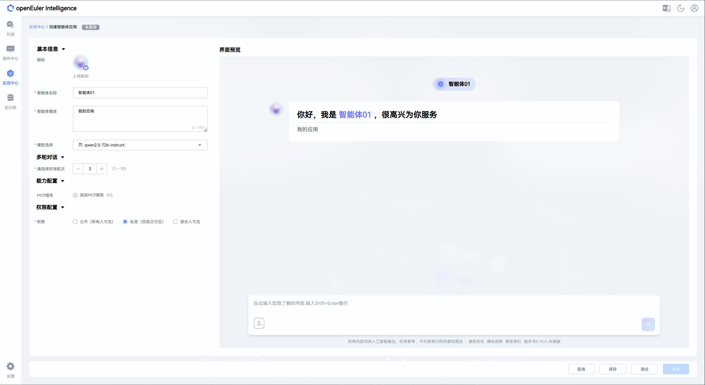
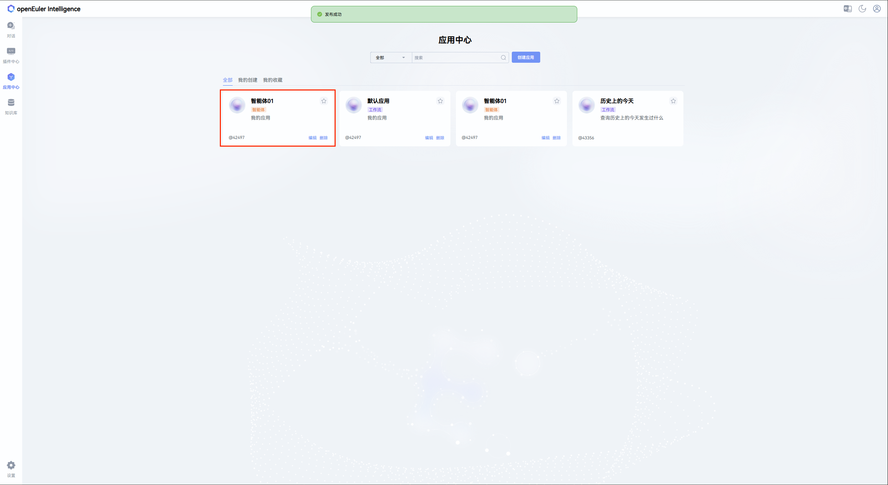

# MCP Service Guide

## 1. Overview

The current version of openEuler intelligence has enhanced support for MCP. The usage process is mainly divided into the following steps:

1. Register MCP
2. Install MCP
3. Activate MCP and load configuration files
4. Build Agent based on the activated MCP
5. Test Agent
6. Publish Agent
7. Use Agent

> **Note**:
>
> - Registration, installation, and activation of MCP require administrator privileges
> - Building, testing, publishing, and using Agent are ordinary user privilege operations
> - All Agent-related operations must be performed based on the activated MCP

## 2. Registration, Installation and Activation of MCP

The following process uses an administrator account as an example to demonstrate the complete management process of MCP:

1. **Register MCP**
   Register MCP to the openEuler intelligence system through the "MCP Registration" button in the plugin center
   

   Clicking the button pops up the registration window (the default configurations for SSE and STDIO are as follows):
   
   

   Taking SSE registration as an example, fill in the configuration information and click "Save"
   

2. **Install MCP**

   > **Note**: Before installing STDIO, you can adjust service dependency files and permissions in the `/opt/copilot/semantics/mcp/template` directory on the corresponding container or server

   Click the "Install" button on the registered MCP card to install
   

3. **View MCP Tools**
   After successful installation, click the MCP card to view the tools supported by this service
   

4. **Activate MCP**
   Click the "Activate" button to enable the MCP service
   

## 3. Creation, Testing, Publishing and Using of Agent Applications

The following operations can be completed by ordinary users, and all operations must be performed based on the activated MCP:

1. **Create Agent Application**
   Click the "Create Application" button in the application center
   

2. **Configure Agent Application**
   After successful creation, click the application card to enter the details page, where you can modify the application configuration information
   

3. **Associate MCP**
   Click the "Add MCP" button, select the activated MCP from the list that pops up on the left to associate
   
   

4. **Test Agent Application**
   After completing MCP association and information configuration, click the "Test" button in the lower right corner to perform functional testing
   

5. **Publish Agent Application**
   After passing the test, click the "Publish" button in the lower right corner to publish the application
   

6. **Use Agent Application**
   The published application will be displayed in the application market, double-click to use
   

   Agent applications have two usage modes:

   - **Automatic Mode**: Operations are executed automatically without manual user confirmation
     

   - **Manual Mode**: Risks are prompted before execution, and execution requires user confirmation
     

## 4. Summary

Through the above process, users can build and use customized Agent applications based on MCP. Welcome to experience and explore more functional scenarios.
