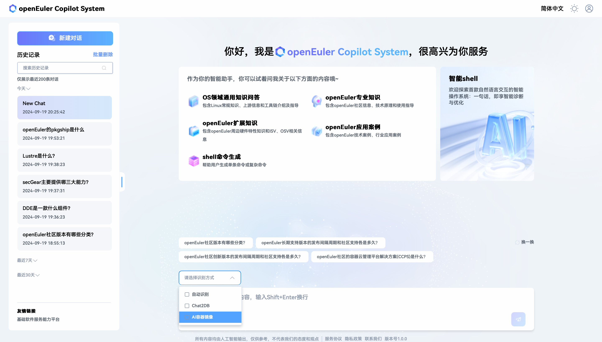
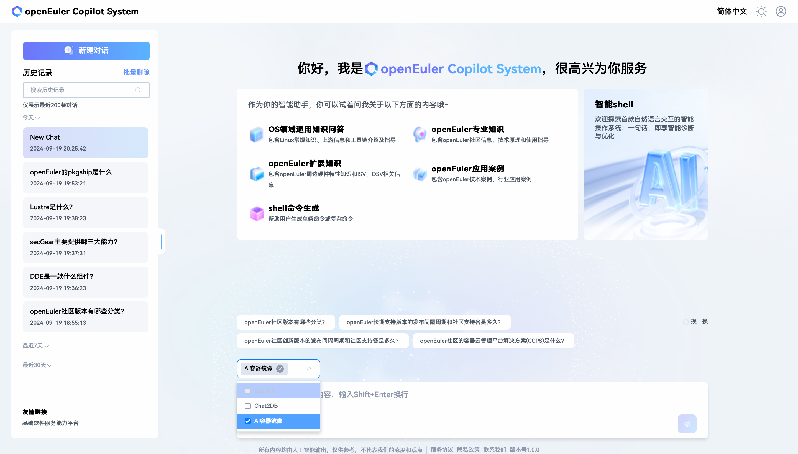
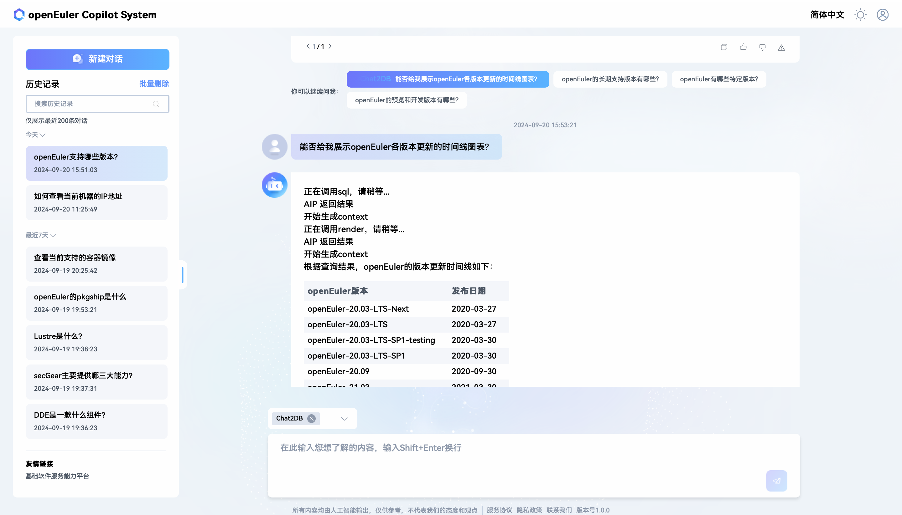
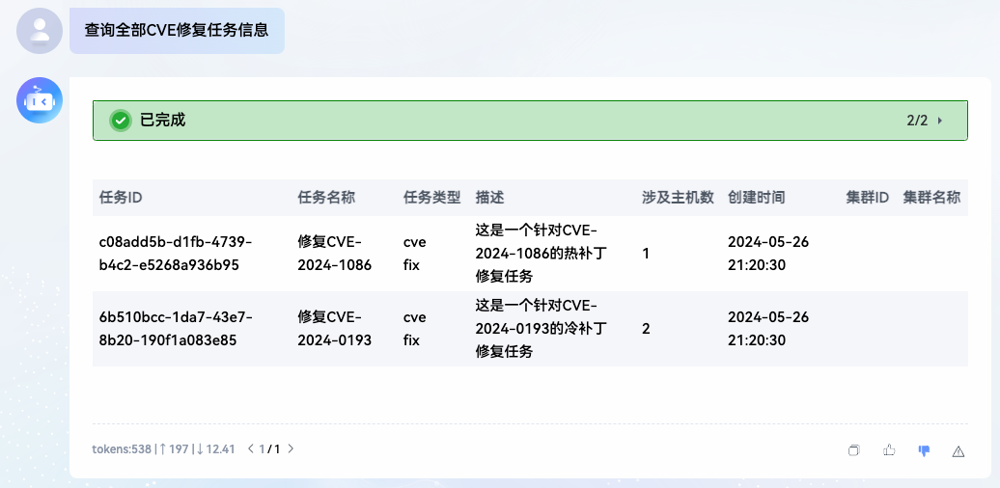
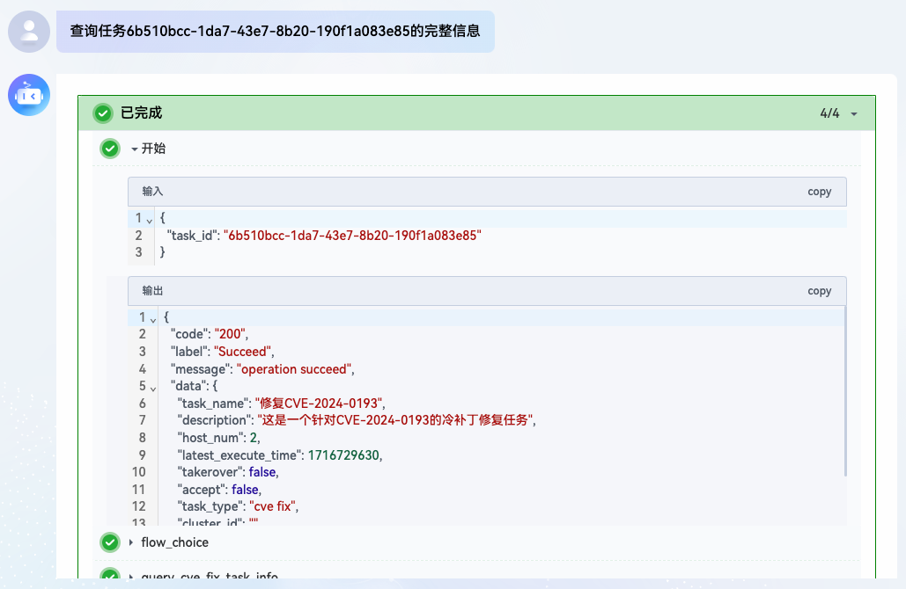
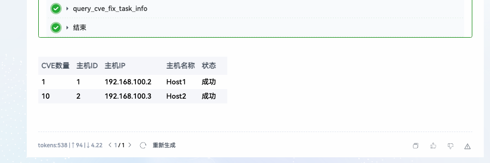
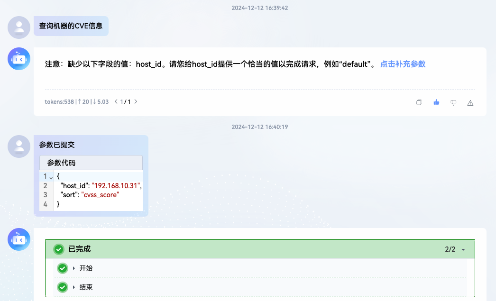

# 智能插件

## 基本用法

1. 如图所示，在输入框左上角可以选择插件，点击显示插件列表。

   

2. 勾选一个插件，然后提问。

   

3. 等待服务响应，查看返回结果。

   智能插件模式下，推荐问题将置顶推荐的工作流，蓝色文字为对应插件名称，点击后可快捷追问。

   
   

## 插件工作流

EulerCopilot 支持插件工作流。插件工作流由多个步骤组成，每个步骤都会调用一次插件。每个步骤的输出将作为下一个步骤的输入。下面以使用 CVE 漏洞查询插件查看漏洞修复任务完成情况为例，介绍插件工作流的使用方法。

1. 查询全部 CVE 修复任务信息

   

2. 根据上一步的结果查询指定 CVE 修复任务的详细信息

   
   

### 补全参数

当上下文信息不足时，插件会提示用户补充缺失的参数。

