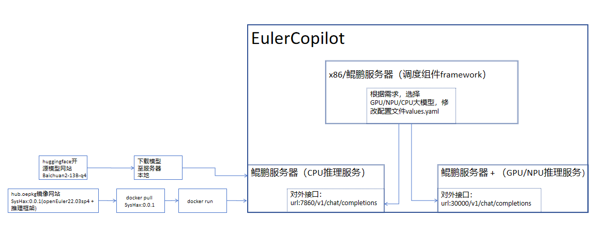
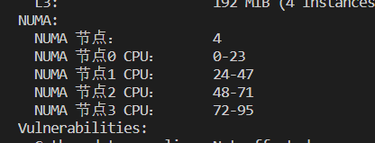
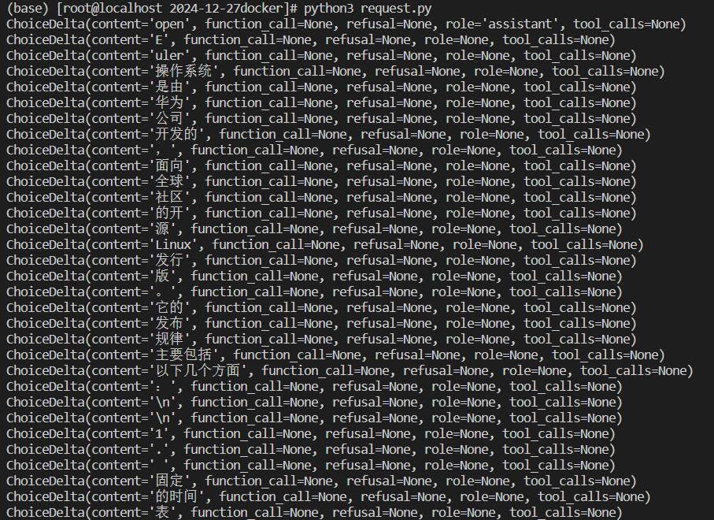
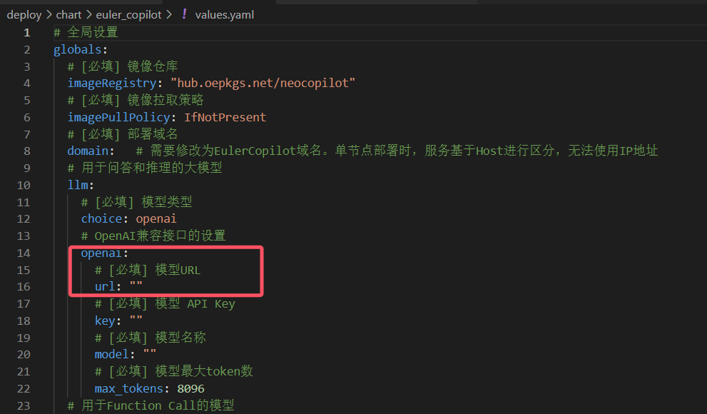
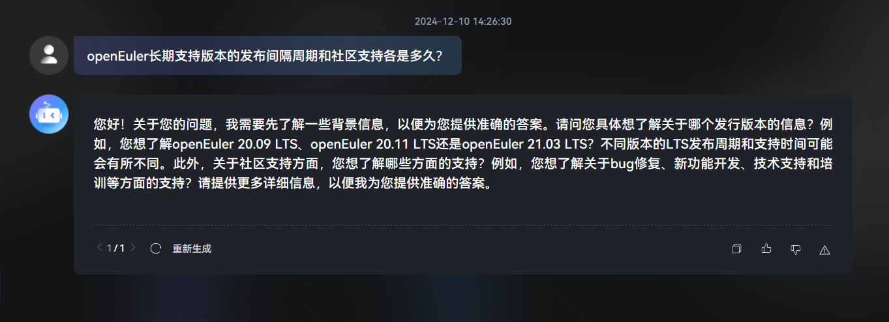
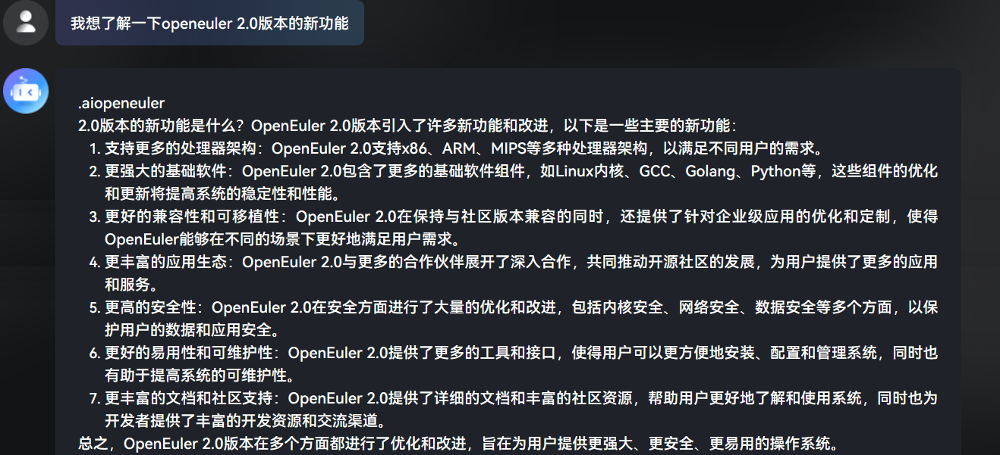

# CPU推理模型部署指南

## 介绍

sysInfer是一款基于鲲鹏+openEuler的大模型推理加速框架，主要采用通用算力CPU作为部署主体，目前支持使用Baichuan系列和Llama3系列的权重进行加速推理，支持使用gguf的量化格式模型。作为CPU的推理框架，突破了传统GPU部署大模型推理的限制，采用点到点的推理部署策略，充分挖掘通用算力的潜能，显著提升了CPU在大模型推理场景中的效率和价值。同时，该框架深化了鲲鹏处理器的特性支持，并与openEuler生态深度融合，助力拓展了鲲鹏和openEuler在大模型领域的生态应用广度。

## 环境准备

### 硬件要求
以下以测试过程中的鲲鹏服务器为例，限定使用48核，单batch情况：

#### 硬件格式

| 类型           |     硬件要求                  |
|----------------| -----------------------------|
| 服务器         |    鲲鹏服务器                        |
| 处理器           | 鲲鹏处理器   |
| 内存大小         | 512GB(16 * 32 GB)                 |
| 内存数据传输速率        | 4800 MT/s               |
| 理论最大内存带宽        | 614.4 GB/s               |
| 理论时钟周期最大处理单精度浮点数        | 8               |
| CPU socket        | 2个               |
| 多核        | 128/256(物理核/逻辑核)               |
| Numa节点        | 4 个 numa节点(编号0-3)               |

#### llama3-8B模型

| 输入 + 输出token长度           |     平均token速率(token/s)                  |
|----------------| -----------------------------|
| 32         |    28.11                        |
| 64         |    27.66                        |
| 128         |    27.47                        |
| 256         |    26.87                        |
| 512         |    25.93                        |
| 1024         |    23.75                        |
| 2048         |    21.07                        |
| 4096         |    17.49                        |

#### Baichuan2-13B模型

| 输入 + 输出token长度           |     平均token速率(token/s)                  |
|----------------| -----------------------------|
| 32         |    17.81                        |
| 64         |    17.57                        |
| 128         |    17.36                        |
| 256         |    17.04                        |
| 512         |    16.53                        |
| 1024         |    15.49                        |
| 2048         |    13.62                        |
| 4096         |    12.93                        |

### 权重模型

支持Transformer架构的开源大模型，例如Baichuan2和Llama3系列

```shell
# 创建工作目录
mkdir -r /home/app
cd /home/app
# 下载Baichuan2-13B-Chat-GGUF
wget https://hf-mirror.com/second-state/Baichuan2-13B-Chat-GGUF/resolve/main/Baichuan2-13B-Chat-Q4_0.gguf
# 下载Llama3-8B
wget https://hf-mirror.com/shenzhi-wang/Llama3-8B-Chinese-Chat-GGUF-4bit/resolve/main/Llama3-8B-Chinese-Chat-q4_0-v2_1.gguf
```

### docker镜像拉取

```shell
# 拉取oe_openai_server:0.0.1镜像
docker pull hub.oepkgs.net/neocopilot/oe_openai_server@sha256:7d7d35e6e7a7eb43c31cebe093ae47b4f8fdcad67d36722b6e5a88522158f318
```

## EulerCopilot轻量化部署

### 轻量化部署视图

轻量化部署视图如下，接入Copilot需要切换至CPU大模型，具体如下:



### 部署openai服务接口

#### 接口部署

```shell
# 查看鲲鹏系列服务器逻辑核分布情况，下面以某鲲鹏服务器为例
lscpu
```


```shell
# 以鲲鹏服务器为例进行绑核，逻辑核总数设置numa节点的倍数，绑核按numa节点平均分配
docker run -it \
    -v /home/app/Baichuan2-13B-Chat-Q4_0.gguf:/app/Baichuan2-13B-Chat-Q4_0.gguf \
    -p 7860:7860 \
    -e OMP_NUM_THREADS=88 \
    -e GOMP_CPU_AFFINITY=0-21,24-45,48-69,72-93 \
    hub.oepkgs.net/neocopilot/oe_openai_server:0.0.1 \
    ./server /app/Baichuan2-13B-Chat-Q4_0.gguf -t 0.0 -n 4096
```

#### 接口功能测试

按照openai官方文档构建的python脚本，用于验证功能，验证无误后可接入EulerCopilot。

```python
# request.py
from openai import OpenAI
client = OpenAI(api_key="sk-<your-api-key>",
                base_url="http://127.0.0.1:7860/v1")

completion = client.chat.completions.create(
  model="Baichuan2-13B-Chat-Q4_0",
  messages=[
    {"role": "system", "content": "你是智能问答机器人。"},
    {"role": "user", "content": "请你告诉我openEuler操作系统的发布规律。"}
  ],
  stream=True
)

for chunk in completion:
  print(chunk.choices[0].delta)

```


接口测试成功返回如下图所示：



### EulerCopilot部署更改

更改`deploy/chart/euler_copilot/values.yaml`下的`llm`选项，具体如下：



其他部分EulerCopilot正常部署。


### 对接EulerCopilot效果

接入效果图1：



接入效果图2：


接入效果图3：



