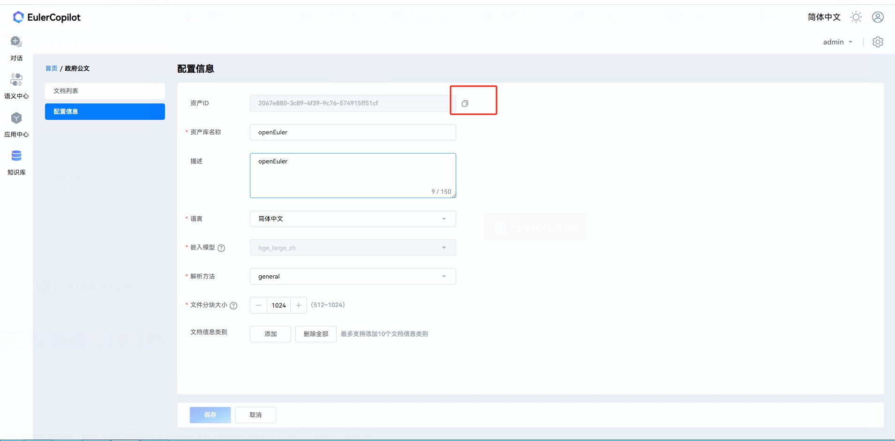
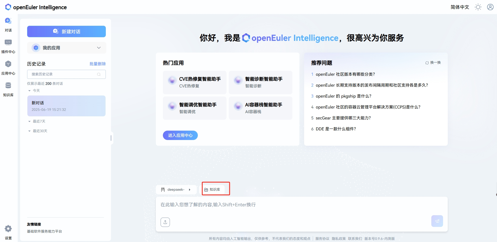

# **EulerCopilot 智能助手部署指南**

版本信息
当前版本：v0.9.4
更新日期：2025年4月22日

## 产品概述

EulerCopilot 是一款智能问答工具，使用 EulerCopilot 可以解决操作系统知识获取的便捷性，并且为OS领域模型赋能开发者及运维人员。作为获取操作系统知识，使能操作系统生产力工具 (如 A-Ops / A-Tune / x2openEuler / EulerMaker / EulerDevOps / StratoVirt / iSulad 等)，颠覆传统命令交付方式，由传统命令交付方式向自然语义进化，并结合智能体任务规划能力，降低开发、使用操作系统特性的门槛。

本指南提供基于自动化脚本的EulerCopilot智能助手系统部署说明，支持一键自动部署和手动分步部署两种方式。

### 组件介绍

| 组件                          | 端口            | 说明                  |
| ----------------------------- | --------------- | -------------------- |
| euler-copilot-framework       | 8002 (内部端口) | 智能体框架服务         |
| euler-copilot-web             | 8080            | 智能体前端界面        |
| euler-copilot-rag             | 9988 (内部端口) | 检索增强服务           |
| authhub-backend-service       | 11120 (内部端口) | 鉴权服务后端          |
| authhub-web-service           | 8000            | 鉴权服务前端          |
| mysql                         | 3306 (内部端口) | MySQL数据库           |
| redis                         | 6379 (内部端口) | Redis数据库           |
| minio                         | 9000 (内部端口) 9001(外部部端口) | minio数据库       |
| mongo                         | 27017 (内部端口)         | mongo数据库           |
| postgres                      | 5432 (内部端口) | 向量数据库             |
| secret_inject                 | 无              | 配置文件安全复制工具   |

### 软件要求
|     类型        |      版本要求                         |  说明                                |
|----------------| -------------------------------------|--------------------------------------|
| 操作系统    | openEuler 22.03 LTS 及以上版本         | 无                                   |
| K3s        | >= v1.30.2，带有 Traefik Ingress 工具   | K3s 提供轻量级的 Kubernetes 集群，易于部署和管理 |
| Helm       | >= v3.15.3                           | Helm 是一个 Kubernetes 的包管理工具，其目的是快速安装、升级、卸载 EulerCopilot 服务 |
| python     | >=3.9.9                              | python3.9.9 以上版本为模型的下载和安装提供运行环境 |
---
### 硬件规格

| 硬件资源      |  最小配置                  |    推荐配置               |
|--------------|----------------------------|------------------------------|
| CPU          | 4 核心                     | 16 核心及以上                 |
| RAM          | 4 GB                       | 64 GB                        |
| 存储         | 32 GB                      | 64G                         |
| 大模型名称    | deepseek-llm-7b-chat      | DeepSeek-R1-Llama-8B                         
| 显存 (GPU)   |  NVIDIA RTX A4000 8GB	   | NVIDIA A100 80GB * 2         |


**关键说明**：
- 纯CPU环境，建议通过调用 OpenAI 接口或使用自带的模型部署方式来实现功能。
- 如果k8s集群环境，则不需要单独安装k3s，要求version >= 1.28

---
### 部署视图


---
### 域名配置
需准备以下两个服务域名：
- authhub认证服务：authhub.eulercopilot.local
- EulerCopilot web服务：www.eulercopilot.local

```bash
# 本地Windows主机中进行配置
# 打开 C:\Windows\System32\drivers\etc\hosts 添加记录
# 替换127.0.0.1为目标服务器的IP
127.0.0.1 authhub.eulercopilot.local
127.0.0.1 www.eulercopilot.local
```

## 快速开始
### 1. 资源获取
- **获取部署脚本**

  [EulerCopilot 的官方Git仓库](https://gitee.com/openeuler/euler-copilot-framework)
  切换至dev分支点击下载ZIP, 并上传至目标服务器
  ```bash
  unzip euler-copilot-framework.tar -d /home
  ```
- **资源清单**
  [EulerCopilot 资源下载地址](https://repo.oepkgs.net/openEuler/rpm/openEuler-22.03-LTS/contrib/eulercopilot/)

| 类型       | 资源文件/说明 |
|------------|--------------|
| **镜像文件** | `hub.oepkgs.net/neocopilot/euler-copilot-framework:0.9.4-x86`<br>`hub.oepkgs.net/neocopilot/euler-copilot-web:0.9.4-x86`<br>`hub.oepkgs.net/neocopilot/data_chain_back_end:0.9.4-x86`<br>`hub.oepkgs.net/neocopilot/data_chain_web:0.9.4-x86`<br>`hub.oepkgs.net/neocopilot/authhub:0.9.3-x86`<br>`hub.oepkgs.net/neocopilot/authhub-web:0.9.3-x86`<br>`hub.oepkgs.net/neocopilot/pgsql-empty:pg16-x86`<br>`hub.oepkgs.net/neocopilot/redis:7.4-alpine-x86`<br>`hub.oepkgs.net/neocopilot/mysql:8-x86`<br>`hub.oepkgs.net/neocopilot/minio:empty-x86`<br>`hub.oepkgs.net/neocopilot/mongo:7.0.16-x86`<br>`hub.oepkgs.net/neocopilot/secret_inject:dev-x86`<br> |
| **模型文件** | `bge-m3-Q4_K_M.gguf`<br>`deepseek-llm-7b-chat-Q4_K_M.gguf`<br> |
| **工具包**   | `helm-v3.15.0-linux-{arm64/amd64}.tar.gz`<br>`k3s-airgap-images-{arm64/amd64}.tar.zst`<br>`k3s-{arm64/amd64}`<br>`k3s-install.sh`<br>`ollama-linux-{arm64/amd64}.tgz` |

---

- **镜像下载与传输**
```bash
# 在联网服务器执行：
cd /home/euler-copilot-framework/deploy/scripts/9-other-script/
./save_images.sh 0.9.4  # 版本号可替换，镜像将保存至 /home/eulercopilot/images/

# 传输至目标服务器：
scp /home/eulercopilot/images/* root@target-server:/home/eulercopilot/images/
```
- **目录结构要求**
确保目标服务器已创建以下目录：
```bash
/home/eulercopilot/
├── images/    # 存放镜像文件
├── models/    # 存放模型文件
└── tools/     # 存放工具包
```
- **注意事项**
- **手动下载**：需通过可访问外网的 Windows 环境下载后传输至离线环境。
- **脚本下载**：仅支持在联网服务器下载镜像，并传输至离线环境。

---

### 2. 部署EulerCopilot
#### 一键部署
```bash
cd /home/euler-copilot-framework/deploy/scripts
```
```bash
bash deploy.sh
```
```bash
# 输入0进行一键自动部署
==============================
        主部署菜单
==============================
0) 一键自动部署
1) 手动分步部署
2) 重启服务
3) 卸载所有组件并清除数据
4) 退出程序
==============================
请输入选项编号（0-3）: 0
```
---
#### 手动分步部署

```bash
# 选择1 -> 1 进入手动分步部署
==============================
        主部署菜单
==============================
0) 一键自动部署
1) 手动分步部署
2) 重启服务
3) 卸载所有组件并清除数据
4) 退出程序
==============================
请输入选项编号（0-3）: 1
```
```bash
# 输入选项编号（0-9），逐步部署
==============================
       手动分步部署菜单
==============================
1) 执行环境检查脚本
2) 安装k3s和helm
3) 安装Ollama
4) 部署Deepseek模型
5) 部署Embedding模型
6) 安装数据库
7) 安装AuthHub
8) 安装EulerCopilot
9) 返回主菜单
==============================
请输入选项编号（0-9）:
```
---

**关键说明**
1. 安装部署前需要预先准备好部署所需的资源
2. 在部署过程中，您需要输入 Authhub 域名和 EulerCopilot 域名, 不输入则使用默认域名`authhub.eulercopilot.local`, `www.eulercopilot.local`。

#### 重启服务
```bash
# 输入选项重启服务
==============================
        服务重启菜单
==============================
可重启的服务列表：
1) authhub-backend
2) authhub
3) framework
4) minio
5) mongo
6) mysql
7) pgsql
8) rag
9) rag-web
10) redis
11) web
12) 返回主菜单
==============================
请输入要重启的服务编号（1-12）:
```
#### 卸载所有组件
```bash
sudo ./deploy.sh
# 选择2进行完全卸载
==============================
        主部署菜单
==============================
0) 一键自动部署
1) 手动分步部署
2) 卸载所有组件并清除数据
3) 退出程序
==============================
请输入选项编号（0-3）: 2
```
---

**关键说明**
- 在部署过程中，您需要输入 Authhub 域名和 EulerCopilot 域名, 不输入则使用默认域名`authhub.eulercopilot.local`, `www.eulercopilot.local`。
- 资源不足时可参考 FAQ 中的评估资源可用性解决
- 查看组件日志
```bash
kubectl logs <pod名称> -n euler-copilot
```
- 查看服务状态
```bash
kubectl get pod -n euler-copilot
```
- 大模型配置修改并更新 EulerCopilot
```bash
cd /home/euler-copilot-framework/deploy/chart/euler-copilot
```
```bash
vim values.yaml
```
```bash
helm upgrade euler-copilot -n euler-copilot .
```

## 验证安装

恭喜您，**EulerCopilot** 已成功部署！为了开始您的体验，请在浏览器中输入 `https://您的EulerCopilot域名` 链接访问 EulerCopilot 的网页界面：

首次访问时，您需要点击页面上的 **立即注册** 按钮来创建一个新的账号，并完成登录过程。


---

## 构建专有领域智能问答

### 资产库构建
1. **访问知识库管理系统**：
   - 打开浏览器，点击知识库登录本地知识库管理页面。
   - 使用默认账户信息进行登录（账号：`admin`，密码：`123456`）。
   - 详情请参阅[本地资产库构建指南](./本地资产库构建指南.md)文档。

2. **获取资产ID**：
   - 登录后，在知识库界面中找到您需要配置的资产条目。
   - 点击该资产条目的ID来选中它，然后使用快捷键或右键选择“复制”来复制这个ID。
   

### 配置资产库
1. **进入配置页面**：
   - 在页面的右上角找到并点击“资产库配置”按钮，进入资产库配置界面。
   

2. **填写资产库ID**：
   - 在打开的配置窗口中，将之前复制的资产ID粘贴到此处, 并点击确定。
   

通过上述步骤，您可以顺利完成智能问答系统中专有领域知识库的构建与配置工作。

---
## 附录

### 大模型准备
#### GPU 环境

以下方式是基于 vLLM 框架部署 Qwen1.5-14B-Chat 大模型推理服务，仅供参考。
1. 安装依赖
确保您的系统满足以下要求：
- Python: 版本 >= 3.10
- CUDA: 版本 >= 11.7（根据您的 GPU 型号选择合适的版本）
- GPU: 至少需要一张高性能的 GPU（建议使用 NVIDIA A100 或类似型号）[GPU驱动安装](https://www.nvidia.cn/drivers/lookup/)

2. 下载模型文件：

   ```bash
   huggingface-cli download --resume-download Qwen/Qwen1.5-14B-Chat --local-dir Qwen1.5-14B-Chat
   ```

3. 创建终端 control

   ```bash
   screen -S control
   ```

   ```bash
   python3 -m fastchat.serve.controller
   ```

   - 按 Ctrl A+D 置于后台

4. 创建新终端 api

   ```bash
   screen -S api
   ```

   ```bash
   python3 -m fastchat.serve.openai_api_server --host 0.0.0.0 --port 30000  --api-keys sk-123456
   ```

   - 按 Ctrl A+D 置于后台
   - 如果当前环境的 Python 版本是 3.12 或者 3.9 可以创建 python3.10 的 conda 虚拟环境

   ```bash
   mkdir -p /root/py310
   ```

   ```bash
   conda create --prefix=/root/py310 python==3.10.14
   ```

   ```bash
   conda activate /root/py310
   ```

5. 创建新终端 worker

   ```bash
   screen -S worker
   ```

   ```bash
   screen -r worker
   ```

   安装 fastchat 和 vllm

   ```bash
   pip install fschat vllm
   ```

   安装依赖：

   ```bash
   pip install fschat[model_worker]
   ```

   ```bash
   python3 -m fastchat.serve.vllm_worker --model-path /root/models/Qwen1.5-14B-Chat/ --model-name qwen1.5 --num-gpus 8 --gpu-memory-utilization=0.7 --dtype=half
   ```

   - 按 Ctrl A+D 置于后台

6. 按照如下方式修改配置的大模型参数，并更新服务。

   ```bash
   vim /home/euler-copilot-framework/deploy/chart/euler_copilot/values.yaml
   ```
   修改如下部分
   ```yaml
   # 模型设置
   models:
     # 用于问答的大模型；需要为OpenAI兼容接口
     answer:
       # [必填] 接口URL（无需带上“v1”后缀）
       url: http://$IP:11434
       # [必填] 接口API Key；默认置空
       key: sk-123456
       # [必填] 模型名称
       name: deepseek-llm-7b-chat:latest
       # [必填] 模型最大上下文数；建议>=8192
       ctx_length: 8192
       # 模型最大输出长度，建议>=2048
       max_tokens: 2048
       # 用于Function Call的模型；建议使用特定推理框架
     functioncall:
       # 推理框架类型，默认为ollama
       # 可用的框架类型：["vllm", "sglang", "ollama", "openai"]
       backend:
       # 模型地址；不填则与问答模型一致
     url: ollama
       # API Key；不填则与问答模型一致
       key:
       # 模型名称；不填则与问答模型一致
       name:
       # 模型最大上下文数；不填则与问答模型一致
       ctx_length:
       # 模型最大输出长度；不填则与问答模型一致
       max_tokens:
     # 用于数据向量化（Embedding）的模型
     embedding:
       # 推理框架类型，默认为openai
       # [必填] Embedding接口类型：["openai", "mindie"]
       type: openai
       # [必填] Embedding URL（需要带上“v1”后缀）
       url: http://172.168.178.107:11434
       # [必填] Embedding 模型API Key
       key: sk-123456
       # [必填] Embedding 模型名称
       name: bge-m3:latest
   ```
   ```bash
   # 更新服务
   helm upgrade -n euler-copilot euler-copilot .
   ```
   ```bash
   # 重启framework服务
   kubectl get pod -n euler-copilot
   ```bash
   kubectl delete pod framework-deploy-65b669fc58-q9bw7 -n euler-copilot
   ```
   ```bash
   # curl大模型接口
    curl http://localhost:11434/v1/chat/completions   -H "Content-Type: application/json" -H "Authorization: Bearer sk-123456"   -d '{ "model": "deepseek-llm-7b-chat:latest", "messages":[ { "role": "system", "content": "你是情感分析专家，你的任务是xxxx"}, { "role": "user", "content": "你好" }], "stream": true, "n": 1, "max_tokens": 8192 }'
   ```

#### NPU 环境

NPU 环境部署可参考链接 [昇腾镜像仓库](https://www.hiascend.com/developer/ascendhub), 可参考[NPU部署案例](./NPU推理服务器部署指南.md)

### FAQ

#### 1. 解决 Hugging Face 连接错误

如果遇到如下连接错误：

```text
urllib3.exceptions.NewConnectionError: <urllib3.connection.HTTPSConnection object>: Failed to establish a new connection: [Errno 101] Network is unreachable
```

尝试以下解决方案：

- 更新 `huggingface_hub` 包到最新版本。

  ```bash
  pip3 install -U huggingface_hub
  ```

- 如果网络问题依旧存在，可以尝试使用镜像站点作为端点。

  ```bash
  export HF_ENDPOINT=https://hf-mirror.com
  ```

#### 2. 在 RAG 容器中调用问答接口

进入对应的 RAG Pod 后，可以通过 `curl` 命令发送 POST 请求来获取问答结果。请确保在请求体中提供具体的问题文本。

```bash
curl -k -X POST "http://localhost:9988/kb/get_answer" \
     -H "Content-Type: application/json" \
     -d '{
           "question": "您的问题",
           "kb_sn": "default_test",
           "fetch_source": true
         }'
```

#### 3. 解决 `helm upgrade` 错误

当 Kubernetes 集群不可达时，您可能会遇到类似下面的错误信息：

```text
Error: UPGRADE FAILED: Kubernetes cluster unreachable
```

确保设置了正确的 KUBECONFIG 环境变量指向有效的配置文件。

```bash
echo "export KUBECONFIG=/etc/rancher/k3s/k3s.yaml" >> /root/.bashrc
source /root/.bashrc
```

#### 4. 查看 Pod 日志失败

如果您遇到查看 Pod 日志时权限被拒绝的问题，检查是否正确配置了代理设置，并将本机 IP 地址添加到 `no_proxy` 环境变量中。

```bash
cat /etc/systemd/system/k3s.service.env
```

编辑文件并确保包含：

```bash
no_proxy=XXX.XXX.XXX.XXX
```

#### 5. GPU环境中大模型流式回复问题

对于某些服务执行 curl 大模型时无法进行流式回复的情况，尝试修改请求中的 `"stream"` 参数为 `false`。此外，确认已安装兼容版本的 Pydantic 库。

```bash
pip install pydantic==1.10.13
```

#### 6. sglang 模型部署指南

按照以下步骤部署基于 sglang 的模型：

```bash
# 1. 激活名为 `myenv` 的 Conda 环境，该环境基于 Python 3.10 创建：
conda activate myenv

# 2. 安装 sglang 及其所有依赖项，指定版本为 0.3.0
pip install "sglang[all]==0.3.0"

# 3. 从特定索引安装 flashinfer，确保与您的 CUDA 和 PyTorch 版本兼容
pip install flashinfer -i https://flashinfer.ai/whl/cu121/torch2.4/

# 4. 使用 sglang 启动服务器，配置如下：
python -m sglang.launch_server \
    --served-model-name Qwen2.5-32B \
    --model-path Qwen2.5-32B-Instruct-AWQ \
    --host 0.0.0.0 \
    --port 8001 \
    --api-key "sk-12345" \
    --mem-fraction-static 0.5 \
    --tp 8
```

- 验证安装

  ```bash
  pip show sglang
  pip show flashinfer
  ```

**注意事项：**
- API Key：请确保 `--api-key` 参数中的 API 密钥是正确的
- 模型路径： 确保 `--model-path` 参数中的路径是正确的，并且模型文件存在于该路径下。
- CUDA 版本：确保你的系统上安装了 CUDA 12.1 和 PyTorch 2.4，因为 `flashinfer` 包依赖于这些特定版本。
- 线程池大小：根据你的GPU资源和预期负载调整线程池大小。如果你有 8 个 GPU，那么可以选择 --tp 8 来充分利用这些资源。

#### 7. 获取 Embedding

使用 curl 发送 POST 请求以获取 embedding 结果：

```bash
curl -k -X POST http://localhost:11434/v1/embeddings \
     -H "Content-Type: application/json" \
     -d '{"input": "The food was delicious and the waiter...", "model": "bge-m3", "encoding_format": "float"}'
```
#### 8. 生成证书

为了生成自签名证书，首先下载 [mkcert](https://github.com/FiloSottile/mkcert/releases)工具，然后运行以下命令：
```bash
mkcert -install
mkcert example.com 
```
最后，将生成的证书和私钥拷贝到 values.yaml 中, 并应用至 Kubernetes Secret。
```bash
vim /home/euler-copilot-framework_openeuler/deploy/chart_ssl/traefik-secret.yaml
```
```bash
kubectl apply -f traefik-secret.yaml
```

#### 9. 问题排查方法

1. **获取集群事件信息**

   为了更好地定位 Pod 失败的原因，请首先检查 Kubernetes 集群中的事件 (Events)。这可以提供有关 Pod 状态变化的上下文信息。

   ```bash
   kubectl get events -n euler-copilot
   ```

2. **验证镜像拉取状态**

   确认容器镜像是否成功拉取。如果镜像未能正确加载，可能是由于网络问题或镜像仓库配置错误。

   ```bash
   k3s crictl images
   ```

3. **审查 Pod 日志**

   检查相关 Pod 的日志，以寻找可能的错误信息或异常行为。这对于诊断应用程序级别的问题特别有用。

   ```bash
   kubectl logs rag-deploy-service-5b7887644c-sm58z -n euler-copilot
   ```

4. **评估资源可用性**

   确保 Kubernetes 集群有足够的资源（如 CPU、内存和存储）来支持 Pod 的运行。资源不足可能导致镜像拉取失败或其他性能问题，或使得 Pod 状态从 Running 变为 Pending 或 Completed。可查看磁盘空间并保证至少有 30% 的可用空间。这有助于维持 Pod 的稳定运行状态。参考该链接挂载空间较大的磁盘[How to move k3s data to another location](https://mrkandreev.name/snippets/how_to_move_k3s_data_to_another_location/)

   ```bash
   kubectl top nodes
   ```

5. **确认 k3s 版本兼容性**

   如果遇到镜像拉取失败且镜像大小为 0 的问题，请检查您的 k3s 版本是否符合最低要求（v1.30.2 或更高）。较低版本可能存在不兼容的问题。

   ```bash
   k3s -v
   ```

6. **检查配置**

   检查 `values.yaml` 文件中关于 OIDC 配置和域名配置是否填写正确，确保配置无误后更新服务。

   ```bash
   cd /home/euler-copilot-framework/deploy/chart/euler_copilot
   ```
   ```bash
   vim values.yaml | grep oidc
   ```
   ```bash
   helm upgrade euler-copilot -n euler-copilot .
   ```
