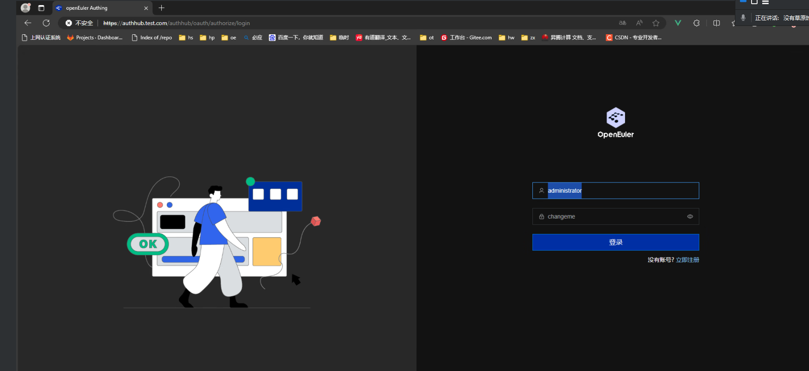
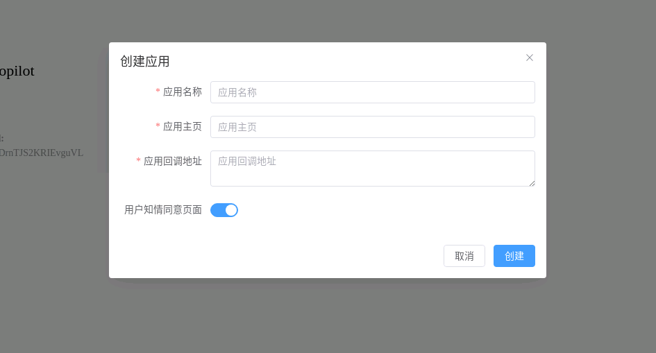
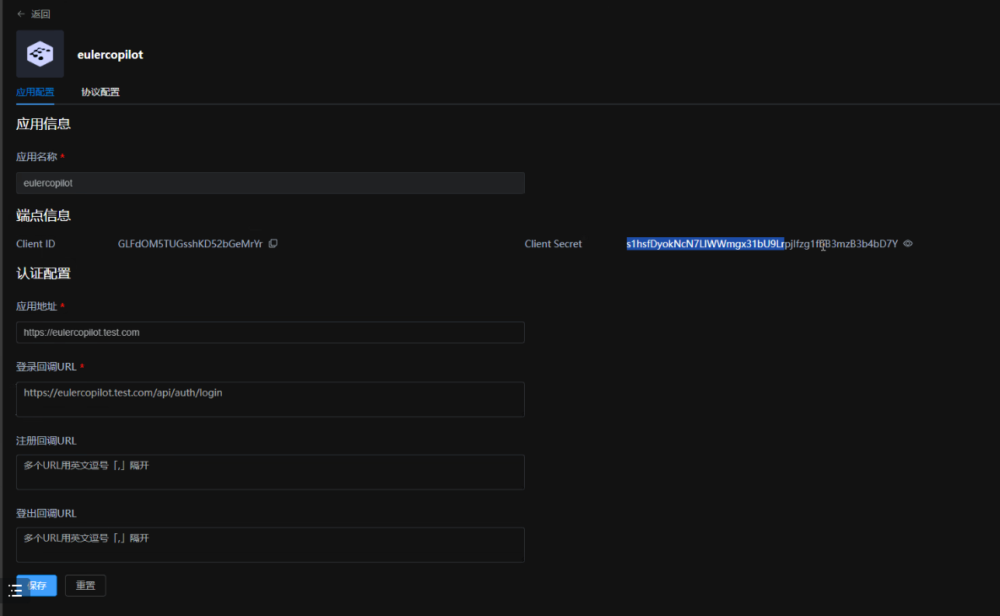

# 无网络环境下部署指南

## 介绍

openEuler Copilot System 是一款智能问答工具，使用 openEuler Copilot System 可以解决操作系统知识获取的便捷性，并且为OS领域模型赋能开发者及运维人员。作为获取操作系统知识，使能操作系统生产力工具 (如 A-Ops / A-Tune / x2openEuler / EulerMaker / EulerDevOps / StratoVirt / iSulad 等)，颠覆传统命令交付方式，由传统命令交付方式向自然语义进化，并结合智能体任务规划能力，降低开发、使用操作系统特性的门槛。

### 组件介绍

| 组件                          | 端口            | 说明                  |
| ----------------------------- | --------------- | -------------------- |
| euler-copilot-framework       | 8002 (内部端口) | 智能体框架服务         |
| euler-copilot-web             | 8080            | 智能体前端界面        |
| euler-copilot-rag             | 8005 (内部端口) | 检索增强服务           |
| euler-copilot-vectorize-agent | 8001 (内部端口) | 文本向量化服务         |
| mysql                         | 3306 (内部端口) | MySQL数据库           |
| redis                         | 6379 (内部端口) | Redis数据库           |
| postgres                      | 5432 (内部端口) | 向量数据库             |
| secret_inject                 | 无              | 配置文件安全复制工具   |

## 环境要求

### 软件要求

| 类型        |  版本要求                         |  说明                                |
|------------| -------------------------------------|--------------------------------------|
| 操作系统    | openEuler 22.03 LTS 及以上版本         | 无                                   |
| K3s        | >= v1.30.2，带有 Traefik Ingress 工具   | K3s 提供轻量级的 Kubernetes 集群，易于部署和管理 |
| Helm       | >= v3.15.3                           | Helm 是一个 Kubernetes 的包管理工具，其目的是快速安装、升级、卸载 openEuler Copilot System 服务 |
| python     | >=3.9.9                              | python3.9.9 以上版本为模型的下载和安装提供运行环境 |

### 硬件要求

| 类型           |     硬件要求                  |
|----------------| -----------------------------|
| 服务器         | 1台                           |
| CPU           | 鲲鹏或x86_64，>= 32 cores     |
| RAM           | >= 64GB                      |
| 存储          | >= 500 GB                    |
| GPU           | Tesla V100 16GB，4张         |
| NPU           | 910ProB、910B                |

注意：

1. 若无 GPU 或 NPU 资源，建议通过调用 OpenAI 接口的方式来实现功能。(接口样例：<https://dashscope.aliyuncs.com/compatible-mode/v1/chat/completions>)
2. 调用第三方 OpenAI 接口的方式不需要安装高版本的 python (>=3.9.9)
3. 英伟达 GPU 对 Docker 的支持必需要新版本 Docker (>= v25.4.0)

### 部署视图


## 获取 openEuler Copilot System

- 从 openEuler Copilot System 的官方Git仓库 [euler-copilot-framework](https://gitee.com/openeuler/euler-copilot-framework) 下载最新的部署仓库
- 如果您正在使用 Kubernetes，则不需要安装 k3s 工具。

  ```bash
  # 下载目录以 home 为例
  cd /home
  ```

  ```bash
  git clone https://gitee.com/openeuler/euler-copilot-framework.git
  ```

## 环境准备

如果您的服务器、硬件、驱动等全部就绪，即可启动环境初始化流程，以下部署步骤在无公网环境执行。

### 1. 环境检查

环境检查主要是对服务器的主机名、DNS、防火墙设置、磁盘剩余空间大小、网络、检查 SELinux 的设置。

- 主机名设置
  在Shell中运行如下命令：

  ```bash
  cat /etc/hostname
  echo "主机名" > /etc/hostname
  ```

- 系统DNS设置：需要给当前主机设置有效的DNS
- 防火墙设置

  ```bash
  # 查看防火墙状态
  systemctl status firewalld
  # 查看防火墙列表
  firewall-cmd --list-all
  # 关闭防火墙
  systemctl stop firewalld
  systemctl disable firewalld
  ```

- SELinux设置

  ```bash
  # 需要关闭selinux，可以临时关闭或永久关闭
  # 永久关闭SELinux
  sed -i 's/SELINUX=enforcing/SELINUX=disabled/g' /etc/selinux/config
  # 临时关闭
  setenforce 0
  ```

### 2. 文件下载

- 模型文件 bge-reranker-large、bge-mixed-model 下载 [模型文件下载链接](https://repo.oepkgs.net/openEuler/rpm/openEuler-22.03-LTS/contrib/EulerCopilot/)

  ```bash
  mkdir -p /home/EulerCopilot/models
  cd /home/EulerCopilot/models
  # 将需要下载的bge文件放置在models目录
  wget https://repo.oepkgs.net/openEuler/rpm/openEuler-22.03-LTS/contrib/EulerCopilot/bge-mixed-model.tar.gz
  wget https://repo.oepkgs.net/openEuler/rpm/openEuler-22.03-LTS/contrib/EulerCopilot/bge-reranker-large.tar.gz
  ```

- 下载分词工具 text2vec-base-chinese-paraphrase [分词工具下载链接](https://repo.oepkgs.net/openEuler/rpm/openEuler-22.03-LTS/contrib/EulerCopilot/)  

  ```bash
  mkdir -p /home/EulerCopilot/text2vec
  cd /home/EulerCopilot/text2vec
  wget https://repo.oepkgs.net/openEuler/rpm/openEuler-22.03-LTS/contrib/EulerCopilot/text2vec-base-chinese-paraphrase.tar.gz
  ```

- 镜像包下载
  - x86或arm架构的EulerCopilot服务的各组件镜像单独提供

### 3. 安装部署工具

#### 3.1 安装 Docker

如需要基于 GPU/NPU 部署大模型，需要检查 Docker 版本是否满足>= v25.4.0 ，如不满足，请升级 Docker 版本

#### 3.2 安装 K3s 并导入镜像

- 安装 SELinux 配置文件

  ```bash
  yum install -y container-selinux selinux-policy-base
  # packages里有k3s-selinux-0.1.1-rc1.el7.noarch.rpm的离线包
  rpm -i https://rpm.rancher.io/k3s-selinux-0.1.1-rc1.el7.noarch.rpm
  ```

- x86 架构安装 k3s

  ```bash
  # 在有网络的环境上获取k3s相关包，以v1.30.3+k3s1示例
  wget https://github.com/k3s-io/k3s/releases/download/v1.30.3%2Bk3s1/k3s
  wget https://github.com/k3s-io/k3s/releases/download/v1.30.3%2Bk3s1/k3s-airgap-images-amd64.tar.zst 
  cp k3s /usr/local/bin/
  cd /var/lib/rancher/k3s/agent
  mkdir images
  cp k3s-airgap-images-arm64.tar.zst /var/lib/rancher/k3s/agent/images
  # packages里有k3s-install.sh的离线包
  curl -sfL https://rancher-mirror.rancher.cn/k3s/k3s-install.sh 
  INSTALL_K3S_SKIP_DOWNLOAD=true ./k3s-install.sh
  export KUBECONFIG=/etc/rancher/k3s/k3s.yaml
  ```

- arm 架构安装 k3s

  ```bash
  # 在有网络的环境上获取k3s相关包，以v1.30.3+k3s1示例
  wget https://github.com/k3s-io/k3s/releases/download/v1.30.3%2Bk3s1/k3s-arm64
  wget https://github.com/k3s-io/k3s/releases/download/v1.30.3%2Bk3s1/k3s-airgap-images-arm64.tar.zst
  cp k3s-arm64 /usr/local/bin/k3s
  cd /var/lib/rancher/k3s/agent
  mkdir images
  cp k3s-airgap-images-arm64.tar.zst /var/lib/rancher/k3s/agent/images
  # packages里有k3s-install.sh的离线包
  curl -sfL https://rancher-mirror.rancher.cn/k3s/k3s-install.sh 
  INSTALL_K3S_SKIP_DOWNLOAD=true ./k3s-install.sh
  export KUBECONFIG=/etc/rancher/k3s/k3s.yaml
  ```

- 导入镜像

  ```bash
  # 导入已下载的镜像文件
  k3s ctr image import $(镜像文件)
  ```

#### 3.3 安装 Helm 工具

- x86_64 架构

  ```bash
  wget https://get.helm.sh/helm-v3.15.0-linux-amd64.tar.gz
  tar -xzf helm-v3.15.0-linux-amd64.tar.gz
  mv linux-amd64/helm /usr/sbin
  rm -rf linux-amd64
  ```

- arm64 架构

  ```bash
  wget https://get.helm.sh/helm-v3.15.0-linux-arm64.tar.gz
  tar -xzf helm-v3.15.0-linux-arm64.tar.gz
  mv linux-arm64/helm /usr/sbin
  rm -rf linux-arm64
  ```

#### 3.4 大模型准备

提供第三方openai接口或基于硬件本都部署大模型，本地部署大模型可参考附录部分。

## 安装

您的环境现已就绪，接下来即可启动 openEuler Copilot System 的安装流程。

- 下载目录以home为例，进入 openEuler Copilot System 仓库的 Helm 配置文件目录

  ```bash
  cd /home/euler-copilot-framework && ll
  ```

  ```bash
  total 28
  drwxr-xr-x  3 root root 4096 Aug 28 17:45 docs/
  drwxr-xr-x  5 root root 4096 Aug 28 17:45 euler-copilot-helm/
  ```

- 查看euler-copilot-helm的目录

  ```bash
  tree euler-copilot-helm
  ```

  ```bash
  euler-copilot-helm/chart
  ├── databases
  │   ├── Chart.yaml
  │   ├── configs
  │   ├── templates
  │   └── values.yaml
  ├── authhub
  │   ├── Chart.yaml
  │   ├── configs
  │   ├── templates
  │   └── values.yaml
  └── euler_copilot
      ├── Chart.yaml
      ├── configs
      ├── templates
      │   ├── NOTES.txt
      │   ├── rag
      │   ├── vectorize
      │   └── web
      └── values.yaml
  ```

### 1. 安装数据库

- 编辑 values.yaml

  ```bash
  cd euler-copilot-helm/chart/databases
  ```

  仅需修改镜像tag为对应架构，其余可不进行修改

  ```bash
  vim values.yaml
  ```

- 创建命名空间

  ```bash
  kubectl create namespace euler-copilot
  ```

  设置环境变量

  ```bash
  export KUBECONFIG=/etc/rancher/k3s/k3s.yaml
  ```

- 安装数据库

  ```bash
  helm install -n euler-copilot databases .
  ```

- 查看 pod 状态

  ```bash
  kubectl -n euler-copilot get pods
  ```

  ```bash
  pgsql-deploy-databases-86b4dc4899-ppltc           1/1     Running   0          17d
  redis-deploy-databases-f8866b56-kj9jz             1/1     Running   0          17d
  mysql-deploy-databases-57f5f94ccf-sbhzp           2/2     Running   0          17d
  ```

- 若服务器之前部署过 mysql，则可预先清除下 pvc，再部署 databases。

  ```bash
  # 获取pvc
  kubectl -n euler-copilot get pvc
  ```

  ```bash
  # 删除pvc
  kubectl -n euler-copilot delete pvc mysql-pvc
  ```

### 2. 安装鉴权平台Authhub

- 编辑 values.yaml

  ```bash
  cd euler-copilot-helm/chart/authhub
  ```

  请结合 YAML 中的注释中的[必填]项进行修改

  ```bash
  vim values.yaml
  ```

  注意：

  1. authHub 需要域名，可预先申请域名或在 'C:\Windows\System32\drivers\etc\hosts' 下配置。
     authhub和euler-copilot必须是同一个根域名的两个子域名, 比如authhub.test.com和
     eulercopilot.test.com
  2. 数据库的密码与databases的values.yaml一致

- 安装 AuthHub

  ```bash
  helm install -n euler-copilot authhub .
  ```

  AuthHub 默认账号 `administrator`, 密码 `changeme`

- 查看 pod 状态

  ```bash
  kubectl -n euler-copilot get pods
  ```

  ```bash
  NAME                                             READY   STATUS    RESTARTS   AGE
  authhub-backend-deploy-authhub-64896f5cdc-m497f   2/2     Running   0          16d
  authhub-web-deploy-authhub-7c48695966-h8d2p       1/1     Running   0          17d
  pgsql-deploy-databases-86b4dc4899-ppltc           1/1     Running   0          17d
  redis-deploy-databases-f8866b56-kj9jz             1/1     Running   0          17d
  mysql-deploy-databases-57f5f94ccf-sbhzp           2/2     Running   0          17d
  ```

- 登录 AuthHub
  
  AuthHub 的域名以 <authhub.test.com> 为例，AuthHub 的登录界面如下图所示：

  

- 创建应用eulercopilot

  
  点击创建应用，输入应用名称、应用主页和应用回调地址（登录后回调地址），参考如下：
  - 应用名称：eulercopilot
  - 应用主页：<https://eulercopilot.test.com>
  - 应用回调地址：<https://eulercopilot.test.com/api/auth/login>
  - 应用创建好后会生成 Client ID 和 Client Secret，将生成的 Client ID 和 Client Secret 配置到应用里，以 eulercopilot 为例，创建应用后在配置文件中添加配置 `euler-copilot-helm/chart/euler_copilot/values.yaml` 中添加配置
  
  

### 2. 安装 openEuler Copilot System

- 编辑 values.yaml

  ```bash
  cd euler-copilot-helm/chart/euler_copilot
  ```

  请结合 YAML 中的注释中的[必填]项进行修改

  ```bash
  vim values.yaml
  ```

- 安装 openEuler Copilot System

  ```bash
  helm install -n euler-copilot service .
  ```

- 查看 Pod 状态

  ```bash
  kubectl -n euler-copilot get pods
  ```

  镜像拉取过程可能需要大约一分钟的时间，请耐心等待。部署成功后，所有 Pod 的状态应显示为 Running。

  ```bash
  NAME                                              READY   STATUS    RESTARTS   AGE
  authhub-backend-deploy-authhub-64896f5cdc-m497f   2/2     Running   0          16d
  authhub-web-deploy-authhub-7c48695966-h8d2p       1/1     Running   0          17d
  pgsql-deploy-databases-86b4dc4899-ppltc           1/1     Running   0          17d
  redis-deploy-databases-f8866b56-kj9jz             1/1     Running   0          17d
  mysql-deploy-databases-57f5f94ccf-sbhzp           2/2     Running   0          17d
  framework-deploy-service-bb5b58678-jxzqr          2/2     Running   0          16d
  rag-deploy-service-5b7887644c-sm58z               2/2     Running   0          110m
  vectorize-deploy-service-57f5f94ccf-sbhzp         2/2     Running   0          17d
  web-deploy-service-74fbf7999f-r46rg               1/1     Running   0          2d
  ```

  注意：如果 Pod 状态出现失败，建议按照以下步骤进行排查

  1. 查看 Kubernetes 集群的事件 (Events)，以获取更多关于 Pod 失败的上下文信息

     ```bash
     kubectl -n euler-copilot get events
     ```

  2. 查看镜像拉取是否成功

     ```bash
     k3s crictl images
     ```

  3. 检查 RAG 的 Pod 日志，以确定是否有错误信息或异常行为。

     ```bash
     kubectl logs rag-deploy-service-5b7887644c-sm58z -n euler-copilot
     ```

  4. 验证 Kubernetes 集群的资源状态，确保没有资源限制或配额问题导致 Pod 无法正常运行。

     ```bash
     df -h
     ```

  5. 如果未拉取成且镜像大小为0，请检查是否是 k3s 版本未满足要求，低于 v1.30.2

     ```bash
     k3s -v
     ```

## 验证安装

恭喜您，openEuler Copilot System 的部署已完成！现在，您可以开启智能问答的非凡体验之旅了。
请在浏览器中输入 https://$(host_ip):8080 或 <https://域名>（其中 port 默认值为8080，若更改则需相应调整）访问 openEuler Copilot System 网页，并尝试进行问答体验。


## 安装插件

详细信息请参考文档 [插件部署指南](./插件)

## 构建专有领域智能问答

### 1. 构建 openEuler 专业知识领域的智能问答

  1. 修改 values.yaml 的 pg 的镜像仓为 `pg-data`
  2. 修改 values.yaml 的 rag 部分的字段 `knowledgebaseID: openEuler_2bb3029f`
  3. 将 `vim euler-copilot-helm/chart/databases/templates/pgsql/pgsql-deployment.yaml` 的 volumes 相关字段注释
  4. 进入 `cd euler-copilot-helm/chart/databases`，执行更新服务 `helm upgrade -n euler-copilot databases .`
  5. 进入 `cd euler-copilot-helm/chart/euler_copilot`，执行更新服务 `helm upgrade -n euler-copilot service .`
  6. 进入网页端进行 openEuler 专业知识领域的问答

### 2. 构建项目专属知识领域智能问答

详细信息请参考文档 [本地资产库构建指南](本地资产库构建指南.md)

## 附录

### 大模型准备

#### GPU 环境

参考以下方式进行部署

1. 下载模型文件：

   ```bash
   huggingface-cli download --resume-download Qwen/Qwen1.5-14B-Chat --local-dir Qwen1.5-14B-Chat
   ```

2. 创建终端 control

   ```bash
   screen -S control
   ```

   ```bash
   python3 -m fastchat.serve.controller
   ```

   - 按 Ctrl A+D 置于后台

3. 创建新终端 api

   ```bash
   screen -S api
   ```

   ```bash
   python3 -m fastchat.serve.openai_api_server --host 0.0.0.0 --port 30000  --api-keys sk-123456
   ```

   - 按 Ctrl A+D 置于后台
   - 如果当前环境的 Python 版本是 3.12 或者 3.9 可以创建 python3.10 的 conda 虚拟环境

   ```bash
   mkdir -p /root/py310
   ```

   ```bash
   conda create --prefix=/root/py310 python==3.10.14
   ```

   ```bash
   conda activate /root/py310
   ```

4. 创建新终端 worker

   ```bash
   screen -S worker
   ```

   ```bash
   screen -r worker
   ```

   安装 fastchat 和 vllm

   ```bash
   pip install fschat vllm
   ```

   安装依赖：

   ```bash
   pip install fschat[model_worker]
   ```

   ```bash
   python3 -m fastchat.serve.vllm_worker --model-path /root/models/Qwen1.5-14B-Chat/ --model-name qwen1.5 --num-gpus 8 --gpu-memory-utilization=0.7 --dtype=half
   ```

   - 按 Ctrl A+D 置于后台

5. 按照如下方式配置文件，并更新服务。

   ```bash 
   vim euler-copilot-helm/chart/euler_copilot/values.yaml
   ```

   修改如下部分

   ```yaml
   llm:
     # 开源大模型，OpenAI兼容接口
     openai:
       url: "http://$(IP):30000"
       key: "sk-123456"
       model: qwen1.5
       max_tokens: 8192
   ```

#### NPU 环境

NPU 环境部署可参考链接 [MindIE安装指南](https://www.hiascend.com/document/detail/zh/mindie/10RC2/whatismindie/mindie_what_0001.html)

## FAQ

### 1. huggingface 使用报错？

```text
File "/usr/lib/python3.9/site-packages/urllib3/connection.py", line 186, in _new_conn
raise NewConnectionError(
urllib3.exceptions.eanconectionError: <urlib3.comnection.Hipscomnection object at exfblab6490>: Failed to establish a new conmection: [Errno 101] Network is unreachable
```

- 解决办法

```bash
pip3 install -U huggingface_hub
```

```bash
export HF_ENDPOINT=https://hf-mirror.com
```

### 2. 如何在 RAG 容器中调用获取问答结果的接口？

- 请先进入到 RAG 对应 Pod

```bash
curl  -k -X POST "http://localhost:8005/kb/get_answer"  -H "Content-Type: application/json"  -d '{ \
      "question": "", \
      "kb_sn": "default_test", \
      "fetch_source": true  }'
```

### 3. 执行 `helm upgrade` 报错?

```text
Error: INSTALLATI0N FAILED: Kubernetes cluster unreachable: Get "http:/localhost:880/version": dial tcp [:1:8089: connect: connection refused
```

- 解决办法

```bash
export KUBECONFIG=/etc/rancher/k3s/k3s.yaml
```

### 4. 无法查看 Pod 日志？

```text
[root@localhost euler-copilot]# kubectl logs rag-deployservice65c75c48d8-44vcp-n euler-copilotDefaulted container "rag" out of: rag.rag-copy secret (init)Error from server: Get "https://172.21.31.11:10250/containerlogs/euler copilot/rag deploy"service 65c75c48d8-44vcp/rag": Forbidden
```

- 解决办法
  如果设置了代理，需要将本机的网络 IP 从代理中剔除

```bash
cat /etc/systemd/system/k3s.service.env
```

```text
http_proxy="http://172.21.60.51:3128"
https_proxy="http://172.21.60.51:3128"
no_proxy=172.21.31.10 # 代理中剔除本机IP
```

### 5. GPU环境部署大模型时出现无法流式回复？

在服务执行 curl 大模型失败，但是将 `"stream": true` 改为 `"stream": false`就可以 curl 通？

```bash
curl http://localhost:30000/v1/chat/completions   -H "Content-Type: application/json"   -H "Authorization: Bearer sk-123456"   -d '{
"model": "qwen1.5",
"messages": [
{
"role": "system",
"content": "你是情感分析专家，你的任务是xxxx"
},
{
"role": "user",
"content": "你好"
}
],
"stream": true,
"n": 1,
"max_tokens": 32768
}'
```

- 解决办法：

```bash
pip install Pydantic=1.10.13
```
