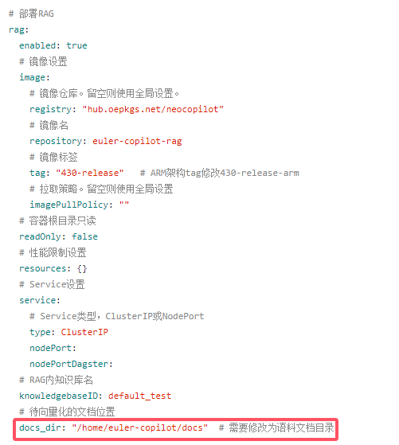
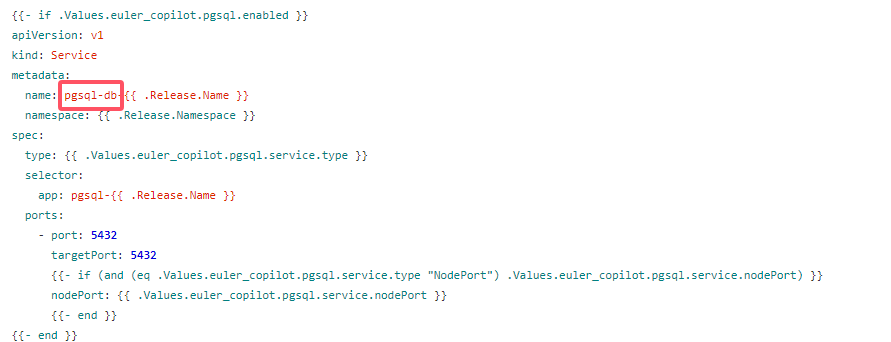
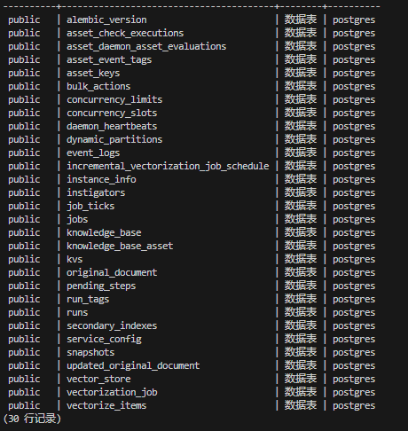
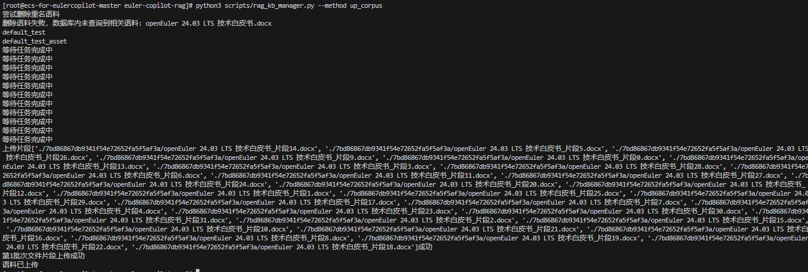

# 本地资产库构建指南

- RAG 是一个检索增强的模块，该指南主要是为rag提供命令行的方式进行数据库管理、资产管理、资产库管理和语料资产管理；
  对于数据库管理提供了清空数据库、初始化数据库等功能；
  对于资产管理提供了资产创建、资产查询和资产删除等功能；
  对于资产库管理提供了资产库创建、资产库查询和资产库删除等功能；
  对于语料资产管理提供了语料上传、语料查询和语料删除等功能。
- 当前指南面向管理员进行编写，对于管理员而言，可以拥有多个资产，一个资产包含多个资产库（不同资产库的使用的向量化模型可以不同），一个资产库对应一个语料资产。
- 本地语料上传指南是用户构建项目专属语料的指导，当前支持 docx、pdf、markdown、txt 和 xlsx 文件上传，推荐使用 docx 格式上传。

## 准备工作

- RAG 中关于语料上传目录挂载的配置：

将本地语料保存到服务器的目录，例如 /home/docs 目录，且将 /home/data 目录权限设置为755

```bash
# 设置本地存放文档目录权限为755
chmod -R 755 /home/docs
```

将文件存放的源目录映射至 RAG 容器目标目录，源目录的配置在  https://gitee.com/openeuler/euler-copilot-framework/blob/master/euler-copilot-helm/chart/values.yaml 中，下面是文件中具体配置映射源目录的的配置方法：



中间层的配置（链接源目录和目标目录的配置）在 https://gitee.com/openeuler/euler-copilot-framework/blob/master/euler-copilot-helm/chart/templates/rag/rag-deployment.yaml 中，下面是文件中具体映射中间层的的配置方法：


目标目录的配置在 https://gitee.com/openeuler/euler-copilot-framework/blob/master/euler-copilot-helm/chart/templates/rag/rag-deployment.yaml 中，下面是文件中具体映射目标目录的配置方法：


- 更新 Copilot 服务：

  ```bash
  root@openeuler:/home/EulerCopilot/euler-copilot-helm/chart# helm upgrade -n euler-copilot service .
  # 请注意：service是服务名，可根据实际修改
  ```

- 进入到 RAG 容器：

  ```bash
  root@openeuler:~# kubectl -n euler-copilot get pods
  NAME                                          READY   STATUS    RESTARTS   AGE
  framework-deploy-service-bb5b58678-jxzqr    2/2     Running   0          16d
  mysql-deploy-service-c7857c7c9-wz9gn        1/1     Running   0          17d
  pgsql-deploy-service-86b4dc4899-ppltc       1/1     Running   0          17d
  rag-deploy-service-5b7887644c-sm58z         2/2     Running   0          110m
  redis-deploy-service-f8866b56-kj9jz         1/1     Running   0          17d
  vectorize-deploy-service-57f5f94ccf-sbhzp   2/2     Running   0          17d
  web-deploy-service-74fbf7999f-r46rg         1/1     Running   0          2d
  # 进入rag pod
  root@openeuler:~# kubectl -n euler-copilot exec -it rag-deploy-service-5b7887644c-sm58z  -- bash
  ```

- 设置 PYTHONPATH

  ```bash
  # 设置PYTHONPATH
  export PYTHONPATH=$(pwd)
  ```

## 上传语料

### 查看脚本帮助信息

```bash
python3 scripts/rag_kb_manager.pyc --help
usage: rag_kb_manager.pyc [-h] --method
                          {init_database_info,init_rag_info,init_database,clear_database,create_kb,del_kb,query_kb,create_kb_asset,del_kb_asset,query_kb_asset,up_corpus,del_corpus,query_corpus,stop_corpus_uploading_job}
                          [--database_url DATABASE_URL] [--vector_agent_name VECTOR_AGENT_NAME] [--parser_agent_name PARSER_AGENT_NAME]
                          [--rag_url RAG_URL] [--kb_name KB_NAME] [--kb_asset_name KB_ASSET_NAME] [--corpus_dir CORPUS_DIR]
                          [--corpus_chunk CORPUS_CHUNK] [--corpus_name CORPUS_NAME] [--up_chunk UP_CHUNK]
                          [--embedding_model {TEXT2VEC_BASE_CHINESE_PARAPHRASE,BGE_LARGE_ZH,BGE_MIXED_MODEL}] [--vector_dim VECTOR_DIM]
                          [--num_cores NUM_CORES]

optional arguments:
  -h, --help            show this help message and exit
  --method {init_database_info,init_rag_info,init_database,clear_database,create_kb,del_kb,query_kb,create_kb_asset,del_kb_asset,query_kb_asset,up_corpus,del_corpus,query_corpus,stop_corpus_uploading_job}
                        脚本使用模式，有init_database_info(初始化数据库配置)、init_database(初始化数据库)、clear_database（清除数据库）、create_kb(创建资产)、
                        del_kb(删除资产)、query_kb(查询资产)、create_kb_asset(创建资产库)、del_kb_asset(删除资产库)、query_kb_asset(查询
                        资产库)、up_corpus(上传语料,当前支持txt、html、pdf、docx和md格式)、del_corpus(删除语料)、query_corpus(查询语料)和
                        stop_corpus_uploading_job(上传语料失败后，停止当前上传任务)
  --database_url DATABASE_URL
                        语料资产所在数据库的url
  --vector_agent_name VECTOR_AGENT_NAME
                        向量化插件名称
  --parser_agent_name PARSER_AGENT_NAME
                        分词插件名称
  --rag_url RAG_URL     rag服务的url
  --kb_name KB_NAME     资产名称
  --kb_asset_name KB_ASSET_NAME
                        资产库名称
  --corpus_dir CORPUS_DIR
                        待上传语料所在路径
  --corpus_chunk CORPUS_CHUNK
                        语料切割尺寸
  --corpus_name CORPUS_NAME
                        待查询或者待删除语料名
  --up_chunk UP_CHUNK   语料单次上传个数
  --embedding_model {TEXT2VEC_BASE_CHINESE_PARAPHRASE,BGE_LARGE_ZH,BGE_MIXED_MODEL}
                        初始化资产时决定使用的嵌入模型
  --vector_dim VECTOR_DIM
                        向量化维度
  --num_cores NUM_CORES
                        语料处理使用核数
```

### 具体操作

以下出现的命令中带**初始化**字段需要在进行资产管理前按指南中出现的相对顺序进行执行，命令中带**可重复**执字段的在后续过程中可以反复执行，命令中带**注意**字段的需谨慎执行。

### 步骤1：配置数据库和 RAG 信息

- #### 配置数据库信息（初始化）

```bash
python3 scripts/rag_kb_manager.pyc --method init_database_info  --database_url postgresql+psycopg2://postgres:123456@{dabase_url}:{databse_port}/postgres
```

**注意：**

**{dabase_url}**为 k8s 集群内访问 postgres 服务的 url，请根据具体情况修改，一般为 **{postgres_servive_name}-{{ .Release.Name }}.\<namespace\>.svc.cluster.local** 格式，其中 **{postgres_servive_name}** 可以从 https://gitee.com/openeuler/euler-copilot-framework/blob/master/euler-copilot-helm/chart/templates/pgsql/pgsql-service.yaml 找到：



**{{ .Release.Name }}**和**\<namespace\>** 为部署服务时helm安装应用时指定的 **my-release-name** 以及 **my-namespace**，一条 helm 安装应用的命令如下所示：

```bash
helm install my-release-name --namespace my-namespace path/to/chart
```

**database_port** 的信息可以在 https://gitee.com/openeuler/euler-copilot-framework/blob/master/euler-copilot-helm/chart/templates/pgsql/pgsql-service.yaml 中查看，以下为字段所在位置（一般为5432）：


数据库信息配置命令执行命令完成之后会在 scripts/config 下出现 database_info.json 文件，文件内容如下：

```bash
{"database_url": "postgresql+psycopg2://postgres:123456@{dabase_url}:{databse_port}/postgres"}
```

下面是命令执行成功的截图：


- #### 配置rag信息（初始化）

```bash
python3 scripts/rag_kb_manager.pyc --method init_rag_info --rag_url http://{rag_url}:{rag_port}
```

**{rag_url}** 为 0.0.0.0，**{rag_port}** 可以从 https://gitee.com/openeuler/euler-copilot-framework/blob/master/euler-copilot-helm/chart/templates/rag/rag-service.yaml 中获取（一般为8005）：


数据库信息配置命令执行命令完成之后会在 scripts/config 下出现 rag_info.json 文件，文件内容如下：

```bash
{"rag_url": "http://{rag_url}:{rag_port}"}
```

下面是命令执行成功的截图：


### 步骤2：初始化数据库

- #### 初始化数据库表格

```bash
python3 scripts/rag_kb_manager.pyc --method init_database 
# 注意： 
# 对于特殊关系型数据库可指定插件参数'--vector_agent_name VECTOR_AGENT_NAME'和 '--parser_agent_name PARSER_AGENT_NAME'；其中VECTOR_AGENT_NAME默认为vector, PARSER_AGENT_NAME默认为zhparser
```

命令执行完成之后可以进入数据库容器查看表格是否创建成功，首先获取命名空间中的所有节点名称：

```bash
# 获取命名空间中的所有pod节点
kubectl get pods -n euler-copilot
```

结果如下：


使用下面命令进入数据库：

```bash
kubectl exec -it pgsql-deploy-b4cc79794-qn8zd   -n euler-copilot -- bash
```

进入容器后使用下面命令进入数据库：

```bash
root@pgsql-deploy-b4cc79794-qn8zd:/tmp# psql -U postgres
```

再使用\dt查看数据库初始化情况，出现下面内容表示数据库初始化成功：



- ##### 清空数据库（注意）

  假设您想清空 RAG 产生的所有数据库数据，可以使用下面命令（**此命令会清空整个数据库，需谨慎操作！**）。

```bash
python3 scripts/rag_kb_manager.pyc --method clear_database
# 清空数据库请谨慎操作
```

### 步骤3：创建资产

 下列指令若不指定 kb_name，则默认资产名为 default_test（ps：Copilot 不允许存在两个同名的资产）：

- ##### 创建资产（可重复）

```bash
python3 scripts/rag_kb_manager.pyc --method create_kb --kb_name default_test
```

创建资产成功会有以下提示：


创建同名资产会有以下提示：


- ##### 删除资产（可重复）

```bash
python3 scripts/rag_kb_manager.pyc --method del_kb --kb_name default_test
```

删除资产成功会出现以下提示（会将资产下的所有资产库和语料资产全部删除）：


对于不存在的资产进行删除，会出现以下提示：


- ##### 查询资产（可重复）

```bash
python3 scripts/rag_kb_manager.pyc --method query_kb
```

查询资产成功会出现下面内容：


对于无资产的情况下查询资产会出现以下内容：


### 步骤4：创建资产库

下列指令若不指定资产名（kb_name）和资产库名（kb_asset_name），则默认资产名为 default_test 和资产库名 default_test_asset（ps：Copilot 同一个资产下不允许存在两个同名的资产库）：

- #### 创建资产库（可重复）

```bash
python3 scripts/rag_kb_manager.pyc --method create_kb_asset --kb_name default_test --kb_asset_name default_test_asset
# 创建属于default_test的资产库
```

对于创建资产库成功会出现以下内容：


对于指定不存在的自查库创建资产会出现以下内容：


对于同一个资产下重复创建同名资产库会出现以下内容：


- #### 删除资产库（可重复）

```bash
python3 scripts/rag_kb_manager.pyc --method del_kb_asset --kb_name default_test --kb_asset_name default_test_asset
```

对于删除资产库成功会出现以下内容：


对于删除不存在的资产库失败会出现以下内容：


对于删除不存在的资产下的资产库会出现以下内容：


- #### 查询资产库（可重复）

```bash
python3 scripts/rag_kb_manager.pyc --method query_kb_asset --kb_name default_test
# 注意：资产是最上层的，资产库属于资产，且不能重名
```

对于查询资产库成功会出现以下内容：


对于资产内无资产库的情况下查询资产库会出现以下内容：


对于查询不存在的资产下的资产库会出现以下内容：


### 步骤5：上传语料

下列指令若不指定资产名（kb_name）和资产库名（kb_asset_name），则默认资产名为 default_test 和资产库名 default_test_asset，对于删除语料命令需要指定完整的语料名称（语料统一为 docx 格式保存在数据库中，可以通过查询语料命令查看已上传的文档名称）；对于查询语料命令可以不指定语料名称（corpus_name），此时默认查询所有语料，可以指定部分或者完整的语料名，此时通过模糊搜索匹配数据库内相关的语料名称。

- 上传语料

```bash
python3 scripts/rag_kb_manager.pyc --method up_corpus --corpus_dir ./scripts/docs/ --kb_name default_test --kb_asset_name default_test_asset
# 注意：
# 1. RAG容器用于存储用户语料的目录路径是'./scripts/docs/'。在执行相关命令前，请确保该目录下已有本地上传的语料。
# 2. 若语料已上传但查询未果，请检查宿主机上的待向量化语料目录（位于/home/euler-copilot/docs）的权限设置。
# 为确保无权限问题影响，您可以通过运行chmod 755 /home/euler-copilot/docs命令来赋予该目录最大访问权限。
```

对于语料上传成功会出现以下内容：



对于语料具体的分割和上传情况可以在 logs/app.log 下查看，内容如下：


- 删除语料

```bash
python3 scripts/rag_kb_manager.pyc --method del_corpus --corpus_name abc.docx --kb_name default_test --kb_asset_name default_test_asset
# 上传的文件统一转换为docx
```

对于语料删除成功会出现以下内容：


对于删除不存在的语料会出现以下内容：


- 查询语料

```bash
# 查询指定名称的语料：
python3 scripts/rag_kb_manager.pyc --method query_corpus --corpus_name 语料名.docx
# 查询所有语料：
python3 scripts/rag_kb_manager.pyc --method query_corpus
```

对于查询所有语料会出现以下内容：


- 停止上传任务

```bash
python3 scripts/rag_kb_manager.pyc --method stop_corpus_uploading_job
```

对于某些极端条件下（例如内存受限），上传语料失败，需要执行上面shell命令用于清除语料上传失败的缓存。

## 网页端查看语料上传进度

您可以灵活设置端口转发规则，通过执行如下命令将容器端口映射到主机上的指定端口，并在任何设备上通过访问 http://<主机IP>:<映射端口>（例如 http://192.168.16.178:3000/ ）来查看语料上传的详细情况。

```bash
kubectl port-forward rag-deploy-service-5b7887644c-sm58z 3000:8005 -n euler-copilot --address=0.0.0.0
# 注意: 3000是主机上的端口，8005是rag的容器端口，可修改映射到主机上的端口
```

## 验证上传后效果

上传语料成功之后你可以通过以下命令直接与 RAG 交互，来观察语料是否上传成功。

```bash
curl -k -X POST "http://{rag_url}:{rag_port}/kb/get_answer" -H "Content-Type: application/json" -d '{ \
    "question": "question", \
    "kb_sn": "kb_name", \
    "fetch_source": true, \
    "top_k": 3 \
}'
```

- `question`：问题

- `kb_sn`：资产库名称

- `fetch_source`：是否返回关联片段以及片段来源，`false` 代表不返回，`true` 代表返回

- `top_k`：关联语料片段个数，需要大于等于3
