# 本地资产库构建指南

本平台设计的目的为了为企业（用户）提供一个可视化入口实现对本地文档资产的管理，功能方面分为以下几个部分：
- 用户管理：
  
  您可以通过账号登入witchainD平台并在平台配置大模型，为后续某些文档解析模式提供能力。
- 资产管理
  
  通过指定资产名称、资产简介、资产默认解析方法、资产默认分块大小和embedding模型等条目创建、删除、导入资产、编辑资产或资产信息
- 文档管理
  
  - 支持用户上传限定大小和限定数量的文件，也允许用户下载自己上传的文件，用户可以通过点击资产卡片的形式进入资产，此时文档以条目的形式展示。

  - 支持txt、md、xlsx、docx和doc以及pdf文档的文档解析
  - 文档解析方式有三种general、ocr和enhanced模式，general模式下只提取文字和表格，ocr模式下不仅提取文字和表格嗨提取部分文档的图片内容，enhanced在ocr的基础上对图片中提取的内容进行总结。

- 文档解析结果管理：
  
  通过指定chunk的类别和关键字过滤目标chunk或者可以指定chunk是否启用，来评判或消除chunk对检索造成的影响。
- 任务管理
  
  查看当前导入导出资产和文档解析任务的状态、取消或移除导入导出资产库和文档解析任务
- 检索增强：
  
  本平台最终解析的结果通过向量化、关键字的形式对外呈现检索结果，也提供了token压缩和问题补全等技术增强结果命中的概率，也使用了上下文随机关联的形式补全检索结果。
## 准备工作

- 部署witchaind服务
  
  ```bash
  # 进入witchaind目录
  cd euler-copilot-framework_openeuler/deploy/chart/witchaind
  ```
  ```bash
  # 编辑values.yaml
  vim values.yaml
  # 注意：
  # - domain的配置和EulerCopilot主页域名配置方法相同且同根域名
  # - LLM设置和EulerCopilot的values中模型配置相同
  # - Embedding模型URL可填写为 http://vectorize-agent-service-service.euler-copilot.svc.cluster.local:8001/embedding或查看Embedding模型的服务IP后填写
  # - 密钥可随意填写为随机字符串
  ```
  ```bash
  # 安装witchaind
  helm install -n euler-copilot witchaind .
  ```

  ```bash
  # 查看pod状态
  kubectl -n euler-copilot get pods
  ```
  ```bash
  # witchaind相关服务已正常启动
  NAME                                                 READY   STATUS    RESTARTS   AGE
  witchaind-backend-deploy-witchaind-8fcccbfb7-8f42t   1/1     Running   0          3d1h
  witchaind-redis-deploy-witchaind-7f9768c8c6-62bwt    1/1     Running   0          3d1h
  witchaind-web-deploy-witchaind-6b4f4674fd-hz88g      1/1     Running   0          3d1h
  minio-deploy-witchaind-7f779f5cf4-lqrd9              1/1     Running   0          3d1h
  ```

## 登录管理平台

请在浏览器中输入 https://$(host_ip):9888 或 <https://域名>访问 openEuler Copilot witChainD 网页,
登入界面如下，输入账号、密码点击登录按钮登录系统。


## 新建资产

### 1. 查看资产库
进入资产卡片显示页面，卡片展示了资产的名称、简介、文档篇数、创建时间和资产ID。

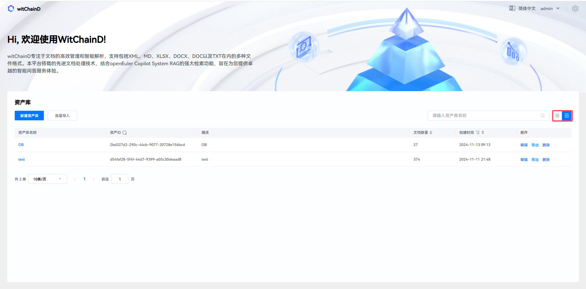

可通过红框中的按钮将卡片展示的资产转换为条目显示。

### 2. 新建资产库
点击新建资产，会跳出资产信息配置的框图

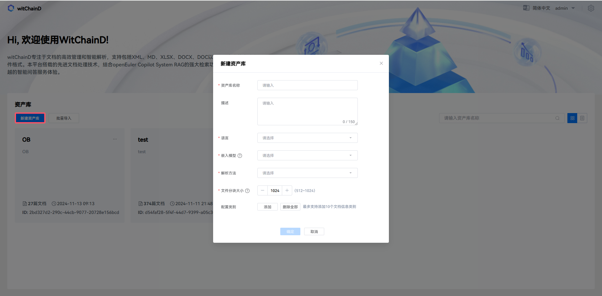

填写资产库名称、资产库描述（可选）、语言、嵌入模型、默认解析方法和默认文件分块大小后，点击确定。
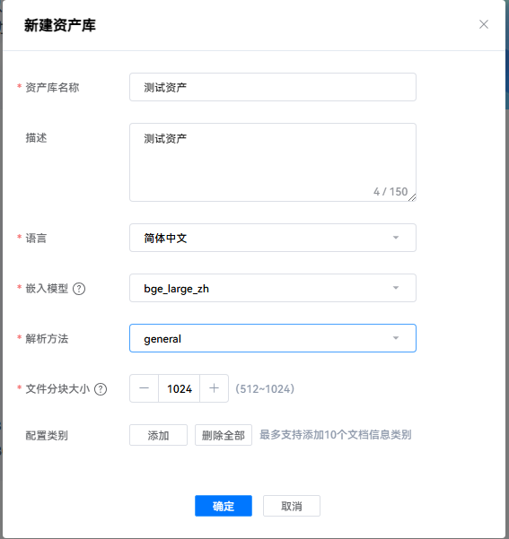

资产库建立完毕之后会显示是否添加文档，点击确定

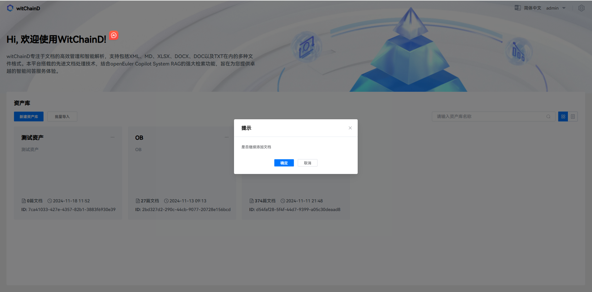

点击确定完成后进入资产库

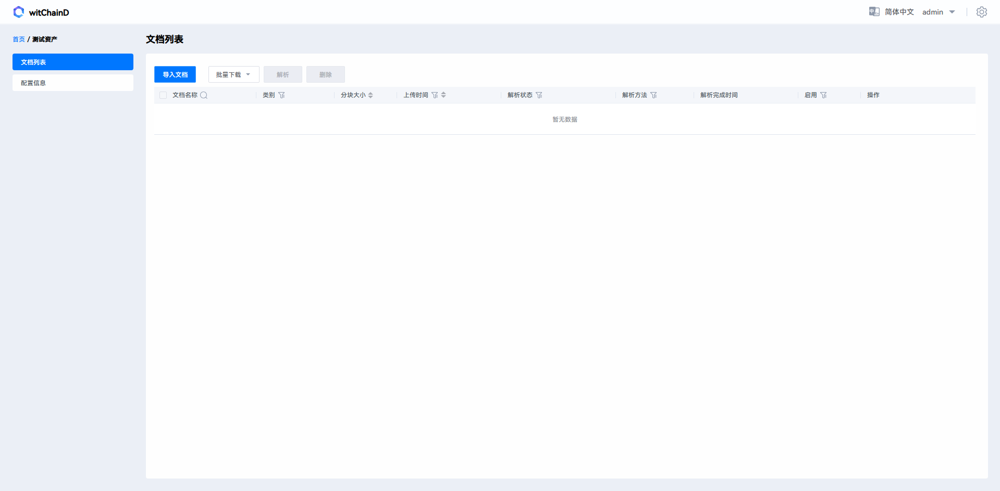

## 导入文档

### 单次导入

点击导入文档按钮跳出文档上传框，选择本地文件并勾选进行上传

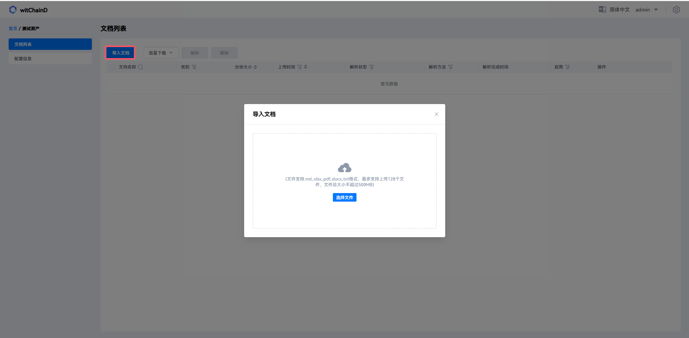

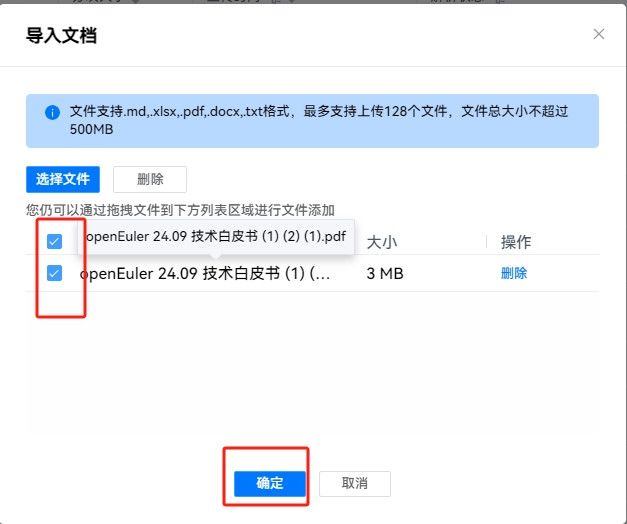

### 批量导入

点击1批量导入资产，2选择本地资产，3勾选本地资产，最后点击确定进行资产导入。

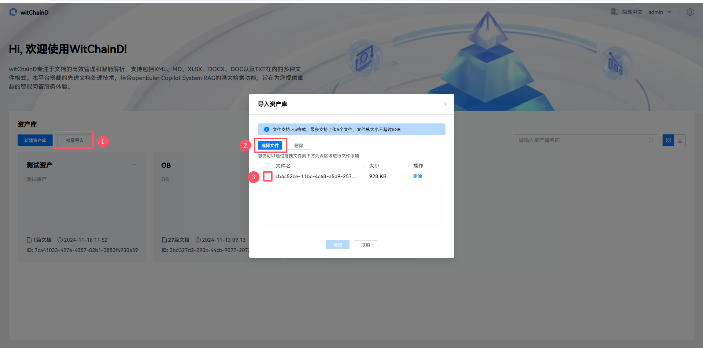

资产导入中

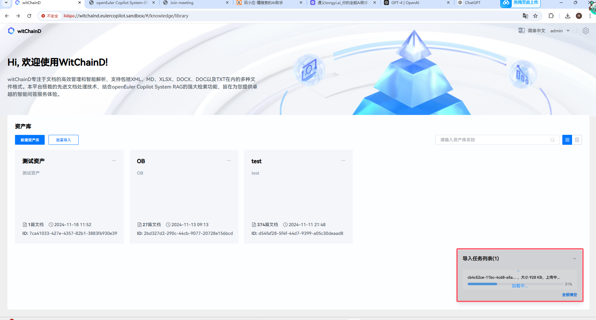

资产导入成功

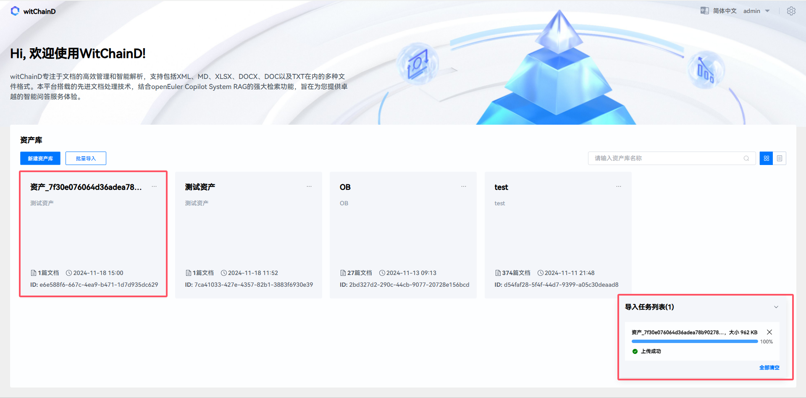


## 解析文档

等待解析中，点击取消可以停止文档解析。

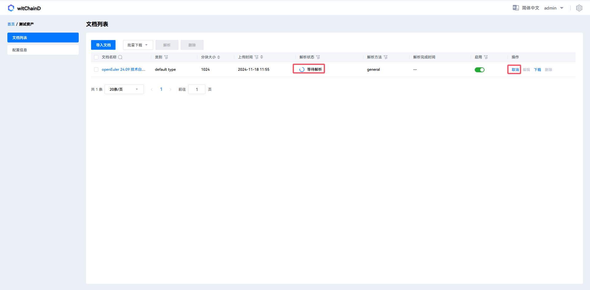

解析完成后，解析状态会显示解析成功。

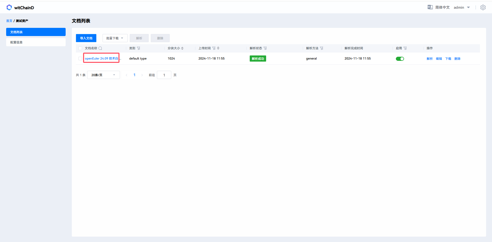

文档解析方式有三种general、ocr和enhanced模式，请根据需要选择合适的文档解析方法

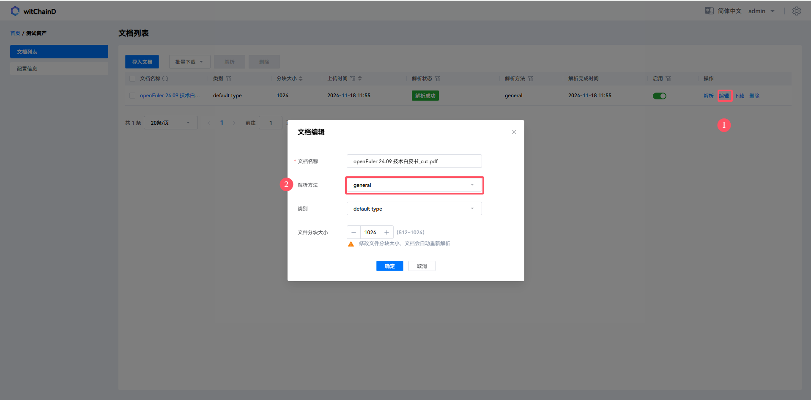

解析完毕可以通过点击文件名进入文档解析结果展示详情，可以查看文档解析结果，如下图所示：

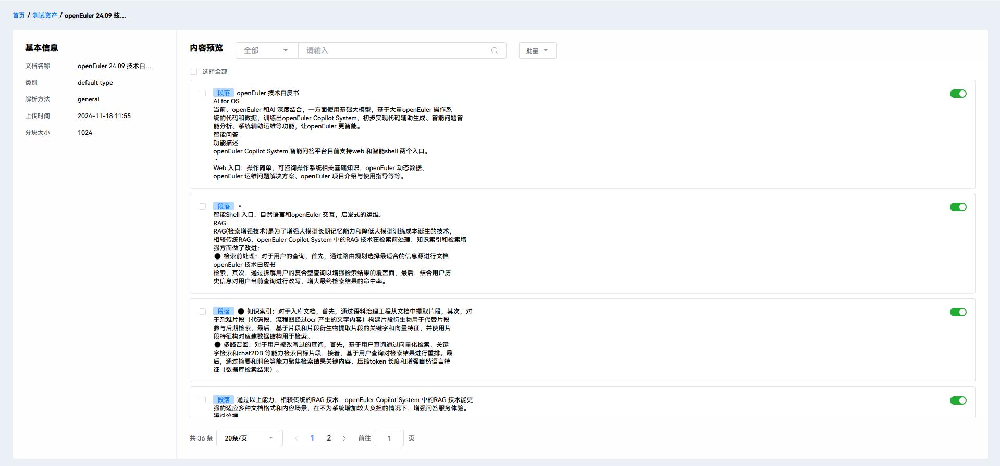

可以通过1过滤文档解析的片段、表格和图片等内容，通过2可以通过关键字检索模糊检索对应的片段，通过3可以设定是否在检索中是否启用片段，如下图所示：

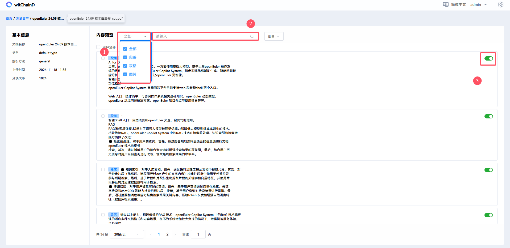

## 导出资产

点击回到首页

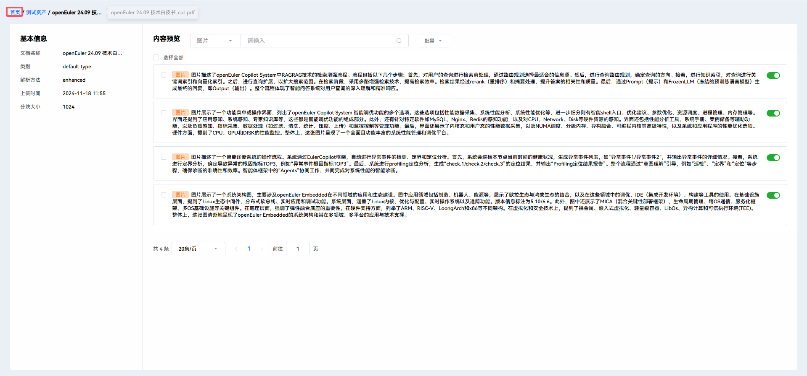

再点击导出资产

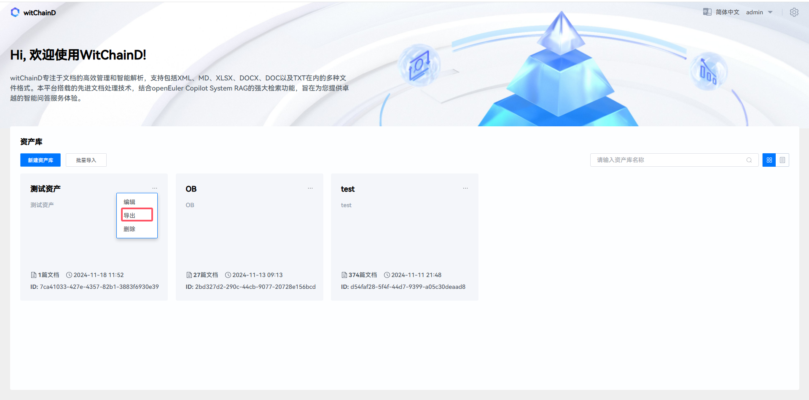

显示资产正在导出中，如下图所示：

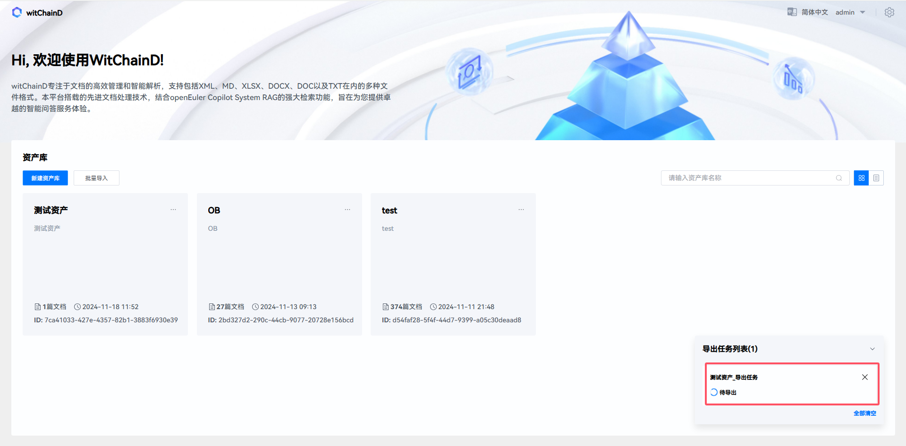

导出成功点击下载，显示下载成功

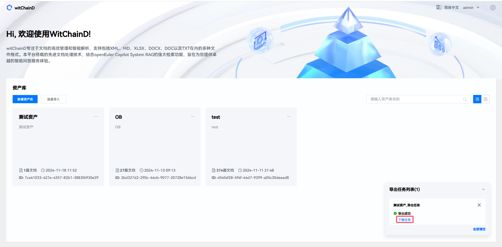