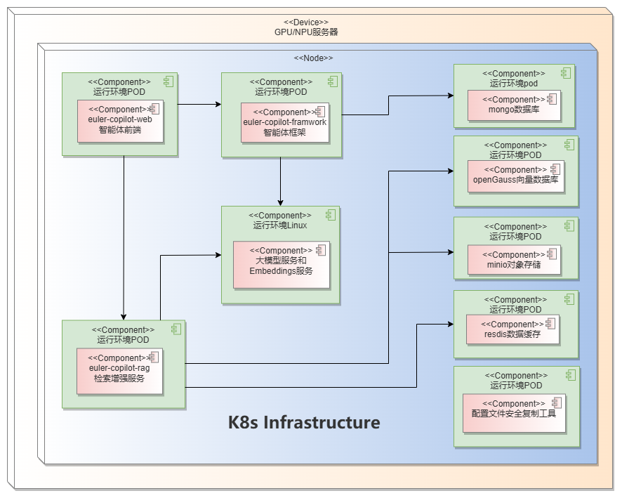
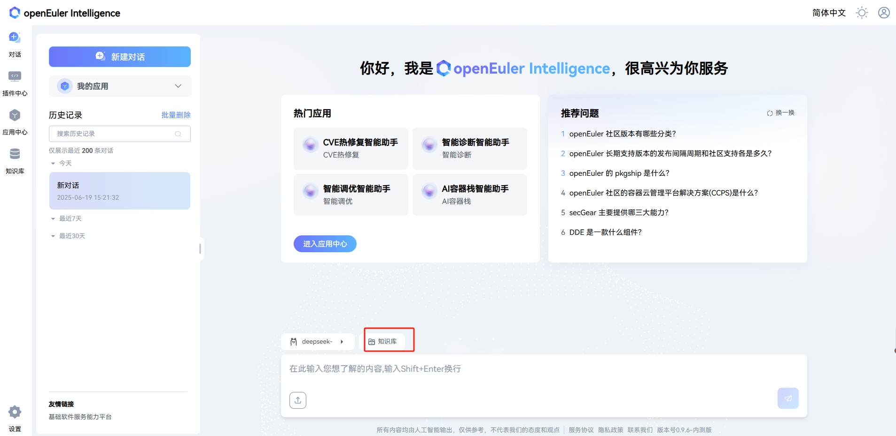

# openEuler Intelligence 智能助手部署指南

**版本信息**  
当前版本：v0.9.6  
更新日期：2025年6月16日

## 产品概述

openEuler Intelligence 是一款智能问答工具，使用 openEuler Intelligence 可以解决操作系统知识获取的便捷性问题，并为 OS 领域模型赋能开发者及运维人员。作为操作系统知识获取工具，它支持多种生产力工具（如 A-Ops/A-Tune/x2openEuler/EulerMaker/EulerDevOps/StratoVirt/iSulad 等），将传统命令交付方式进化为自然语义交互，结合智能体任务规划能力，显著降低开发和使用操作系统特性的门槛。

本指南提供基于自动化脚本的 openEuler Intelligence 智能助手系统部署说明，支持一键自动部署和手动分步部署两种方式。

## 组件介绍

| 组件                      | 端口                  | 说明                |
|--------------------------|-----------------------|-------------------|
| euler-copilot-framework  | 8002 (内部端口)       | 智能体框架服务      |
| euler-copilot-web        | 8080                 | 智能体前端界面      |
| euler-copilot-rag        | 9988 (内部端口)       | 检索增强服务        |
| authhub-backend-service  | 11120 (内部端口)      | 鉴权服务后端        |
| authhub-web-service      | 8000                 | 鉴权服务前端        |
| redis                    | 6379 (内部端口)       | Redis 数据缓存     |
| minio                    | 9000/9001 (内/外部端口) | minio 对象存储库   |
| mongo                    | 27017 (内部端口)      | mongo 数据库       |
| openGauss                | 5432 (内部端口)       | 向量数据库          |
| secret_inject            | 无                   | 配置文件安全复制工具 |

## 软件要求

| 类型     | 版本要求                          | 说明                                  |
|----------|----------------------------------|---------------------------------------|
| 操作系统 | openEuler 22.03 LTS 及以上版本    | -                                     |
| K3s      | >= v1.30.2 (带 Traefik Ingress)  | 提供轻量级 Kubernetes 集群            |
| Helm     | >= v3.15.3                      | Kubernetes 包管理工具                 |
| python   | >=3.9.9                         | 模型下载和安装的运行环境              |

## 硬件规格

| 硬件资源   | 最小配置                 | 推荐配置               |
|------------|--------------------------|------------------------|
| CPU        | 4 核心                  | 16 核心及以上          |
| RAM        | 4 GB                    | 64 GB                 |
| 存储       | 32 GB                   | 64 GB                 |
| 大模型名称 | qwen2.5-14B              | qwen2.5-32B           |
| 显存 (GPU) | NVIDIA RTX A4000 8GB    | NVIDIA A100 80GB * 2   |

**关键说明**：

- 纯 CPU 环境建议调用 OpenAI 接口或使用自带模型部署
- 已有 Kubernetes 集群环境 (version >= 1.28) 无需单独安装 k3s

## 部署视图



## 域名配置

需准备以下服务域名：

- authhub 认证服务：`authhub.eulercopilot.local`
- openEuler Intelligence web 服务：`www.eulercopilot.local`

```bash
# 本地 Windows 主机配置
# 编辑 C:\Windows\System32\drivers\etc\hosts 添加记录
# 替换 127.0.0.1 为目标服务器 IP
127.0.0.1 authhub.eulercopilot.local
127.0.0.1 www.eulercopilot.local
```

## 快速开始

### 1. 获取部署脚本

从 openEuler Intelligence 的官方 Git 仓库 [euler-copilot-framework](https://gitee.com/openeuler/euler-copilot-framework) 下载最新的部署仓库

```bash
cd /home
git clone https://gitee.com/openeuler/euler-copilot-framework.git -b dev
cd euler-copilot-framework/deploy/scripts
chmod -R +x ./*
```

### 2. 部署 openEuler Intelligence

#### 一键部署

```bash
bash deploy.sh
```

```text
==============================
        主部署菜单
==============================
0) 一键自动部署
1) 手动分步部署
2) 重启服务
3) 卸载所有组件并清除数据
4) 退出程序
==============================
请输入选项编号（0-3）: 0
```

#### 分步部署

```bash
bash deploy.sh
```

```text
==============================
        主部署菜单
==============================
0) 一键自动部署
1) 手动分步部署
2) 重启服务
3) 卸载所有组件并清除数据
4) 退出程序
==============================
请输入选项编号（0-3）: 1
```

```text
==============================
       手动分步部署菜单
==============================
1) 执行环境检查脚本
2) 安装k3s和helm
3) 安装Ollama
4) 部署Deepseek模型
5) 部署Embedding模型
6) 安装数据库
7) 安装AuthHub
8) 安装openEuler Intelligence
9) 返回主菜单
==============================
请输入选项编号（1-9）:
```

#### 重启服务

```bash
bash deploy.sh
```

```text
==============================
        服务重启菜单
==============================
可重启的服务列表：
1) authhub-backend
2) authhub
3) framework
4) minio
5) mongo
6) mysql
7) opengauss
8) rag
9) rag-web
10) redis
11) web
12) 返回主菜单
==============================
请输入要重启的服务编号（1-12）:
```

#### 卸载所有组件

```bash
sudo ./deploy.sh
```

```text
==============================
        主部署菜单
==============================
0) 一键自动部署
1) 手动分步部署
2) 卸载所有组件并清除数据
3) 退出程序
==============================
请输入选项编号（0-3）: 2
```

**运维命令**：

```bash
# 查看组件日志
kubectl logs $pod_name$ -n euler-copilot

# 查看服务状态
kubectl get pod -n euler-copilot

# 大模型配置修改
cd /home/euler-copilot-framework/deploy/chart/euler-copilot
vim values.yaml
helm upgrade euler-copilot -n euler-copilot .
```

## 验证安装

恭喜您，**openEuler Intelligence** 已成功部署！为了开始您的体验，请在浏览器中输入 `https://www.eulercopilot.local` 访问 openEuler Intelligence 的网页：

1. 首次访问点击 **立即注册** 创建账号
2. 完成登录流程


## 构建专有领域智能问答

知识库专注于文档的高效管理和智能解析，支持包括xlsx,pdf,doc,docx,pptx,html,json,yaml,md,zip以及txt在内的多种文件格式。本平台搭载的先进文档处理技术，结合openEuler Intelligence的强大检索功能，旨在为您提供卓越的智能问答服务体验。

1. **进入知识库管理系统**：
   - 点击知识库
   - 新建团队，点击确定
   - 点击新建资产库或导入资产库

2. **配置资产库**
   - 点击对话
   - 点击知识库
   
   - 选择资产库
   

## 附录

### 大模型准备

#### GPU 环境（基于 vLLM）

1. 安装依赖：
   - Python >= 3.10
   - CUDA >= 11.7
   - [GPU 驱动安装](https://www.nvidia.cn/drivers/lookup/)

2. 下载模型：

   ```bash
   huggingface-cli download --resume-download Qwen/Qwen1.5-14B-Chat --local-dir Qwen1.5-14B-Chat
   ```

3. 启动服务：

   ```bash
   # 启动 controller
   screen -S control
   python3 -m fastchat.serve.controller
   Ctrl+A+D  # 后台运行

   # 启动 API 服务
   screen -S api
   python3 -m fastchat.serve.openai_api_server --host 0.0.0.0 --port 30000 --api-keys sk-123456
   Ctrl+A+D  # 后台运行

   # 启动 worker
   screen -S worker
   pip install fschat vllm
   python3 -m fastchat.serve.vllm_worker --model-path /root/models/Qwen1.5-14B-Chat/ --model-name qwen1.5 --num-gpus 8 --gpu-memory-utilization=0.7 --dtype=half
   Ctrl+A+D  # 后台运行
   ```

4. 修改配置：

   ```bash
   vim /home/euler-copilot-framework/deploy/chart/euler_copilot/values.yaml
   ```

   修改如下部分

   ```yaml
   # 模型设置
   models:
     # 用于问答的大模型；需要为OpenAI兼容接口
     answer:
       # [必填] 接口URL（无需带上“v1”后缀）
       endpoint: http://172.168.XXX.XX:11434
       # [必填] 接口API Key；默认置空
       key: sk-123456
       # [必填] 模型名称
       name: deepseek-llm-7b-chat:latest
       # [必填] 模型最大上下文数；建议>=8192
       ctxLength: 8192
       # 模型最大输出长度，建议>=2048
       maxTokens: 2048
     # 用于Function Call的模型；建议使用特定推理框架
     functionCall:
       # 推理框架类型，默认为ollama
       # 可用的框架类型：["vllm", "sglang", "ollama", "openai"]
       backend: ollama
       # 模型地址；不填则与问答模型一致
       endpoint: 
       # API Key；不填则与问答模型一致
       key: 
       # 模型名称；不填则与问答模型一致
       name: 
       # 模型最大上下文数；不填则与问答模型一致
       ctxLength: 8192
       # 模型最大输出长度；不填则与问答模型一致
       maxTokens: 8192
       # 用于数据向量化（Embedding）的模型
     embedding:
       # 推理框架类型，默认为openai
       # [必填] Embedding接口类型：["openai", "mindie"]
       type: openai
       # [必填] Embedding URL（需要带上“v1”后缀）
       endpoint: http://172.168.XXX.XX:11434/v1
       # [必填] Embedding 模型API Key
       key: sk-123456
       # [必填] Embedding 模型名称
       name: bge-m3:latest
   ```

5. 更新服务：
  
   ```bash
   # 更新服务
   helm upgrade -n euler-copilot euler-copilot .
   ```

   ```bash
   # 重启framework服务
   kubectl get pod -n euler-copilot
   ```bash
   kubectl delete pod framework-deploy-65b669fc58-q9bw7 -n euler-copilot
   ```

6. curl 大模型接口

   ```bash
   # curl大模型接口
    curl http://localhost:11434/v1/chat/completions   -H "Content-Type: application/json" -H "Authorization: Bearer sk-123456"   -d '{ "model": "deepseek-llm-7b-chat:latest", "messages":[ { "role": "system", "content": "你是情感分析专家，你的任务是xxxx"}, { "role": "user", "content": "你好" }], "stream": true, "n": 1, "max_tokens": 8192 }'
   ```

#### NPU 环境

参考：[昇腾镜像仓库](https://www.hiascend.com/developer/ascendhub) | [NPU部署案例](./NPU推理服务器部署指南.md)

## FAQ

### 1. 解决 Hugging Face 连接错误

```bash
urllib3.exceptions.NewConnectionError: <urllib3.connection.HTTPSConnection object>: Failed to establish a new connection: [Errno 101] Network is unreachable
```

**解决方案**：

- 更新 `huggingface_hub` 包到最新版本。

  ```bash
  pip3 install -U huggingface_hub
  ```

- 如果网络问题依旧存在，可以尝试使用镜像站点作为端点。

  ```bash
  export HF_ENDPOINT=https://hf-mirror.com

### 2. 在 RAG 容器中调用问答接口

```bash
curl -k -X POST "http://localhost:9988/kb/get_answer" \
     -H "Content-Type: application/json" \
     -d '{"question": "您的问题", "kb_sn": "default_test", "fetch_source": true}'
```

### 3. 解决 helm upgrade 错误

```text
Error: UPGRADE FAILED: Kubernetes cluster unreachable
```

**解决方案**：

```bash
echo "export KUBECONFIG=/etc/rancher/k3s/k3s.yaml" >> /root/.bashrc
source /root/.bashrc
```

### 4. 查看 Pod 日志失败

**解决方案**：

```bash
cat /etc/systemd/system/k3s.service.env  # 确认 no_proxy 包含本机 IP
```

### 5. GPU 环境流式回复问题

**解决方案**：

```bash
pip install pydantic==1.10.13
# 请求中将 "stream": true 改为 false
```

### 6. sglang 模型部署

```bash
conda create --prefix=/root/py310 python==3.10.14
conda activate /root/py310
pip install "sglang[all]==0.3.0"
pip install flashinfer -i https://flashinfer.ai/whl/cu121/torch2.4/

python -m sglang.launch_server \
    --served-model-name Qwen2.5-32B \
    --model-path Qwen2.5-32B-Instruct-AWQ \
    --host 0.0.0.0 \
    --port 8001 \
    --api-key "sk-12345" \
    --mem-fraction-static 0.5 \
    --tp 8
```

### 7. 获取 Embedding

```bash
curl -k -X POST http://localhost:11434/v1/embeddings \
     -H "Content-Type: application/json" \
     -d '{"input": "The food was delicious...", "model": "bge-m3", "encoding_format": "float"}'
```

### 8. 生成证书

```bash
mkcert -install
mkcert example.com 

# 编辑配置文件
vim /home/euler-copilot-framework_openeuler/deploy/chart_ssl/traefik-secret.yaml

# 应用配置
kubectl apply -f traefik-secret.yaml
```

### 9. 问题排查方法

1. **集群事件检查**：

   ```bash
   kubectl get events -n euler-copilot
   ```

2. **镜像状态验证**：

   ```bash
   k3s crictl images
   ```

3. **日志审查**：

   ```bash
   kubectl logs <pod-name> -n euler-copilot
   ```

4. **资源评估**：

   ```bash
   kubectl top nodes
   df -h  # 确保磁盘空间 >30%
   ```

5. **版本兼容性检查**：

   ```bash
   k3s -v  # 需 >= v1.30.2
   ```

6. **配置验证**：

   ```bash
   cd /home/euler-copilot-framework/deploy/chart/euler_copilot
   vim values.yaml
   helm upgrade euler-copilot -n euler-copilot .
   ```
