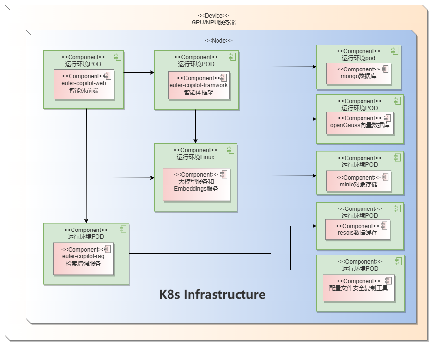
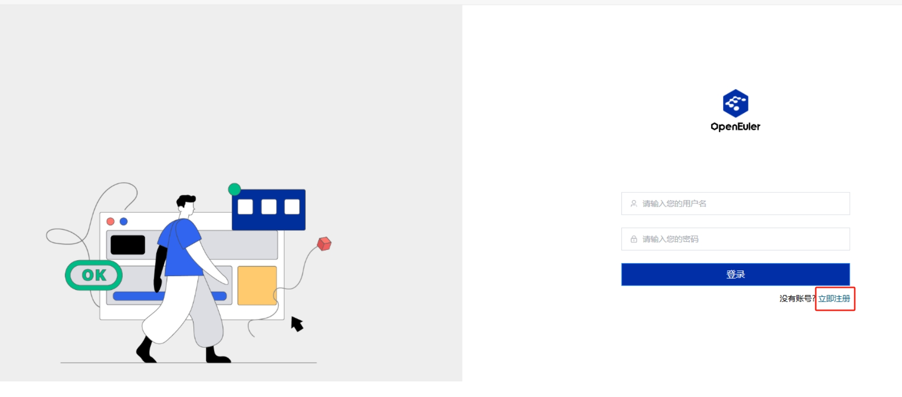

# 网络环境部署指南

## 介绍

openEuler Copilot System 是一款智能问答工具，使用 openEuler Copilot System 可以解决操作系统知识获取的便捷性，并且为OS领域模型赋能开发者及运维人员。作为获取操作系统知识，使能操作系统生产力工具 (如 A-Ops / A-Tune / x2openEuler / EulerMaker / EulerDevOps / StratoVirt / iSulad 等)，颠覆传统命令交付方式，由传统命令交付方式向自然语义进化，并结合智能体任务规划能力，降低开发、使用操作系统特性的门槛。

### 主要组件介绍

| 组件                          | 端口            | 说明                  |
| ----------------------------- | --------------- | -------------------- |
| euler-copilot-framework       | 8002 (内部端口) | 智能体框架服务         |
| euler-copilot-web             | 8080            | 智能体前端界面        |
| euler-copilot-rag             | 9988 (内部端口) | 检索增强服务           |
| euler-copilot-vectorize-agent | 8001 (内部端口) | 文本向量化服务         |
| mysql                         | 3306 (内部端口) | MySQL数据库           |
| redis                         | 6379 (内部端口) | Redis数据库           |
| postgres                      | 5432 (内部端口) | 向量数据库             |
| secret_inject                 | 无              | 配置文件安全复制工具   |

## 环境要求

### 软件要求

| 类型        |  版本要求                         |  说明                                |
|------------| -------------------------------------|--------------------------------------|
| 操作系统    | openEuler 22.03 LTS 及以上版本         | 无                                   |
| K3s        | >= v1.30.2，带有 Traefik Ingress 工具   | K3s 提供轻量级的 Kubernetes 集群，易于部署和管理 |
| Helm       | >= v3.15.3                           | Helm 是一个 Kubernetes 的包管理工具，其目的是快速安装、升级、卸载 openEuler Copilot System 服务 |
| python     | >=3.9.9                              | python3.9.9 以上版本为模型的下载和安装提供运行环境 |

### 硬件要求

| 类型           |     硬件要求                  |
|----------------| -----------------------------|
| 服务器         | 1台                           |
| CPU           | 鲲鹏或x86_64，>= 32 cores     |
| RAM           | >= 64GB                      |
| 存储          | >= 500 GB                    |
| GPU           | Tesla V100 16GB，4张         |
| NPU           | 支持大模型推理的NPU卡或服务器  |              

注意：

1. 若无 GPU 或 NPU 资源，建议通过调用 OpenAI 接口的方式来实现功能。(接口样例：<https://dashscope.aliyuncs.com/compatible-mode/v1/chat/completions> 参考链接：[API-KEY的获取与配置](https://help.aliyun.com/zh/dashscope/developer-reference/acquisition-and-configuration-of-api-key?spm=a2c4g.11186623.0.0.30e7694eaaxxGa))
2. 调用第三方 OpenAI 接口的方式不需要安装高版本的 python (>=3.9.9)
3. 英伟达 GPU 对 Docker 的支持必需要新版本 Docker (>= v25.4.0)
4. 如果k8s集群环境，则不需要单独安装k3s，要求version >= 1.28

### 部署视图



## 获取 openEuler Copilot System

- 从 openEuler Copilot System 的官方Git仓库 [euler-copilot-framework](https://gitee.com/openeuler/euler-copilot-framework) 下载最新的部署仓库
- 如果您正在使用 Kubernetes，则不需要安装 k3s 工具。

```bash
# 下载目录以 home 为例
cd /home
```

```bash
git clone https://gitee.com/openeuler/euler-copilot-framework.git
```

## 环境准备

设备需联网并符合 openEuler Copilot System 的最低软硬件要求。确认服务器、硬件、驱动等准备就绪后，即可开始环境准备工作。为了顺利进行后续操作，请按照指引，先进入我
们的脚本部署目录，并且按照提供的操作步骤和脚本路径依次执行，以确保初始化成功。

```bash
# 进入部署脚本目录
cd /home/euler-copilot-framework/deploy/scripts && tree
```

```bash
.
├── check_env.sh
├── download_file.sh
├── get_log.sh
├── install_tools.sh
└── prepare_docker.sh
```

|      序号    |  步骤内容     |    相关指令        |        说明    |
|-------------- |----------|---------------------------------------------|------------------------------------------ |
|1| 环境检查        | `bash check_env.sh`      | 主要对服务器的主机名、DNS、防火墙设置、磁盘剩余空间大小、网络、检查SELinux的设置  |
|2| 文件下载        | `bash download_file.sh`  | 模型bge-reranker-large、bge-mixed-mode下载 |
|3| 安装部署工具    | `bash install_tools.sh v1.30.2+k3s1 v3.15.3`  |  安装helm、k3s工具 |
|4| 大模型准备      | 提供第三方 OpenAI 接口或基于硬件本都部署大模型   |   本地部署大模型可参考附录部分  |

## 域名准备

为确保 openEuler Copilot System 的正确部署和使用，请准备以下四个服务的域名：`minio`、`authhub`、`eulercopilot` 和 `witchaind`。这些子域名需属于同一个主域名下，例如 `minio.test.com`、`authhub.test.com`、`eulercopilot.test.com` 和 `witchaind.test.com`。

您可以通过两种方式来完成这项准备工作：

1. **预先申请域名**：为每个服务（Minio、AuthHub、Euler Copilot 和 WitchainD）分别注册上述格式的子域名。
   
2. **本地配置**：如果是在开发或测试环境中，您可以直接在本地Windows主机文件中进行配置。打开位于 `C:\Windows\System32\drivers\etc\hosts` 的文件，并添加相应的条目以映射这些子域名到本地或特定的IP地址，例如：
   ```
   127.0.0.1 minio.test.com
   127.0.0.1 authhub.test.com
   127.0.0.1 eulercopilot.test.com
   127.0.0.1 witchaind.test.com
   ```


## 安装

您的环境现已就绪，接下来即可启动 openEuler Copilot System 的安装流程。

- 下载目录以home为例，进入 openEuler Copilot System 仓库的 Helm 配置文件目录

  ```bash
  cd /home/euler-copilot-framework && ll
  ```

  ```bash
  total 28
  drwxr-xr-x  3 root root 4096 Aug 28 17:45 docs/
  drwxr-xr-x  5 root root 4096 Aug 28 17:45 deploy/
  ```

- 查看deploy的目录

  ```bash
  tree deploy
  ```

  ```bash
  deploy/chart
  ├── databases
  │   ├── Chart.yaml
  │   ├── configs
  │   ├── templates
  │   └── values.yaml
  ├── authhub
  │   ├── Chart.yaml
  │   ├── configs
  │   ├── templates
  │   └── values.yaml
  └── euler_copilot
      ├── Chart.yaml
      ├── configs
      ├── templates
      │   ├── NOTES.txt
      │   ├── rag
      │   ├── vectorize
      │   └── web
      └── values.yaml
  ```
- 创建命名空间

  ```bash
  kubectl create namespace euler-copilot
  ```

  设置环境变量

  ```bash
  export KUBECONFIG=/etc/rancher/k3s/k3s.yaml
  ```

### 1. 安装数据库

- 编辑 values.yaml

  ```bash
  cd deploy/chart/databases
  ```

  ```bash
  vim values.yaml
  ```
  **填写说明：**
  1. **密码设置**：所有密码必须设置为数字与字母的组合，并请确认所有条目均已准确填写；
  2. **域名设置**：依据之前的域名配置，请正确填写 MinIO 的域名；
  3. **镜像标签调整**：根据系统架构，请相应地调整镜像标签（tag）。

- 安装数据库

  ```bash
  helm install -n euler-copilot databases .
  ```

- 检查 Pod 的状态

  ```bash
  kubectl -n euler-copilot get pods
  ```

  ```bash
  pgsql-deploy-databases-86b4dc4899-ppltc           1/1     Running   0          17d
  redis-deploy-databases-f8866b56-kj9jz             1/1     Running   0          17d
  minio-deploy-databases-6b8dfcdc5d-7d4td           1/1     Running   0          17d
  mongo-deploy-databases-85c75cbb-v88r6             1/1     Running   0          17d
  ```

- 问题定位

  - 查看 Pod 的 日志
  
  ```bash
  kubectl -n euler-copilot logs minio-deploy-databases-6b8dfcdc5d-7d4td
  ```
  - 进入 Pod

  ```bash
  kubectl -n euler-copilot exec pgsql-deploy-databases-86b4dc4899-ppltc -- bash
  ```
  ```bash
  # 连接数据库
  psql -U postgres -d postgres
  ```
  - 清除 PVC

  ```bash
  kubectl -n euler-copilot get pvc
  ```

  ```bash
  kubectl -n euler-copilot delete pvc minio-pvc-databases
  ```
  - 更新配置
  ```bash
  helm upgrade -n euler-copilot databases .
  ```

### 2. 安装鉴权平台Authhub

- 编辑 values.yaml

  ```bash
  cd ../authhub
  ```
  ```bash
  vim values.yaml
  ```
  **填写说明：**
  1. **密码设置**：所有密码必须设置为数字与字母的组合，并请确认所有条目均已准确填写；
  2. **域名设置**：依据之前的域名配置，请正确填写 authhub-web 的域名；
  3. **镜像标签调整**：根据系统架构，请相应地调整镜像标签（tag）。

- 安装 AuthHub

  ```bash
  helm install -n euler-copilot authhub .
  ```

- 查看 pod 状态

  ```bash
  kubectl -n euler-copilot get pods
  ```

  ```bash
  NAME                                             READY   STATUS    RESTARTS   AGE
  authhub-backend-deploy-authhub-64896f5cdc-m497f   2/2     Running   0          16d
  authhub-web-deploy-authhub-7c48695966-h8d2p       1/1     Running   0          17d
  pgsql-deploy-databases-86b4dc4899-ppltc           1/1     Running   0          17d
  redis-deploy-databases-f8866b56-kj9jz             1/1     Running   0          17d
  minio-deploy-databases-6b8dfcdc5d-7d4td           1/1     Running   0          17d
  mongo-deploy-databases-85c75cbb-v88r6             1/1     Running   0          17d
  ```

- 登录 AuthHub
  
  AuthHub 的域名以 <authhub.test.com> 为例，浏览器输入`https://authhub.test.com`，登录界面如下图所示：

  

  **AuthHub 登录默认账号 `administrator`, 密码 `changeme`**

- 创建应用eulercopilot

  
 
  点击**创建应用**后，请按照以下示例填写相关信息：
  - **应用名称**: eulercopilot
  - **应用主页 URL**: https://eulercopilot.test.com
  - **应用回调地址（登录后）**: https://eulercopilot.test.com/api/auth/login
  - 点击**创建**，即可完成应用创建流程，系统将自动生成一个 **Client ID** 和 **Client Secret**。请保存好这对凭据，稍后在 `deploy/chart/euler_copilot/values.yaml` 配置文件中需要添加它们。
  
  

### 3. 安装 openEuler Copilot System

- 编辑 values.yaml

  ```bash
  cd ../euler_copilot
  ```
  ```bash
  vim values.yaml
  ```
  **填写说明：**

  1. **密码设置**：所有密码必须是数字与字母的组合，请确保所有条目均已准确无误地填写。
  2. **域名配置**：请根据先前的域名设置，正确填写 eulercopilot 和 witchind 的对应域名。
  3. **镜像标签调整**：依据系统的架构要求，适当调整容器镜像的标签（tag）。
  4. **Volume挂载目录**：创建并指定正确的卷（volume）挂载路径。
  5. **OIDC 设置**：完成 framework章节中 OIDC 的正确配置。
  6. **插件部署（可选）**：如果选择部署插件，需配置用于Function Call的模型。注意，部署sglang时需要有GPU支持环境，详情请参阅附件。

- 安装 openEuler Copilot System

  ```bash
  helm install -n euler-copilot service .
  ```

- 查看 Pod 状态

  ```bash
  kubectl -n euler-copilot get pods
  ```

  镜像拉取过程可能需要大约一分钟的时间，请耐心等待。部署成功后，所有 Pod 的状态应显示为 Running。

  ```bash
  NAME                                              READY   STATUS    RESTARTS   AGE
  authhub-backend-deploy-authhub-64896f5cdc-m497f   2/2     Running   0          16d
  authhub-web-deploy-authhub-7c48695966-h8d2p       1/1     Running   0          17d
  pgsql-deploy-databases-86b4dc4899-ppltc           1/1     Running   0          17d
  redis-deploy-databases-f8866b56-kj9jz             1/1     Running   0          17d
  mysql-deploy-databases-57f5f94ccf-sbhzp           2/2     Running   0          17d
  framework-deploy-service-bb5b58678-jxzqr          2/2     Running   0          16d
  rag-deploy-service-5b7887644c-sm58z               2/2     Running   0          110m
  vectorize-deploy-service-57f5f94ccf-sbhzp         2/2     Running   0          17d
  web-deploy-service-74fbf7999f-r46rg               1/1     Running   0          2d
  ```

  **故障排查：**

  当 Pod 状态显示为失败时，建议遵循以下步骤进行问题排查：

  1. **获取集群事件信息**

     为了更好地定位 Pod 失败的原因，请首先检查 Kubernetes 集群中的事件 (Events)。这可以提供有关 Pod 状态变化的上下文信息。

     ```bash
     kubectl get events -n euler-copilot
     ```

  2. **验证镜像拉取状态**

     确认容器镜像是否成功拉取。如果镜像未能正确加载，可能是由于网络问题或镜像仓库配置错误。

     ```bash
     k3s crictl images
     ```

  3. **审查 Pod 日志**

     检查相关 Pod 的日志，以寻找可能的错误信息或异常行为。这对于诊断应用程序级别的问题特别有用。

     ```bash
     kubectl logs rag-deploy-service-5b7887644c-sm58z -n euler-copilot
     ```

  4. **评估资源可用性**

     确保 Kubernetes 集群有足够的资源（如 CPU、内存和存储）来支持 Pod 的运行。资源不足可能导致镜像拉取失败或其他性能问题。

     ```bash
     kubectl top nodes
     ```

  5. **确认 k3s 版本兼容性**

     如果遇到镜像拉取失败且镜像大小为 0 的问题，请检查您的 k3s 版本是否符合最低要求（v1.30.2 或更高）。较低版本可能存在不兼容的问题。

     ```bash
     k3s -v
     ```

  6. **检查 OIDC 设置**

     审核 `values.yaml` 文件中关于框架的 OIDC 配置，确保身份验证和授权服务已正确设置，这对于集成外部认证服务至关重要。

     ```bash
     cat /home/euler-copilot-framework/deploy/chart/euler_copilot/values.yaml | grep oidc
     ```

## 验证安装

恭喜您，**openEuler Copilot System** 已成功部署！为了开始您的体验，请在浏览器中输入 `https://您的EulerCopilot域名` 链接访问 openEuler Copilot System 的网页界面：

首次访问时，您需要点击页面上的 **立即注册** 按钮来创建一个新的账号，并完成登录过程。




## 安装插件

详细信息请参考文档 [插件部署指南](./插件部署指南)

## 构建专有领域智能问答

详细信息请参考文档 [本地资产库构建指南](./本地资产库构建指南.md)

## 附录

### 大模型准备

#### GPU 环境

参考以下方式进行部署

1. 下载模型文件：

   ```bash
   huggingface-cli download --resume-download Qwen/Qwen1.5-14B-Chat --local-dir Qwen1.5-14B-Chat
   ```

2. 创建终端 control

   ```bash
   screen -S control
   ```

   ```bash
   python3 -m fastchat.serve.controller
   ```

   - 按 Ctrl A+D 置于后台

3. 创建新终端 api

   ```bash
   screen -S api
   ```

   ```bash
   python3 -m fastchat.serve.openai_api_server --host 0.0.0.0 --port 30000  --api-keys sk-123456
   ```

   - 按 Ctrl A+D 置于后台
   - 如果当前环境的 Python 版本是 3.12 或者 3.9 可以创建 python3.10 的 conda 虚拟环境

   ```bash
   mkdir -p /root/py310
   ```

   ```bash
   conda create --prefix=/root/py310 python==3.10.14
   ```

   ```bash
   conda activate /root/py310
   ```

4. 创建新终端 worker

   ```bash
   screen -S worker
   ```

   ```bash
   screen -r worker
   ```

   安装 fastchat 和 vllm

   ```bash
   pip install fschat vllm
   ```

   安装依赖：

   ```bash
   pip install fschat[model_worker]
   ```

   ```bash
   python3 -m fastchat.serve.vllm_worker --model-path /root/models/Qwen1.5-14B-Chat/ --model-name qwen1.5 --num-gpus 8 --gpu-memory-utilization=0.7 --dtype=half
   ```

   - 按 Ctrl A+D 置于后台

5. 按照如下方式配置文件，并更新服务。

   ```bash
   vim deploy/chart/euler_copilot/values.yaml
   ```

   修改如下部分

   ```yaml
   llm:
     # 开源大模型，OpenAI兼容接口
     openai:
       url: "http://$(IP):30000"
       key: "sk-123456"
       model: qwen1.5
       max_tokens: 8192
   ```

#### NPU 环境

NPU 环境部署可参考链接 [MindIE安装指南](https://www.hiascend.com/document/detail/zh/mindie/10RC2/whatismindie/mindie_what_0001.html)

### FAQ

#### 1. 解决 Hugging Face 连接错误

如果遇到如下连接错误：

```text
urllib3.exceptions.NewConnectionError: <urllib3.connection.HTTPSConnection object>: Failed to establish a new connection: [Errno 101] Network is unreachable
```

尝试以下解决方案：

- 更新 `huggingface_hub` 包到最新版本。

  ```bash
  pip3 install -U huggingface_hub
  ```

- 如果网络问题依旧存在，可以尝试使用镜像站点作为端点。

  ```bash
  export HF_ENDPOINT=https://hf-mirror.com
  ```

#### 2. 在 RAG 容器中调用问答接口

进入对应的 RAG Pod 后，可以通过 `curl` 命令发送 POST 请求来获取问答结果。请确保在请求体中提供具体的问题文本。

```bash
curl -k -X POST "http://localhost:8005/kb/get_answer" \
     -H "Content-Type: application/json" \
     -d '{
           "question": "您的问题",
           "kb_sn": "default_test",
           "fetch_source": true
         }'
```

#### 3. 解决 `helm upgrade` 错误

当 Kubernetes 集群不可达时，您可能会遇到类似下面的错误信息：

```text
Error: UPGRADE FAILED: Kubernetes cluster unreachable
```

确保设置了正确的 KUBECONFIG 环境变量指向有效的配置文件。

```bash
echo "export KUBECONFIG=/etc/rancher/k3s/k3s.yaml" >> /root/.bashrc
source /root/.bashrc
```

#### 4. 查看 Pod 日志失败

如果您遇到查看 Pod 日志时权限被拒绝的问题，检查是否正确配置了代理设置，并将本机 IP 地址添加到 `no_proxy` 环境变量中。

```bash
cat /etc/systemd/system/k3s.service.env
```

编辑文件并确保包含：

```bash
no_proxy=XXX.XXX.XXX.XXX
```

#### 5. GPU环境中大模型流式回复问题

对于某些服务执行 curl 大模型时无法进行流式回复的情况，尝试修改请求中的 `"stream"` 参数为 `false`。此外，确认已安装兼容版本的 Pydantic 库。

```bash
pip install pydantic==1.10.13
```

#### 6. sglang 模型部署指南

按照以下步骤部署基于 sglang 的模型：

```bash
# 1. 激活名为 `myenv` 的 Conda 环境，该环境基于 Python 3.10 创建：
conda activate myenv

# 2. 安装 sglang 及其所有依赖项，指定版本为 0.3.0
pip install "sglang[all]==0.3.0"

# 3. 从特定索引安装 flashinfer，确保与您的 CUDA 和 PyTorch 版本兼容
pip install flashinfer -i https://flashinfer.ai/whl/cu121/torch2.4/

# 4. 使用 sglang 启动服务器，配置如下：
python -m sglang.launch_server \
    --served-model-name Qwen2.5-32B \
    --model-path Qwen2.5-32B-Instruct-AWQ \
    --host 0.0.0.0 \
    --port 8001 \
    --api-key "sk-12345" \
    --mem-fraction-static 0.5 \
    --tp 8
```

- 验证安装

  ```bash
  pip show sglang
  pip show flashinfer
  ```

**注意事项：**
- API Key：请确保 `--api-key` 参数中的 API 密钥是正确的
- 模型路径： 确保 `--model-path` 参数中的路径是正确的，并且模型文件存在于该路径下。
- CUDA 版本：确保你的系统上安装了 CUDA 12.1 和 PyTorch 2.4，因为 `flashinfer` 包依赖于这些特定版本。
- 线程池大小：根据你的GPU资源和预期负载调整线程池大小。如果你有 8 个 GPU，那么可以选择 --tp 8 来充分利用这些资源。

#### 7. 获取 Embedding

使用 curl 发送 POST 请求以获取 embedding 结果：

```bash
curl -k -X POST http://$IP:8001/embedding \
     -H "Content-Type: application/json" \
     -d '{"texts": ["sample text 1", "sample text 2"]}'
```

其中 `$IP` 是 vectorize 内网地址。

#### 8. 生成证书

为了生成自签名证书，首先下载 [mkcert](https://github.com/FiloSottile/mkcert/releases)工具，然后运行以下命令：
```bash
mkcert -install
mkcert example.com 
```
最后，将生成的证书和私钥拷贝到 values.yaml 中, 并应用至 Kubernetes Secret。
```bash
vim /home/euler-copilot-framework_openeuler/deploy/chart_ssl/traefik-secret.yaml
```
```bash
kubectl apply -f traefik-secret.yaml
```

#### 9. Pod 状态从 Running 变为 Pending 或 Completed

Pod 状态变化可能是因为宿主机存储空间不足。使用 `df -h` 检查磁盘使用情况，并保证至少有 30% 的可用空间。这有助于维持 Pod 的稳定运行状态。
